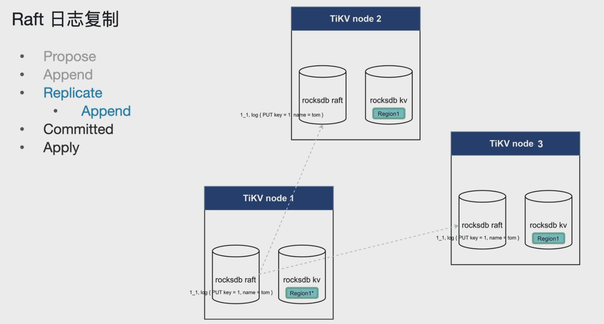
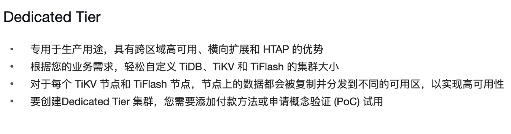

# TiDB体系架构

- 水平扩容或缩容
- 金融级高可用
  - 通过Raft实现三副本；
- 实时HTAP
- 云原生的分布式数据库
- 兼容MySQL 5.7协议

PD：

- 保存数据Region的元数据信息（如Region和TiKV的对应关系）；
- 为TiDB进行授时服务（如分配TSO，即分配时间戳）；

## TiDB Server

-  处理客户端的连接
- SQL语句的解析和编译
- 关系型数据与KV的转化
  - 将行记录转换为KV对，存入TiKV；
- SQL语句的执行
- 执行 online DDL
- 垃圾回收（GC）
  - 定时回收MVCC中过期的历史版本数据；
- 热点小表缓存（V6.0）
  - cache table：不经常修改，但是访问频繁，放到缓存中，提高吞吐量；

## TiKV

- 数据持久化
  - TiKV节点中运行着单机的存储引擎，内部是通过rocksdb来保证数据持久化的；
    - rocksdb kv：将表数据转换为KV对，存储在单机的rocksdb kv实例中；
    - rocksdb raft：存储指令的，对表的一些增删改记录都存在rocksdb raft实例中，然后由TiKV将这些修改记录应用到rocksdb kv实例中；
- 副本的强一致性和高可用性
  - raft协议实现三副本：
    - leader角色的Region可以读写，其他两个Region由leader角色的Region复制而来；
    - 修改集群中的大多数Region才算成功（如三个Region，必须修改成功两个才算成功）；
- MVCC（多版本并发控制）
  - 读取的是快照；
- 分布式事务支持
  - 两阶段提交
- Coprocessor （算子下推）
  - 在靠近数据存储的地方过滤好数据;
  - 在每个TiKV节点进行计算，充分利用分布式计算的优势；

## PD

PD，即 Placement Driver；

- 整个集群TiKV的元数据存储；
- 分配全局ID和事务ID；
- 生成全局时间戳TSO；
  - 事务开始时间戳
  - 事务结束时间戳
- 收集集群信息进行调度；
  - 根据集群信息（比如热节点，迁移到冷节点）进行负载均衡
- 提供TiDB Dashboard服务；
  - 热力图
  - TOP SQL
  - SQL分析

## TiFlash

- 异步复制
- 一致性
  - 相当于TiKV的列存副本，TiKV做的修改会同步到TiFlash中；
- 列式存储提供统计分析查询效率
- 业务隔离
  - 交易型业务走TiKV
  - 分析型业务走TiFlash
- 智能选择
  - 通过智能选择（TiDB优化器）判断是走TiKV还是走TiFlash；

# TiDB Server

SQL语句经过Parse、Compile生成具体的执行计划；

Executor、DistSQL和KV主要是负责SQL语句的执行，Executor对SQL进行分类，范围扫描使用DistSQL，点查使用KV；

Online DDL（不阻塞读写）使用schema load、worker、start job这三个模块；

memBuffer：缓存元数据、统计信息等；

## SQL语句的解析和编译

SQL解析成抽象语法树（AST，Abstract Syntax  Tree）

## 行记录转化为KV对

TiDB 自动将 SQL 结构映射为 KV 结构。具体的可以参考 [《三篇文章了解 TiDB 技术内幕 - 说计算》 ](https://pingcap.com/blog-cn/tidb-internal-2)这篇文档。简单来说，TiDB 做了两件事：

- 一行数据映射为一个 KV，Key 以 `TableID`构造前缀，以行 ID 为后缀
- 一条索引映射为一个 KV，Key 以 `TableID+IndexID`构造前缀，以索引值构造后缀

可以看到，对于一个表中的数据或者索引，会具有相同的前缀，这样在 TiKV 的 Key 空间内，这些 Key-Value 会在相邻的位置。那么当写入量很大，并且集中在一个表上面时，就会造成写入的热点，特别是连续写入的数据中某些索引值也是连续的(比如 update time 这种按时间递增的字段)，会在很少的几个 Region 上形成写入热点，成为整个系统的瓶颈。同样，如果所有的数据读取操作也都集中在很小的一个范围内 (比如在连续的几万或者十几万行数据上)，那么可能造成数据的访问热点。

### 聚簇表

主键是整型单字段；

表编号和主键作为Key，行记录除主键之外的字段作为Value；

### 非聚簇表

没有主键或者非整形单字段主键或者是联合主键

## SQL读写相关模块

- DistSQL将复杂SQL执行计划（join、子查询）转化为单个表操作的组合发送给TiKV；

- 点查直接走KV模块；

## 在线DDL

在线DDL请求通过TiDB start job模块转化为对应的job，然后放入到TiKV的 job队列中，然后Owner角色的TiDB Server的worker负责从job队列中按顺序拿出第一个job进行执行，并放入到history队列中；因此在同一时间只能有一个在线DDL的job在执行；

> Owner是通过选举出来的，会不断地进行切换；

## GC机制和相关模块

GC：定期清理MVCC历史版本的快照数据；

每次GC会保留当前时间到safe point时间点之间的数据；

GC Life Time：一般10min，即保留10分钟之内的数据，10分钟以前的数据会被清掉;

先找到过期数据，其次检查是否有锁信息，清理锁，然后清理drop数据，最后是delete数据...（？）

## TiDB Server的缓存

- TiDB Server缓存组成
  - SQL结果
    - 表连接、子查询等
      - 多张大表的join是在缓存中执行的，缓存占用还是比较大的；
  - 线程缓存
  - 元数据，统计信息
- TiDB Server缓存管理
  - tidb_mem_quota_query
    - 单个SQL语句占用缓存的上限；
  - oom-action
    - SQL语句占用缓存超过tidb_mem_quota_query时，如何处理？报错还是记录日志...

## 热点小表缓存

- 表的数据量不大（须小于64M）
- 只读表或修改不频繁的表
- 表的访问很频繁

难点：如果保证修改之后数据的一致性，是先修改TiKV还是先修改cache table？

### 热点小表缓存 - 原理

tidb_table_cache_lease：租约时间，默认是5s；

- 租约时间内，从缓存中读数据，但无法进行写操作；
- 租约时间到期之后，才可以写数据，
- 租约到期后读写操作执行到TiKV节点上执行
  - 因此在从缓存中读数据转换到从TiKV中执行数据的时候会有一个数据抖动；

- 租约时间内，无法进行写操作；
  - 租约时间为5s，当前还剩3s到期，写操作被阻塞；

- 租约到期，数据过期
- 写操作不在被阻塞
- 读写操作直接到TiKV节点上执行

- 数据更新完毕，租约继续开启

### 热点小表缓存 - 应用

# TiKV

## TiKV 架构和作用

- rocksdb raft：存储raft日志；
- rocksdb kv：存储具体的KV数据对；

## RocksDB

### RocksDB写入

先写入Disk的WAL文件（即预写日志，Write Ahead Log），然后在写入MemTable，当MemTable满了之后，直接将其转化为immutable MemTable（固定MemTable，即不再有写入了），然后通过独立的后台线程将immutable MemTable刷入到Disk的SST文件中；

注意：

- （1）MemTable转化为immutable MemTable之后就可以创建一个新的MemTable，继续进行写入；
- （2）先写入Disk的WAL文件，可以避免内存出现故障之后，可以通过WAL文件恢复数据到MemTable中，避免数据的丢失；
- （3）如果MemTable写入速度比较快，导致累积的immutable MemTable达到5个默认就会触发RocksDB的一个流量控制（Write Stall）; 
  - 客户端写入的速度快于磁盘刷入速度；

- Disk的WAL文件一般是有限制的，当immutable MemTable刷入磁盘之后，就会被删除；
  - 不断被覆写；
- Level 0 ：和inmutable MemTable基本一样，客户端怎么写，Level 0 就怎么存；
- 当 Level 0 文件达到4个之后，就开始启动向下一层的compaction操作（压缩），4个压缩成1个Level 1的SST文件，当Level 1 文件达到 256M，则继续往下一层进行compaction操作；下面的操作也是如此，只是触发的条件不一样；
  - 注意每次compaction操作得到的都是经过重新按Key合并排序的SST文件（存储的KV对）；

### RocksDB查询

### RocksDB：Column Families

Column Family：列簇（CF）

RocksDB通过Column Family实现分片技术，即将KV对按照不同的属性分配给不同的Column Family；

如：

write(cf1，id，name，age)

write(cf2，id，tel，address)

不指定写入的Column Family，则默认写入default的Column Family；

## 分布式事务

数据库有多种并发控制方法，这里只介绍以下两种：

- 乐观并发控制（OCC）：在事务提交阶段检测冲突
- 悲观并发控制（PCC）：在事务执行阶段检测冲突

乐观并发控制期望事务间数据冲突不多，只在提交阶段检测冲突能够获取更高的性能。悲观并发控制更适合数据冲突较多的场景，能够避免乐观事务在这类场景下事务因冲突而回滚的问题，但相比乐观并发控制，在没有数据冲突的场景下，性能相对要差。

TiDB 基于 Google [Percolator](https://storage.googleapis.com/pub-tools-public-publication-data/pdf/36726.pdf) 实现了支持完整 ACID、基于快照隔离级别（Snapshot Isolation）的分布式乐观事务。TiDB 乐观事务需要将事务的所有修改都保存在内存中，直到提交时才会写入 TiKV 并检测冲突。

在事务开始的时候，会先获得一个事务开始时间戳，然后往TiKV的Default CF和Lock CF分别预写入修改数据和锁信息，等提交时再获取一个事务提交时间戳，并将数据的指针写入Write CF，并写入删除锁的记录到Lock CF，这样一个事务就完成了；

> 注意：
>
> （1）如果数据小于255字节，则会直接存储在Write CF中；否则会存在Default CF中；
>
> （2）Default列存储的是超过255字节的数据；

## MVCC

MVCC：Multi-Version Concurrency Control，多版本并发控制；

## Raft 与 Multi Raft

### Raft 日志复制

- Propose
  - 写入的是一个raft日志；
- Append：leader节点的Append操作
  - 在leader节点上接收到一个raft日志，然后持久化到rocksdb raft实例中；
- Replicate：leader节点分发raft日志给其他节点，其他节点也要把raft日志持久到本地的rocksdb raft实例中；
  - Append：其他节点的Append操作
- Committed
  - 其他节点在将leader节点发送的raft日志持久化之后，就给leader节点一个反馈；
- Apply
  - 将rocksdb实例的raft log写入到rocksdb kv中，然后region中的数据就可以被访问了；

> Raft 日志复制中的Committed是指follower节点收到leader节点分发的raft日志，并且已经持久化到本地的rocksdb raft中后给leader节点发送反馈的意思；
>
> 而应用的Committed是指事务已提交成功，数据写入到数据库中，业务可以访问该数据了； 

## Raft 选举

在无leader状态下，最早达到election_timeout的follower节点发起选举；

比如节点2最早到达election_timeout时间，则节点2率先发起选举自己为leader节点进入term2的投票，节点1收到发起节点2发起的投票之后，发现term2比自己的term1更大，则同意投票并反馈给节点2，节点3也是如此；因此最后节点2收到两个同意票，再加自己的同意票超过半数，所以选举成功，节点2成为新的leader节点；

如果follower节点超过heartbeat_time_interval时间没有收到来自leader节点的心跳（如leader节点宕机了），最早超过heartbeat_time_interval的follower节点就会发起投票进入下一个term，另一个follower节点发现投票的term比自己的term大，就会同意投票，这样就有两个节点同意了投票（满足大多数票），所以发起投票的follower节点就变成了leader节点，原本宕机的节点（旧leader节点）在恢复之后就会以follower节点的形式加入进来；

同时发起投票，导致每个节点只有一票，选举不成功，则继续选举，直到选举成功；

>  为了避免选举一直不成功，采用random_election_timeout，即每个节点的election_timeout时间是随机的，从而尽可能降低同时发起投票的概率；

## 读写与Coprocessor

### 数据写入

用户提交事务之后，从PD获取TSO和Region信息，然后通过解析编译形成物理执行计划，通过Propose操作生成具体的Raft日志发送到leader节点的raftstore pool，然后leader节点raftstore pool中的raft日志持久化到rocksdb raft实例中（Leader节点的Append操作），然后learder节点分发raft日志给follower节点的raftstore pool，follower节点也将自身raftstore pool中的raft日志持久化到rocksdb raft实例中，之后follower节点再向leader节点进行反馈（raft的committed操作），最后再中各自将rocksdb raft实例中的日志转换为具体的操作，将数据以KV对的形式写入到各自的rocksdb kv实例，这个时候region中的数据才是可以访问的，即这个时候才是用户事务committed结束的时候；

### 数据读取

#### ReadIndex Read

#### Lease Read

#### Follower Read

## Coprocessor

## 事务大小限制

由于分布式事务要做两阶段提交，并且底层还需要做 Raft 复制，如果一个事务非常大，会使得提交过程非常慢，并且会卡住下面的 Raft 复制流程。为了避免系统出现被卡住的情况，我们对事务的大小做了限制：

- 单个事务包含的 SQL 语句不超过 5000 条（默认）
- 单条 KV entry 不超过 6MB
- KV entry 的总条数不超过 30W
- KV entry 的总大小不超过 100MB

## 总结

# PD

PD，即 Placement Driver；

- Store实际就是指TiKV实例，一个TiKV实例就是一个Store；
- Peer

## TSO

TSO=physical time logical time

int64位，logical time 中 1ms可以分配264212个TSO；

### TSO分配

## 调度

- Store heartbeat：TiKV实例的心跳；
- Region heartbeat：Region的心跳；

## Label 与 高可用

Lable需要在PD和TiKV两个组件上进行配置；

zone：对应数据中心编号；

rack：对应机柜编号；

host：对应服务器；

location-labels用来告诉PD，配置了哪些Label参数；

isolation-level：表示隔离级别，如isolation-level="zone"，表示同一个DC中不能有两个相同的Region，即相同的Region必须分布在不同的DC上；

# TiDB数据库SQL执行流程

## DML

## DDL

## SQL的Parse与Compile

- preprocess：SQL语法是否正确；查询的数据是否只读取一行，如果是则直接点查；如果不是，则进行优化流程（逻辑优化和物理优化）；
  - 物理优化是结合统计信息；

## 读取的执行

- 第一次获取Region信息从PD节点上，后面会region信息会缓存到TiDB中的TiKV Client中的region Cache，下次获取会从region Cache获取Region信息，如果leader节点发现变化、Region已经分裂或者合并，所以访问时反馈错误信息（即backoff），则会PD节点会通知TiDB进行变化；

## 写入的执行

## DDL的执行

# HTAP

## MPP

## 混合工作负载场景

## 流式计算场景

# TiFlash

## TiFlash架构

TiFlash主要功能：

- 异步复制
- 一致性读取
- 引擎智能选择
- 计算加速

> 一般使用TiFlash的QPS应小于50；

## 异步复制

## 一致性读取

就是说在TiDB Server通过访问TiFlash副本查询数据的时候，TiFlash会向TiKV发送一个非常轻量级的请求查询TiKV最新写的数据位移（idx）是多少，默认然后等TiFlash异步复制到之前查询的TiKV写的最新位移数据时，然后根据查询TiFlash副本数据的时间戳确定查询距离该时间戳最近的一个TiFlash副本快照数据；从而保证TiKV和TiFlash数据读取的一致性。

## 智能选择

# TiDB 6.0新特性

## Placement Rules in SQL

### Placement Rules in SQL的使用步骤

### Placement Rules in SQL 的应用

## 热点小表缓存

## 内存悲观锁

悲观锁：在写入事务提交前，将锁信息写入到TiKV存储中（lock CF）；

- 锁信息**只**写入到Leader角色Region所在的TiKV节点上的缓存中；

- 锁信息无副本，只存在于leader角色Region所在的TiKV节点的缓存中，锁信息丢失后，TiDB为了保证事务的一致性，只能失败回滚；

## Top SQL

## TiDB Enterprise Manager（TiEM）

# TiDB Cloud

## 为什么选择TiDB

## 什么是TiDB Cloud

DBaaS：Database as a Service，数据库即服务；

IaaS：Infrastructure as a Service，基础设施即服务；

- 基础设施服务，如硬件

PaaS：Platform as a Service，平台即服务；

- 基础软件服务，如操作系统；

SaaS：Software as a Service，软件即服务；

- 软件以服务的方式提供给你，只需运营即可

