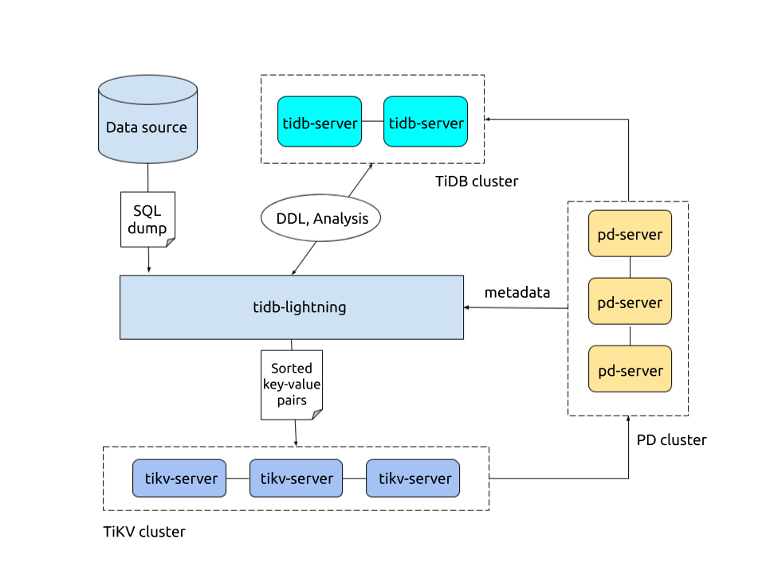

# TiDB文件导入


# TiDB整体架构



TiDB Lightning 目前支持两种导入方式，通过 `backend` 配置区分。不同的模式决定 TiDB Lightning 如何将数据导入到目标 TiDB 集群。

- [Physical Import Mode](https://docs.pingcap.com/zh/tidb/stable/tidb-lightning-physical-import-mode)：TiDB Lightning 首先将数据编码成键值对并排序存储在本地临时目录，然后将这些键值对上传到各个 TiKV 节点，最后调用 TiKV Ingest 接口将数据插入到 TiKV 的 RocksDB 中。如果用于初始化导入，请优先考虑使用 Physical Import Mode，其拥有较高的导入速度。Physical Import Mode 对应的后端模式为 `local`。
- [Logical Import Mode](https://docs.pingcap.com/zh/tidb/stable/tidb-lightning-logical-import-mode)：TiDB Lightning 先将数据编码成 SQL，然后直接运行这些 SQL 语句进行数据导入。如果需要导入的集群为生产环境线上集群，或需要导入的目标表中已包含有数据，则应使用 Logical Import Mode。Logical Import Mode 对应的后端模式为 `tidb`。

| 导入模式                           | Physical Import Mode    | Logical Import Mode   |
| :--------------------------------- | :---------------------- | :-------------------- |
| 后端                               | `local`                 | `tidb`                |
| 速度                               | 快 (100 ~ 500 GiB/小时) | 慢 (10 ~ 50 GiB/小时) |
| 资源使用率                         | 高                      | 低                    |
| 占用网络带宽                       | 高                      | 低                    |
| 导入时是否满足 ACID                | 否                      | 是                    |
| 目标表                             | 必须为空                | 可以不为空            |
| 支持 TiDB 集群版本                 | >= v4.0.0               | 全部                  |
| 导入期间是否允许 TiDB 对外提供服务 | 否                      | 是                    |

# Physical Import Mode 简介

Physical Import Mode 是 TiDB Lightning 支持的一种数据导入方式。Physical Import Mode 不经过 SQL 接口，而是直接将数据以键值对的形式插入 TiKV 节点，是一种高效、快速的导入模式。Physical Import Mode 适合导入最高 100 TB 数据量，使用前请务必自行阅读[必要条件及限制](https://docs.pingcap.com/zh/tidb/stable/tidb-lightning-physical-import-mode#必要条件及限制)。

Physical Import Mode 对应的后端模式为 `local`。

## 原理说明

1. 在导入数据之前，TiDB Lightning 会自动将 TiKV 节点切换为“导入模式” (import mode)，优化写入效率并停止 PD 调度和自动压缩。

2. `tidb-lightning` 在目标数据库建立表结构，并获取其元数据。

3. 每张表都会被分割为多个连续的**区块**，这样来自大表 (200 GB+) 的数据就可以多个并发导入。

4. `tidb-lightning` 会为每一个区块准备一个“引擎文件 (engine file)”来处理键值对。`tidb-lightning` 会并发读取 SQL dump，将数据源转换成与 TiDB 相同编码的键值对，然后将这些键值对排序写入本地临时存储文件中。

5. 当一个引擎文件数据写入完毕时，`tidb-lightning` 便开始对目标 TiKV 集群数据进行分裂和调度，然后导入数据到 TiKV 集群。

   引擎文件包含两种：**数据引擎**与**索引引擎**，各自又对应两种键值对：行数据和次级索引。通常行数据在数据源里是完全有序的，而次级索引是无序的。因此，数据引擎文件在对应区块写入完成后会被立即上传，而所有的索引引擎文件只有在整张表所有区块编码完成后才会执行导入。

6. 整张表相关联的所有引擎文件完成导入后，`tidb-lightning` 会对比本地数据源及下游集群的校验和 (checksum)，确保导入的数据无损，然后让 TiDB 分析 (`ANALYZE`) 这些新增的数据，以优化日后的操作。同时，`tidb-lightning` 调整 `AUTO_INCREMENT` 值防止之后新增数据时发生冲突。

   表的自增 ID 是通过行数的**上界**估计值得到的，与表的数据文件总大小成正比。因此，最后的自增 ID 通常比实际行数大得多。这属于正常现象，因为在 TiDB 中自增 ID [不一定是连续分配的](https://docs.pingcap.com/zh/tidb/stable/mysql-compatibility#自增-id)。

7. 在所有步骤完毕后，`tidb-lightning` 自动将 TiKV 切换回“普通模式” (normal mode)，此后 TiDB 集群可以正常对外提供服务。

## 必要条件及限制

### 运行环境需求

**操作系统**：建议使用新的、纯净版 CentOS 7 实例，你可以在本地虚拟化一台主机，或在供应商提供的平台上部署一台小型的云虚拟主机。TiDB Lightning 运行过程中，默认会占满 CPU，建议单独部署在一台主机上。如果条件不允许，你可以将 TiDB Lightning 和其他组件（比如 `tikv-server`）部署在同一台机器上，然后设置 `region-concurrency` 配置项的值为逻辑 CPU 数的 75%，以限制 TiDB Lightning 对 CPU 资源的使用。

**内存和 CPU**：

建议使用 32 核以上的 CPU 和 64 GiB 以上内存以获得更好的性能。


注意

导入大量数据时，一个并发对内存的占用在 2 GiB 左右，也就是说总内存占用最大可达到 region-concurrency * 2 GiB。`region-concurrency` 默认与逻辑 CPU 的数量相同。如果内存的大小（GiB）小于逻辑 CPU 数量的两倍或运行时出现 OOM，需要手动调低 `region-concurrency` 参数以避免 TiDB Lightning OOM。

**存储空间**：配置项 `sorted-kv-dir` 设置排序的键值对的临时存放地址，目标路径必须是一个空目录，目录空间须大于待导入数据集的大小。建议与 `data-source-dir` 使用不同的存储设备，独占 IO 会获得更好的导入性能，且建议优先考虑配置闪存等高性能存储介质。

**网络**：建议使用 10 Gbps 以太网卡。

### 版本要求

- TiDB Lightning 版本 ≥ 4.0.3。
- TiDB 集群版本 ≥ v4.0.0。
- 如果目标 TiDB 集群是 v3.x 或以下的版本，需要使用 Importer-backend 来完成数据的导入。在这个模式下，`tidb-lightning` 需要将解析的键值对通过 gRPC 发送给 `tikv-importer` 并由 `tikv-importer` 完成数据的导入。

### 使用限制

- 请勿使用 Physical Import Mode 向已经投入生产的 TiDB 集群导入数据，这将对在线业务产生严重影响。
- 默认情况下，不应同时启动多个 TiDB Lightning 实例向同一 TiDB 集群导入数据，而应考虑使用[并行导入](https://docs.pingcap.com/zh/tidb/stable/tidb-lightning-distributed-import)特性。
- 使用多个 TiDB Lightning 向同一目标导入时，请勿混用不同的 backend，即不可同时使用 Physical Import Mode 和 Logical Import Mode 导入同一 TiDB 集群。
- 单个 Lightning 进程导入单表不应超过 10TB，使用并行导入 Lightning 实例不应超过 10 个。

### 与其他组件一同使用的注意事项

- TiDB Lightning 与 TiFlash 一起使用时需要注意：
  - 无论是否已为一张表创建 TiFlash 副本，你都可以使用 TiDB Lightning 导入数据至该表。但该场景下，TiDB Lightning 导入数据耗费的时间更长，具体取决于 TiDB Lightning 部署机器的网卡带宽、TiFlash 节点的 CPU 及磁盘负载及 TiFlash 副本数等因素。
- TiDB Lightning 字符集相关的注意事项：
  - TiDB Lightning 在 v5.4.0 之前不支持导入 `charset=GBK` 的表。
- TiDB Lightning 与 TiCDC 一起使用时需要注意：
  - TiCDC 无法捕获 Physical Import Mode 插入的数据。

# Logical Import Mode 简介

Logical Import Mode 是 TiDB Lightning 支持的一种数据导入方式。在 Logical Import Mode 下，**TiDB Lightning 先将数据编码成 SQL，然后直接运行这些 SQL 语句进行数据导入**。对于已有数据、对外提供服务的 TiDB 集群，推荐使用 Logical Import Mode 导入数据。Logical Import Mode 的行为与正常执行 SQL 并无差异，可保证 ACID。

Logical Import Mode 对应的后端模式为 `tidb`。

## 必要条件

**操作系统**：

建议使用新的、纯净版 CentOS 7 实例，你可以在本地虚拟化一台主机，或在供应商提供的平台上部署一台小型的云虚拟主机。**TiDB Lightning 运行过程中，默认会占满 CPU，建议单独部署在一台主机上**。如果条件不允许，你可以将 TiDB Lightning 和其他组件（比如 `tikv-server`）部署在同一台机器上，然后**设置 `region-concurrency` 配置项的值为逻辑 CPU 数的 75%**，以限制 TiDB Lightning 对 CPU 资源的使用。

**内存和 CPU**：

建议使用 4 核以上的 CPU 和 8 GiB 以上内存以获得更好的性能。根据长期的实践经验，Lightning 的 Logical Import Mode 没有显著（5 GiB 以上）的内存占用，但上调 `region-concurrency` 默认值将导致内存量增加。

**网络**：建议使用 1 Gbps 或 10 Gbps 以太网卡。

## 使用限制

使用多个 TiDB Lightning 向同一目标导入时，请勿混用不同的 backend，即**不可同时使用 Physical Import Mode 和 Logical Import Mode 导入同一 TiDB 集群**。

# 使用 Physical Import Mode

本文档介绍如何编写 [Physical Import Mode](https://docs.pingcap.com/zh/tidb/stable/tidb-lightning-physical-import-mode) 的配置文件，如何进行性能调优等内容。

## 配置及使用

可以通过以下配置文件使用 Physical Import Mode 执行数据导入：

```toml
[lightning]
# 日志
level = "info"
file = "tidb-lightning.log"
max-size = 128 # MB
max-days = 28
max-backups = 14

# 启动之前检查集群是否满足最低需求。
check-requirements = true

[mydumper]
# 本地源数据目录或外部存储 URL
data-source-dir = "/data/my_database"

[tikv-importer]
# 导入模式配置，设为 local 即使用 Physical Import Mode
backend = "local"

# 冲突数据处理方式
duplicate-resolution = 'remove'

# 本地进行 KV 排序的路径。
sorted-kv-dir = "./some-dir"

[tidb]
# 目标集群的信息。tidb-server 的地址，填一个即可。
host = "172.16.31.1"
port = 4000
user = "root"
# 设置连接 TiDB 的密码，可为明文或 Base64 编码。
password = ""
# 必须配置。表结构信息从 TiDB 的“status-port”获取。
status-port = 10080
# 必须配置。pd-server 的地址，填一个即可。
pd-addr = "172.16.31.4:2379"
# tidb-lightning 引用了 TiDB 库，并生成产生一些日志。
# 设置 TiDB 库的日志等级。
log-level = "error"

[post-restore]
# 配置是否在导入完成后对每一个表执行 `ADMIN CHECKSUM TABLE <table>` 操作来验证数据的完整性。
# 可选的配置项：
# - "required"（默认）。在导入完成后执行 CHECKSUM 检查，如果 CHECKSUM 检查失败，则会报错退出。
# - "optional"。在导入完成后执行 CHECKSUM 检查，如果报错，会输出一条 WARN 日志并忽略错误。
# - "off"。导入结束后不执行 CHECKSUM 检查。
# 默认值为 "required"。从 v4.0.8 开始，checksum 的默认值由此前的 "true" 改为 "required"。
#
# 注意：
# 1. Checksum 对比失败通常表示导入异常（数据丢失或数据不一致），因此建议总是开启 Checksum。
# 2. 考虑到与旧版本的兼容性，依然可以在本配置项设置 `true` 和 `false` 两个布尔值，其效果与 `required` 和 `off` 相同。
checksum = "required"
# 配置是否在 CHECKSUM 结束后对所有表逐个执行 `ANALYZE TABLE <table>` 操作。
# 此配置的可选配置项与 `checksum` 相同，但默认值为 "optional"。
analyze = "optional"
```

Lightning 的完整配置文件可参考[完整配置及命令行参数](https://docs.pingcap.com/zh/tidb/stable/tidb-lightning-configuration)。

## 冲突数据检测

冲突数据，即两条或两条以上的记录存在 PK/UK 列数据重复的情况。当数据源中的记录存在冲突数据，将导致该表真实总行数和使用唯一索引查询的总行数不一致的情况。冲突数据检测支持三种策略：

- record: 仅将冲突记录添加到目的 TiDB 中的 `lightning_task_info.conflict_error_v1` 表中。注意，该方法要求目的 TiKV 的版本为 v5.2.0 或更新版本。如果版本过低，则会启用 'none' 模式。
- remove: 推荐方式。记录所有的冲突记录，和 'record' 模式相似。但是会删除所有的冲突记录，以确保目的 TiDB 中的数据状态保持一致。
- none: 关闭冲突数据检测。该模式是三种模式中性能最佳的，但是可能会导致目的 TiDB 中出现数据不一致的情况。

在 v5.3 版本之前，Lightning 不具备冲突数据检测特性，若存在冲突数据将导致导入过程最后的 checksum 环节失败；开启冲突检测特性的情况下，无论 `record` 还是 `remove` 策略，只要检测到冲突数据，Lightning 都会跳过最后的 checksum 环节（因为必定失败）。

假设一张表 `order_line` 的表结构如下：

```sql
CREATE TABLE IF NOT EXISTS `order_line` (
  `ol_o_id` int(11) NOT NULL,
  `ol_d_id` int(11) NOT NULL,
  `ol_w_id` int(11) NOT NULL,
  `ol_number` int(11) NOT NULL,
  `ol_i_id` int(11) NOT NULL,
  `ol_supply_w_id` int(11) DEFAULT NULL,
  `ol_delivery_d` datetime DEFAULT NULL,
  `ol_quantity` int(11) DEFAULT NULL,
  `ol_amount` decimal(6,2) DEFAULT NULL,
  `ol_dist_info` char(24) DEFAULT NULL,
  PRIMARY KEY (`ol_w_id`,`ol_d_id`,`ol_o_id`,`ol_number`)
) ENGINE=InnoDB DEFAULT CHARSET=utf8mb4 COLLATE=utf8mb4_bin;
```

若在导入过程中检测到冲突数据，则可以查询 `lightning_task_info.conflict_error_v1` 表得到以下内容：

```sql
mysql> select table_name,index_name,key_data,row_data from conflict_error_v1 limit 10;
+---------------------+------------+----------+-----------------------------------------------------------------------------+
|  table_name         | index_name | key_data | row_data                                                                    |
+---------------------+------------+----------+-----------------------------------------------------------------------------+
| `tpcc`.`order_line` | PRIMARY    | 21829216 | (2677, 10, 10, 11, 75656, 10, NULL, 5, 5831.97, "HT5DN3EVb6kWTd4L37bsbogj") |
| `tpcc`.`order_line` | PRIMARY    | 49931672 | (2677, 10, 10, 11, 75656, 10, NULL, 5, 5831.97, "HT5DN3EVb6kWTd4L37bsbogj") |
| `tpcc`.`order_line` | PRIMARY    | 21829217 | (2677, 10, 10, 12, 76007, 10, NULL, 5, 9644.36, "bHuVoRfidQ0q2rJ6ZC9Hd12E") |
| `tpcc`.`order_line` | PRIMARY    | 49931673 | (2677, 10, 10, 12, 76007, 10, NULL, 5, 9644.36, "bHuVoRfidQ0q2rJ6ZC9Hd12E") |
| `tpcc`.`order_line` | PRIMARY    | 21829218 | (2677, 10, 10, 13, 85618, 10, NULL, 5, 7427.98, "t3rsesgi9rVAKi9tf6an5Rpv") |
| `tpcc`.`order_line` | PRIMARY    | 49931674 | (2677, 10, 10, 13, 85618, 10, NULL, 5, 7427.98, "t3rsesgi9rVAKi9tf6an5Rpv") |
| `tpcc`.`order_line` | PRIMARY    | 21829219 | (2677, 10, 10, 14, 15873, 10, NULL, 5, 133.21, "z1vH0e31tQydJGhfNYNa4ScD")  |
| `tpcc`.`order_line` | PRIMARY    | 49931675 | (2677, 10, 10, 14, 15873, 10, NULL, 5, 133.21, "z1vH0e31tQydJGhfNYNa4ScD")  |
| `tpcc`.`order_line` | PRIMARY    | 21829220 | (2678, 10, 10, 1, 44644, 10, NULL, 5, 8463.76, "TWKJBt5iJA4eF7FIVxnugNmz")  |
| `tpcc`.`order_line` | PRIMARY    | 49931676 | (2678, 10, 10, 1, 44644, 10, NULL, 5, 8463.76, "TWKJBt5iJA4eF7FIVxnugNmz")  |
+---------------------+------------+----------------------------------------------------------------------------------------+
10 rows in set (0.14 sec)
```

根据上述信息人工甄别需要保留的重复数据，手动插回原表即可。

## 性能调优

**提高 Lightning Physical Import Mode 导入性能最直接有效的方法：**

- **升级 Lightning 所在节点的硬件，尤其重要的是 CPU 和 sorted-key-dir 所在存储设备的性能。**
- **使用[并行导入](https://docs.pingcap.com/zh/tidb/stable/tidb-lightning-distributed-import)特性实现水平扩展。**

当然，Lightning 也提供了部分并发相关配置以影响 Physical Import Mode 的导入性能。但是从长期实践的经验总结来看，以下四个配置项一般保持默认值即可，调整其数值并不会带来显著的性能提升，可作为了解内容阅读。

```ini
[lightning]
# 引擎文件的最大并行数。
# 每张表被切分成一个用于存储索引的“索引引擎”和若干存储行数据的“数据引擎”。
# 这两项设置控制两种引擎文件的最大并发数。
index-concurrency = 2
table-concurrency = 6

# 数据的并发数。默认与逻辑 CPU 的数量相同。
# region-concurrency =

# I/O 最大并发数。I/O 并发量太高时，会因硬盘内部缓存频繁被刷新
# 而增加 I/O 等待时间，导致缓存未命中和读取速度降低。
# 对于不同的存储介质，此参数可能需要调整以达到最佳效率。
io-concurrency = 5
```

导入时，每张表被切分成一个用于存储索引的“索引引擎”和若干存储行数据的“数据引擎”，`index-concurrency`用于调整"索引引擎"的并发度。

在调整 `index-concurrency` 时，需要注意 `index-concurrency * 每个表对应的源文件数量 > region-concurrency` 以确保 cpu 被充分利用，一般比例大概在 1.5 ~ 2 左右为优。`index-concurrency` 不应该设置的过大，但不低于 2 (默认)，过大会导致太多导入的 pipeline 变差，大量 index-engine 的 import 阶段堆积。

`table-concurrency` 同理，需要确保`table-concurrency * 每个表对应的源文件数量 > region-concurrency` 以确保 cpu 被充分利用。 推荐值为`region-concurrency * 4 / 每个表对应的源文件数量` 左右，最少设置为 4.

如果表非常大，Lightning 会按照 100 GiB 的大小将表分割成多个批次处理，并发度由 `table-concurrency` 控制。

上述两个参数对导入速度影响不大，使用默认值即可。

`io-concurrency` 用于控制文件读取并发度，默认值为 5。可以认为在某个时刻只有 5 个句柄在执行读操作。由于文件读取速度一般不会是瓶颈，所以使用默认值即可。

读取文件数据后，lightning 还需要做后续处理，例如将数据在本地进行编码和排序。此类操作的并发度由 `region-concurrency` 配置控制。`region-concurrency` 的默认值为 CPU 核数，通常无需调整，建议不要将 Lightning 与其它组件部署在同一主机，如果客观条件限制必须混合部署，则需要根据实际负载调低 `region-concurrency`。

此外，TiKV 的 [num-threads](https://docs.pingcap.com/zh/tidb/stable/tikv-configuration-file#num-threads) 配置也可能影响性能，新集群建议设置为 CPU 核数。

# 使用 Logical Import Mode

本文档介绍如何编写 [Logical Import Mode](https://docs.pingcap.com/zh/tidb/stable/tidb-lightning-logical-import-mode) 的配置文件，如何进行性能调优等内容。

## 配置及使用

可以通过以下配置文件使用 Logical Import Mode 执行数据导入：

```toml
[lightning]
# 日志
level = "info"
file = "tidb-lightning.log"
max-size = 128 # MB
max-days = 28
max-backups = 14

# 启动之前检查集群是否满足最低需求。
check-requirements = true

[mydumper]
# 本地源数据目录或外部存储 URL
data-source-dir = "/data/my_database"

[tikv-importer]
# 导入模式配置，设为 tidb 即使用 Logical Import Mode
backend = "tidb"

# Logical Import Mode 插入重复数据时执行的操作。
# - replace：新数据替代已有数据
# - ignore：保留已有数据，忽略新数据
# - error：中止导入并报错
on-duplicate = "replace"

[tidb]
# 目标集群的信息。tidb-server 的地址，填一个即可。
host = "172.16.31.1"
port = 4000
user = "root"
# 设置连接 TiDB 的密码，可为明文或 Base64 编码。
password = ""
# tidb-lightning 引用了 TiDB 库，并生成产生一些日志。
# 设置 TiDB 库的日志等级。
log-level = "error"
```

TiDB Lightning 的完整配置文件可参考[完整配置及命令行参数](https://docs.pingcap.com/zh/tidb/stable/tidb-lightning-configuration)。

## 冲突数据检测

冲突数据，即两条或两条以上的记录存在主键或唯一键列数据重复的情况。当数据源中的记录存在冲突数据，将导致该表真实总行数和使用唯一索引查询的总行数不一致的情况。TiDB Lightning 的 Logical Import Mode 通过 `on-duplicate` 配置冲突数据检测的策略，TiDB Lightning 根据策略使用不同的 SQL 语句进行插入。

| 策略      | 冲突时默认行为         | 对应 SQL 语句            |
| :-------- | :--------------------- | :----------------------- |
| `replace` | 新数据替代旧数据       | `REPLACE INTO ...`       |
| `ignore`  | 保留旧数据，忽略新数据 | `INSERT IGNORE INTO ...` |
| `error`   | 中止导入               | `INSERT INTO ...`        |

## 性能调优

- TiDB Lightning 的 Logical Import Mode 性能很大程度上取决于目标 TiDB 集群的写入性能，当遇到性能瓶颈时可参考 TiDB 相关[性能优化文档](https://docs.pingcap.com/zh/tidb/stable/high-concurrency-best-practices)。

- 如果发现目标 TiDB 集群的的写入尚未达到瓶颈，可以考虑增加 Lightning 配置中 `region-concurrency` 的值。`region-concurrency` 默认值为 CPU 核数，其含义在 Physical Import Mode 和 Logical Import Mode 下有所不同，Logical Import Mode 的 `region-concurrency` 表示写入并发数。配置示例：

  ```toml
  [lightning]
  region-concurrency = 32
  ```

- 调整目标 TiDB 集群的 [`raftstore.apply-pool-size`](https://docs.pingcap.com/zh/tidb/stable/tikv-configuration-file#apply-pool-size) 和 [`raftstore.store-pool-size`](https://docs.pingcap.com/zh/tidb/stable/tikv-configuration-file#store-pool-size) 参数也可能提升导入速度。

# TiDB Lightning 后端

TiDB Lightning 的[后端](https://docs.pingcap.com/zh/tidb/v5.3/tidb-lightning-glossary#backend)决定 `tidb-lightning` 组件将如何把将数据导入到目标集群中。目前，TiDB Lightning 支持以下后端：

- [Local-backend](https://docs.pingcap.com/zh/tidb/v5.3/tidb-lightning-backends#tidb-lightning-local-backend)
- [Importer-backend](https://docs.pingcap.com/zh/tidb/v5.3/tidb-lightning-backends#tidb-lightning-importer-backend)
- [TiDB-backend](https://docs.pingcap.com/zh/tidb/v5.3/tidb-lightning-backends#tidb-lightning-tidb-backend)

以上几种后端导入数据的区别如下：

- **Local-backend**：`tidb-lightning` 先将数据编码成键值对并排序存储在本地临时目录，然后将这些键值对以 SST 文件的形式上传到各个 TiKV 节点，然后由 TiKV 将这些 SST 文件 Ingest 到集群中。和 `Importer-backend` 原理相同，不过不依赖额外的 `tikv-importer` 组件。
- **Importer-backend**：`tidb-lightning` 先将 SQL 或 CSV 数据编码成键值对，由 `tikv-importer` 对写入的键值对进行排序，然后把这些键值对 Ingest 到 TiKV 节点中。
- **TiDB-backend**：`tidb-lightning` 先将数据编码成 `INSERT` 语句，然后直接在 TiDB 节点上运行这些 SQL 语句进行数据导入。

| 后端                       | Local-backend     | Importer-backend  | TiDB-backend         |
| :------------------------- | :---------------- | :---------------- | :------------------- |
| 速度                       | 快 (~500 GB/小时) | 快 (~400 GB/小时) | **慢 (~50 GB/小时)** |
| 资源使用率                 | 高                | 高                | 低                   |
| 占用网络带宽               | 高                | 中                | 低                   |
| 导入时是否满足 ACID        | 否                | 否                | 是                   |
| 目标表                     | 必须为空          | 必须为空          | 可以不为空           |
| 额外组件                   | 无                | `tikv-importer`   | 无                   |
| 支持 TiDB 集群版本         | >= v4.0.0         | 全部              | 全部                 |
| 是否影响 TiDB 对外提供服务 | 是                | 是                | **否**               |

## 如何选择后端模式

- 如果导入的目标集群为 v4.0 或以上版本，请优先考虑使用 Local-backend 模式。Local-backend 部署更简单并且性能也较其他两个模式更高
- 如果目标集群为 v3.x 或以下，建议使用 Importer-backend 模式
- 如果需要导入的集群为生产环境线上集群，或需要导入的表中已包含有数据，则最好使用 TiDB-backend 模式；

## TiDB Lightning TiDB-backend

注意：

从 TiDB v4.0 起，PingCAP 不再维护 [Loader](https://docs.pingcap.com/zh/tidb/v4.0/loader-overview) 工具。从 v5.0 起，不再提供 Loader 的文档。Loader 的功能已经完全被 TiDB Lightning 的 TiDB backend 功能取代，强烈建议切换到 TiDB Lightning。

### 部署和配置 TiDB Lightning

使用 TiDB-backend 时，你无需部署 `tikv-importer`。与[标准部署过程](https://docs.pingcap.com/zh/tidb/v5.3/deploy-tidb-lightning)相比，部署 TiDB-backend 时有如下不同：

- 可以跳过所有涉及 `tikv-importer` 的步骤。
- 必须更改相应配置申明使用的是 TiDB-backend。

#### 硬件需求

使用 TiDB-backend 时， TiDB Lightning 的速度仅受限于 TiDB 执行 SQL 语句的速度。因此，即使是低配的机器也足够发挥出最佳性能。推荐的硬件配置如下：

- 16 逻辑核 CPU
- 足够储存整个数据源的 SSD 硬盘，读取速度越快越好
- 千兆网卡

#### 手动部署

手动部署时，你无需下载和配置 `tikv-importer`，TiDB Lightning 可[在此下载](https://docs.pingcap.com/zh/tidb/v5.3/download-ecosystem-tools#tidb-lightning)。

在运行 `tidb-lightning` 之前，在配置文件中加上如下几行：

```toml
[tikv-importer]
backend = "tidb"
```

或者在用命令行启动 `tidb-lightning` 时，传入参数 `--backend tidb`。

#### 配置说明与示例

```toml
# tidb-lightning 任务配置

[lightning]
# 启动之前检查集群是否满足最低需求
check-requirements = true

# 每张表被切分成一个用于存储索引的“索引引擎”和若干存储行数据的“数据引擎”
# 这两项设置控制两种引擎文件的最大并发数
# 控制同时允许导入的最大表数量，对于 TiDB-backend，默认值为 CPU 数
index-concurrency = 40

# 控制同时允许导入的最大“数据引擎”数，默认值为 CPU 数，本配置应大于或等于 index-concurrency
table-concurrency = 40

# 执行 SQL 语句的并发数。默认与逻辑 CPU 的数量相同
# TiDB-backend 的瓶颈通常不在 CPU, 可以根据下游集群的实际负载调大此配置以优化写入速度
# 在调整此配置时，建议将 index-concurrency 和 table-concurrency 也调整成相同的值
region-concurrency = 40

# 日志相关的配置
# 输出日志级别
level = "info"

# 日志输出的文件。如果为空（默认），则会输出至 /tmp/lightning.log.{timestamp}；如果希望输出至系统标准输出，请设置为 "-"
# file = "tidb-lightning.log"

[checkpoint]
# 启用断点续传
# 导入数据时，TiDB Lightning 会记录当前表导入的进度
# 若 TiDB Lightning 或其他组件异常退出，在重启时也可以避免重复再导入已完成的数据
enable = true

# 存储断点的方式
#  - file（默认）：存放在本地文件系统（要求 v2.1.1 或以上）
#  - mysql：存放在兼容 MySQL 的数据库服务器
driver = "file"

# 存储断点的数据库名称
# 仅在 driver = "mysql" 时生效
# schema = "tidb_lightning_checkpoint"

# 断点的存放位置
#
# 若 driver = "file"，此参数为断点信息存放的文件路径
# 如果不设置该参数则默认为 `/tmp/CHECKPOINT_SCHEMA.pb`
#
# 若 driver = "mysql"，此参数为数据库连接参数 (DSN)，格式为“用户:密码@tcp(地址:端口)/”
# 默认会重用 [tidb] 设置目标数据库来存储断点
# 为避免加重目标集群的压力，建议另外使用一个兼容 MySQL 的数据库服务器
# dsn = "/tmp/tidb_lightning_checkpoint.pb"

# 导入成功后是否保留断点。默认为删除
# 保留断点可用于调试，但有可能泄漏数据源的元数据
# keep-after-success = false

[tikv-importer]
# 后端模式，对于 TiDB-backend 请设置为 “tidb”
backend = "tidb"

# 对于插入重复数据时执行的操作：
# - replace：新数据替代已有数据
# - ignore：保留已有数据，忽略新数据
# - error：中止导入并报错
# on-duplicate = "replace"

[mydumper]
# 设置文件读取的区块大小(默认为 64 KiB)，确保该值比数据源的最长字符串长。
# read-block-size = "64KiB" 

# （源数据文件）单个导入区块大小的最小值（默认为 100 GiB）。
# TiDB Lightning 根据该值将一张大表分割为多个数据引擎文件。
# batch-size = "100GiB"

# 本地源数据目录或外部存储 URL
data-source-dir = "/data/my_database"

# “严格”格式的导入数据可加快处理速度。
# strict-format = true 要求：
# 在 CSV 文件的所有记录中，每条数据记录的值不可包含字符换行符（U+000A 和 U+000D，即 \r 和 \n）
# 甚至被引号包裹的字符换行符都不可包含，即换行符只可用来分隔行。
# 导入数据源为严格格式时，TiDB Lightning 会快速定位大文件的分割位置进行并行处理。
# 但是如果输入数据为非严格格式，可能会将一条完整的数据分割成两部分，导致结果出错。
# 为保证数据安全而非追求处理速度，默认值为 false。
# strict-format = false

# 如果 strict-format = true，TiDB Lightning 会将 CSV 大文件分割为多个文件块进行并行处理。max-region-size 是分割后每个文件块的最大大小。
# max-region-size = "256MiB" # Byte（默认是 256 MiB）

# 只导入与该通配符规则相匹配的表，默认会过滤掉系统表。详情见表库过滤章节。
# filter = ['*.*', '!mysql.*', '!sys.*', '!INFORMATION_SCHEMA.*', '!PERFORMANCE_SCHEMA.*', '!METRICS_SCHEMA.*', '!INSPECTION_SCHEMA.*']

# 配置 CSV 文件的解析方式（如果源文件中不包含 CSV 文件可不设置此项）。
[mydumper.csv]
# 字段分隔符，应为单个 ASCII 字符。
separator = ','

# 引用定界符，可为单个 ASCII 字符或空字符串。
delimiter = '"'

# CSV 文件是否包含表头。
# 如果 header = true，将跳过首行。
header = true

# CSV 文件是否包含 NULL。
# 如果 not-null = true，CSV 所有列都不能解析为 NULL。
not-null = false

# 如果 not-null = false（即 CSV 可以包含 NULL），
# 为以下值的字段将会被解析为 NULL。
null = '\N'

# 是否对字段内“\“进行转义
backslash-escape = true

# 如果有行以分隔符结尾，删除尾部分隔符。
trim-last-separator = false

[tidb]
# 目标集群的信息。tidb-server 的地址，填一个即可。
host = "172.16.31.1"
port = 4000
user = "root"
password = ""

# 解析和执行 SQL 语句的默认 SQL 模式。
# sql-mode = "ONLY_FULL_GROUP_BY,NO_ENGINE_SUBSTITUTION"

# SQL 连接是否使用 TLS。可选值为：
#  * ""            - 如果填充了 [tidb.security] 部分，则强制使用 TLS（与 "cluster" 情况相同），否则与 "false" 情况相同
#  * "false"       - 禁用 TLS
#  * "cluster"     - 强制使用 TLS, 并使用 [tidb.security] 部分中指定的 CA 验证服务器的证书
#  * "skip-verify" - 强制使用 TLS, 但不验证服务器的证书（不安全！）
#  * "preferred"   - 与 "skip-verify" 相同，但是如果服务器不支持 TLS，则会退回到未加密的连接
tls = ""

# 指定证书和密钥用于 TLS 连接 MySQL。
# [tidb.security]

# CA 的公钥证书。设置为空字符串可禁用 SQL 的 TLS。
# ca-path = "/path/to/ca.pem"

# 该服务的公钥证书。默认为 `security.cert-path` 的副本
# cert-path = "/path/to/lightning.pem"

# 此服务的私钥。默认为 `security.key-path` 的副本
# key-path = "/path/to/lightning.key"

# 设置周期性后台操作。
# 支持的单位：h（时）、m（分）、s（秒）。
[cron]

# 在日志中打印导入进度的持续时间。
log-progress = "5m"
```

### 解决冲突

TiDB-backend 支持导入到已填充的表（非空表）。但是，新数据可能会与旧数据的唯一键冲突。你可以通过使用如下任务配置来控制遇到冲突时的默认行为：

```toml
[tikv-importer]
backend = "tidb"
on-duplicate = "replace" # 或者 “error”、“ignore”
```

| 设置    | 冲突时默认行为         | 对应 SQL 语句            |
| :------ | :--------------------- | :----------------------- |
| replace | 新数据替代旧数据       | `REPLACE INTO ...`       |
| ignore  | 保留旧数据，忽略新数据 | `INSERT IGNORE INTO ...` |
| error   | 中止导入               | `INSERT INTO ...`        |

# TiDB Lightning 断点续传

大量的数据导入一般耗时数小时至数天，长时间运行的进程会有一定机率发生非正常中断。如果每次重启都从头开始，就会浪费掉之前已成功导入的数据。为此，TiDB Lightning 提供了“断点续传”的功能，即使 `tidb-lightning` 崩溃，在重启时仍然接着之前的进度继续工作。

本文主要介绍 TiDB Lightning 断点续传的启用与配置、断点的存储，以及断点续传的控制。

## 断点续传的启用与配置

```toml
[checkpoint]
# 启用断点续传。
# 导入时，TiDB Lightning 会记录当前进度。
# 若 TiDB Lightning 或其他组件异常退出，在重启时可以避免重复再导入已完成的数据。
enable = true

# 存储断点的方式
#  - file：存放在本地文件系统（要求 v2.1.1 或以上）
#  - mysql：存放在兼容 MySQL 的数据库服务器
driver = "file"

# 存储断点的架构名称（数据库名称）
# 仅在 driver = "mysql" 时生效
# schema = "tidb_lightning_checkpoint"

# 断点的存放位置
#
# 若 driver = "file"，此参数为断点信息存放的文件路径。
# 如果不设置该参数则默认为 `/tmp/CHECKPOINT_SCHEMA.pb`
#
# 若 driver = "mysql"，此参数为数据库连接参数 (DSN)，格式为“用户:密码@tcp(地址:端口)/”。
# 默认会重用 [tidb] 设置目标数据库来存储断点。
# 为避免加重目标集群的压力，建议另外使用一个兼容 MySQL 的数据库服务器。
# dsn = "/tmp/tidb_lightning_checkpoint.pb"

# 导入成功后是否保留断点。默认为删除。
# 保留断点可用于调试，但有可能泄漏数据源的元数据。
# keep-after-success = false
```

## 断点的存储

TiDB Lightning 支持两种存储方式：本地文件或 MySQL 数据库。

- 若 `driver = "file"`，**断点会存放在一个本地文件，其路径由 `dsn` 参数指定。由于断点会频繁更新，建议将这个文件放到写入次数不受限制的盘上**，例如 RAM disk。
- 若 `driver = "mysql"`，断点可以存放在任何兼容 MySQL 5.7 或以上的数据库中，包括 MariaDB 和 TiDB。在没有选择的情况下，默认会存在目标数据库里。

目标数据库在导入期间会有大量的操作，若使用目标数据库来存储断点会加重其负担，甚至有可能造成通信超时丢失数据。因此，**强烈建议另外部署一台兼容 MySQL 的临时数据库服务器**。此数据库也可以安装在 `tidb-lightning` 的主机上。导入完毕后可以删除。

## 断点续传的控制

若 `tidb-lightning` 因不可恢复的错误而退出（例如数据出错），重启时不会使用断点，而是直接报错离开。为保证已导入的数据安全，这些错误必须先解决掉才能继续。使用 `tidb-lightning-ctl` 工具可以标示已经恢复。

### `--checkpoint-error-destroy`

```sh
tidb-lightning-ctl --checkpoint-error-destroy='`schema`.`table`'
```

**该命令会让失败的表从头开始整个导入过程**。选项中的架构和表名必须以反引号 (```) 包裹，而且区分大小写。

- 如果导入 ``schema`.`table`` 这个表曾经出错，这条命令会：
  1. **从目标数据库移除 (DROP) 这个表，清除已导入的数据。**
  2. 将断点重设到“未开始”的状态。
- 如果 ``schema`.`table`` 没有出错，则无操作。

传入 "all" 会对所有表进行上述操作。这是最方便、安全但保守的断点错误解决方法：

```sh
tidb-lightning-ctl --checkpoint-error-destroy=all
```

### `--checkpoint-error-ignore`

```sh
tidb-lightning-ctl --checkpoint-error-ignore='`schema`.`table`' &&
tidb-lightning-ctl --checkpoint-error-ignore=all
```

如果导入 ``schema`.`table`` 这个表曾经出错，这条命令会清除出错状态，如同没事发生过一样。传入 "all" 会对所有表进行上述操作。

>  注意：
>
> **除非确定错误可以忽略，否则不要使用这个选项**。**如果错误是真实的话，可能会导致数据不完全**。启用校验和 (CHECKSUM) 可以防止数据出错被忽略。

### `--checkpoint-remove`

```sh
tidb-lightning-ctl --checkpoint-remove='`schema`.`table`' &&
tidb-lightning-ctl --checkpoint-remove=all
```

无论是否有出错，把表的断点清除。

### `--checkpoint-dump`

```sh
tidb-lightning-ctl --checkpoint-dump=output/directory
```

将所有断点备份到传入的文件夹，主要用于技术支持。此选项仅于 `driver = "mysql"` 时有效。

# TiDB Lightning 并行导入（一般用于Physical Import Mode）

TiDB Lightning 的 [Physical Import Mode](https://docs.pingcap.com/zh/tidb/stable/tidb-lightning-physical-import-mode) 从 v5.3.0 版本开始**支持单表或多表数据的并行导入**。**通过支持同步启动多个实例，并行导入不同的单表或多表的不同数据**，使 TiDB Lightning 具备水平扩展的能力，可大大降低导入大量数据所需的时间。

在技术实现上，TiDB Lightning 通过**在目标 TiDB 中记录各个实例以及每个导入表导入数据的元信息，协调不同实例的 Row ID 分配范围、全局 Checksum 的记录和 TiKV 及 PD 的配置变更与恢复**。


TiDB Lightning 并行导入可以用于以下场景：

- **并行导入分库分表的数据**。在该场景中，来自上游多个数据库实例中的多个表，分别由不同的 TiDB Lightning 实例并行导入到下游 TiDB 数据库中。
- **并行导入单表的数据**。在该场景中，存放在某个目录中或云存储（如 Amazon S3）中的多个单表文件，分别由不同的 TiDB Lightning 实例并行导入到下游 TiDB 数据库中。该功能为 v5.3.0 版本引入的新功能。


注意：

- **并行导入只支持初始化 TiDB 的空表，不支持导入数据到已有业务写入的数据表**，否则可能会导致数据不一致的情况。
- **并行导入一般用于 local-backend 模式。**
- **并行导入一般用于 Physical Import Mode**；虽然也能用于 Logical Import Mode，但是一般不会带来明显的性能提升。

## 使用说明

使用 TiDB Lightning 并行导入无须额外配置。**TiDB Lightning 在启动时，会在下游 TiDB 中注册元信息，并自动检测是否有其他实例向目标集群导入数据。如果有，则自动进入并行导入模式。**

但是在并行导入时，需要注意以下情况：

- 解决主键或者唯一索引的冲突；
- 导入性能优化；

### （1）解决主键或者唯一索引的冲突

**在使用 [Physical Import Mode](https://docs.pingcap.com/zh/tidb/stable/tidb-lightning-physical-import-mode) 并行导入时，需要确保多个 TiDB Lightning 的数据源之间，以及它们和 TiDB 的目标表中的数据没有主键或者唯一索引的冲突，并且导入的目标表不能有其他应用进行数据写入**。否则，TiDB Lightning 将无法保证导入结果的正确性，并且导入完成后相关的数据表将处于数据索引不一致的状态。

### （2）导入性能优化

由于 TiDB Lightning **需要将生成的 Key-Value 数据上传到对应 Region 的每一个副本所在的 TiKV 节点**，其导入速度受目标集群规模的限制。在通常情况下，建议确保目标 TiDB 集群中的 TiKV 实例数量与 TiDB Lightning 的实例数量大于 n:1 (n 为 Region 的副本数量)。同时，在使用 TiDB Lightning 并行导入模式时，为达到最优性能，建议进行如下限制：

- 每个 TiDB Lightning 部署在单独的机器上面。**TiDB Lightning 默认会消耗所有的 CPU 资源，在单台机器上面部署多个实例并不能提升性能**。
- 每个 TiDB Lightning 实例**导入的源文件总大小不超过 5 TiB**；
- **TiDB Lightning 实例的总数量不超过 10 个**；

在使用 TiDB Lightning 并行导入分库分表数据的时候，请根据数据量大小选择使用的 TiDB Lightning 实例数量。

- **如果 MySQL 数据量小于 2 TiB，可以使用 1 个 TiDB Lightning 实例进行并行导入**；
- 如果 MySQL 数据量超过 2 TiB，并且 MySQL 实例总数小于 10 个，建议每个 MySQL 实例对应 1 个 TiDB Lightning 实例，而且并行 TiDB Lightning 实例数量不要超过 10 个；
- 如果 MySQL 数据量超过 2 TiB，并且 MySQL 实例总数超过 10 个，建议这些 MySQL 实例导出的数据平均分配 5 到 10 个 TiDB Lightning 实例进行导入；

接下来，本文档将以两个并行导入的示例，详细介绍了不同场景下并行导入的操作步骤：

- 示例 1：使用 Dumpling + TiDB Lightning 并行导入分库分表数据至 TiDB
- 示例 2：使用 TiDB Lightning 并行导入单表数据

### （3）使用限制！！！

TiDB Lightning 在运行时，需要独占部分资源，因此如果需要在单台机器上面部署多个 TiDB Lightning 实例(不建议生产环境使用)或多台机器共享磁盘存储时，需要注意如下使用限制：

- **每个 TiDB Lightning 实例的 tikv-importer.sorted-kv-dir 必须设置为不同的路径**。多个实例共享相同的路径会导致非预期的行为，可能导致导入失败或数据出错。
- **每个 TiDB Lightning 的 checkpoint 需要分开存储**。checkpoint 的详细配置见： [TiDB Lightning 断点续传](https://docs.pingcap.com/zh/tidb/stable/tidb-lightning-checkpoints)。
  - 如果设置 checkpoint.driver = "file"（默认值），**需要确保每个实例设置的 checkpoint 的路径不同**。
  - 如果设置 checkpoint.driver = "mysql", 需要为每个实例设置不同的 schema。
- **每个 TiDB Lightning 的 log 文件应该设置为不同的路径**。共享同一个 log 文件将不利于日志的查询和排查问题。
- **如果开启 [Web 界面](https://docs.pingcap.com/zh/tidb/stable/tidb-lightning-web-interface) 或 Debug API, 需要为每个实例的 `lightning.status-addr` 设置不同地址**，否则，TiDB Lightning 进程会由于端口冲突无法启动。

## 示例 1：并行导入分库分表数据至 TiDB

在本示例中，假设上游为包含 10 个分表的 MySQL 集群，总共大小为 10 TiB。使用 5 个 TiDB Lightning 实例并行导入，每个实例导入 2 TiB 数据，预计可以将总导入时间（不包含 Dumpling 导出的耗时）由约 40 小时降至约 10 小时。

假设上游的库名为 `my_db`，每个分表的名字为 `my_table_01` ~ `my_table_10`，需要合并导入至下游的 `my_db.my_table` 表中。下面介绍具体的操作步骤。

### （1）使用 Dumpling 导出数据

在部署 TiDB Lightning 的 5 个节点上面分别导出两个分表的数据：

- 如果两个分表位于同一个 MySQL 实例中，可以直接使用 Dumpling 的 `--filter` 参数一次性导出。此时在使用 TiDB Lightning 导入时，指定 `data-source-dir` 为 Dumpling 数据导出的目录即可；
- 如果两个分表的数据分布在不同的 MySQL 节点上，则需要使用 Dumpling 分别导出，两次导出数据需要放置在同一父目录下**不同子目录里**，然后在使用 TiDB Lightning 导入时，`data-source-dir` 指定为此父级目录。

使用 Dumpling 导出数据的步骤，请参考 [Dumpling](https://docs.pingcap.com/zh/tidb/stable/dumpling-overview)。

### （2）配置 TiDB Lightning 的数据源

创建 `tidb-lightning.toml` 配置文件，并加入如下内容：

```ini
[lightning]
status-addr = ":8289"

[mydumper]
# 设置为 Dumpling 导出数据的路径，如果 Dumpling 执行了多次并分属不同的目录，请将多次导出的数据置放在相同的父目录下并指定此父目录即可。
data-source-dir = "/path/to/source-dir"

[tikv-importer]
# 是否允许向已存在数据的表导入数据。默认值为 false。
# 当使用并行导入模式时，由于多个 TiDB Lightning 实例同时导入一张表，因此此开关必须设置为 true。
incremental-import = true
# "local"：Physical Import Mode，默认使用。适用于 TB 级以上大数据量，但导入期间下游 TiDB 无法对外提供服务。
# "tidb"：Logical Import Mode。TB 级以下数据量也可以采用，下游 TiDB 可正常提供服务。
backend = "local"

# 设置本地排序数据的路径
sorted-kv-dir = "/path/to/sorted-dir"
```

如果数据源存放在 Amazon S3 或 GCS 等外部存储中，请参考[外部存储](https://docs.pingcap.com/zh/tidb/stable/backup-and-restore-storages)。

### （3）开启 TiDB Lightning 进行数据导入

在使用 TiDB Lightning 并行导入时，对每个 TiDB Lightning 节点机器配置的需求与**非并行导入模式相同**，每个 TiDB Lightning 节点需要消耗相同的资源，建议部署在不同的机器上。详细的部署步骤，请参考 [TiDB Lightning 部署与执行](https://docs.pingcap.com/zh/tidb/stable/deploy-tidb-lightning)

依次在每台机器上面运行 TiDB Lightning。**如果直接在命令行中用 `nohup` 启动程序，可能会因为 SIGHUP 信号而退出，建议把 `nohup` 放到脚本里面**，如：

```sh
# !/bin/bash
nohup tiup tidb-lightning -config tidb-lightning.toml > nohup.out &
```

在并行导入的场景下，TiDB Lightning 在启动任务之后，会自动进行下列检查：

- **检查本地盘空间（即 `sort-kv-dir` 配置）以及 TiKV 集群是否有足够空间导入数据**，空间大小的详细说明参考 [TiDB Lightning 下游数据库所需空间](https://docs.pingcap.com/zh/tidb/stable/tidb-lightning-requirements#目标数据库所需空间)和 [TiDB Lightning 运行时资源要求](https://docs.pingcap.com/zh/tidb/stable/tidb-lightning-physical-import-mode#运行环境需求)。检查时会对数据源进行采样，通过采样结果预估索引大小占比。由于估算中考虑了索引，因此可能会出现尽管数据源大小低于本地盘可用空间，但依然无法通过检测的情况。
- **检查 TiKV 集群的 region 分布是否均匀，以及是否存在大量空 region**，如果空 region 的数量大于 max(1000, 表的数量 * 3) ，即大于 “1000” 和 “3 倍表数量”二者中的最大者，则无法执行导入。
- **检查数据源导入数据是否有序，并且根据检查结果自动调整 `mydumper.batch-size` 的大小**。因此 `mydumper.batch-size` 配置不再对用户开放。

你也可以通过 `lightning.check-requirements` 配置来关闭检查，执行强制导入。更多详细检查内容，可以查看 [Lightning 执行前检查项](https://docs.pingcap.com/zh/tidb/stable/tidb-lightning-prechecks)。

### （4）查看进度

开始导入后，可以通过以下任意方式查看进度：

- **通过 `grep` 日志关键字 `progress` 查看进度**，默认 5 分钟更新一次。
- **通过监控面板查看进度**。详情请参见 [TiDB Lightning 监控](https://docs.pingcap.com/zh/tidb/stable/monitor-tidb-lightning)。

等待所有的 TiDB Lightning 运行结束，则整个导入完成。

## 示例 2：并行导入单表数据

TiDB Lightning 也支持并行导入单表的数据。例如，将存放在 Amazon S3 中的多个单表文件，分别由不同的 TiDB Lightning 实例并行导入到下游 TiDB 数据库中。该方法可以加快整体导入速度。关于更多远端存储信息，请参考 [TiDB Lightning 支持的远端存储](https://docs.pingcap.com/zh/tidb/stable/backup-and-restore-storages)。

注意：

在本地环境下，可以使用 Dumpling 的 `--filesize` 或 `--where` 参数，预先将单表的数据划分成不同的部分导出至多台机器的本地磁盘，此时依然可以使用并行导入功能，其配置与示例 1 相同。

假设通过 Dumpling 导出的源文件存放在 Amazon S3 云存储中，数据文件为 `my_db.my_table.00001.sql` ~ `my_db.my_table.10000.sql` 共计 10000 个 SQL 文件。如果希望使用 2 个 TiDB Lightning 实例加速导入，则需要在配置文件中增加如下设置：

```ini
[[mydumper.files]]
# db schema 文件
pattern = '(?i)^(?:[^/]*/)*my_db-schema-create\.sql'
schema = "my_db"
type = "schema-schema"

[[mydumper.files]]
# table schema 文件
pattern = '(?i)^(?:[^/]*/)*my_db\.my_table-schema\.sql'
schema = "my_db"
table = "my_table"
type = "table-schema"

[[mydumper.files]]
# 只导入 00001~05000 这些数据文件并忽略其他文件
pattern = '(?i)^(?:[^/]*/)*my_db\.my_table\.(0[0-4][0-9][0-9][0-9]|05000)\.sql'
schema = "my_db"
table = "my_table"
type = "sql"
```

另外一个实例的配置修改为只导入 `05001 ~ 10000` 数据文件即可。

其他步骤请参考示例 1 中的相关步骤。

## 错误处理

### 部分 TiDB Lightning 节点异常终止

在并行导入过程中，如果一个或多个 TiDB Lightning 节点异常终止，需要首先根据日志中的报错明确异常退出的原因，然后根据错误类型做不同处理：

1. 如果是**正常退出(如手动 Kill 等)，或内存溢出被操作系统终止**等，可以在适当调整配置后直接重启 TiDB Lightning，无须任何其他操作。
2. 如果是**不影响数据正确性的报错**，如网络超时，可以**在每一个失败的节点上使用 tidb-lightning-ctl 工具清除断点续传源数据中记录的错误，然后重启这些异常的节点，从断点位置继续导入**，详见 [checkpoint-error-ignore](https://docs.pingcap.com/zh/tidb/stable/tidb-lightning-checkpoints#--checkpoint-error-ignore)。
3. 如果是**影响数据正确性的报错**，如 checksum mismatched，表示源文件中有非法的数据，则**需要在每一个失败的节点上使用 tidb-lightning-ctl 工具，清除失败的表中已导入的数据及断点续传相关的源数据**，详见 [checkpoint-error-destroy](https://docs.pingcap.com/zh/tidb/stable/tidb-lightning-checkpoints#--checkpoint-error-destroy)。此命令会删除下游导入失败表中已导入的数据，因此，**应在所有 TiDB Lightning 节点（包括任务正常结束的）重新配置和导入失败的表的数据**，**可以配置 filters 参数只导入报错失败的表**。

### 导入过程中报错 "Target table is calculating checksum. Please wait until the checksum is finished and try again"

在部分并行导入场景，如果表比较多或者一些表的数据量比较小，可能会出现当一个或多个任务开始处理某个表的时候，此表对应的其他任务已经完成，并开始数据一致性校验。此时，由于数据一致性校验不支持写入其他数据，对应的任务会返回 "Target table is calculating checksum. Please wait until the checksum is finished and try again" 错误。等校验任务完成，重启这些失败的任务，报错会消失，数据的正确性也不会受影响。

# TiDB Lightning配置参数

你可以使用配置文件或命令行配置 TiDB Lightning。本文主要介绍 TiDB Lightning 的**全局配置、任务配置**，以及如何使用命令行进行参数配置。

## 配置文件

TiDB Lightning 的配置文件分为**“全局”和“任务”**两种类别，二者在结构上兼容。**只有当[服务器模式](https://docs.pingcap.com/zh/tidb/stable/tidb-lightning-web-interface)开启时，全局配置和任务配置才会有区别**；默认情况下，**服务器模式为禁用状态，此时 TiDB Lightning 只会执行一个任务，且全局和任务配置使用同一配置文件**。

### TiDB Lightning 全局配置

```toml
### tidb-lightning 全局配置

[lightning]
# 用于进度展示 web 界面、拉取 Prometheus 监控项、暴露调试数据和提交导入任务（服务器模式下）的 HTTP 端口。设置为 0 时为禁用状态。
status-addr = ':8289'

# 服务器模式，默认值为 false，命令启动后会开始导入任务。如果改为 true，命令启动后会等待用户在 web 界面上提交任务。
# 详情参见“TiDB Lightning web 界面”文档
server-mode = false

# 日志
level = "info"
file = "tidb-lightning.log"
max-size = 128 # MB
max-days = 28
max-backups = 14
```

### TiDB Lightning 任务配置

```toml
### tidb-lightning 任务配置

[lightning]
# 启动之前检查集群是否满足最低需求。
# check-requirements = true

# 引擎文件的最大并行数。
# 每张表被切分成一个用于存储索引的“索引引擎”和若干存储行数据的“数据引擎”。
# 这两项设置控制两种引擎文件的最大并发数。
# 这两项设置的值会影响 tikv-importer 的内存和磁盘用量。
# 两项数值之和不能超过 tikv-importer 的 max-open-engines 的设定。
index-concurrency = 2
table-concurrency = 6

# 数据的并发数。默认与逻辑 CPU 的数量相同。
# 混合部署的情况下可以将其大小配置为逻辑 CPU 数的 75%，以限制 CPU 的使用。
# region-concurrency =

# I/O 最大并发数。I/O 并发量太高时，会因硬盘内部缓存频繁被刷新
# 而增加 I/O 等待时间，导致缓存未命中和读取速度降低。
# 对于不同的存储介质，此参数可能需要调整以达到最佳效率。
io-concurrency = 5

# TiDB Lightning 停止迁移任务之前能容忍的最大非严重 (non-fatal errors) 错误数。
# 在忽略非严重错误所在的行数据之后，迁移任务可以继续执行。
# 将该值设置为 N，表示 TiDB Lightning 会在遇到第 (N+1) 个错误时停止迁移任务。
# 被忽略的行会被记录到位于目标集群的 "task info" 数据库中。最大错误数可以通过下面参数配置。
max-error = 0
# 参数 task-info-schema-name 指定用于存储 TiDB Lightning 执行结果的数据库。
# 要关闭该功能，需要将该值设置为空字符串。
# task-info-schema-name = 'lightning_task_info'

# 在并行导入模式下，在目标集群保存各个 TiDB Lightning 实例元信息的 schema 名字，默认为 "lightning_metadata"。
# 如果未开启并行导入模式，无须设置此配置项。
# **注意：**
# - 对于参与同一批并行导入的每个 TiDB Lightning 实例，该参数设置的值必须相同，否则将无法确保导入数据的正确性。
# - 如果开启并行导入模式，需要确保导入使用的用户（对于 tidb.user 配置项）有权限创建和访问此配置对应的库。
# - TiDB Lightning 在导入完成后会删除此 schema，因此不要使用已存在的库名配置该参数。
meta-schema-name = "lightning_metadata"

[security]
# 指定集群中用于 TLS 连接的证书和密钥。
# CA 的公钥证书。如果留空，则禁用 TLS。
# ca-path = "/path/to/ca.pem"
# 此服务的公钥证书。
# cert-path = "/path/to/lightning.pem"
# 该服务的密钥。
# key-path = "/path/to/lightning.key"

[checkpoint]
# 是否启用断点续传。
# 导入数据时，TiDB Lightning 会记录当前表导入的进度。
# 所以即使 TiDB Lightning 或其他组件异常退出，在重启时也可以避免重复再导入已完成的数据。
enable = true
# 存储断点的数据库名称。
schema = "tidb_lightning_checkpoint"
# 存储断点的方式。
#  - file：存放在本地文件系统。
#  - mysql：存放在兼容 MySQL 的数据库服务器。
driver = "file"

# dsn 是数据源名称 (data source name)，表示断点的存放位置。
# 若 driver = "file"，则 dsn 为断点信息存放的文件路径。
#若不设置该路径，则默认存储路径为“/tmp/CHECKPOINT_SCHEMA.pb”。
# 若 driver = "mysql"，则 dsn 为“用户:密码@tcp(地址:端口)/”格式的 URL。
# 若不设置该 URL，则默认会使用 [tidb] 部分指定的 TiDB 服务器来存储断点。
# 为减少目标 TiDB 集群的压力，建议指定另一台兼容 MySQL 的数据库服务器来存储断点。
# dsn = "/tmp/tidb_lightning_checkpoint.pb"

# 所有数据导入成功后是否保留断点。设置为 false 时为删除断点。
# 保留断点有利于进行调试，但会泄漏关于数据源的元数据。
# keep-after-success = false

[tikv-importer]
# "local"：Physical Import Mode，默认使用。适用于 TB 级以上大数据量，但导入期间下游 TiDB 无法对外提供服务。
# "tidb"：Logical Import Mode。TB 级以下数据量可以采用，下游 TiDB 可正常提供服务。
# backend = "local"
# 是否允许向已存在数据的表导入数据。默认值为 false。
# 当使用并行导入模式时，由于多个 TiDB Lightning 实例同时导入一张表，因此此开关必须设置为 true。
# incremental-import = false
# 当后端是 “importer” 时，tikv-importer 的监听地址（需改为实际地址）。
addr = "172.16.31.10:8287"
# Logical Import Mode 插入重复数据时执行的操作。
# - replace：新数据替代已有数据
# - ignore：保留已有数据，忽略新数据
# - error：中止导入并报错
# on-duplicate = "replace"

# Physical Import Mode 设置是否检测和解决重复的记录（唯一键冲突）。
# 目前支持三种解决方法：
#  - record: 仅将重复记录添加到目的 TiDB 中的 `lightning_task_info.conflict_error_v1` 表中。注意，该方法要求目的 TiKV 的版本为 v5.2.0 或更新版本。如果版本过低，则会启用下面的 'none' 模式。
#  - none: 不检测重复记录。该模式是三种模式中性能最佳的，但是可能会导致目的 TiDB 中出现数据不一致的情况。
#  - remove: 记录所有的重复记录，和 'record' 模式相似。但是会删除所有的重复记录，以确保目的 TiDB 中的数据状态保持一致。
# duplicate-resolution = 'none'
# Physical Import Mode 一次请求中发送的 KV 数量。
# send-kv-pairs = 32768
# Physical Import Mode 本地进行 KV 排序的路径。如果磁盘性能较低（如使用机械盘），建议设置成与 `data-source-dir` 不同的磁盘，这样可有效提升导入性能。
# sorted-kv-dir = ""
# Physical Import Mode TiKV 写入 KV 数据的并发度。当 TiDB Lightning 和 TiKV 直接网络传输速度超过万兆的时候，可以适当增加这个值。
# range-concurrency = 16

[mydumper]
# 设置文件读取的区块大小，确保该值比数据源的最长字符串长。
read-block-size = "64KiB" # 默认值

# 引擎文件需按顺序导入。由于并行处理，多个数据引擎几乎在同时被导入，
# 这样形成的处理队列会造成资源浪费。因此，为了合理分配资源，TiDB Lightning
# 稍微增大了前几个区块的大小。该参数也决定了比例系数，即在完全并发下
# “导入”和“写入”过程的持续时间比。这个值可以通过计算 1 GiB 大小的
# 单张表的（导入时长/写入时长）得到。在日志文件中可以看到精确的时间。
# 如果“导入”更快，区块大小的差异就会更小；比值为 0 时则说明区块大小一致。
# 取值范围为（0 <= batch-import-ratio < 1）。
batch-import-ratio = 0.75

# 本地源数据目录或外部存储 URL
data-source-dir = "/data/my_database"

# 指定包含 `CREATE TABLE` 语句的表结构文件的字符集。只支持下列选项：
#  - utf8mb4：表结构文件必须使用 UTF-8 编码，否则会报错。
#  - gb18030：表结构文件必须使用 GB-18030 编码，否则会报错。
#  - auto：自动判断文件编码是 UTF-8 还是 GB-18030，两者皆非则会报错（默认）。
#  - binary：不尝试转换编码。
character-set = "auto"

# 指定源数据文件的字符集，Lightning 会在导入过程中将源文件从指定的字符集转换为 UTF-8 编码。
# 该配置项目前仅用于指定 CSV 文件的字符集。只支持下列选项：
#  - utf8mb4：源数据文件使用 UTF-8 编码。
#  - GB18030：源数据文件使用 GB-18030 编码。
#  - GBK：源数据文件使用 GBK 编码（GBK 编码是对 GB-2312 字符集的拓展，也被称为 Code Page 936）。
#  - binary：不尝试转换编码（默认）。
# 留空此配置将默认使用 "binary"，即不尝试转换编码。
# 需要注意的是，Lightning 不会对源数据文件的字符集做假定，仅会根据此配置对数据进行转码并导入。
# 如果字符集设置与源数据文件的实际编码不符，可能会导致导入失败、导入缺失或导入数据乱码。
data-character-set = "binary"
# 指定在源数据文件的字符集转换过程中，出现不兼容字符时的替换字符。
# 此项不可与字段分隔符、引用界定符和换行符号重复。
# 默认值为 "\uFFFD"，即 UTF-8 编码中的 "error" Rune 或 Unicode replacement character。
# 改变默认值可能会导致潜在的源数据文件解析性能下降。
data-invalid-char-replace = "\uFFFD"

# “严格”格式的导入数据可加快处理速度。
# strict-format = true 要求：
# 在 CSV 文件的所有记录中，每条数据记录的值不可包含字符换行符（U+000A 和 U+000D，即 \r 和 \n）
# 甚至被引号包裹的字符换行符都不可包含，即换行符只可用来分隔行。
# 导入数据源为严格格式时，TiDB Lightning 会快速定位大文件的分割位置进行并行处理。
# 但是如果输入数据为非严格格式，可能会将一条完整的数据分割成两部分，导致结果出错。
# 为保证数据安全而非追求处理速度，默认值为 false。
strict-format = false

# 如果 strict-format = true，TiDB Lightning 会将 CSV 大文件分割为多个文件块进行并行处理。max-region-size 是分割后每个文件块的最大大小。
# max-region-size = "256MiB" # 默认值

# 只导入与该通配符规则相匹配的表。详情见相应章节。
filter = ['*.*', '!mysql.*', '!sys.*', '!INFORMATION_SCHEMA.*', '!PERFORMANCE_SCHEMA.*', '!METRICS_SCHEMA.*', '!INSPECTION_SCHEMA.*']

# 配置 CSV 文件的解析方式。
[mydumper.csv]
# 字段分隔符，支持一个或多个字符，默认值为 ','。
separator = ','
# 引用定界符，设置为空表示字符串未加引号。
delimiter = '"'
# 行尾定界字符，支持一个或多个字符。设置为空（默认值）表示 "\n"（换行）和 "\r\n" （回车+换行），均表示行尾。
terminator = ""
# CSV 文件是否包含表头。
# 如果 header = true，将跳过首行。
header = true
# CSV 文件是否包含 NULL。
# 如果 not-null = true，CSV 所有列都不能解析为 NULL。
not-null = false
# 如果 not-null = false（即 CSV 可以包含 NULL），
# 为以下值的字段将会被解析为 NULL。
null = '\N'
# 是否对字段内“\“进行转义
backslash-escape = true
# 如果有行以分隔符结尾，删除尾部分隔符。
trim-last-separator = false

# [[mydumper.files]]
# 解析 AWS Aurora parquet 文件所需的表达式
# pattern = '(?i)^(?:[^/]*/)*([a-z0-9_]+)\.([a-z0-9_]+)/(?:[^/]*/)*(?:[a-z0-9\-_.]+\.(parquet))$'
# schema = '$1'
# table = '$2'
# type = '$3'

[tidb]
# 目标集群的信息。tidb-server 的地址，填一个即可。
host = "172.16.31.1"
port = 4000
user = "root"
# 设置连接 TiDB 的密码，可为明文或 Base64 编码。
password = ""
# 表结构信息从 TiDB 的“status-port”获取。
status-port = 10080
# pd-server 的地址，填一个即可。
pd-addr = "172.16.31.4:2379"
# tidb-lightning 引用了 TiDB 库，并生成产生一些日志。
# 设置 TiDB 库的日志等级。
log-level = "error"

# 设置 TiDB 会话变量，提升 Checksum 和 Analyze 的速度。
# 各参数定义可参阅”控制 Analyze 并发度“文档
build-stats-concurrency = 20
distsql-scan-concurrency = 100
index-serial-scan-concurrency = 20
checksum-table-concurrency = 16

# 解析和执行 SQL 语句的默认 SQL 模式。
sql-mode = "ONLY_FULL_GROUP_BY,NO_ENGINE_SUBSTITUTION"
# `max-allowed-packet` 设置数据库连接允许的最大数据包大小，
# 对应于系统参数中的 `max_allowed_packet`。 如果设置为 0，
# 会使用下游数据库 global 级别的 `max_allowed_packet`。
max-allowed-packet = 67_108_864

# SQL 连接是否使用 TLS。可选值为：
#  * ""            - 如果填充了 [tidb.security] 部分，则强制使用 TLS（与 "cluster" 情况相同），否则与 "false" 情况相同
#  * "false"       - 禁用 TLS
#  * "cluster"     - 强制使用 TLS 并使用 [tidb.security] 部分中指定的 CA 验证服务器的证书
#  * "skip-verify" - 强制使用 TLS，但不验证服务器的证书（不安全！）
#  * "preferred"   - 与 "skip-verify" 相同，但是如果服务器不支持 TLS，则会退回到未加密的连接
# tls = ""
# 指定证书和密钥用于 TLS 连接 MySQL。
# 默认为 [security] 部分的副本。
# [tidb.security]
# CA 的公钥证书。设置为空字符串可禁用 SQL 的 TLS。
# ca-path = "/path/to/ca.pem"
# 该服务的公钥证书。默认为 `security.cert-path` 的副本
# cert-path = "/path/to/lightning.pem"
# 此服务的私钥。默认为 `security.key-path` 的副本
# key-path = "/path/to/lightning.key"

# 对于 Physical Import Mode，数据导入完成后，TiDB Lightning 可以自动执行 Checksum 和 Analyze 操作。
# 在生产环境中，建议总是开启 Checksum 和 Analyze。
# 执行的顺序为：Checksum -> Analyze。
# 注意：对于 Logical Import Mode, 无须执行这两个阶段，因此在实际运行时总是会直接跳过。
[post-restore]
# 配置是否在导入完成后对每一个表执行 `ADMIN CHECKSUM TABLE <table>` 操作来验证数据的完整性。
# 可选的配置项：
# - "required"（默认）。在导入完成后执行 CHECKSUM 检查，如果 CHECKSUM 检查失败，则会报错退出。
# - "optional"。在导入完成后执行 CHECKSUM 检查，如果报错，会输出一条 WARN 日志并忽略错误。
# - "off"。导入结束后不执行 CHECKSUM 检查。
# 默认值为 "required"。从 v4.0.8 开始，checksum 的默认值由此前的 "true" 改为 "required"。
#
# 注意：
# 1. Checksum 对比失败通常表示导入异常（数据丢失或数据不一致），因此建议总是开启 Checksum。
# 2. 考虑到与旧版本的兼容性，依然可以在本配置项设置 `true` 和 `false` 两个布尔值，其效果与 `required` 和 `off` 相同。
checksum = "required"
# 配置是否在 CHECKSUM 结束后对所有表逐个执行 `ANALYZE TABLE <table>` 操作。
# 此配置的可选配置项与 `checksum` 相同，但默认值为 "optional"。
analyze = "optional"


# 设置周期性后台操作。
# 支持的单位：h（时）、m（分）、s（秒）。
[cron]
# TiDB Lightning 自动刷新导入模式状态的持续时间，该值应小于 TiKV 对应的设定值。
switch-mode = "5m"
# 在日志中打印导入进度的持续时间。
log-progress = "5m"
```

## 命令行参数

### `tidb-lightning`

使用 `tidb-lightning` 可以对下列参数进行配置：

| 参数                                                         | 描述                                                         | 对应配置项                     |
| :----------------------------------------------------------- | :----------------------------------------------------------- | :----------------------------- |
| --config *file*                                              | 从 *file* 读取全局设置。如果没有指定则使用默认设置。         |                                |
| -V                                                           | 输出程序的版本                                               |                                |
| -d *directory*                                               | 读取数据的本地目录或[外部存储 URL](https://docs.pingcap.com/zh/tidb/stable/backup-and-restore-storages) | `mydumper.data-source-dir`     |
| -L *level*                                                   | 日志的等级： debug、info、warn、error 或 fatal (默认为 info) | `lightning.log-level`          |
| -f *rule*                                                    | [表库过滤的规则](https://docs.pingcap.com/zh/tidb/stable/table-filter) (可多次指定) | `mydumper.filter`              |
| --backend [*backend*](https://docs.pingcap.com/zh/tidb/stable/tidb-lightning-overview) | 选择导入的模式：`local`为 Physical Import Mode ，`tidb`为 Logical Import Mode | `local`                        |
| --log-file *file*                                            | 日志文件路径（默认值为 `/tmp/lightning.log.{timestamp}`, 设置为 '-' 表示日志输出到终端） | `lightning.log-file`           |
| --status-addr *ip:port*                                      | TiDB Lightning 服务器的监听地址                              | `lightning.status-port`        |
| --importer *host:port*                                       | TiKV Importer 的地址                                         | `tikv-importer.addr`           |
| --pd-urls *host:port*                                        | PD endpoint 的地址                                           | `tidb.pd-addr`                 |
| --tidb-host *host*                                           | TiDB Server 的 host                                          | `tidb.host`                    |
| --tidb-port *port*                                           | TiDB Server 的端口（默认为 4000）                            | `tidb.port`                    |
| --tidb-status *port*                                         | TiDB Server 的状态端口的（默认为 10080）                     | `tidb.status-port`             |
| --tidb-user *user*                                           | 连接到 TiDB 的用户名                                         | `tidb.user`                    |
| --tidb-password *password*                                   | 连接到 TiDB 的密码，可为明文或 Base64 编码                   | `tidb.password`                |
| --enable-checkpoint *bool*                                   | 是否启用断点 (默认值为 true)                                 | `checkpoint.enable`            |
| --analyze *level*                                            | 导入后分析表信息，可选值为 required、optional（默认值）、off | `post-restore.analyze`         |
| --checksum *level*                                           | 导入后比较校验和，可选值为 required（默认值）、optional、off | `post-restore.checksum`        |
| --check-requirements *bool*                                  | 开始之前检查集群版本兼容性（默认值为 true）                  | `lightning.check-requirements` |
| --ca *file*                                                  | TLS 连接的 CA 证书路径                                       | `security.ca-path`             |
| --cert *file*                                                | TLS 连接的证书路径                                           | `security.cert-path`           |
| --key *file*                                                 | TLS 连接的私钥路径                                           | `security.key-path`            |
| --server-mode                                                | 在服务器模式下启动 TiDB Lightning                            | `lightning.server-mode`        |

如果同时对命令行参数和配置文件中的对应参数进行更改，命令行参数将优先生效。例如，在 `cfg.toml` 文件中，不管对日志等级做出什么修改，运行 `./tidb-lightning -L debug --config cfg.toml` 命令总是将日志级别设置为 “debug”。

### `tidb-lightning-ctl`

使用 `tidb-lightning-ctl` 可以对下列参数进行配置：

| 参数                                   | 描述                                                 |
| :------------------------------------- | :--------------------------------------------------- |
| --compact                              | 执行 full compact                                    |
| --switch-mode *mode*                   | 将每个 TiKV Store 切换到指定模式（normal 或 import） |
| --fetch-mode                           | 打印每个 TiKV Store 的当前模式                       |
| --import-engine *uuid*                 | 将 TiKV Importer 上关闭的引擎文件导入到 TiKV 集群    |
| --cleanup-engine *uuid*                | 删除 TiKV Importer 上的引擎文件                      |
| --checkpoint-dump *folder*             | 将当前的断点以 CSV 格式存储到文件夹中                |
| --checkpoint-error-destroy *tablename* | 删除断点，如果报错则删除该表                         |
| --checkpoint-error-ignore *tablename*  | 忽略指定表中断点的报错                               |
| --checkpoint-remove *tablename*        | 无条件删除表的断点                                   |

*tablename* 必须是``db`.`tbl`` 中的限定表名（包括反引号），或关键词 `all`。

此外，上表中所有 `tidb-lightning` 的参数也适用于 `tidb-lightning-ctl`。