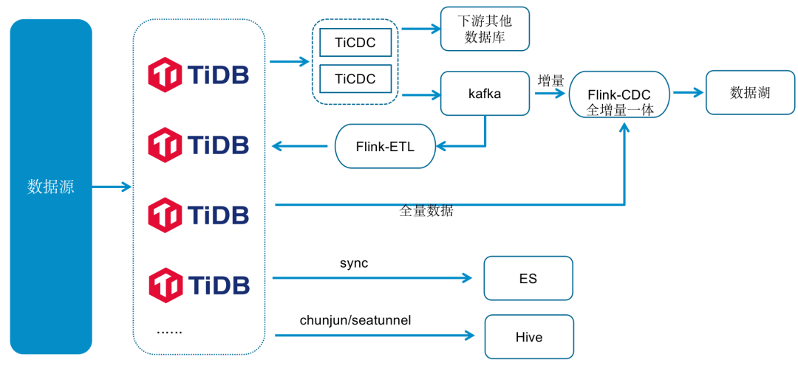

## 企查查数据中台示意图

TiDB 数据入湖使用了自研的 Flink Hybird Source。全量分片数据通过查询 TiDB 获取，增量数据通过消费 TiCDC 推送到 Kafka 的 Changelog 获取，准实时（分钟级）写入到 数据湖 Iceberg 中。Flink Hybird Source 支持全量、增量、和全增量一体三种数据同步模式。

我们将 TiDB 的部分数据同步到 ES 系统中，为 ES 系统提供数据来源，供一些检索场景的应用使用。对于离线数据，我们使用 Chunjun/Seatunnel 同步工具将其同步到 Hive 离线数据平台中，供下游的离线数据平台跑批。目前，我们正在调研 TiFlash 的功能，计划今年将部分复杂的离线查询从 Hive 迁移到 TiDB 中，直接从 TiDB 中查询，以减少数据在多个数据栈中流转，进一步提升数据的实时性。

参考：https://asktug.com/t/topic/1021824

