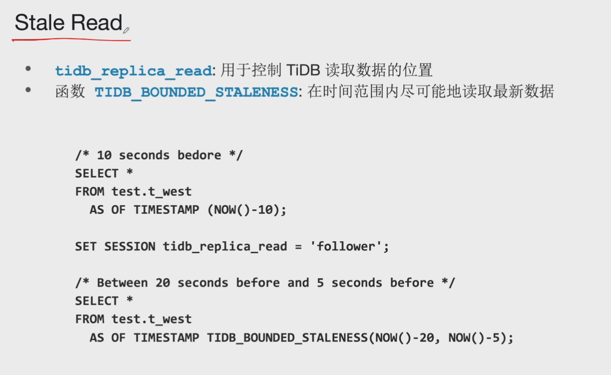
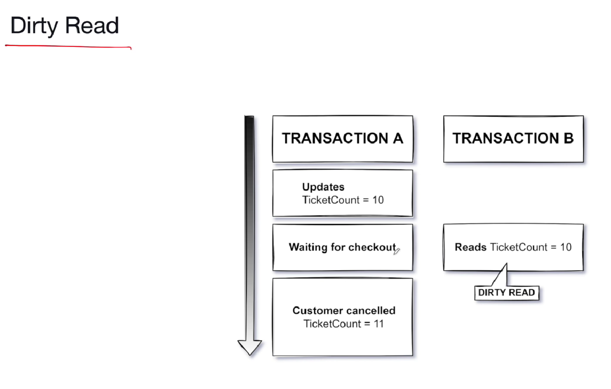
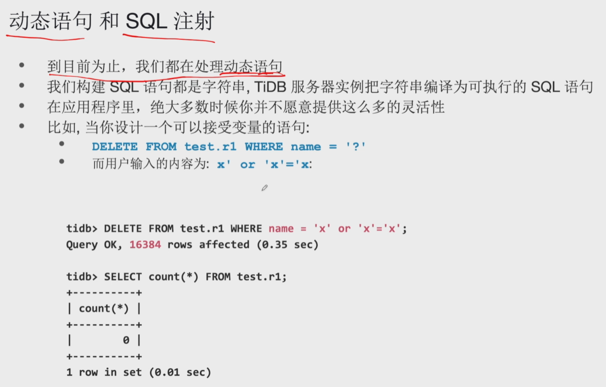
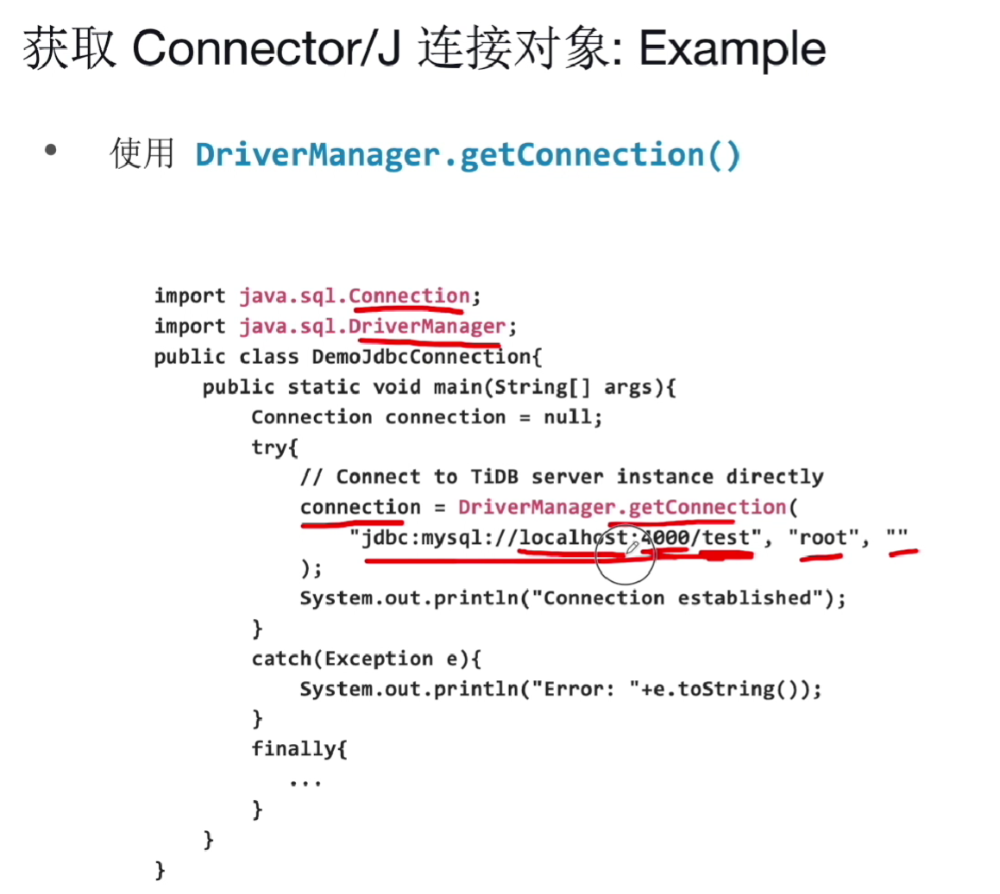

## 创建 Schema/Database

- 语法:

  - `CREATE DATABSAE [IF NOT EXISTS] database_name [options];`
  - `CREATE SCHEMA [IF NOT EXISTS] schema_name [options];`

- 数据库里的对象命名只能使用英文字母、数字和下划线

  - 名称不能超过 64 个字符
  - 不能使用某些字符，包括 `ASCII(0), ASCII(255), /, \, .`
  - 您可以使用保留字和特殊字符，但前提是使用反引号将其包围

- 删除数据库:

  ```
  DROP DATABASE [IF EXISTS] database_name;
  ```

  - 小心这是一个无法撤消的操作

- TiDB 以区分大小写的方式存储对象名，但以不区分大小写的方式进行比较

```sql
tidb> show variables like 'lower_case_%';
+------------------------+-------+
| Variable_name          | Value |
+------------------------+-------+
| lower_case_file_system | 1     |
| lower_case_table_names | 2     |
+------------------------+-------+
```

lower_case_file_system: 用于控制文件系统是否大小写敏感，1表示大小写不敏感。

lower_case_table_names：

- TiDB 默认：`2`，且仅支持设置该值为 `2`。
  - 目前 TiDB 只支持将 lower-case-table-names 值设为 2，即按照大小写来保存表名，按照小写来比较（不区分大小写）；
- MySQL 默认如下：
  - Linux 系统中该值为 `0`，表示表名和数据库名按照在 `CREATE TABLE` 或 `CREATE DATABASE` 语句中指定的字母大小写存储在磁盘上，且名称比较时区分大小写。
  - Windows 系统中该值为 `1`，表示表名按照小写字母存储在磁盘上，名称比较时不区分大小写。MySQL 在存储和查询时将所有表名转换为小写。该行为也适用于数据库名称和表的别名。
  - macOS 系统中该值为 `2`，表示表名和数据库名按照在 `CREATE TABLE` 或 `CREATE DATABASE` 语句中指定的字母大小写存储在磁盘上，但 MySQL 在查询时将它们转换为小写。名称比较时不区分大小写。

## 字符集和排序规则

字符集 (character set) 是符号与编码的集合。TiDB 中的默认字符集是 utf8mb4，与 MySQL 8.0 及更高版本中的默认字符集匹配。

排序规则 (collation) 是在字符集中比较字符以及字符排序顺序的规则。

查询支持的字符集和排序规则

```sql
MySQL [(none)]> show character set;
+---------+-------------------------------------+-------------------+--------+
| Charset | Description                         | Default collation | Maxlen |
+---------+-------------------------------------+-------------------+--------+
| ascii   | US ASCII                            | ascii_bin         |      1 |
| binary  | binary                              | binary            |      1 |
| gbk     | Chinese Internal Code Specification | gbk_chinese_ci    |      2 |
| latin1  | Latin1                              | latin1_bin        |      1 |
| utf8    | UTF-8 Unicode                       | utf8_bin          |      3 |
| utf8mb4 | UTF-8 Unicode                       | utf8mb4_bin       |      4 |
+---------+-------------------------------------+-------------------+--------+
6 rows in set (0.00 sec)

MySQL [(none)]> show collation;
+--------------------+---------+------+---------+----------+---------+
| Collation          | Charset | Id   | Default | Compiled | Sortlen |
+--------------------+---------+------+---------+----------+---------+
| ascii_bin          | ascii   |   65 | Yes     | Yes      |       1 |
| binary             | binary  |   63 | Yes     | Yes      |       1 |
| gbk_bin            | gbk     |   87 |         | Yes      |       1 |
| gbk_chinese_ci     | gbk     |   28 | Yes     | Yes      |       1 |
| latin1_bin         | latin1  |   47 | Yes     | Yes      |       1 |
| utf8_bin           | utf8    |   83 | Yes     | Yes      |       1 |
| utf8_general_ci    | utf8    |   33 |         | Yes      |       1 |
| utf8_unicode_ci    | utf8    |  192 |         | Yes      |       1 |
| utf8mb4_0900_ai_ci | utf8mb4 |  255 |         | Yes      |       1 |
| utf8mb4_0900_bin   | utf8mb4 |  309 |         | Yes      |       1 |
| utf8mb4_bin        | utf8mb4 |   46 | Yes     | Yes      |       1 |
| utf8mb4_general_ci | utf8mb4 |   45 |         | Yes      |       1 |
| utf8mb4_unicode_ci | utf8mb4 |  224 |         | Yes      |       1 |
+--------------------+---------+------+---------+----------+---------+
13 rows in set (0.01 sec)
```

## COLLATE 子句

```sql
tidb> select * from test.c1 order by name;
+------+
| name |
+------+
| A    |
| B    |
| C    |
| a    |
| b    |
| c    |
+------+
6 rows in set (0.00 sec)

tidb> select * from test.c1 order by name collate utf8mb4_unicode_ci;
+------+
| name |
+------+
| A    |
| a    |
| B    |
| b    |
| C    |
| c    |
+------+
6 rows in set (0.01 sec)
```

------

以下示例取自官方文档: `https://docs.pingcap.com/zh/tidb/v6.0/character-set-and-collation`:

观察在排序规则为 utf8mb4_bin 和 utf8mb4_general_ci 情况下两个不同的结果:

```sql
tidb> SET NAMES utf8mb4 COLLATE utf8mb4_bin;
Query OK, 0 rows affected (0.00 sec)

tidb> SELECT 'A' = 'a';
+-----------+
| 'A' = 'a' |
+-----------+
|         0 |
+-----------+
1 row in set (0.00 sec)

tidb> SET NAMES utf8mb4 COLLATE utf8mb4_general_ci;
Query OK, 0 rows affected (0.00 sec)

tidb> SELECT 'A' = 'a';
+-----------+
| 'A' = 'a' |
+-----------+
|         1 |
+-----------+
1 row in set (0.01 sec)
```

查看当前数据库的字符集和排序规则

```sql
MySQL [(none)]> select @@character_set_database,@@collation_database;
+--------------------------+----------------------+
| @@character_set_database | @@collation_database |
+--------------------------+----------------------+
| utf8mb4                  | utf8mb4_bin          |
+--------------------------+----------------------+
1 row in set (0.00 sec)
```


```sql
MySQL [(none)]> SELECT * FROM INFORMATION_SCHEMA.SCHEMATA;
+--------------+--------------------+----------------------------+------------------------+----------+----------------------------+
| CATALOG_NAME | SCHEMA_NAME        | DEFAULT_CHARACTER_SET_NAME | DEFAULT_COLLATION_NAME | SQL_PATH | TIDB_PLACEMENT_POLICY_NAME |
+--------------+--------------------+----------------------------+------------------------+----------+----------------------------+
| def          | bookshop           | utf8mb4                    | utf8mb4_bin            | NULL     | NULL                       |
| def          | INFORMATION_SCHEMA | utf8mb4                    | utf8mb4_bin            | NULL     | NULL                       |
| def          | lsy                | utf8mb4                    | utf8mb4_bin            | NULL     | NULL                       |
| def          | METRICS_SCHEMA     | utf8mb4                    | utf8mb4_bin            | NULL     | NULL                       |
| def          | mysql              | utf8mb4                    | utf8mb4_bin            | NULL     | NULL                       |
| def          | PERFORMANCE_SCHEMA | utf8mb4                    | utf8mb4_bin            | NULL     | NULL                       |
| def          | test               | utf8mb4                    | utf8mb4_bin            | NULL     | NULL                       |
+--------------+--------------------+----------------------------+------------------------+----------+----------------------------+
7 rows in set (0.04 sec)
```

## 本地临时表

CREATE TEMPORARY TABLE

- 仅在客户端会话期间存在
- 仅对创建它的会话可见
- 覆盖永久表的定义
- 不会出现在 **information_schema.tables**

------

- 本地临时表的语义与 MySQL 临时表一致，它有以下特性：
  - 本地临时表的表定义不持久化，只在创建该表的会话内可见，其他会话无法访问该本地临时表
  - 不同会话可以创建同名的本地临时表，各会话只会读写该会话内创建的本地临时表
  - 本地临时表的数据对会话内的所有事务可见
  - 在会话结束后，该会话创建的本地临时表会被自动删除
  - 本地临时表可以与普通表同名，此时在 DDL 和 DML 语句中，普通表被隐藏，直到本地临时表被删除
- 用户可通过 CREATE TEMPORARY TABLE 语句创建本地临时表，通过 DROP TABLE 或 DROP TEMPORARY TABLE 语句删除本地临时表。

```sql
tidb> create table test.temp1 (id int);
Query OK, 0 rows affected (0.51 sec)

tidb> create temporary table test.temp1 (name char(10));
Query OK, 0 rows affected (0.00 sec)

tidb> desc test.temp1;
+-------+----------+------+------+---------+-------+
| Field | Type     | Null | Key  | Default | Extra |
+-------+----------+------+------+---------+-------+
| name  | char(10) | YES  |      | NULL    |       |
+-------+----------+------+------+---------+-------+
1 row in set (0.00 sec)

tidb> drop table test.temp1;
Query OK, 0 rows affected (0.00 sec)

tidb> desc test.temp1;
+-------+---------+------+------+---------+-------+
| Field | Type    | Null | Key  | Default | Extra |
+-------+---------+------+------+---------+-------+
| id    | int(11) | YES  |      | NULL    |       |
+-------+---------+------+------+---------+-------+
1 row in set (0.00 sec)
```

## 全局临时表

CREATE GLOBAL TEMPORARY TABLE

- 全局临时表的表定义是持久的，并且对所有会话都可见
- 全局临时表的数据仅在当前事务中可见
- 当事务结束时，数据会自动清除
- 全局临时表不能与永久表同名
- 出现在 `information_schema.tables`

------

- 全局临时表是 TiDB 的扩展功能，它有以下特性：
  - 全局临时表的表定义会持久化，对所有会话可见
  - 全局临时表的数据只对当前的事务内可见，事务结束后数据自动清空
  - 全局临时表不能与普通表同名

用户可通过 CREATE GLOBAL TEMPORARY TABLE 语句创建全局临时表，语句末尾要加上 ON COMMIT DELETE ROWS。可通过 DROP TABLE 或 DROP GLOBAL TEMPORARY TABLE 语句删除全局临时表。

```sql
tidb> create global temporary table test.temp2 (id bigint);
ERROR 1064 (42000): You have an error in your SQL syntax; check the manual that corresponds to your TiDB version for the right syntax to use line 1 column 52 near ""GLOBAL TEMPORARY and ON COMMIT DELETE ROWS must appear together 

tidb> create global temporary table test.temp2 (id bigint) on commit delete rows;
Query OK, 0 rows affected (0.57 sec)

tidb> set @@autocommit = 'OFF';

tidb> insert into test.temp2 values (10);

tidb> select * from test.temp2;
+------+
| id   |
+------+
|   10 |
+------+
1 row in set (0.00 sec)

tidb> commit;

tidb> select * from test.temp2;
Empty set (0.00 sec)
```


## 在线DDL


## TiDB Primary Key和索引


## TiDB Foreign Key


## 索引

### 索引概述

- 索引：指向行记录的指针以加快数据检索速度

  - 快速找到表里的行记录
  - 避免全表扫描
  - 提高查询性能

- 以下 TiDB 约束默认提供索引：

  - Primary Key
  - Unique Key

- 也可以通过 **CREATE INDEX** 语句创建

- 索引信息系统表:

   

  ```
  information_schema.tidb_indexes
  ```

  - 索引名称: `KEY_NAME`

- `SHOW INDEX FROM table_name;` 获取索引的定义

------

### Unique Key 和索引

- 唯一键具有以下特点：
  - 唯一标识表中的单个行
  - 接受 `NULL`
  - 每张表允许多个唯一键

```sql
tidb> CREATE TABLE test.dropme (
   ->   id BIGINT AUTO_RANDOM,
   ->   name CHAR(35) NOT NULL,
   ->   PRIMARY KEY (id),
   ->   UNIQUE KEY (name)
   ->   );
tidb> SELECT key_name, column_name, index_id FROM information_schema.tidb_indexes 
   -> WHERE table_schema='test' AND table_name='dropme';
+----------+-------------+----------+
| key_name | column_name | index_id |
+----------+-------------+----------+
| PRIMARY  | id          |        0 |
|  name    | name        |        1 |
+----------+-------------+----------+
```

------

### 二级索引

- 二级索引：主键以外的索引
- 唯一二级索引：具有约束条件的二级索引
- 创建二级索引：
  - 创建表时使用 INDEX 或 KEY 关键字
  - 对现有的表:
    - `ALTER TABLE ... ADD INDEX/KEY ...`
    - `CREATE INDEX ... ON ...`

```sql
tidb> CREATE TABLE test.ggg (id INT, name CHAR(30), KEY(name));

tidb> CREATE INDEX ggg_idx ON test.ggg (id);

tidb> CREATE TABLE test.gg (id INT, id2 INT, name CHAR(30), INDEX(name));

tidb> ALTER TABLE test.gg ADD KEY (id);

tidb> ALTER TABLE test.gg ADD INDEX (id2);
```

------

### 复合 Primary Key

- 复合主键需要两列或更多列才能唯一标识行

- 组成复合主键的各个列单独并不需要保证唯一性

- ```
  infromation_schema.tidb_indexes
  ```

  - `COLUMN_NAME`
  - `SEQ_IN_INDEX`

```sql
CREATE TABLE `stars` (
  `name` char(20) NOT NULL DEFAULT '',
  `mass` float NOT NULL DEFAULT 0.0 COMMENT '10**24 kg',
  ...
  `distance_from_earth` float COMMENT 'light year',
  `discover_date` datetime NOT NULL,
  PRIMARY KEY (`name`, `discover_date`)
);
```

------

name 和 discover_date 两个列共同组成了一个复合主键。

## 缓存表


## 分区表


## Placement Policy

### 跨地域数据库Region放置规则


### 创建Placement Policy


## Stale Read



## 放置规则约束


## TiFlash

### TiFlash主要特点


### 引擎智能选择


## TRUNCATE 语句

- 语法: `TRUNCATE [TABLE] table_name`
- TRUNCATE TABLE 语句将删除表中所有的行
- 它重置 AUTO_INCREMENT 为起始值
- **不像 DELETE，它是 DDL，不是 DML，意味着它不能加入事务用，不能被 ROLLBACK**
- **等同于按次序执行: `DROP TABLE`, `CREATE TABLE`**
- 可能可以使用 FLASHBACK TABLE 撤销

------

TRUNCATE 语句以非事务方式从表中删除所有数据。可认为 TRUNCATE 语句同 DROP TABLE + CREATE TABLE 组合在语义上相同。

有关事务的详细知识我们会在后续章节中讲解。

TRUNCATE TABLE table_name 和 TRUNCATE table_name 均为有效语法。

## 事务

### 事务概览


### 事务自动提交模式


### 事务控制语句


### 隐式COMMIT


**DESC、EXPLAIN、ANALYZE会使得前面设置手动提交的事务隐式提交吗？**

### 因果一致性的事务


### 事务和并发





### TiDB事务隔离级别


### 切换事务模式


## 预编译语句（Prepared Statement）

### 动态语句和SQL注射



### Prepared Statement


## Connector/J


### 安装Connector/J


### 使用Connector/J 连接到 TiDB


### 获取Connector/J 连接对象



### 断开与TIDB服务器实例的连接

