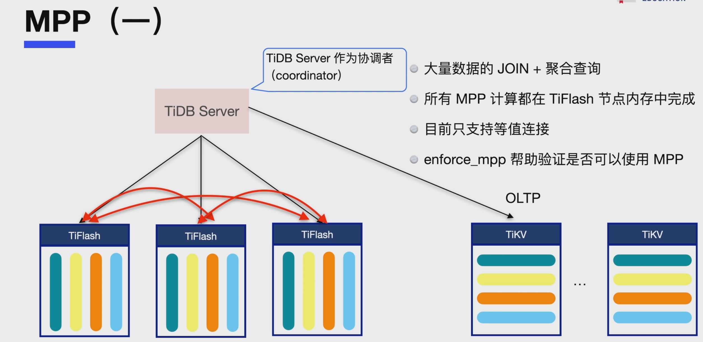

# TiDB执行计划概览

使用 `EXPLAIN` 可查看 TiDB 执行某条语句时选用的执行计划。也就是说，TiDB 在考虑上数百或数千种可能的执行计划后，最终认定该执行计划消耗的资源最少、执行的速度最快。

`EXPLAIN` 示例如下：

```sql
CREATE TABLE t (id INT NOT NULL PRIMARY KEY auto_increment, a INT NOT NULL, pad1 VARCHAR(255), INDEX(a));
INSERT INTO t VALUES (1, 1, 'aaa'),(2,2, 'bbb');
EXPLAIN SELECT * FROM t WHERE a = 1;
```

返回的结果如下：

```sql
Query OK, 0 rows affected (0.96 sec)

Query OK, 2 rows affected (0.02 sec)
Records: 2  Duplicates: 0  Warnings: 0

+-------------------------------+---------+-----------+---------------------+---------------------------------------------+
| id                            | estRows | task      | access object       | operator info                               |
+-------------------------------+---------+-----------+---------------------+---------------------------------------------+
| IndexLookUp_10                | 10.00   | root      |                     |                                             |
| ├─IndexRangeScan_8(Build)     | 10.00   | cop[tikv] | table:t, index:a(a) | range:[1,1], keep order:false, stats:pseudo |
| └─TableRowIDScan_9(Probe)     | 10.00   | cop[tikv] | table:t             | keep order:false, stats:pseudo              |
+-------------------------------+---------+-----------+---------------------+---------------------------------------------+
3 rows in set (0.00 sec)
```

- `EXPLAIN` 实际不会执行查询。

- [`EXPLAIN ANALYZE`](https://docs.pingcap.com/zh/tidb/v6.1/sql-statement-explain-analyze) 可用于实际执行查询并显示执行计划。如果 TiDB 所选的执行计划非最优，可用 `EXPLAIN` 或 `EXPLAIN ANALYZE` 来进行诊断。

> 这样可以将查询计划中的估计值与执行时所遇到的实际值进行比较。如果估计值与实际值显著不同，那么应考虑在受影响的表上运行 `ANALYZE TABLE`。
>
> 在使用 `EXPLAIN ANALYZE` 执行 DML 语句时，数据的修改操作会被正常执行。但目前 DML 语句还无法展示执行计划。


## 算子执行信息介绍

`execution info` 信息除了基本的 `time` 和 `loop` 信息外，还包含算子特有的执行信息，主要包含了该算子发送 RPC 请求的耗时信息以及其他步骤的耗时。

### Point_Get

`Point_Get` 算子可能包含以下执行信息：

- `Get:{num_rpc:1, total_time:697.051µs}`：向 TiKV 发送 `Get` 类型的 RPC 请求的数量 (`num_rpc`) 和所有 RPC 请求的总耗时 (`total_time`)。
- `ResolveLock:{num_rpc:1, total_time:12.117495ms}`：读数据遇到锁后，进行 resolve lock 的时间。一般在读写冲突的场景下会出现。
- `regionMiss_backoff:{num:11, total_time:2010 ms},tikvRPC_backoff:{num:11, total_time:10691 ms}`：RPC 请求失败后，会在等待 backoff 的时间后重试，包括了 backoff 的类型（如 regionMiss，tikvRPC），backoff 等待的总时间 (total_time) 和 backoff 的总次数 (num)。

> Backoff_time：表示语句遇到需要重试的错误时在重试前等待的时间。常见的需要重试的错误有以下几种：遇到了 lock、Region 分裂、tikv server is busy。
>
> Backoff pattern 是一种程序设计模式，通常用于处理因高负载或故障而导致的请求失败或错误。该模式基于一种简单的策略，即当请求失败时，等待一段时间后重试，等待时间逐渐增加，直到成功或达到最大重试次数为止。

### Batch_Point_Get

`Batch_Point_get` 算子的执行信息和 `Point_Get` 算子类似，不过 `Batch_Point_Get` 一般向 TiKV 发送 `BatchGet` 类型的 RPC 请求来读取数据。

`BatchGet:{num_rpc:2, total_time:83.13µs}`：向 TiKV 发送 `BatchGet` 类型的 RPC 请求的数量 (`num_rpc`) 和所有 RPC 请求的总耗时 (`total_time`)。

### TableReader

`TableReader` 算子可能包含以下执行信息：

```apache
cop_task: {num: 6, max: 1.07587ms, min: 844.312µs, avg: 919.601µs, p95: 1.07587ms, max_proc_keys: 16, p95_proc_keys: 16, tot_proc: 1ms, tot_wait: 1ms, rpc_num: 6, rpc_time: 5.313996ms, copr_cache_hit_ratio: 0.00}
```

- cop_task：包含 cop task 的相关信息，如：
  - `num`：cop task 的数量
  
  - `max`,`min`,`avg`,`p95`：所有 cop task 中执行时间的最大值，最小值，平均值和 P95 值。
  
  - `max_proc_keys`, `p95_proc_keys`：所有 cop task 中 tikv 扫描 kv 数据的最大值，P95 值，**如果 max 和 p95 的值差距很大，说明数据分布不太均匀。**
  
  - `rpc_num`, `rpc_time`：向 TiKV 发送 `Cop` 类型的 RPC 请求总数量和总时间。
  
  - `copr_cache_hit_ratio`：cop task 请求的 Coprocessor Cache 缓存命中率。[Coprocessor Cache 配置](https://docs.pingcap.com/zh/tidb/v6.1/tidb-configuration-file)。
  
    > Coprocessor Cache 相关的配置项
    >
    > tikv-client.copr-cache 
    >
    > `capacity-mb`
    >
    > - 缓存的总数据量大小。当缓存空间满时，旧缓存条目将被逐出。值为 0.0 时表示关闭 Coprocessor Cache。
    > - 默认值：1000.0
    > - 单位：MB
    > - 类型：Float
- `backoff`：包含不同类型的 backoff 以及等待总耗时。

### Insert

`Insert` 算子可能包含以下执行信息：

```apache
prepare:109.616µs, check_insert:{total_time:1.431678ms, mem_insert_time:667.878µs, prefetch:763.8µs, rpc:{BatchGet:{num_rpc:1, total_time:699.166µs},Get:{num_rpc:1, total_time:378.276µs}}}
```

- `prepare`：准备写入前的耗时，包括表达式，默认值相关的计算等。
- check_insert：这个信息一般出现在insert ignore和insert on duplicate语句中，包含冲突检查和写入 TiDB 事务缓存的耗时。注意，这个耗时不包含事务提交的耗时。具体包含以下信息：
  - `total_time`：`check_insert` 步骤的总耗时。
  - `mem_insert_time`：将数据写入 TiDB 事务缓存的耗时。
  - `prefetch`：从 TiKV 中获取需要检查冲突的数据的耗时，该步骤主要是向 TiKV 发送 `BatchGet` 类型的 RPC 请求的获取数据。
  - rpc：向 TiKV 发送 RPC 请求的总耗时，一般包含BatchGet和Get两种类型的 RPC 耗时，其中：
    - `BatchGet` 请求是 `prefetch` 步骤发送的 RPC 请求。
    - `Get` 请求是 `insert on duplicate` 语句在执行 `duplicate update` 时发送的 RPC 请求。
- `backoff`：包含不同类型的 backoff 以及等待总耗时。

### IndexJoin

`IndexJoin` 算子有 1 个 outer worker 和 N 个 inner worker 并行执行，其 join 结果的顺序和 outer table 的顺序一致，具体执行流程如下：

1. Outer worker 读取 N 行 outer table 的数据，然后包装成一个 task 发送给 result channel 和 inner worker channel。
2. Inner worker 从 inner worker channel 里面接收 task，然后根据 task 生成需要读取 inner table 的 key ranges 范围，然后读取相应范围的 inner table 行数据，并生成一个 inner table row 的 hash table。
3. `IndexJoin` 的主线程从 result channel 中接收 task，然后等待 inner worker 执行完这个 task。
4. `IndexJoin` 的主线程用 outer table rows 和 inner table rows 的 hash table 做 join。

`IndexJoin` 算子包含以下执行信息：

```apache
inner:{total:4.297515932s, concurrency:5, task:17, construct:97.96291ms, fetch:4.164310088s, build:35.219574ms}, probe:53.574945ms
```

- inner：inner worker 的执行信息，具体如下：
  - `total`：inner worker 的总耗时。
  - `concurrency`：inner worker 的数量。
  - `task`：inner worker 处理 task 的总数量。
  - `construct`：inner worker 读取 task 对应的 inner table rows 之前的准备时间。
  - `fetch`：inner worker 读取 inner table rows 的总耗时。
  - `build`: inner worker 构造 inner table rows 对应的 hash table 的总耗时。
- `probe`：`IndexJoin` 主线程用 outer table rows 和 inner table rows 的 hash table 做 join 的总耗时。

### IndexHashJoin

`IndexHashJoin` 算子和 `IndexJoin` 算子执行流程类似，也有 1 个 outer worker 和 N 个 inner worker 并行执行，但是其 join 结果的顺序是不和 outer table 一致。具体执行流程如下：

1. Outer worker 读取 N 行 out table 的数据，然后包装成一个 task 发送给 inner worker channel。
2. Inner worker 从 inner worker channel 里面接收 task，然后做以下三件事情，其中步骤 a 和 b 是并行执行。 
   - a. 用 outer table rows 生成一个 hash table。
   -  b. 根据 task 生成 key 的范围后，读取 inner table 相应范围的行数据。
   -  c. 用 inner table rows 和 outer table rows 的 hash table 做 join，然后把 join 结果发送给 result channel。
3. `IndexHashJoin` 的主线程从 result channel 中接收 join 结果。

`IndexHashJoin` 算子包含以下执行信息：

```sql
inner:{total:4.429220003s, concurrency:5, task:17, construct:96.207725ms, fetch:4.239324006s, build:24.567801ms, join:93.607362ms}
```

- inner：inner worker 的执行信息，具体如下：
  - `total`：inner worker 的总耗时。
  - `concurrency`：inner worker 的数量。
  - `task`：inner worker 处理 task 的总数量。
  - `construct`：inner worker 读取 task 对应的 inner table rows 之前的准备时间。
  - `fetch`：inner worker 读取 inner table rows 的总耗时。
  - `build`: inner worker 构造 outer table rows 对应的 hash table 的总耗时。
  - `join`: inner worker 用 inner table rows 和 outer table rows 的 hash table 做 join 的总耗时。

### HashJoin

`HashJoin` 算子有一个 inner worker，一个 outer worker 和 N 个 join worker，其具体执行逻辑如下：

1. inner worker 读取 inner table rows 并构造 hash table。
2. outer worker 读取 outer table rows, 然后包装成 task 发送给 join worker。
3. 等待第 1 步的 hash table 构造完成。
4. join worker 用 task 里面的 outer table rows 和 hash table 做 join，然后把 join 结果发送给 result channel。
5. `HashJoin` 的主线程从 result channel 中接收 join 结果。

`HashJoin` 算子包含以下执行信息：

```apache
build_hash_table:{total:146.071334ms, fetch:110.338509ms, build:35.732825ms}, probe:{concurrency:5, total:857.162518ms, max:171.48271ms, probe:125.341665ms, fetch:731.820853ms}
```

- build_hash_table: 读取 inner table 的数据并构造 hash table 的执行信息：
  - `total`：总耗时。
  - `fetch`：读取 inner table 数据的总耗时。
  - `build`：构造 hash table 的总耗时。
- probe: join worker 的执行信息：
  - `concurrency`：join worker 的数量。
  - `total`：所有 join worker 执行的总耗时。
  - `max`：单个 join worker 执行的最大耗时。
  - `probe`: 用 outer table rows 和 hash table 做 join 的总耗时。
  - `fetch`：join worker 等待读取 outer table rows 数据的总耗时。

### lock_keys 执行信息

在悲观事务中执行 DML 语句时，算子的执行信息还可能包含 `lock_keys` 的执行信息，示例如下：

```apache
lock_keys: {time:94.096168ms, region:6, keys:8, lock_rpc:274.503214ms, rpc_count:6}
```

- `time`：执行 `lock_keys` 操作的总耗时。
- `region`：执行 `lock_keys` 操作涉及的 Region 数量。
- `keys`：需要 `Lock` 的 `Key` 的数量。
- `lock_rpc`：向 TiKV 发送 `Lock` 类型的 RPC 总耗时。因为可以并行发送多个 RPC 请求，所以总 RPC 耗时可能比 `lock_keys` 操作总耗时大。
- `rpc_count`：向 TiKV 发送 `Lock` 类型的 RPC 总数量。

### commit_txn 执行信息

在 `autocommit=1` 的事务中执行写入类型的 DML 语句时，算子的执行信息还会包括事务提交的耗时信息，示例如下：

```apache
commit_txn: {prewrite:48.564544ms, wait_prewrite_binlog:47.821579, get_commit_ts:4.277455ms, commit:50.431774ms, region_num:7, write_keys:16, write_byte:536}
```

- `prewrite`：事务 2PC 提交阶段中 `prewrite` 阶段的耗时。
- `wait_prewrite_binlog:`：等待写 prewrite Binlog 的耗时。
- `get_commit_ts`：获取事务提交时间戳的耗时。
- `commit`：事务 2PC 提交阶段中，`commit` 阶段的耗时。
- `write_keys`：事务中写入 `key` 的数量。
- `write_byte`：事务中写入 `key-value` 的总字节数量，单位是 byte。

### 其它常见执行信息

Coprocessor 算子通常包含 `cop_task` 和 `tikv_task` 两部分执行时间信息。

- `cop_task` 是 TiDB 端记录的时间，从发出请求到接收回复；
- `tikv_task` 是 TiKV Coprocessor 算子自己记录的时间。

**两者相差较大可能说明在等待、gRPC 或网络上耗时较长。**

# 使用Explain分析执行计划

以 [bikeshare 数据库示例（英文）](https://docs.pingcap.com/tidb/stable/import-example-data) 中的一个 SQL 语句为例，该语句统计了 2017 年 7 月 1 日的行程次数：

```sql
EXPLAIN SELECT count(*) FROM trips WHERE start_date BETWEEN '2017-07-01 00:00:00' AND '2017-07-01 23:59:59';
+------------------------------+----------+-----------+---------------+------------------------------------------------------------------------------------------------------------------------+
| id                           | estRows  | task      | access object | operator info                                                                                                          |
+------------------------------+----------+-----------+---------------+------------------------------------------------------------------------------------------------------------------------+
| StreamAgg_20                 | 1.00     | root      |               | funcs:count(Column#13)->Column#11                                                                                      |
| └─TableReader_21             | 1.00     | root      |               | data:StreamAgg_9                                                                                                       |
|   └─StreamAgg_9              | 1.00     | cop[tikv] |               | funcs:count(1)->Column#13                                                                                              |
|     └─Selection_19           | 250.00   | cop[tikv] |               | ge(bikeshare.trips.start_date, 2017-07-01 00:00:00.000000), le(bikeshare.trips.start_date, 2017-07-01 23:59:59.000000) |
|       └─TableFullScan_18     | 10000.00 | cop[tikv] | table:trips   | keep order:false, stats:pseudo                                                                                         |
+------------------------------+----------+-----------+---------------+------------------------------------------------------------------------------------------------------------------------+
5 rows in set (0.00 sec)
```

以上是该查询的执行计划结果。从 `└─TableFullScan_18` 算子开始向上看，查询的执行过程如下（非最佳执行计划）：

1. Coprocessor (TiKV) 读取整张 `trips` 表的数据，作为一次 `TableFullScan` 操作，再将读取到的数据传递给 `Selection_19` 算子。`Selection_19` 算子仍在 TiKV 内。
2. `Selection_19` 算子根据谓词 `WHERE start_date BETWEEN ..` 进行数据过滤。预计大约有 250 行数据满足该过滤条件（基于统计信息以及算子的执行逻辑估算而来）。`└─TableFullScan_18` 算子显示 **`stats:pseudo`，表示该表没有实际统计信息**，执行 `ANALYZE TABLE trips` 收集统计信息后，预计的估算的数字会更加准确。
3. `COUNT` 函数随后应用于满足过滤条件的行，这一过程也是在 TiKV (`cop[tikv]`) 中的 `StreamAgg_9` 算子内完成的。TiKV coprocessor 能执行一些 MySQL 内置函数，`COUNT` 是其中之一。
4. `StreamAgg_9` 算子执行的结果会被传递给 `TableReader_21` 算子（位于 TiDB 进程中，即 `root` 任务）。执行计划中，`TableReader_21` 算子的 `estRows` 为 `1`，**表示该算子将从每个访问的 TiKV Region 接收一行数据**。这一请求过程的详情，可参阅 [`EXPLAIN ANALYZE`](https://docs.pingcap.com/zh/tidb/stable/sql-statement-explain-analyze)。
5. `StreamAgg_20` 算子随后对 `└─TableReader_21` 算子传来的每行数据计算 `COUNT` 函数的结果。`StreamAgg_20` 是根算子，会将结果返回给客户端。


> 思考：如果是有多个TiKV Region，是怎么显示的？

## Explain返回信息的含义

- id表示算子名，或执行SQL语句需要执行的子任务；
- estRows表示TiDB预估会处理的行数；
  - 该信息可能基于字典信息（例如访问方法基于主键或唯一键），或基于CMSketch或直方图等统计信息而来；

> 注意：
>
> 自V6.4.0版本开始，特定算子（即IndexJoin和Apply算子的Probe端所有子节点）的estRows字段含义和以前有所不同；
>
> - 在V6.4.0版本以前，estRows表示Build端的每一行数据，Probe端预计处理的行数；
>
> - 而在V6.4.0开始，estRows表示的是Probe端预计会处理的所有行数；
>
> 因为Explain Analyze中的actRows表示的是实际处理的总行数，V6.4.0开始这些算子的estRows的含义与actRows列的含义保持一致；

- task：表示算子在执行语句时的所在位置；

> 目前 TiDB 的计算任务分为两种不同的 task：cop task 和 root task。Cop task 是指使用 TiKV 中的 Coprocessor 执行的计算任务，root task 是指在 TiDB 中执行的计算任务。
>
> 如果还有TiFlash，则还有tiflash上的task；如：mpp[tiflash]、batchCop[tiflash]；
>
> SQL 优化的目标之一是**将计算尽可能地下推到 TiKV 中执行**。TiKV 中的 Coprocessor 能支持大部分 SQL 内建函数（包括聚合函数和标量函数）、SQL `LIMIT` 操作、索引扫描和表扫描。

- operator info 表示显示访问表、分区和索引的其他信息、条件下推等信息；

  - 比如是否排序、estRows显示的预估行数是否准确等；
    - keep order: false 表示不排序；
    - stats:pseudo 表示estRows显示的预估处理行数不准确；

  

注意：

要查看 TiDB 中某张表的 Region 信息，可执行 [`SHOW TABLE REGIONS`](https://docs.pingcap.com/zh/tidb/stable/sql-statement-show-table-regions) 语句。

```sql
MySQL [(none)]> show table bikeshare.trips regions;
+-----------+-----------+--------------------+-----------+-----------------+------------------------+------------+---------------+------------+----------------------+------------------+------------------------+------------------+
| REGION_ID | START_KEY | END_KEY            | LEADER_ID | LEADER_STORE_ID | PEERS                  | SCATTERING | WRITTEN_BYTES | READ_BYTES | APPROXIMATE_SIZE(MB) | APPROXIMATE_KEYS | SCHEDULING_CONSTRAINTS | SCHEDULING_STATE |
+-----------+-----------+--------------------+-----------+-----------------+------------------------+------------+---------------+------------+----------------------+------------------+------------------------+------------------+
|    829001 | t_157_    | t_281474976710654_ |    829003 |               2 | 829002, 829003, 829004 |          0 |            39 |          0 |                    1 |             6600 |                        |                  |
+-----------+-----------+--------------------+-----------+-----------------+------------------------+------------+---------------+------------+----------------------+------------------+------------------------+------------------+
1 row in set (0.02 sec)
```


## 算子简介

算子是为返回查询结果而执行的特定步骤。真正执行扫表（读盘或读TiKV Block Cache）操作的算子有如下几类：

- **TableFullScan**：全表扫描
- TableRangeScan：带有范围的表数据扫描；
- **TableRowIDScan**：根据上层传下来的RowID扫描表数据。时常在索引读操作后检索符合条件的行；
  - 类似于回表操作；
- **IndexFullScan**：另一种"全表扫描"，扫描的是索引数据，而非表数据；
- **IndexRangeScan**：带有范围的索引数据扫描；

TiDB会汇聚TiKV/TiFlash上扫描的数据或者计算结果，这种“数据汇聚”算子有如下几类：

- TableReader：将TiKV底层扫表算子TableFullScan或TableRangeScan得到的数据进行汇总；
- IndexReader：将TiKV底层扫表算子IndexFullScan或IndexRangeScan得到的数据进行汇总；
- IndexLookUp：先汇总Build端扫描上来的RowID，再取Probe端根据RowID精确读取TiKV上具体的数据；
  - Build端是IndexFullScan或IndexRangeScan类型算子，Probe端是TableRowIDScan类型算子；
- IndexMerge：和IndexLookUp相似，可以看作是它的扩展，不同的是，**IndexMerge可以同时读取多个索引的数据，有多个Build端，一个Probe端**。

### 算子执行顺序

算子的结构是树状的，但在查询执行过程中，**并不严格要求子节点任务在父节点之前完成**。TiDB 支持**同一查询内的并行处理**，即子节点“流入”父节点。**父节点、子节点和同级节点可能并行执行查询的一部分**。

**Build 总是先于 Probe 执行，并且 Build 总是出现在 Probe 前面**。

> 即如果一个算子有多个子节点，子节点 ID 后面有 Build 关键字的算子总是先于有 Probe 关键字的算子执行。
>
> TiDB 在展现执行计划的时候，Build 端总是第一个出现，接着才是 Probe 端。


若要使用索引，条件必须是 "Sargable" (Search ARGument ABLE) 的。例如条件 `YEAR(date_column) < 1992` 不能使用索引，但 `date_column < '1992-01-01` 就可以使用索引。

推荐使用同一类型的数据以及同一类型的[字符串和排序规则](https://docs.pingcap.com/zh/tidb/stable/character-set-and-collation)进行比较，以避免引入额外的 `cast` 操作而导致不能利用索引。

> In relational databases, a condition (or predicate) in a query is said to be sargable if the DBMS engine can take advantage of an index to speed up the execution of the query. The term is derived from a contraction of Search ARGument ABLE.
>
> 在关系数据库中，如果关系数据库可以使用索引来加速查询的执行，则查询中的条件（或谓词）被称为可优化查询；Sargable该术语来源于Search ARGument ABLE的简写；


### 算子相关的系统变量

TiDB 在 MySQL 的基础上，定义了一些专用的系统变量和语法用来优化性能。其中一些系统变量和具体的算子相关，比如

- 算子的并发度
- 算子的内存使用上限
- 是否允许使用分区表...

这些都可以通过系统变量进行控制，从而影响各个算子执行的效率。

### 索引查询的算子

TiDB 支持以下使用索引的算子来提升查询速度：

- [`IndexLookup`](https://docs.pingcap.com/zh/tidb/v6.1/explain-indexes#indexlookup)
- [`IndexReader`](https://docs.pingcap.com/zh/tidb/v6.1/explain-indexes#indexreader)
- [`Point_Get` 和 `Batch_Point_Get`](https://docs.pingcap.com/zh/tidb/v6.1/explain-indexes#point_get-和-batch_point_get)
- [`IndexFullScan`](https://docs.pingcap.com/zh/tidb/v6.1/explain-indexes#indexfullscan)

```sql
CREATE TABLE t1 (
 id INT NOT NULL PRIMARY KEY auto_increment,
 intkey INT NOT NULL,
 pad1 VARBINARY(1024),
 INDEX (intkey)
);

INSERT INTO t1 SELECT NULL, FLOOR(RAND()*1024), RANDOM_BYTES(1024) FROM dual;
INSERT INTO t1 SELECT NULL, FLOOR(RAND()*1024), RANDOM_BYTES(1024) FROM t1 a JOIN t1 b JOIN t1 c LIMIT 10000;
INSERT INTO t1 SELECT NULL, FLOOR(RAND()*1024), RANDOM_BYTES(1024) FROM t1 a JOIN t1 b JOIN t1 c LIMIT 10000;
INSERT INTO t1 SELECT NULL, FLOOR(RAND()*1024), RANDOM_BYTES(1024) FROM t1 a JOIN t1 b JOIN t1 c LIMIT 10000;
```

#### IndexLookup

`IndexLookup` 算子有以下两个子节点：

- `├─IndexRangeScan_8(Build)` 算子节点对 `intkey` 列的索引执行范围扫描，并检索内部的 `RowID` 值（对此表而言，即为主键）。
  - `└─TableRowIDScan_9(Probe)` 算子节点随后从表数据中检索整行。		

`IndexLookup` 任务分以上两步执行。如果满足条件的行较多，SQL 优化器可能会根据[统计信息](https://docs.pingcap.com/zh/tidb/v6.1/statistics)选择使用 `TableFullScan` 算子。

TiDB 支持覆盖索引优化 (covering index optimization)。如果 TiDB 能从索引中检索出所有行，就会跳过 `IndexLookup` 任务中通常所需的第二步（即从表数据中检索整行）。示例如下：

```sql
EXPLAIN SELECT * FROM t1 WHERE intkey = 123;
EXPLAIN SELECT id FROM t1 WHERE intkey = 123;
+-------------------------------+---------+-----------+--------------------------------+-----------------------------------+
| id                            | estRows | task      | access object                  | operator info                     |
+-------------------------------+---------+-----------+--------------------------------+-----------------------------------+
| IndexLookUp_10                | 1.00    | root      |                                |                                   |
| ├─IndexRangeScan_8(Build)     | 1.00    | cop[tikv] | table:t1, index:intkey(intkey) | range:[123,123], keep order:false |
| └─TableRowIDScan_9(Probe)     | 1.00    | cop[tikv] | table:t1                       | keep order:false                  |
+-------------------------------+---------+-----------+--------------------------------+-----------------------------------+
3 rows in set (0.00 sec)

+--------------------------+---------+-----------+--------------------------------+-----------------------------------+
| id                       | estRows | task      | access object                  | operator info                     |
+--------------------------+---------+-----------+--------------------------------+-----------------------------------+
| Projection_4             | 1.00    | root      |                                | test.t1.id                        |
| └─IndexReader_6          | 1.00    | root      |                                | index:IndexRangeScan_5            |
|   └─IndexRangeScan_5     | 1.00    | cop[tikv] | table:t1, index:intkey(intkey) | range:[123,123], keep order:false |
+--------------------------+---------+-----------+--------------------------------+-----------------------------------+
3 rows in set (0.00 sec)
```

以上结果中，**`id` 也是内部的 `RowID` 值，因此 `id` 也存储在 `intkey` 索引中**。部分 `└─IndexRangeScan_5` 任务使用 `intkey` 索引后，可直接返回 `RowID` 值。

#### Point_Get 和 Batch_Point_Get

TiDB 直接从主键或唯一键检索数据时会使用 `Point_Get` 或 `Batch_Point_Get` 算子。这两个算子比 `IndexLookup` 更有效率。

#### IndexFullScan

索引是有序的，所以优化器可以使用 `IndexFullScan` 算子（**索引数据的“全表扫描”**）来优化常见的查询。

#### 有索引的MIN 和 MAX

例如在索引值上使用 `MIN` 或 `Max` 函数：

```sql
EXPLAIN SELECT MIN(intkey) FROM t1;
EXPLAIN SELECT MAX(intkey) FROM t1;
+------------------------------+---------+-----------+--------------------------------+-------------------------------------+
| id                           | estRows | task      | access object                  | operator info                       |
+------------------------------+---------+-----------+--------------------------------+-------------------------------------+
| StreamAgg_12                 | 1.00    | root      |                                | funcs:min(test.t1.intkey)->Column#4 |
| └─Limit_16                   | 1.00    | root      |                                | offset:0, count:1                   |
|   └─IndexReader_29           | 1.00    | root      |                                | index:Limit_28                      |
|     └─Limit_28               | 1.00    | cop[tikv] |                                | offset:0, count:1                   |
|       └─IndexFullScan_27     | 1.00    | cop[tikv] | table:t1, index:intkey(intkey) | keep order:true                     |
+------------------------------+---------+-----------+--------------------------------+-------------------------------------+
5 rows in set (0.00 sec)

+------------------------------+---------+-----------+--------------------------------+-------------------------------------+
| id                           | estRows | task      | access object                  | operator info                       |
+------------------------------+---------+-----------+--------------------------------+-------------------------------------+
| StreamAgg_12                 | 1.00    | root      |                                | funcs:max(test.t1.intkey)->Column#4 |
| └─Limit_16                   | 1.00    | root      |                                | offset:0, count:1                   |
|   └─IndexReader_29           | 1.00    | root      |                                | index:Limit_28                      |
|     └─Limit_28               | 1.00    | cop[tikv] |                                | offset:0, count:1                   |
|       └─IndexFullScan_27     | 1.00    | cop[tikv] | table:t1, index:intkey(intkey) | keep order:true, desc               |
+------------------------------+---------+-----------+--------------------------------+-------------------------------------+
5 rows in set (0.00 sec)
```

以上语句的执行过程中，TiDB 在每一个 TiKV Region 上执行 `IndexFullScan` 操作。**虽然算子名为 `FullScan` 即全扫描，TiDB 只读取第一行 (`└─Limit_28`)**。每个 TiKV Region 返回各自的 `MIN` 或 `MAX` 值给 TiDB，TiDB 再执行流聚合运算来过滤出一行数据。即使表为空，带 `MAX` 或 `MIN` 函数的流聚合运算也能保证返回 `NULL` 值。

> 当max和min可以走索引，只需读取一行即可，因为索引数据是有序的；

#### 无索引的MIN 和 MAX

相反，在没有索引的值上执行 `MIN` 函数会在每一个 TiKV Region 上执行 `TableFullScan` 操作。**该查询会要求在 TiKV 中扫描所有行，但 `TopN` 计算可保证每个 TiKV Region 只返回一行数据给 TiDB**。尽管 `TopN` 能减少 TiDB 和 TiKV 之间的多余数据传输，但该查询的效率仍远不及以上示例（`MIN` 能够使用索引）。

```sql
EXPLAIN SELECT MIN(pad1) FROM t1;
+--------------------------------+---------+-----------+---------------+-----------------------------------+
| id                             | estRows | task      | access object | operator info                     |
+--------------------------------+---------+-----------+---------------+-----------------------------------+
| StreamAgg_13                   | 1.00    | root      |               | funcs:min(test.t1.pad1)->Column#4 |
| └─TopN_14                      | 1.00    | root      |               | test.t1.pad1, offset:0, count:1   |
|   └─TableReader_23             | 1.00    | root      |               | data:TopN_22                      |
|     └─TopN_22                  | 1.00    | cop[tikv] |               | test.t1.pad1, offset:0, count:1   |
|       └─Selection_21           | 1008.99 | cop[tikv] |               | not(isnull(test.t1.pad1))         |
|         └─TableFullScan_20     | 1010.00 | cop[tikv] | table:t1      | keep order:false                  |
+--------------------------------+---------+-----------+---------------+-----------------------------------+
6 rows in set (0.00 sec)
```

执行以下语句时，TiDB 将使用 `IndexFullScan` 算子扫描索引中的每一行：

```sql
EXPLAIN SELECT SUM(intkey) FROM t1;
EXPLAIN SELECT AVG(intkey) FROM t1;
+----------------------------+---------+-----------+--------------------------------+-------------------------------------+
| id                         | estRows | task      | access object                  | operator info                       |
+----------------------------+---------+-----------+--------------------------------+-------------------------------------+
| StreamAgg_20               | 1.00    | root      |                                | funcs:sum(Column#6)->Column#4       |
| └─IndexReader_21           | 1.00    | root      |                                | index:StreamAgg_8                   |
|   └─StreamAgg_8            | 1.00    | cop[tikv] |                                | funcs:sum(test.t1.intkey)->Column#6 |
|     └─IndexFullScan_19     | 1010.00 | cop[tikv] | table:t1, index:intkey(intkey) | keep order:false                    |
+----------------------------+---------+-----------+--------------------------------+-------------------------------------+
4 rows in set (0.00 sec)

+----------------------------+---------+-----------+--------------------------------+----------------------------------------------------------------------------+
| id                         | estRows | task      | access object                  | operator info                                                              |
+----------------------------+---------+-----------+--------------------------------+----------------------------------------------------------------------------+
| StreamAgg_20               | 1.00    | root      |                                | funcs:avg(Column#7, Column#8)->Column#4                                    |
| └─IndexReader_21           | 1.00    | root      |                                | index:StreamAgg_8                                                          |
|   └─StreamAgg_8            | 1.00    | cop[tikv] |                                | funcs:count(test.t1.intkey)->Column#7, funcs:sum(test.t1.intkey)->Column#8 |
|     └─IndexFullScan_19     | 1010.00 | cop[tikv] | table:t1, index:intkey(intkey) | keep order:false                                                           |
+----------------------------+---------+-----------+--------------------------------+----------------------------------------------------------------------------+
4 rows in set (0.00 sec)
```

以上示例中，`IndexFullScan` 比 `TableFullScan` 更有效率，因为 `(intkey + RowID)` 索引中值的长度小于整行的长度。

> （1）min()、max() 会在每个TiKV Region上执行扫描，如果字段设置了索引，则是索引扫描，否则是全表扫描， 无论是索引扫描还是全表扫描，每个TiKV Region扫描完都会返回各自Region上 的最小值或者最大值给到TiDB，然后TiDB通过流聚合运算（StreamAgg）过滤出一行数据。如果表数据为空，min() 、 max() 也能保证返回NULL值；
>
> （2）sum() 、avg() 是需要全表扫描的，若聚合的字段有索引，则扫描索引的每一行；若聚合的字段没有索引，则扫描全表的每一行。


## EXPLAIN ANALYZE

`EXPLAIN ANALYZE` 语句的工作方式类似于 `EXPLAIN`，主要区别在于**前者实际上会执行语句**，并相比EXPLAIN会多一些字段显示（如actRows、memory、disk等）；

| 属性名         | 含义                                                         |
| :------------- | :----------------------------------------------------------- |
| actRows        | 算子实际输出的数据条数。                                     |
| execution info | 算子的实际执行信息。time 表示从进入算子到离开算子的全部 wall time，包括**所有子算子操作的全部执行时间**。如果该算子被父算子多次调用 (loops)，这个时间就是累积的时间。loops 是**当前算子被父算子调用的次数**。 |
| memory         | 算子占用内存空间的大小。                                     |
| disk           | 算子占用磁盘空间的大小。                                     |

如果估计值与实际值显著不同，那么应考虑在受影响的表上运行 `ANALYZE TABLE`。

```sql
MySQL [bikeshare]> EXPLAIN ANALYZE SELECT count(*) FROM trips WHERE start_date BETWEEN '2017-07-01 00:00:00' AND '2017-07-01 23:59:59';
+------------------------------+----------+---------+-----------+---------------+----------------------------------------------------------------------------------------------------------------------------------------------------------------------------------------+------------------------------------------------------------------------------------------------------------------------+-----------+------+
| id                           | estRows  | actRows | task      | access object | execution info                                                                                                                                                                         | operator info                                                                                                          | memory    | disk |
+------------------------------+----------+---------+-----------+---------------+----------------------------------------------------------------------------------------------------------------------------------------------------------------------------------------+------------------------------------------------------------------------------------------------------------------------+-----------+------+
| StreamAgg_20                 | 1.00     | 1       | root      |               | time:13.7ms, loops:2                                                                                                                                                                   | funcs:count(Column#13)->Column#11                                                                                      | 388 Bytes | N/A  |
| └─TableReader_21             | 1.00     | 0       | root      |               | time:13.7ms, loops:1, cop_task: {num: 1, max: 13.7ms, proc_keys: 0, tot_proc: 12ms, rpc_num: 1, rpc_time: 13.6ms, copr_cache_hit_ratio: 0.00, distsql_concurrency: 15}                 | data:StreamAgg_9                                                                                                       | 242 Bytes | N/A  |
|   └─StreamAgg_9              | 1.00     | 0       | cop[tikv] |               | tikv_task:{time:13ms, loops:1}, scan_detail: {total_keys: 1, get_snapshot_time: 20.4µs, rocksdb: {block: {cache_hit_count: 1, read_count: 2, read_byte: 63.1 KB, read_time: 12.1ms}}}  | funcs:count(1)->Column#13                                                                                              | N/A       | N/A  |
|     └─Selection_19           | 250.00   | 0       | cop[tikv] |               | tikv_task:{time:13ms, loops:1}                                                                                                                                                         | ge(bikeshare.trips.start_date, 2017-07-01 00:00:00.000000), le(bikeshare.trips.start_date, 2017-07-01 23:59:59.000000) | N/A       | N/A  |
|       └─TableFullScan_18     | 10000.00 | 0       | cop[tikv] | table:trips   | tikv_task:{time:13ms, loops:1}                                                                                                                                                         | keep order:false, stats:pseudo                                                                                         | N/A       | N/A  |
+------------------------------+----------+---------+-----------+---------------+----------------------------------------------------------------------------------------------------------------------------------------------------------------------------------------+------------------------------------------------------------------------------------------------------------------------+-----------+------+
5 rows in set (0.01 sec)
```


一般在EXPLAIN ANALYZE之前，ANALYZE TABLE 会使得预估行数更加接近实际行数；

- ANALYZE TABLE 用于更新统计信息；

```sql
ANALYZE TABLE trips;
```


除 ANALYZE TABLE 外，达到 tidb_auto_analyze_ratio 阈值后，TiDB 会自动在后台重新生成统计数据。若要查看 TiDB 有多接近该阈值（即 TiDB 判断统计数据有多健康），可执行 SHOW STATS_HEALTHY 语句。

```sql
MySQL [bikeshare]> SHOW STATS_HEALTHY;
+-----------+------------+----------------+---------+
| Db_name   | Table_name | Partition_name | Healthy |
+-----------+------------+----------------+---------+
| bikeshare | trips      |                |     100 |
| bikeshare | test0915   |                |       0 |
| lsy       | lsy_test3  |                |       0 |
| lsy       | lsy_test1  |                |       0 |
| lsy       | lsy_test2  |                |       0 |
| lsy       | lsy_test4  |                |     100 |
| test      | nation     |                |       0 |
| test      | region     |                |       0 |
| test      | part       |                |     100 |
| test      | supplier   |                |     100 |
| test      | partsupp   |                |     100 |
| test      | customer   |                |     100 |
| test      | orders     |                |      81 |
| test      | lineitem   |                |     100 |
| test      | t          | p0             |     100 |
| test      | t          | p1             |       0 |
| test      | t          | p2             |     100 |
| test      | t          | p3             |     100 |
| test      | t1         | p0             |       0 |
| test      | t1         | p1             |       0 |
| test      | t1         | p2             |       0 |
| test      | t2         |                |     100 |
+-----------+------------+----------------+---------+
22 rows in set (0.02 sec)

MySQL [bikeshare]> show stats_healthy where db_name='bikeshare' and table_name='trips';
+-----------+------------+----------------+---------+
| Db_name   | Table_name | Partition_name | Healthy |
+-----------+------------+----------------+---------+
| bikeshare | trips      |                |     100 |
+-----------+------------+----------------+---------+
1 row in set (0.01 sec)
```


## 优化思路

- 加索引：start_date加索引，避免全表扫描；
- coprocessor cache：如果无法添加索引，则可考虑开启coprocessor cache功能（在TiDB实例上**缓存**下推给TiKV计算的结果，相当于减少了原本在TiKV上计算的一些步骤和时间）；
  - 开启后，只要上次算子执行以来Region未做改变，TiKV将从缓存中返回值，这也有助于减少Table FullScan 和 Selection算子的大部分运算成本；
  - 开启该功能后，将在 TiDB 实例侧**缓存**下推给 TiKV 计算的结果，在部分场景下起到加速效果。
  - Coprocessor Cache 的配置均位于 TiDB 的 `tikv-client.copr-cache` 配置项中。

### Coprocessor Cache

开启该功能后，将在 TiDB 实例侧**缓存**下推给 TiKV 计算的结果，在部分场景下起到加速效果。

#### 特性说明

- 所有 SQL 在单个 TiDB 实例上的**首次执行都不会被缓存**。
- **缓存仅存储在 TiDB 内存中，TiDB 重启后缓存会失效**。
- **不同 TiDB 实例之间不共享缓存**。
- 缓存的是**下推计算结果**，即使缓存命中，后续仍有 TiDB 计算。
- 缓存以 Region 为单位**。对 Region 的写入会导致涉及该 Region 的缓存失效**。基于此原因，**该功能主要会对很少变更的数据有效果**。
- 下推计算请求相同时，缓存会被命中。通常在以下场景下，下推计算的请求是相同或部分相同的：
  - SQL 语句完全一致，例如重复执行相同的 SQL 语句。
    - 该场景下所有下推计算的请求都是一致的，所有请求都能利用上下推计算缓存。
  - SQL 语句**包含一个变化的条件，其他部分一致**，**变化的条件**是**表主键或分区主键**。
    - 该场景下一部分下推计算的请求会与之前出现过的一致，部分请求能利用上**下推计算结果缓存**。
  - SQL 语句**包含多个变化的条件，其他部分一致**，**变化的条件完全匹配一个复合索引列**。
    - 该场景下一部分下推计算的请求会与之前出现过的一致，部分请求能利用上下推计算结果缓存。

#### 检查缓存效果

可以通过执行 `EXPLAIN ANALYZE` 或查看 Grafana 监控面板来检查 Coprocessor 的缓存效果。

##### EXPLAIN ANALYZE

```sql
EXPLAIN ANALYZE SELECT * FROM t USE INDEX(a);
+-------------------------------+-----------+---------+-----------+------------------------+----------------------------------------------------------------------------------------------------------------------------------------------------------------------------------------------------------------------------------------------------------+--------------------------------+-----------------------+------+
| id                            | estRows   | actRows | task      | access object          | execution info                                                                                                                                                                                                                                           | operator info                  | memory                | disk |
+-------------------------------+-----------+---------+-----------+------------------------+----------------------------------------------------------------------------------------------------------------------------------------------------------------------------------------------------------------------------------------------------------+--------------------------------+-----------------------+------+
| IndexLookUp_6                 | 262400.00 | 262400  | root      |                        | time:620.513742ms, loops:258, cop_task: {num: 4, max: 5.530817ms, min: 1.51829ms, avg: 2.70883ms, p95: 5.530817ms, max_proc_keys: 2480, p95_proc_keys: 2480, tot_proc: 1ms, tot_wait: 1ms, rpc_num: 4, rpc_time: 10.816328ms, copr_cache_hit_rate: 0.75} |                                | 6.685169219970703 MB  | N/A  |
| ├─IndexFullScan_4(Build)      | 262400.00 | 262400  | cop[tikv] | table:t, index:a(a, c) | proc max:93ms, min:1ms, p80:93ms, p95:93ms, iters:275, tasks:4                                                                                                                                                                                           | keep order:false, stats:pseudo | 1.7549400329589844 MB | N/A  |
| └─TableRowIDScan_5(Probe)     | 262400.00 | 0       | cop[tikv] | table:t                | time:0ns, loops:0                                                                                                                                                                                                                                        | keep order:false, stats:pseudo | N/A                   | N/A  |
+-------------------------------+-----------+---------+-----------+------------------------+----------------------------------------------------------------------------------------------------------------------------------------------------------------------------------------------------------------------------------------------------------+--------------------------------+-----------------------+------+
3 rows in set (0.62 sec)
```

execution info中的copr_cache_hit_rate: 0.75 表示下推计算结果缓存的命中率为0.75，即75%；

##### 查看 Grafana 监控面板

在 Grafana 监控中，`tidb` 命名空间下 `distsql` 子系统中可见 **copr-cache** 面板，该面板监控整个集群中下推计算结果缓存的**命中次数**、**未命中次数**和**缓存丢弃次数**。


> 你可通过执行 [`ADMIN SHOW DDL JOBS`](https://docs.pingcap.com/zh/tidb/stable/sql-statement-admin-show-ddl) 语句来查看 DDL 任务的进度。
>
> TiDB 中的默认值的设置较为保守，因此添加索引不会对生产环境下的负载造成太大影响。
>
> 测试环境下，可以考虑调大以下两个值： 
>
> - [`tidb_ddl_reorg_batch_size`](https://docs.pingcap.com/zh/tidb/stable/system-variables#tidb_ddl_reorg_batch_size) 
> - [`tidb_ddl_reorg_worker_cnt`](https://docs.pingcap.com/zh/tidb/stable/system-variables#tidb_ddl_reorg_worker_cnt) 
>
> 在参照系统上，将批处理大小设为 `10240`，将 worker count 并发度设置为 `32`，该系统可获得 10 倍的性能提升（较之使用默认值）。
>
> ### `tidb_ddl_reorg_batch_size`
>
> - 作用域：GLOBAL
> - 是否持久化到集群：是
> - 默认值：`256`
> - 范围：`[32, 10240]`
> - 这个变量用来**设置 DDL 操作 `re-organize` 阶段的 batch size**。比如 `ADD INDEX` 操作，**需要回填索引数据**，通过并发 `tidb_ddl_reorg_worker_cnt` 个 worker 一起回填数据，每个 worker 以 batch 为单位进行回填。
>   - 如果 `ADD INDEX` 操作时有较多 `UPDATE` 操作或者 `REPLACE` 等更新操作，batch size 越大，事务冲突的概率也会越大，此时建议调小 batch size 的值，最小值是 32。
>   - 在没有事务冲突的情况下，batch size 可设为较大值（需要参考 worker 数量，见[线上负载与 `ADD INDEX` 相互影响测试](https://docs.pingcap.com/zh/tidb/stable/online-workloads-and-add-index-operations)），最大值是 10240，这样回填数据的速度更快，但是 TiKV 的写入压力也会变大。
>
> ### `tidb_ddl_reorg_worker_cnt`
>
> - 作用域：GLOBAL
> - 是否持久化到集群：是
> - 默认值：`4`
> - 范围：`[1, 256]`
> - 这个变量用来设置 DDL 操作 `re-organize` 阶段的并发度。


查看DDL任务的进度

```sql
MySQL [bikeshare]> admin show ddl jobs;
+--------+---------+--------------------+---------------+--------------+-----------+----------+-----------+---------------------+---------------------+---------------------+--------+
| JOB_ID | DB_NAME | TABLE_NAME         | JOB_TYPE      | SCHEMA_STATE | SCHEMA_ID | TABLE_ID | ROW_COUNT | CREATE_TIME         | START_TIME          | END_TIME            | STATE  |
+--------+---------+--------------------+---------------+--------------+-----------+----------+-----------+---------------------+---------------------+---------------------+--------+
|    230 | mysql   | user               | add column    | public       |         3 |        5 |         0 | 2022-12-25 18:34:40 | 2022-12-25 18:34:40 | 2022-12-25 18:34:42 | synced |
|    229 | mysql   | user               | add column    | public       |         3 |        5 |         0 | 2022-12-25 18:34:39 | 2022-12-25 18:34:39 | 2022-12-25 18:34:40 | synced |
|    228 | mysql   | tidb_mdl_view      | create view   | public       |         3 |      227 |         0 | 2022-12-25 18:34:38 | 2022-12-25 18:34:39 | 2022-12-25 18:34:39 | synced |
|    226 | mysql   | advisory_locks     | create table  | public       |         3 |      225 |         0 | 2022-12-25 18:34:38 | 2022-12-25 18:34:38 | 2022-12-25 18:34:38 | synced |
|    224 | mysql   | user               | modify column | public       |         3 |        5 |         0 | 2022-12-25 18:34:38 | 2022-12-25 18:34:38 | 2022-12-25 18:34:38 | synced |
|    223 | mysql   | user               | modify column | public       |         3 |        5 |         0 | 2022-12-25 18:34:37 | 2022-12-25 18:34:37 | 2022-12-25 18:34:38 | synced |
|    222 | mysql   | analyze_jobs       | create table  | public       |         3 |      221 |         0 | 2022-12-25 18:34:37 | 2022-12-25 18:34:37 | 2022-12-25 18:34:37 | synced |
|    220 | mysql   | tables_priv        | modify column | public       |         3 |       11 |         0 | 2022-12-25 18:34:37 | 2022-12-25 18:34:37 | 2022-12-25 18:34:37 | synced |
|    219 | mysql   | stats_meta_history | create table  | public       |         3 |      218 |         0 | 2022-12-25 18:34:37 | 2022-12-25 18:34:37 | 2022-12-25 18:34:37 | synced |
|    217 | mysql   | stats_history      | create table  | public       |         3 |      216 |         0 | 2022-12-25 18:34:35 | 2022-12-25 18:34:36 | 2022-12-25 18:34:36 | synced |
+--------+---------+--------------------+---------------+--------------+-----------+----------+-----------+---------------------+---------------------+---------------------+--------+
10 rows in set (0.02 sec)
```


# MPP模式查询的执行计划

TiDB支持使用MPP模式来进行查询。在MPP执行模式下，SQL优化器会生成MPP的执行计划。

注意：**MPP模式仅对有TiFlash副本的表生效**；

> **MPP**：Massively Parallel Processing，大规模并行处理，简单说来，**MPP**就是**将任务并行地分散到各个服务器和节点上进行计算，各个服务器节点计算完成之后，将各部分的计算结果汇总得到最终的结果**（与Hadoop类似）。

创建TiFlash副本

```sql
ALTER TABLE t1 set tiflash replica 1;
```

注意：

- 1表示副本的数量，即副本数为1，0表示删除副本；
- 如果集群版本以及 TiDB Lightning 版本均 >= v4.0.6，无论一个表是否已经创建 TiFlash 副本，你均可以使用 TiDB Lightning 导入数据至该表。但注意**此情况会导致 TiDB Lightning 导入数据耗费的时间延长**，**具体取决于 TiDB Lightning 部署机器的网卡带宽、TiFlash 节点的 CPU 及磁盘负载、TiFlash 副本数**等因素。

在使用MPP模式之前，如果统计信息没有及时更新，可以使用 ANALYZE TABLE 更新下统计信息:

```sql
ANALYZE TABLE t1;
```

第一次建议先检查tidb的MPP模式开关是否打开, 

```sql
MySQL [(none)]> show global variables like 'tidb_allow_mpp%';
+----------------+-------+
| Variable_name  | Value |
+----------------+-------+
| tidb_allow_mpp | ON    |
+----------------+-------+
1 row in set (0.00 sec)
```

如果没有打开，则可以通过如下方式打开：

```sql
SET tidb_allow_mpp = 1;
```

注意：

- `SHOW [GLOBAL|SESSION] VARIABLES` 语句用于**显示 `GLOBAL` 或 `SESSION` 范围的变量列表**。如果**未指定范围，则应用默认范围 `SESSION`**。

  - 未指定范围，则查的是SESSION类型的变量值；

    ```sql
    MySQL [(none)]> show variables like '%time_zone%';
    +------------------+---------------+
    | Variable_name    | Value         |
    +------------------+---------------+
    | system_time_zone | Asia/Shanghai |
    | time_zone        | SYSTEM        |
    +------------------+---------------+
    2 rows in set (0.00 sec)
    ```

  - 指定查询GLOBAL变量值；

    ```sql
    MySQL [(none)]> show global  variables like '%time_zone%';
    +------------------+---------------+
    | Variable_name    | Value         |
    +------------------+---------------+
    | system_time_zone | Asia/Shanghai |
    | time_zone        | SYSTEM        |
    +------------------+---------------+
    2 rows in set (0.00 sec)
    ```

- `SHOW CONFIG` 语句用于展示 **TiDB 各个组件当前正在应用的配置**，请注意，**配置与系统变量作用于不同维度**，请不要混淆，如果**希望获取系统变量信息，请使用 [SHOW VARIABLES](https://docs.pingcap.com/zh/tidb/stable/sql-statement-show-variables) 语法**。

```sql
MySQL [(none)]> show config where type='tidb' and name='max-index-length';
+------+---------------------+------------------+-------+
| Type | Instance            | Name             | Value |
+------+---------------------+------------------+-------+
| tidb | 192.168.93.128:4001 | max-index-length | 3072  |
+------+---------------------+------------------+-------+
1 row in set (0.02 sec)
```

也可以使用like进行匹配，这里匹配的是Type字段；

```sql
MySQL [(none)]> show config like '%tidb%';
+------+---------------------+--------------------------------------------------------+-----------------------------------------------------------------+
| Type | Instance            | Name                                                   | Value                                                           |
+------+---------------------+--------------------------------------------------------+-----------------------------------------------------------------+
| tidb | 192.168.93.128:4001 | advertise-address                                      | 192.168.93.128                                                  |
| tidb | 192.168.93.128:4001 | alter-primary-key                                      | false                                                           |
| tidb | 192.168.93.128:4001 | ballast-object-size                                    | 0                                                               |
| tidb | 192.168.93.128:4001 | binlog.binlog-socket                                   |                                                                 |
| tidb | 192.168.93.128:4001 | binlog.enable                                          | false                                                           |
| tidb | 192.168.93.128:4001 | binlog.ignore-error                                    | false                                                           |
| tidb | 192.168.93.128:4001 | binlog.strategy                                        | range                                                           |
| tidb | 192.168.93.128:4001 | binlog.write-timeout                                   | 15s                                                             |
| tidb | 192.168.93.128:4001 | compatible-kill-query                                  | false                                                           |
| tidb | 192.168.93.128:4001 | cors                                                   |                                                                 |
| tidb | 192.168.93.128:4001 | delay-clean-table-lock                                 | 0                                                               |
| tidb | 192.168.93.128:4001 | deprecate-integer-display-length                       | false                                                           |
| tidb | 192.168.93.128:4001 | enable-enum-length-limit                               | true                                                            |
| tidb | 192.168.93.128:4001 | enable-forwarding                                      | false                                                           |
| tidb | 192.168.93.128:4001 | enable-global-index                                    | false                                                           |
| tidb | 192.168.93.128:4001 | enable-global-kill                                     | true                                                            |
| tidb | 192.168.93.128:4001 | enable-table-lock                                      | false                                                           |
| tidb | 192.168.93.128:4001 | enable-tcp4-only                                       | false                                                           |
| tidb | 192.168.93.128:4001 | enable-telemetry                                       | true                                                            |
| tidb | 192.168.93.128:4001 | experimental.allow-expression-index                    | false                                                           |
| tidb | 192.168.93.128:4001 | graceful-wait-before-shutdown                          | 0                                                               |
| tidb | 192.168.93.128:4001 | host                                                   | 0.0.0.0                                                         |
| tidb | 192.168.93.128:4001 | index-limit                                            | 64                                                              |
| tidb | 192.168.93.128:4001 | instance.ddl_slow_threshold                            | 300                                                             |
| tidb | 192.168.93.128:4001 | instance.max_connections                               | 0                                                               |
| tidb | 192.168.93.128:4001 | instance.plugin_dir                                    | /data/deploy/plugin                                             |
| tidb | 192.168.93.128:4001 | instance.plugin_load                                   |                                                                 |
| tidb | 192.168.93.128:4001 | instance.tidb_check_mb4_value_in_utf8                  | true                                                            |
| tidb | 192.168.93.128:4001 | instance.tidb_enable_collect_execution_info            | true                                                            |
| tidb | 192.168.93.128:4001 | instance.tidb_enable_ddl                               | true                                                            |
| tidb | 192.168.93.128:4001 | instance.tidb_enable_slow_log                          | true                                                            |
| tidb | 192.168.93.128:4001 | instance.tidb_expensive_query_time_threshold           | 60                                                              |
| tidb | 192.168.93.128:4001 | instance.tidb_force_priority                           | NO_PRIORITY                                                     |
| tidb | 192.168.93.128:4001 | instance.tidb_general_log                              | false                                                           |
| tidb | 192.168.93.128:4001 | instance.tidb_pprof_sql_cpu                            | false                                                           |
| tidb | 192.168.93.128:4001 | instance.tidb_rc_read_check_ts                         | false                                                           |
| tidb | 192.168.93.128:4001 | instance.tidb_record_plan_in_slow_log                  | 1                                                               |
| tidb | 192.168.93.128:4001 | instance.tidb_slow_log_threshold                       | 300                                                             |
| tidb | 192.168.93.128:4001 | isolation-read.engines                                 | ["tikv","tiflash","tidb"]                                       |
| tidb | 192.168.93.128:4001 | lease                                                  | 45s                                                             |
| tidb | 192.168.93.128:4001 | log.disable-error-stack                                | null                                                            |
| tidb | 192.168.93.128:4001 | log.disable-timestamp                                  | null                                                            |
| tidb | 192.168.93.128:4001 | log.enable-error-stack                                 | null                                                            |
| tidb | 192.168.93.128:4001 | log.enable-timestamp                                   | null                                                            |
| tidb | 192.168.93.128:4001 | log.file.filename                                      | /tidb-deploy/tidb-4001/log/tidb.log                             |
| tidb | 192.168.93.128:4001 | log.file.max-backups                                   | 0                                                               |
| tidb | 192.168.93.128:4001 | log.file.max-days                                      | 0                                                               |
| tidb | 192.168.93.128:4001 | log.file.max-size                                      | 300                                                             |
| tidb | 192.168.93.128:4001 | log.format                                             | text                                                            |
| tidb | 192.168.93.128:4001 | log.level                                              | info                                                            |
| tidb | 192.168.93.128:4001 | log.slow-query-file                                    | /tidb-deploy/tidb-4001/log/tidb_slow_query.log                  |
| tidb | 192.168.93.128:4001 | max-ballast-object-size                                | 0                                                               |
| tidb | 192.168.93.128:4001 | max-index-length                                       | 3072                                                            |
| tidb | 192.168.93.128:4001 | new_collations_enabled_on_first_bootstrap              | true                                                            |
| tidb | 192.168.93.128:4001 | opentracing.enable                                     | false                                                           |
| tidb | 192.168.93.128:4001 | opentracing.reporter.buffer-flush-interval             | 0                                                               |
| tidb | 192.168.93.128:4001 | opentracing.reporter.local-agent-host-port             |                                                                 |
| tidb | 192.168.93.128:4001 | opentracing.reporter.log-spans                         | false                                                           |
| tidb | 192.168.93.128:4001 | opentracing.reporter.queue-size                        | 0                                                               |
| tidb | 192.168.93.128:4001 | opentracing.rpc-metrics                                | false                                                           |
| tidb | 192.168.93.128:4001 | opentracing.sampler.max-operations                     | 0                                                               |
| tidb | 192.168.93.128:4001 | opentracing.sampler.param                              | 1                                                               |
| tidb | 192.168.93.128:4001 | opentracing.sampler.sampling-refresh-interval          | 0                                                               |
| tidb | 192.168.93.128:4001 | opentracing.sampler.sampling-server-url                |                                                                 |
| tidb | 192.168.93.128:4001 | opentracing.sampler.type                               | const                                                           |
| tidb | 192.168.93.128:4001 | path                                                   | 192.168.93.128:2379                                             |
| tidb | 192.168.93.128:4001 | pd-client.pd-server-timeout                            | 3                                                               |
| tidb | 192.168.93.128:4001 | performance.analyze-partition-concurrency-quota        | 16                                                              |
| tidb | 192.168.93.128:4001 | performance.bind-info-lease                            | 3s                                                              |
| tidb | 192.168.93.128:4001 | performance.cross-join                                 | true                                                            |
| tidb | 192.168.93.128:4001 | performance.distinct-agg-push-down                     | false                                                           |
| tidb | 192.168.93.128:4001 | performance.enable-load-fmsketch                       | false                                                           |
| tidb | 192.168.93.128:4001 | performance.enable-stats-cache-mem-quota               | false                                                           |
| tidb | 192.168.93.128:4001 | performance.enforce-mpp                                | false                                                           |
| tidb | 192.168.93.128:4001 | performance.gogc                                       | 100                                                             |
| tidb | 192.168.93.128:4001 | performance.max-procs                                  | 0                                                               |
| tidb | 192.168.93.128:4001 | performance.max-txn-ttl                                | 3600000                                                         |
| tidb | 192.168.93.128:4001 | performance.plan-replayer-gc-lease                     | 10m                                                             |
| tidb | 192.168.93.128:4001 | performance.projection-push-down                       | false                                                           |
| tidb | 192.168.93.128:4001 | performance.pseudo-estimate-ratio                      | 0.8                                                             |
| tidb | 192.168.93.128:4001 | performance.server-memory-quota                        | 0                                                               |
| tidb | 192.168.93.128:4001 | performance.stats-lease                                | 3s                                                              |
| tidb | 192.168.93.128:4001 | performance.stats-load-concurrency                     | 5                                                               |
| tidb | 192.168.93.128:4001 | performance.stats-load-queue-size                      | 1000                                                            |
| tidb | 192.168.93.128:4001 | performance.stmt-count-limit                           | 5000                                                            |
| tidb | 192.168.93.128:4001 | performance.tcp-keep-alive                             | true                                                            |
| tidb | 192.168.93.128:4001 | performance.tcp-no-delay                               | true                                                            |
| tidb | 192.168.93.128:4001 | performance.txn-entry-size-limit                       | 6291456                                                         |
| tidb | 192.168.93.128:4001 | performance.txn-total-size-limit                       | 104857600                                                       |
| tidb | 192.168.93.128:4001 | pessimistic-txn.constraint-check-in-place-pessimistic  | true                                                            |
| tidb | 192.168.93.128:4001 | pessimistic-txn.deadlock-history-capacity              | 10                                                              |
| tidb | 192.168.93.128:4001 | pessimistic-txn.deadlock-history-collect-retryable     | false                                                           |
| tidb | 192.168.93.128:4001 | pessimistic-txn.max-retry-count                        | 256                                                             |
| tidb | 192.168.93.128:4001 | pessimistic-txn.pessimistic-auto-commit                | false                                                           |
| tidb | 192.168.93.128:4001 | port                                                   | 4001                                                            |
| tidb | 192.168.93.128:4001 | proxy-protocol.header-timeout                          | 5                                                               |
| tidb | 192.168.93.128:4001 | proxy-protocol.networks                                |                                                                 |
| tidb | 192.168.93.128:4001 | repair-mode                                            | false                                                           |
| tidb | 192.168.93.128:4001 | repair-table-list                                      | []                                                              |
| tidb | 192.168.93.128:4001 | security.auth-token-jwks                               |                                                                 |
| tidb | 192.168.93.128:4001 | security.auth-token-refresh-interval                   | 1h0m0s                                                          |
| tidb | 192.168.93.128:4001 | security.auto-tls                                      | false                                                           |
| tidb | 192.168.93.128:4001 | security.cluster-ssl-ca                                |                                                                 |
| tidb | 192.168.93.128:4001 | security.cluster-ssl-cert                              |                                                                 |
| tidb | 192.168.93.128:4001 | security.cluster-ssl-key                               |                                                                 |
| tidb | 192.168.93.128:4001 | security.cluster-verify-cn                             | null                                                            |
| tidb | 192.168.93.128:4001 | security.enable-sem                                    | false                                                           |
| tidb | 192.168.93.128:4001 | security.rsa-key-size                                  | 4096                                                            |
| tidb | 192.168.93.128:4001 | security.secure-bootstrap                              | false                                                           |
| tidb | 192.168.93.128:4001 | security.session-token-signing-cert                    |                                                                 |
| tidb | 192.168.93.128:4001 | security.session-token-signing-key                     |                                                                 |
| tidb | 192.168.93.128:4001 | security.skip-grant-table                              | false                                                           |
| tidb | 192.168.93.128:4001 | security.spilled-file-encryption-method                | plaintext                                                       |
| tidb | 192.168.93.128:4001 | security.ssl-ca                                        |                                                                 |
| tidb | 192.168.93.128:4001 | security.ssl-cert                                      |                                                                 |
| tidb | 192.168.93.128:4001 | security.ssl-key                                       |                                                                 |
| tidb | 192.168.93.128:4001 | security.tls-version                                   |                                                                 |
| tidb | 192.168.93.128:4001 | server-version                                         |                                                                 |
| tidb | 192.168.93.128:4001 | skip-register-to-dashboard                             | false                                                           |
| tidb | 192.168.93.128:4001 | socket                                                 | /tmp/tidb-4001.sock                                             |
| tidb | 192.168.93.128:4001 | split-region-max-num                                   | 1000                                                            |
| tidb | 192.168.93.128:4001 | split-table                                            | true                                                            |
| tidb | 192.168.93.128:4001 | status.grpc-concurrent-streams                         | 1024                                                            |
| tidb | 192.168.93.128:4001 | status.grpc-initial-window-size                        | 2097152                                                         |
| tidb | 192.168.93.128:4001 | status.grpc-keepalive-time                             | 10                                                              |
| tidb | 192.168.93.128:4001 | status.grpc-keepalive-timeout                          | 3                                                               |
| tidb | 192.168.93.128:4001 | status.grpc-max-send-msg-size                          | 2147483647                                                      |
| tidb | 192.168.93.128:4001 | status.metrics-addr                                    |                                                                 |
| tidb | 192.168.93.128:4001 | status.metrics-interval                                | 15                                                              |
| tidb | 192.168.93.128:4001 | status.record-db-qps                                   | false                                                           |
| tidb | 192.168.93.128:4001 | status.report-status                                   | true                                                            |
| tidb | 192.168.93.128:4001 | status.status-host                                     | 0.0.0.0                                                         |
| tidb | 192.168.93.128:4001 | status.status-port                                     | 10081                                                           |
| tidb | 192.168.93.128:4001 | store                                                  | tikv                                                            |
| tidb | 192.168.93.128:4001 | stores-refresh-interval                                | 60                                                              |
| tidb | 192.168.93.128:4001 | table-column-count-limit                               | 1017                                                            |
| tidb | 192.168.93.128:4001 | temp-dir                                               | /tmp/tidb                                                       |
| tidb | 192.168.93.128:4001 | tidb-edition                                           |                                                                 |
| tidb | 192.168.93.128:4001 | tidb-max-reuse-chunk                                   | 64                                                              |
| tidb | 192.168.93.128:4001 | tidb-max-reuse-column                                  | 256                                                             |
| tidb | 192.168.93.128:4001 | tidb-release-version                                   |                                                                 |
| tidb | 192.168.93.128:4001 | tikv-client.async-commit.allowed-clock-drift           | 500000000                                                       |
| tidb | 192.168.93.128:4001 | tikv-client.async-commit.keys-limit                    | 256                                                             |
| tidb | 192.168.93.128:4001 | tikv-client.async-commit.safe-window                   | 2000000000                                                      |
| tidb | 192.168.93.128:4001 | tikv-client.async-commit.total-key-size-limit          | 4096                                                            |
| tidb | 192.168.93.128:4001 | tikv-client.batch-wait-size                            | 8                                                               |
| tidb | 192.168.93.128:4001 | tikv-client.commit-timeout                             | 41s                                                             |
| tidb | 192.168.93.128:4001 | tikv-client.copr-cache.capacity-mb                     | 1000                                                            |
| tidb | 192.168.93.128:4001 | tikv-client.enable-chunk-rpc                           | true                                                            |
| tidb | 192.168.93.128:4001 | tikv-client.grpc-compression-type                      | none                                                            |
| tidb | 192.168.93.128:4001 | tikv-client.grpc-connection-count                      | 4                                                               |
| tidb | 192.168.93.128:4001 | tikv-client.grpc-keepalive-time                        | 10                                                              |
| tidb | 192.168.93.128:4001 | tikv-client.grpc-keepalive-timeout                     | 3                                                               |
| tidb | 192.168.93.128:4001 | tikv-client.max-batch-size                             | 128                                                             |
| tidb | 192.168.93.128:4001 | tikv-client.max-batch-wait-time                        | 0                                                               |
| tidb | 192.168.93.128:4001 | tikv-client.overload-threshold                         | 200                                                             |
| tidb | 192.168.93.128:4001 | tikv-client.region-cache-ttl                           | 600                                                             |
| tidb | 192.168.93.128:4001 | tikv-client.resolve-lock-lite-threshold                | 16                                                              |
| tidb | 192.168.93.128:4001 | tikv-client.store-limit                                | 0                                                               |
| tidb | 192.168.93.128:4001 | tikv-client.store-liveness-timeout                     | 1s                                                              |
| tidb | 192.168.93.128:4001 | tikv-client.ttl-refreshed-txn-size                     | 33554432                                                        |
| tidb | 192.168.93.128:4001 | tmp-storage-path                                       | /tmp/1000_tidb/MC4wLjAuMDo0MDAxLzAuMC4wLjA6MTAwODE=/tmp-storage |
| tidb | 192.168.93.128:4001 | tmp-storage-quota                                      | -1                                                              |
| tidb | 192.168.93.128:4001 | token-limit                                            | 1000                                                            |
| tidb | 192.168.93.128:4001 | top-sql.receiver-address                               |                                                                 |
| tidb | 192.168.93.128:4001 | transaction-summary.transaction-id-digest-min-duration | 2147483647                                                      |
| tidb | 192.168.93.128:4001 | transaction-summary.transaction-summary-capacity       | 500                                                             |
| tidb | 192.168.93.128:4001 | treat-old-version-utf8-as-utf8mb4                      | true                                                            |
| tidb | 192.168.93.128:4001 | version-comment                                        |                                                                 |
+------+---------------------+--------------------------------------------------------+-----------------------------------------------------------------+
169 rows in set (0.01 sec)
```

## MPP查询片段和MPP任务

在MPP模式下，一个查询在逻辑上会被切分为多个MPP查询片段（query fragment）;

如一阶段聚合，和二阶段聚合（最终聚合）；在查询的时候每个查询片段都会被实例化为一个或多个MPP任务；

## Exchange算子

MPP查询的执行计划有两个特有的Exchange算子：

- **ExchangeReceiver**算子：用于接收（读取）下游查询片段发送的数据；
- **ExchangeSender**算子：用于下游查询片段向上游查询片段发送数据；

每个MPP查询片段的根算子均为ExchangeSender算子，即每个查询片段以ExchangeSender为界进行划分；

```sql
EXPLAIN SELECT COUNT(*) FROM t1 GROUP BY id;
```

结果如下：

```sql
+------------------------------------+---------+-------------------+---------------+----------------------------------------------------+
| id                                 | estRows | task              | access object | operator info                                      |
+------------------------------------+---------+-------------------+---------------+----------------------------------------------------+
| TableReader_31                     | 2.00    | root              |               | data:ExchangeSender_30                             |
| └─ExchangeSender_30                | 2.00    | batchCop[tiflash] |               | ExchangeType: PassThrough                          |
|   └─Projection_26                  | 2.00    | batchCop[tiflash] |               | Column#4                                           |
|     └─HashAgg_27                   | 2.00    | batchCop[tiflash] |               | group by:test.t1.id, funcs:sum(Column#7)->Column#4 |
|       └─ExchangeReceiver_29        | 2.00    | batchCop[tiflash] |               |                                                    |
|         └─ExchangeSender_28        | 2.00    | batchCop[tiflash] |               | ExchangeType: HashPartition, Hash Cols: test.t1.id |
|           └─HashAgg_9              | 2.00    | batchCop[tiflash] |               | group by:test.t1.id, funcs:count(1)->Column#7      |
|             └─TableFullScan_25     | 3.00    | batchCop[tiflash] | table:t1      | keep order:false                                   |
+------------------------------------+---------+-------------------+---------------+--------------------------------------------------
```

以上执行计划中有两个查询片段：

- `[TableFullScan_25, HashAgg_9, ExchangeSender_28]` 为第一个查询片段，其主要完成一阶段聚合的计算。
- `[ExchangeReceiver_29, HashAgg_27, Projection_26, ExchangeSender_30]` 为第二个查询片段，其主要完成二阶段聚合的计算。

ExchangeSender 算子的 `operator info` 列输出了 ExchangeType 信息。目前有以下**三种 ExchangeType**：

| ExchangeType  | 分发方式                     | 使用场景或作用                                       |
| ------------- | ---------------------------- | ---------------------------------------------------- |
| HashPartition | 按Hash值分区后分发数据给上游 | 通常在 Hash Aggregation 以及 Shuffle Hash Join中使用 |
| Broadcast     | 以广播的方式分发数据给上游   | 通常在 Broadcast Join 中使用                         |
| PassThrough   | 将数据分发给上游             | 通常用于向TiDB返回数据，此时上游有且仅有一个MPP任务  |


上述例子中 ExchangeSender 的 ExchangeType 为 HashPartition 以及 PassThrough，分别对应于 Hash Aggregation 运算以及向 TiDB 返回数据。

另外一个典型的 MPP 应用为 join 运算。TiDB MPP 支持两种类型的 join，分别为：

- **Shuffle Hash Join**：join 的 input 通过 HashPartition 的方式 shuffle 数据，上游的 MPP 任务进行分区内的 join。
- **Broadcast Join**：join 中的小表以 Broadcast 的方式把数据广播到各个节点，各个节点各自进行 join。


典型的 Shuffle Hash Join 执行计划如下：

```sql
SET tidb_broadcast_join_threshold_count=0; SET tidb_broadcast_join_threshold_size=0; EXPLAIN SELECT COUNT(*) FROM t1 a JOIN t1 b ON a.id = b.id;
+----------------------------------------+---------+--------------+---------------+----------------------------------------------------+
| id                                     | estRows | task         | access object | operator info                                      |
+----------------------------------------+---------+--------------+---------------+----------------------------------------------------+
| StreamAgg_14                           | 1.00    | root         |               | funcs:count(1)->Column#7                           |
| └─TableReader_48                       | 9.00    | root         |               | data:ExchangeSender_47                             |
|   └─ExchangeSender_47                  | 9.00    | cop[tiflash] |               | ExchangeType: PassThrough                          |
|     └─HashJoin_44                      | 9.00    | cop[tiflash] |               | inner join, equal:[eq(test.t1.id, test.t1.id)]     |
|       ├─ExchangeReceiver_19(Build)     | 6.00    | cop[tiflash] |               |                                                    |
|       │ └─ExchangeSender_18            | 6.00    | cop[tiflash] |               | ExchangeType: HashPartition, Hash Cols: test.t1.id |
|       │   └─Selection_17               | 6.00    | cop[tiflash] |               | not(isnull(test.t1.id))                            |
|       │     └─TableFullScan_16         | 6.00    | cop[tiflash] | table:a       | keep order:false                                   |
|       └─ExchangeReceiver_23(Probe)     | 6.00    | cop[tiflash] |               |                                                    |
|         └─ExchangeSender_22            | 6.00    | cop[tiflash] |               | ExchangeType: HashPartition, Hash Cols: test.t1.id |
|           └─Selection_21               | 6.00    | cop[tiflash] |               | not(isnull(test.t1.id))                            |
|             └─TableFullScan_20         | 6.00    | cop[tiflash] | table:b       | keep order:false                                   |
+----------------------------------------+---------+--------------+---------------+----------------------------------------------------+
12 rows in set (0.00 sec)
```

以上执行计划中，

- `[TableFullScan_20, Selection_21, ExchangeSender_22]` 完成表 b 的数据读取并通过 HashPartition 的方式把数据 shuffle 给上游 MPP 任务。
- `[TableFullScan_16, Selection_17, ExchangeSender_18]` 完成表 a 的数据读取并通过 HashPartition 的方式把数据 shuffle 给上游 MPP 任务。
- `[ExchangeReceiver_19, ExchangeReceiver_23, HashJoin_44, ExchangeSender_47]` 完成 join 并把数据返回给 TiDB。

> 疑问：a表和b表均以HashPartition的方式把数据shuffle给上游MPP任务，上游MPP任务如何进行join？

典型的 Broadcast Join 执行计划如下：

```sql
EXPLAIN SELECT COUNT(*) FROM t1 a JOIN t1 b ON a.id = b.id;
+----------------------------------------+---------+--------------+---------------+------------------------------------------------+
| id                                     | estRows | task         | access object | operator info                                  |
+----------------------------------------+---------+--------------+---------------+------------------------------------------------+
| StreamAgg_15                           | 1.00    | root         |               | funcs:count(1)->Column#7                       |
| └─TableReader_47                       | 9.00    | root         |               | data:ExchangeSender_46                         |
|   └─ExchangeSender_46                  | 9.00    | cop[tiflash] |               | ExchangeType: PassThrough                      |
|     └─HashJoin_43                      | 9.00    | cop[tiflash] |               | inner join, equal:[eq(test.t1.id, test.t1.id)] |
|       ├─ExchangeReceiver_20(Build)     | 6.00    | cop[tiflash] |               |                                                |
|       │ └─ExchangeSender_19            | 6.00    | cop[tiflash] |               | ExchangeType: Broadcast                        |
|       │   └─Selection_18               | 6.00    | cop[tiflash] |               | not(isnull(test.t1.id))                        |
|       │     └─TableFullScan_17         | 6.00    | cop[tiflash] | table:a       | keep order:false                               |
|       └─Selection_22(Probe)            | 6.00    | cop[tiflash] |               | not(isnull(test.t1.id))                        |
|         └─TableFullScan_21             | 6.00    | cop[tiflash] | table:b       | keep order:false                               |
+----------------------------------------+---------+--------------+---------------+------------------------------------------------+
```

以上执行计划中，

- `[TableFullScan_17, Selection_18, ExchangeSender_19]` 从小表（表 a）读数据并广播给大表（表 b）数据所在的各个节点。
- `[TableFullScan_21, Selection_22, ExchangeReceiver_20, HashJoin_43, ExchangeSender_46]` 完成 join 并将数据返回给 TiDB。


## MPP执行案例

- 大量数据的 JOIN+聚合查询；
- 所有MPP计算都**在TiFlash节点内存中**完成；
- 目前**只支持等值连接**；
  - a left join b a.id > b.id不支持
- enforce_mpp帮助验证是否可以使用MPP；如果SQL走不了MPP，则会有Warning。
- 如果希望使用 MPP 模式访问分区表，需要先开启[动态裁剪模式](https://docs.pingcap.com/zh/tidb/v6.1/partitioned-table#动态裁剪模式)。

TiDB 访问分区表有两种模式，`dynamic` 和 `static`，目前默认使用 `static` 模式。如果想开启 `dynamic` 模式，需要手动将 `tidb_partition_prune_mode` 设置为 `dynamic`。

```sql
set @@session.tidb_partition_prune_mode = 'dynamic'
```

普通查询和手动 analyze 使用的是 session 级别的 `tidb_partition_prune_mode` 设置，后台的 auto-analyze 使用的是 global 级别的 `tidb_partition_prune_mode` 设置。

静态裁剪模式下，分区表使用的是分区级别的统计信息，而动态裁剪模式下，分区表用的是表级别的汇总统计信息，即 GlobalStats。详见[动态裁剪模式下的分区表统计信息](https://docs.pingcap.com/zh/tidb/v6.1/statistics#动态裁剪模式下的分区表统计信息)。



先做过滤，并行过滤，节点越多，速度越快：

```sql
and sub_str(order.dic,3)='7c0' 
and product.pct_date>'2021-09-30'
```

.png)

数据交换

- 目的：实现表连接在同一个节点上执行；

- 原理：通过对连接表的连接字段取hash，连接表中连接字段的hash值相同的记录放在同一个节点上；
  - hash函数有很多，可以选择稍微复杂的hash函数，减少hash冲突；

> 如果不做数据交换，比如某个节点的order表有pid=9，而该节点的product表中没有pid=9，那么就需要去其他节点一个一个地找哪个节点的product表有pid=9，即每个节点的product表都要遍历一遍，然后进行跨节点的表关联，如此这样对网络带宽、延迟和负载压力是非常大的。

.png)

表连接：只发生在同一节点上，所以可以并行执行，进行加速；

.png)

聚合提速：也是通过对聚合字段使用hash函数，然后对聚合字段的hash值相同的进行数据交换，交换到同一个节点上，直接在TiFlash上交换掉，然后分别在各个TiFlash节点上并行聚合。

.png)

.png)


# SQL优化

## 逻辑优化

### 子查询相关的优化

#### `EXISTS` 子查询以及 `... >/>=/</<=/=/!= (SELECT ... FROM ...)`

当前对于这种场景的子查询，当它不是关联子查询时，TiDB会**在优化阶段提前展开它，将其替换为一个结果集直接判断结果**；

如下图所示，EXISTS会提前在优化阶段被执行为TRUE, 从而不会在最终的执行结果中看到它。

```sql
create table t1(a int);
create table t2(a int);
insert into t2 values(1);
explain select * from t1 where exists (select * from t2);
```

执行计划如下：

```sql
MySQL [lsy]> explain select * from t1 where exists (select * from t2);
+-----------------------+----------+-----------+---------------+--------------------------------+
| id                    | estRows  | task      | access object | operator info                  |
+-----------------------+----------+-----------+---------------+--------------------------------+
| TableReader_10        | 10000.00 | root      |               | data:TableFullScan_9           |
| └─TableFullScan_9     | 10000.00 | cop[tikv] | table:t1      | keep order:false, stats:pseudo |
+-----------------------+----------+-----------+---------------+--------------------------------+
2 rows in set (0.01 sec)
```


# 终止执行的SQL语句任务

先查询SQL语句对应的Job ID，然后Kill掉该Job ID

```sql
SELECT ID, USER, INSTANCE, INFO FROM INFORMATION_SCHEMA.CLUSTER_PROCESSLIST;
```

查询结果：

```sql
MySQL [(none)]> SELECT ID, USER, INSTANCE, INFO FROM INFORMATION_SCHEMA.CLUSTER_PROCESSLIST;
+---------------------+------+----------------------+-----------------------------------------------------------------------------+
| ID                  | USER | INSTANCE             | INFO                                                                        |
+---------------------+------+----------------------+-----------------------------------------------------------------------------+
| 7119711623803044263 | root | 192.168.93.128:10081 | SELECT ID, USER, INSTANCE, INFO FROM INFORMATION_SCHEMA.CLUSTER_PROCESSLIST |
| 7119711623803044261 | root | 192.168.93.128:10081 | select sleep(30)                                                            |
+---------------------+------+----------------------+-----------------------------------------------------------------------------+
2 rows in set (0.00 sec)
```

比如要终止 Job ID为5857102839209263511，则执行如下语句即可：

```shell
# 在当前连接的TiDB实例上终止Job
KILL 7119711623803044261;
# 在TiDB集群的所有实例上终止Job
KILL TIDB 7119711623803044261;
```

执行结果如下：

```sql
MySQL [(none)]> kill 7119711623803044261;
Query OK, 0 rows affected (0.01 sec)
```

再次查看对应SQL语句的Job是否kill掉了；

```sql
MySQL [(none)]> SELECT ID, USER, INSTANCE, INFO FROM INFORMATION_SCHEMA.CLUSTER_PROCESSLIST;
+---------------------+------+----------------------+-----------------------------------------------------------------------------+
| ID                  | USER | INSTANCE             | INFO                                                                        |
+---------------------+------+----------------------+-----------------------------------------------------------------------------+
| 7119711623803044263 | root | 192.168.93.128:10081 | SELECT ID, USER, INSTANCE, INFO FROM INFORMATION_SCHEMA.CLUSTER_PROCESSLIST |
+---------------------+------+----------------------+-----------------------------------------------------------------------------+
1 row in set (0.01 sec)
```

注意：

TiDB 从 v6.1.0 起新增 Global Kill 功能（由 [`enable-global-kill`](https://docs.pingcap.com/zh/tidb/stable/tidb-configuration-file#enable-global-kill-从-v610-版本开始引入) 配置项控制，默认启用）。启用 Global Kill 功能时，**`KILL` 语句和 `KILL TIDB` 语句均能跨节点终止查询或连接，且无需担心错误地终止其他查询或连接**。**当你使用客户端连接到任何一个 TiDB 节点执行 `KILL` 语句或 `KILL TIDB` 语句时，该语句会被转发给对应的 TiDB 节点。当客户端和 TiDB 中间有代理时，`KILL` 及 `KILL TIDB` 语句也会被转发给对应的 TiDB 节点执行**。

参考：

https://docs.pingcap.com/zh/tidb/stable/sql-statement-kill


# 问题

## INL_JOIN(t1_name [, tl_name ...])

`INL_JOIN(t1_name [, tl_name ...])` 提示优化器对指定表使用 Index Nested Loop Join 算法。这个算法可能会在某些场景更快，消耗更少系统资源，有的场景会更慢，消耗更多系统资源。对于外表经过 WHERE 条件过滤后结果集较小（小于 1 万行）的场景，可以尝试使用。例如：

```sql
SELECT /*+ INL_JOIN(t1, t2) */ * FROM t1, t2 WHERE t1.id = t2.id;
```

> 这里的外表是指t1，还是t2 ?