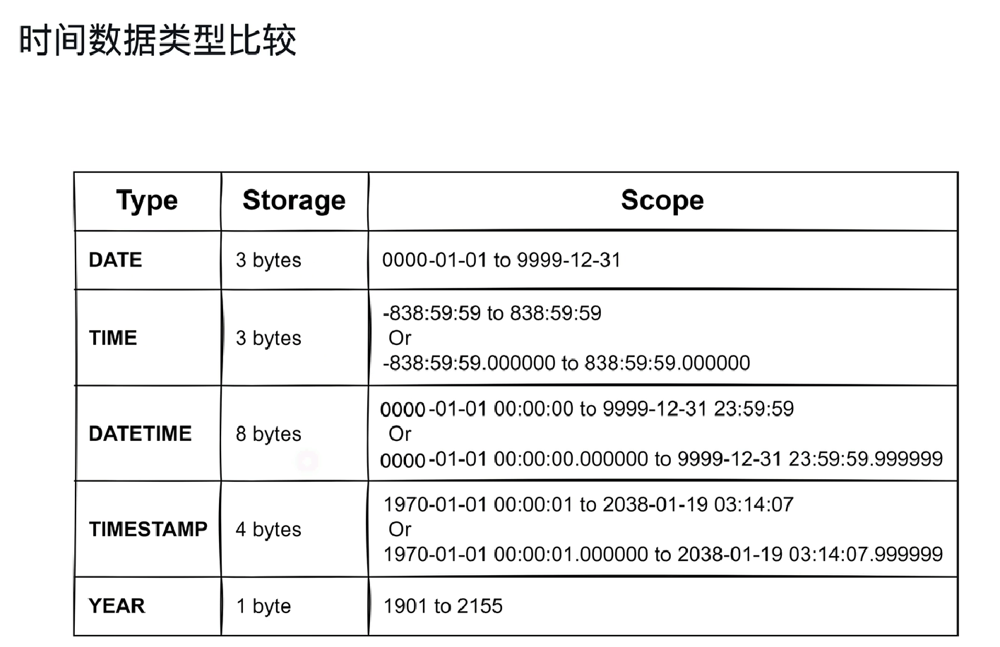
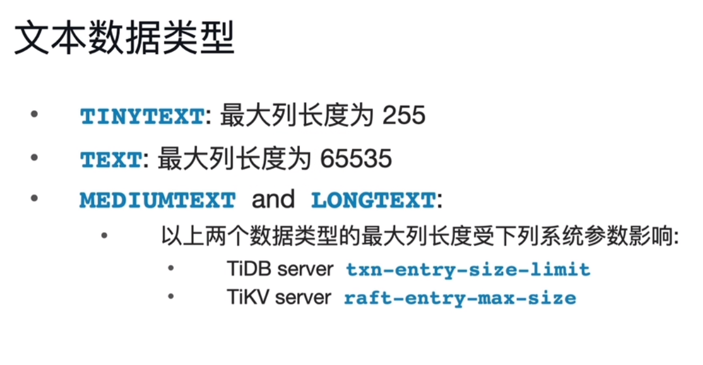
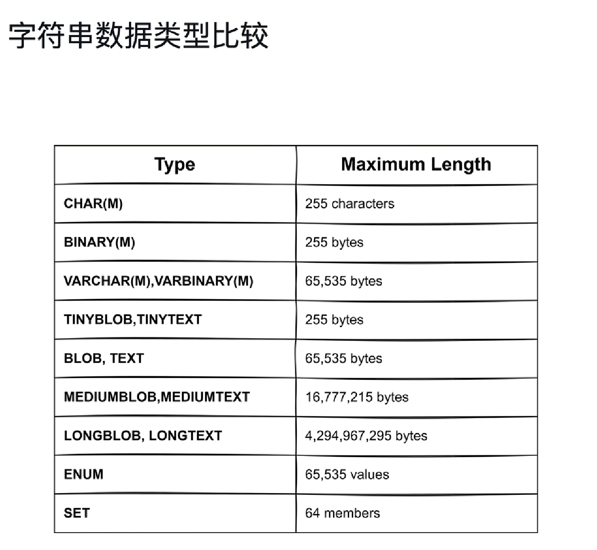
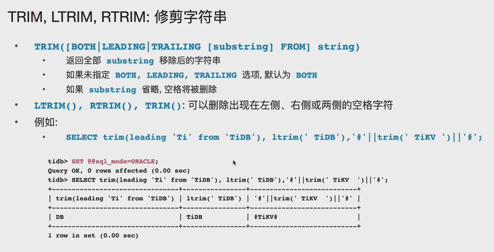
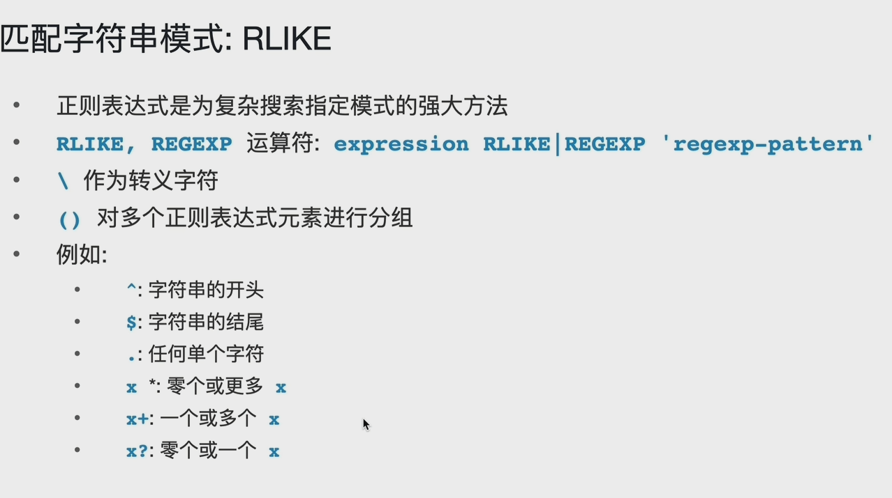
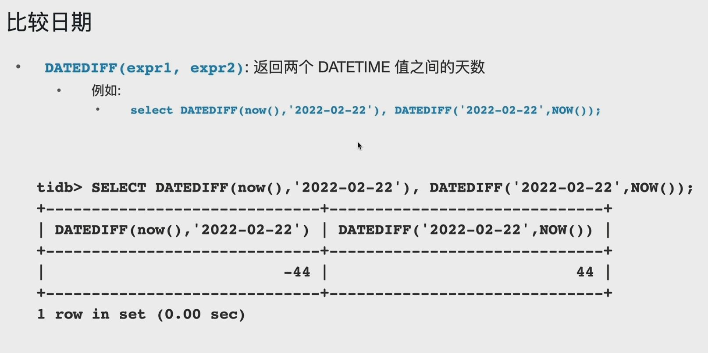

# 1-SQL

## 分页查询优化

### offset操作

offset在表数据量比较大的时候扫描的表数据量比较大，即开销比较大

### Keyset Seeker操作

Keyset Seeker分页的方法相对比offset分页方法，一般开销更小，特别是大表；

> 注意：这里的mass,id设置了索引；

#### Keyset Seeker分页方法

Keyset Seeker分页方法：把上一页的最后一行数据mass值作为下一页的起始值，并且通过NOT操作避免上一页最后一行被分到下一页中；

> 因为降序排列，如下一页的mass值肯定要小于等于90148，并且不能是mass值等于90148时，id还大于等于上一页最后一行的id值（即34334234234）的记录，即避免上一页的记录也被分到下一页中；

# 数据类型和表达式

## 数值数据类型

### 整数

### 定点数

decimal(22,2) 表示 小数和整数的总位数为22位，小数为2位；

> 如果是插入的数据小数位数多于2位，则会被截断为2位；
>
> 如果是插入的总位数多于22位，则会报错；

### 浮点数

精度会丢失

### 数值字面值

> 1.1+2.2时会自动转换为定点数，而带E的数会自动转换为浮点数，所以会出现精度丢失；

### BIT数据类型

### 布尔类型

> 注意：tinyint是1byte, 有符号数值范围为-128~127, 无符号范围为0~256；
>
> tinyint(1)的1并不是整数只有1位，123仍然可以插入到tinyint(1)类型中；

### 时间类型

timestamp与datetime的区别：

- timestamp：受时区影响；存储范围：1970-01-01 00:00:01.000000 ~ 2038-01-19 03:04:17.999999 ;
- datetime：不受时区的改变，存的是什么就是什么；存储范围：0000-00-00 00:00:00 ~ 9999-12-31 23:59:59 ;

### 字符串

- char 和 varchar
  - char: 固定长度；存储在定义时就已经确定，相对更浪费空间；
    - 查询速度快一点
  - varchar：可变长度字符串；存储随实际存储的字符串变化；
    - 不能超过65535 byte
    - TiDB 默认的编码格式为UTFMB4，一个字符占4个字节（byte），所以字符个数最长为 65535/4 个；
- binary 和 varbinary
- blob
- text
  - 
- enum
- set

#### 文本数据类型

#### 二进制和变量二进制

#### 二进制大对象数据类型

blob: 0 ~ 65535 (2^16)

mediumblob：0 ~ 2^32

longblob: 0 ~ 2^ 64

#### 枚举和集合类型

#### 字符串数据类型比较

> varchar, varbinary,blob,text 都是最大65535 字节，那这四个又有什么区别呢？

> set sql_mode=ansi_quotes后双引号字符就被当作关键字了，如select、from和where等；

## 字符集和排序规则

## 表达式

### CAST函数

### 选择数据类型

Appropriate：是时间就用时间类型，是数值就用数值类型；

### NULL

> NULL 安全判断符：<=>，即使是NULL也能进行判断；

# 函数与表达式

## 使用函数

## 字符串比较

## 在字符串中查找字符串

## 逆向、连接

### 处理NULL

### 使用管道运算符连接字符串

> 设置为sql_mode=PIPES_AS_CONCAT，'||' 才是连接符；

## LEFT，RIGHT，LPAD和RPAD

## SUBSTRING 减少字符串的一部分

## SUBSTRING_INDEX

### TRIM, LTRIM, RTRIM： 修剪字符串

### 插入和替换字符串的某些部分

### 确定字符长度

### 匹配字符串模式：LIKE

### 匹配字符串模式：RLIKE

## 日期和时间函数

## 日期和时间算术

## 将日期格式化为字符串

## 创建日期

## 比较日期

## 基本算术函数

## 其他常用函数

## 窗口函数

### 获取上一行的值

### 获取下一行的值

## Flow Control函数

- case 表达式
- nullif() 函数
- ifnull() 函数
- if() 函数

## 表达式下推

## 其他集合运算

### 差集（EXCEPT）和交集（INTERSECT）

## ANY 和 ALL

ANY：比其中任意一个大就可以

ALL：比其中所有元素都大

## IN 和 EXISTS

in：先把内层查询先查出来，然后再用外层查询一个一个查是否匹配成功；

exists：先把外层查询查出来，然后再去内层查询里面查看是否匹配；

## With子句

