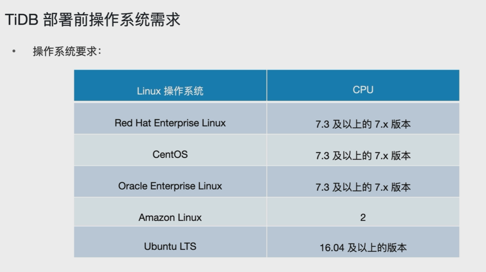
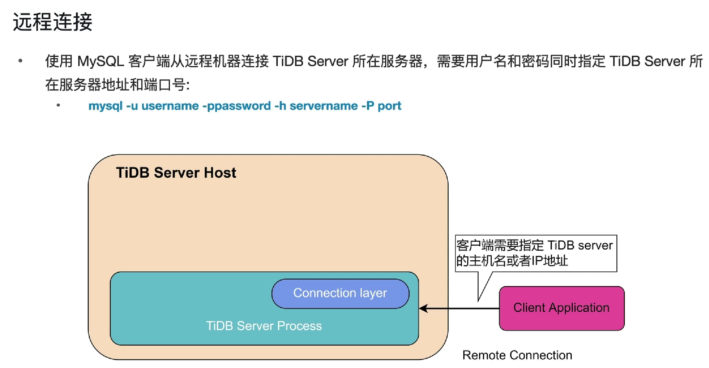
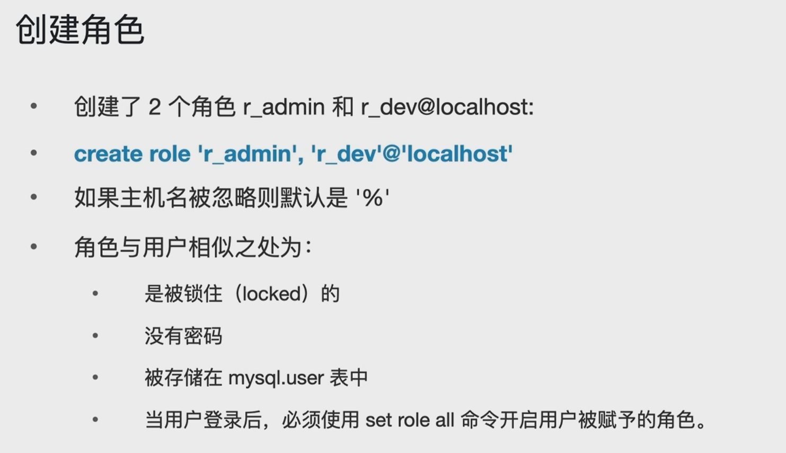
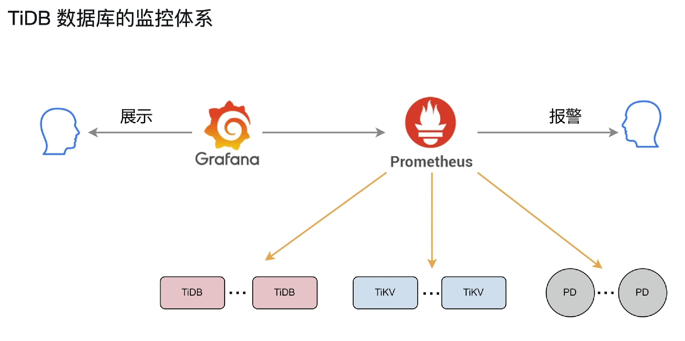
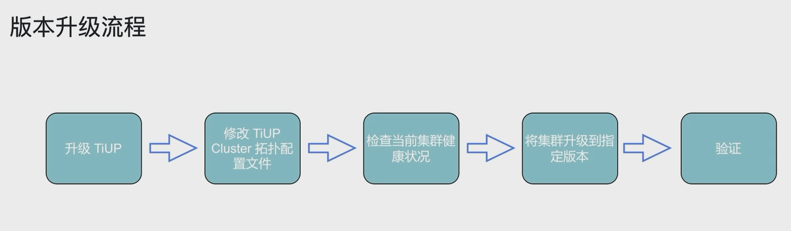
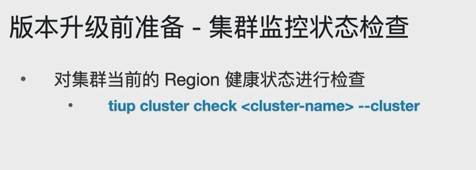
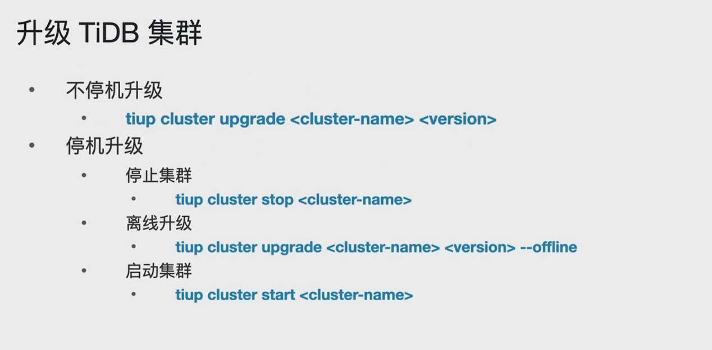
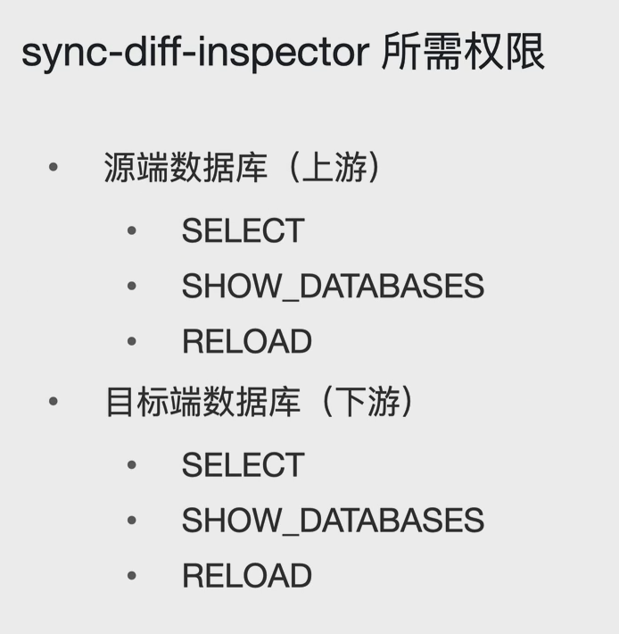

# TiDB 部署

## TiDB部署前硬件要求（PRO）


## TiDB部署前操作系统需求




## TiDB基本部署拓扑结构


## 使用TiUP部署步骤

### 1-软硬件环境需求及前置检查


### 2-安装TiUP组件


### 3-初始化集群拓扑文件


### 4-执行部署命令


### 5-查看TiUP管理的集群情况


> 查看TiUP管理的所有集群

### 6-检查部署的TiDB集群情况


> 查看具体的集群情况

### TiDB Cluster的启动


### TiDB Cluster的停止


# TiDB 数据库文件介绍


# TiDB连接管理


# TiDB配置

## 理解TiDB的配置


> 系统配置一般和TiDB Server有关，即与SQL有关的配置；
>
> 集群配置一般是组件的配置，如PD、TiKV组件等，部分TiDB Server组件的配置也在其中；
>
> 即TiDB Server 中与SQL相关的配置在系统配置中，TiDB Server和组件相关的配置放在集群配置中；

## TiDB数据集群配置的存储位置


## 区分TiDB的系统参数和集群参数


## TiDB系统参数的作用域

Global和Session

Global级别：

- 修改后，需要重新连接（包括当前会话）才会生效；
  - 即Global参数对当前会话也不生效，需要重新连接创建会话才生效；
- 修改后，重启集群依然生效，因为Global级别的参数会持久化到TiKV中；

Session级别：

- 设置时未设置global，默认就是session级别；


Global参数对当前会话不生效，重新连接之后才生效；

Session1：

```sql
[tidb@BigData01 ~]$ mysql -utidb -h 192.168.93.128 -P 4000 -p
Enter password: 
Welcome to the MariaDB monitor.  Commands end with ; or \g.
Your MySQL connection id is 447
Server version: 5.7.25-TiDB-v6.1.6 TiDB Server (Apache License 2.0) Community Edition, MySQL 5.7 compatible

Copyright (c) 2000, 2018, Oracle, MariaDB Corporation Ab and others.

Type 'help;' or '\h' for help. Type '\c' to clear the current input statement.

MySQL [(none)]> show variables like '%autocommit%';
+---------------+-------+
| Variable_name | Value |
+---------------+-------+
| autocommit    | ON    |
+---------------+-------+
1 row in set (0.00 sec)

MySQL [(none)]> set global autocommit='OFF';
Query OK, 0 rows affected (0.07 sec)

MySQL [(none)]> show variables like '%autocommit%';
+---------------+-------+
| Variable_name | Value |
+---------------+-------+
| autocommit    | ON    |
+---------------+-------+
1 row in set (0.00 sec)

MySQL [(none)]> show session  variables like '%autocommit%';
+---------------+-------+
| Variable_name | Value |
+---------------+-------+
| autocommit    | ON    |
+---------------+-------+
1 row in set (0.00 sec)

MySQL [(none)]> show global  variables like '%autocommit%';
+---------------+-------+
| Variable_name | Value |
+---------------+-------+
| autocommit    | OFF   |
+---------------+-------+
1 row in set (0.00 sec)
```

Session2：

```sql
[root@BigData01 ~]# mysql -utidb -h 192.168.93.128 -P 4000 -p
Enter password: 
Welcome to the MariaDB monitor.  Commands end with ; or \g.
Your MySQL connection id is 449
Server version: 5.7.25-TiDB-v6.1.6 TiDB Server (Apache License 2.0) Community Edition, MySQL 5.7 compatible

Copyright (c) 2000, 2018, Oracle, MariaDB Corporation Ab and others.

Type 'help;' or '\h' for help. Type '\c' to clear the current input statement.

MySQL [(none)]> show variables like '%autocommit%';
+---------------+-------+
| Variable_name | Value |
+---------------+-------+
| autocommit    | OFF   |
+---------------+-------+
1 row in set (0.00 sec)

MySQL [(none)]> show session variables like '%autocommit%';
+---------------+-------+
| Variable_name | Value |
+---------------+-------+
| autocommit    | OFF   |
+---------------+-------+
1 row in set (0.00 sec)

MySQL [(none)]> show global variables like '%autocommit%';
+---------------+-------+
| Variable_name | Value |
+---------------+-------+
| autocommit    | OFF   |
+---------------+-------+
1 row in set (0.00 sec)

MySQL [(none)]> 
```


## TiDB系统参数的修改


```sql
MySQL [(none)]> show variables like '%autocommit%';
+---------------+-------+
| Variable_name | Value |
+---------------+-------+
| autocommit    | ON    |
+---------------+-------+
1 row in set (0.00 sec)

MySQL [(none)]> set session autocommit='OFF';
Query OK, 0 rows affected (0.02 sec)

MySQL [(none)]> show variables like '%autocommit%';
+---------------+-------+
| Variable_name | Value |
+---------------+-------+
| autocommit    | OFF   |
+---------------+-------+
1 row in set (0.00 sec)

MySQL [(none)]> set global autocommit='ON';
Query OK, 0 rows affected (0.02 sec)

MySQL [(none)]> 
MySQL [(none)]> show variables like '%autocommit%';
+---------------+-------+
| Variable_name | Value |
+---------------+-------+
| autocommit    | OFF   |
+---------------+-------+
1 row in set (0.00 sec)

MySQL [(none)]> 
MySQL [(none)]> 
MySQL [(none)]> show global  variables like '%autocommit%';
+---------------+-------+
| Variable_name | Value |
+---------------+-------+
| autocommit    | ON    |
+---------------+-------+
1 row in set (0.01 sec)

MySQL [(none)]> show session  variables like '%autocommit%';
+---------------+-------+
| Variable_name | Value |
+---------------+-------+
| autocommit    | OFF   |
+---------------+-------+
1 row in set (0.00 sec)

MySQL [(none)]> 
```


> 注意：t1表只有一个字段a，且a为自增主键，当自增步长会话参数修改为10时，并不是基于目前表中最大的自增值进行自增，而是按自己的自增步长进行自增10；

## TiDB 集群参数的修改


查看集群配置

```shell
[tidb@BigData01 ~]$ tiup cluster show-config tidb-test
tiup is checking updates for component cluster ...
Starting component `cluster`: /home/tidb/.tiup/components/cluster/v1.12.2/tiup-cluster show-config tidb-test
global:
  user: tidb
  ssh_port: 22
  ssh_type: builtin
  deploy_dir: /tidb-deploy
  data_dir: /tidb-data
  os: linux
  arch: amd64
monitored:
  node_exporter_port: 9100
  blackbox_exporter_port: 9115
  deploy_dir: /tidb-deploy/monitor-9100
  data_dir: /tidb-data/monitor-9100
  log_dir: /tidb-deploy/monitor-9100/log
tidb_servers:
- host: 192.168.93.128
  ssh_port: 22
  port: 4000
  status_port: 10080
  deploy_dir: /tidb-deploy/tidb-4000
  log_dir: /tidb-deploy/tidb-4000/log
  arch: amd64
  os: linux
tikv_servers:
- host: 192.168.93.128
  ssh_port: 22
  port: 20160
  status_port: 20180
  deploy_dir: /tidb-deploy/tikv-20160
  data_dir: /tidb-data/tikv-20160
  log_dir: /tidb-deploy/tikv-20160/log
  arch: amd64
  os: linux
- host: 192.168.93.129
  ssh_port: 22
  port: 20160
  status_port: 20180
  deploy_dir: /tidb-deploy/tikv-20160
  data_dir: /tidb-data/tikv-20160
  log_dir: /tidb-deploy/tikv-20160/log
  arch: amd64
  os: linux
- host: 192.168.93.130
  ssh_port: 22
  port: 20160
  status_port: 20180
  deploy_dir: /tidb-deploy/tikv-20160
  data_dir: /tidb-data/tikv-20160
  log_dir: /tidb-deploy/tikv-20160/log
  arch: amd64
  os: linux
tiflash_servers:
- host: 192.168.93.129
  ssh_port: 22
  tcp_port: 9000
  http_port: 8123
  flash_service_port: 3930
  flash_proxy_port: 20170
  flash_proxy_status_port: 20292
  metrics_port: 8234
  deploy_dir: /tidb-deploy/tiflash-9000
  data_dir: /tidb-data/tiflash-9000
  log_dir: /tidb-deploy/tiflash-9000/log
  arch: amd64
  os: linux
- host: 192.168.93.130
  ssh_port: 22
  tcp_port: 9000
  http_port: 8123
  flash_service_port: 3930
  flash_proxy_port: 20170
  flash_proxy_status_port: 20292
  metrics_port: 8234
  deploy_dir: /tidb-deploy/tiflash-9000
  data_dir: /tidb-data/tiflash-9000
  log_dir: /tidb-deploy/tiflash-9000/log
  arch: amd64
  os: linux
pd_servers:
- host: 192.168.93.128
  ssh_port: 22
  name: pd-192.168.93.128-2379
  client_port: 2379
  peer_port: 2380
  deploy_dir: /tidb-deploy/pd-2379
  data_dir: /tidb-data/pd-2379
  log_dir: /tidb-deploy/pd-2379/log
  arch: amd64
  os: linux
- host: 192.168.93.129
  ssh_port: 22
  name: pd-192.168.93.129-2379
  client_port: 2379
  peer_port: 2380
  deploy_dir: /tidb-deploy/pd-2379
  data_dir: /tidb-data/pd-2379
  log_dir: /tidb-deploy/pd-2379/log
  arch: amd64
  os: linux
- host: 192.168.93.130
  ssh_port: 22
  name: pd-192.168.93.130-2379
  client_port: 2379
  peer_port: 2380
  deploy_dir: /tidb-deploy/pd-2379
  data_dir: /tidb-data/pd-2379
  log_dir: /tidb-deploy/pd-2379/log
  arch: amd64
  os: linux
cdc_servers:
- host: 192.168.93.128
  ssh_port: 22
  port: 8300
  deploy_dir: /tidb-deploy/cdc-8300
  data_dir: /tidb-data/cdc-8300
  log_dir: /tidb-deploy/cdc-8300/log
  ticdc_cluster_id: ""
  arch: amd64
  os: linux
monitoring_servers:
- host: 192.168.93.128
  ssh_port: 22
  port: 9090
  ng_port: 12020
  deploy_dir: /tidb-deploy/prometheus-9090
  data_dir: /tidb-data/prometheus-9090
  log_dir: /tidb-deploy/prometheus-9090/log
  external_alertmanagers: []
  arch: amd64
  os: linux
grafana_servers:
- host: 192.168.93.128
  ssh_port: 22
  port: 3000
  deploy_dir: /tidb-deploy/grafana-3000
  arch: amd64
  os: linux
  username: admin
  password: admin
  anonymous_enable: false
  root_url: ""
  domain: ""
alertmanager_servers:
- host: 192.168.93.128
  ssh_port: 22
  web_port: 9093
  cluster_port: 9094
  deploy_dir: /tidb-deploy/alertmanager-9093
  data_dir: /tidb-data/alertmanager-9093
  log_dir: /tidb-deploy/alertmanager-9093/log
  arch: amd64
  os: linux
[tidb@BigData01 ~]$ 
```


## TiDB集群参数的在线修改

在6.1中，该特性为实验特性；


# TiDB 用户管理和安全

## TiDB的认证和赋权


## 数据库用户的连接过程


```sql
MySQL [(none)]> select user,host,authentication_string from mysql.user;
+------+------+-------------------------------------------+
| user | host | authentication_string                     |
+------+------+-------------------------------------------+
| root | %    | *0DD2AB82B8E433B5A148C255C6441ACBAA8D23CC |
| tidb | %    | *0DD2AB82B8E433B5A148C255C6441ACBAA8D23CC |
+------+------+-------------------------------------------+
2 rows in set (0.01 sec)
```




## 角色管理


### 创建角色



### 管理角色


Session1：tidb用户登录

```sql
[tidb@BigData01 ~]$ mysql -utidb -h 192.168.93.128 -P 4000 -p
Enter password: 
Welcome to the MariaDB monitor.  Commands end with ; or \g.
Your MySQL connection id is 447
Server version: 5.7.25-TiDB-v6.1.6 TiDB Server (Apache License 2.0) Community Edition, MySQL 5.7 compatible

Copyright (c) 2000, 2018, Oracle, MariaDB Corporation Ab and others.

Type 'help;' or '\h' for help. Type '\c' to clear the current input statement.

MySQL [(none)]> create role cust_role;
Query OK, 0 rows affected (0.08 sec)

MySQL [(none)]> create role acct_role;
Query OK, 0 rows affected (0.04 sec)

MySQL [(none)]> grant select on lsy.acct to 'acct_role'; 
Query OK, 0 rows affected (0.07 sec)

MySQL [(none)]> grant select,insert,update,delete on lsy.cust to 'cust_role'; 
Query OK, 0 rows affected (0.04 sec)

MySQL [(none)]> 
MySQL [(none)]> create user 'acct'@'%' identified by 'lsy';
Query OK, 0 rows affected (0.04 sec)

MySQL [(none)]> create user 'cust'@'%' identified by 'lsy';
Query OK, 0 rows affected (0.03 sec)

MySQL [(none)]> 
MySQL [(none)]> grant acct_role to 'acct'@'%';
Query OK, 0 rows affected (0.05 sec)

MySQL [(none)]> grant cust_role to 'cust'@'%';
Query OK, 0 rows affected (0.03 sec)
```

> acct_role角色：有 lsy.acct 表的select权限；
>
> cust_role角色：有 lsy.cust 表的select,insert,update,delete权限；
>
> acct用户被赋予了acct_role角色，cust用户被赋予了cust_role角色；

角色是没有密码的

```sql
MySQL [(none)]> select user,host,authentication_string from mysql.user;
+-----------+------+-------------------------------------------+
| user      | host | authentication_string                     |
+-----------+------+-------------------------------------------+
| root      | %    | *0DD2AB82B8E433B5A148C255C6441ACBAA8D23CC |
| tidb      | %    | *0DD2AB82B8E433B5A148C255C6441ACBAA8D23CC |
| cust_role | %    |                                           |
| acct_role | %    |                                           |
| acct      | %    | *0DD2AB82B8E433B5A148C255C6441ACBAA8D23CC |
| cust      | %    | *0DD2AB82B8E433B5A148C255C6441ACBAA8D23CC |
+-----------+------+-------------------------------------------+
6 rows in set (0.00 sec)
```


Session2：acct用户登录

```sql
[root@BigData01 ~]# mysql -uacct -h 192.168.93.128 -P 4000 -p
Enter password: 
Welcome to the MariaDB monitor.  Commands end with ; or \g.
Your MySQL connection id is 451
Server version: 5.7.25-TiDB-v6.1.6 TiDB Server (Apache License 2.0) Community Edition, MySQL 5.7 compatible

Copyright (c) 2000, 2018, Oracle, MariaDB Corporation Ab and others.

Type 'help;' or '\h' for help. Type '\c' to clear the current input statement.

MySQL [(none)]> select * from lsy.cust;
ERROR 1142 (42000): SELECT command denied to user 'acct'@'%' for table 'cust'
MySQL [(none)]> 
MySQL [(none)]> 
MySQL [(none)]> select * from lsy.acct;
ERROR 1142 (42000): SELECT command denied to user 'acct'@'%' for table 'acct'
MySQL [(none)]> 
MySQL [(none)]> set role all;
Query OK, 0 rows affected (0.01 sec)

MySQL [(none)]> select * from lsy.acct;
+---------------------+-----------+
| ac_id               | ac_name   |
+---------------------+-----------+
| 2017612633061982209 | 小明      |
| 2017612633061982210 | 小李      |
| 2017612633061982211 | 克劳德    |
| 2017612633061982212 | 凯文      |
+---------------------+-----------+
4 rows in set (0.00 sec)

MySQL [(none)]> select * from lsy.cust;
ERROR 1142 (42000): SELECT command denied to user 'acct'@'%' for table 'cust'
MySQL [(none)]> 
MySQL [(none)]> show databases;
+--------------------+
| Database           |
+--------------------+
| INFORMATION_SCHEMA |
| lsy                |
+--------------------+
2 rows in set (0.00 sec)
MySQL [(none)]> show grants;
+----------------------------------------+
| Grants for User                        |
+----------------------------------------+
| GRANT USAGE ON *.* TO 'acct'@'%'       |
| GRANT SELECT ON lsy.acct TO 'acct'@'%' |
| GRANT 'acct_role'@'%' TO 'acct'@'%'    |
+----------------------------------------+
3 rows in set (0.00 sec)
```

> 注意：当用户登录，必须使用set role all 开启用户被赋予的角色权限；

Session3：cust用户登录

```sql
[root@BigData02 ~]# mysql -u cust -h 192.168.93.128 -P 4000 -p
Enter password: 
Welcome to the MariaDB monitor.  Commands end with ; or \g.
Your MySQL connection id is 453
Server version: 5.7.25-TiDB-v6.1.6 TiDB Server (Apache License 2.0) Community Edition, MySQL 5.7 compatible

Copyright (c) 2000, 2018, Oracle, MariaDB Corporation Ab and others.

Type 'help;' or '\h' for help. Type '\c' to clear the current input statement.

MySQL [(none)]> 
MySQL [(none)]> select * from lsy.cust;
ERROR 1142 (42000): SELECT command denied to user 'cust'@'%' for table 'cust'
MySQL [(none)]> 
MySQL [(none)]> show grants;
+-------------------------------------+
| Grants for User                     |
+-------------------------------------+
| GRANT USAGE ON *.* TO 'cust'@'%'    |
| GRANT 'cust_role'@'%' TO 'cust'@'%' |
+-------------------------------------+
2 rows in set (0.01 sec)

MySQL [(none)]> 
MySQL [(none)]> set role all;
Query OK, 0 rows affected (0.00 sec)

MySQL [(none)]> 
MySQL [(none)]> show grants;
+-------------------------------------------------------------+
| Grants for User                                             |
+-------------------------------------------------------------+
| GRANT USAGE ON *.* TO 'cust'@'%'                            |
| GRANT SELECT,INSERT,UPDATE,DELETE ON lsy.cust TO 'cust'@'%' |
| GRANT 'cust_role'@'%' TO 'cust'@'%'                         |
+-------------------------------------------------------------+
3 rows in set (0.00 sec)

MySQL [(none)]> 
MySQL [(none)]> select * from lsy.cust;
+---------------------+-----------+
| cust_id             | cust_name |
+---------------------+-----------+
| 1441151880758558721 | 小明      |
| 2594073385365405700 | 保罗      |
| 2594073385365405701 | 小李      |
| 2594073385365405702 | 克劳德    |
| 2594073385365405703 | 凯文      |
| 2594073385365405704 | 斯特恩    |
| 3746994889972252674 | 小红      |
| 4323455642275676163 | 小马      |
+---------------------+-----------+
8 rows in set (0.00 sec)

MySQL [(none)]> 
MySQL [(none)]> insert into lsy.cust (cust_name) values ('陈翔');
Query OK, 1 row affected (0.02 sec)

MySQL [(none)]> select * from lsy.cust;
+---------------------+-----------+
| cust_id             | cust_name |
+---------------------+-----------+
| 1441151880758558721 | 小明      |
| 2594073385365405700 | 保罗      |
| 2594073385365405701 | 小李      |
| 2594073385365405702 | 克劳德    |
| 2594073385365405703 | 凯文      |
| 2594073385365405704 | 斯特恩    |
| 3746994889972252674 | 小红      |
| 3746994889972252681 | 陈翔      |
| 4323455642275676163 | 小马      |
+---------------------+-----------+
9 rows in set (0.00 sec)

MySQL [(none)]> 
MySQL [(none)]> delete from lsy.cust where cust_name='小明';
Query OK, 1 row affected (0.01 sec)

MySQL [(none)]> 
MySQL [(none)]> truncate lsy.cust;
ERROR 1142 (42000): DROP command denied to user 'cust'@'%' for table 'cust'
```


注意：给用户赋予角色后，用户**每次登录**时必须开启角色权限，才会有角色相应的权限；

> 每次登录都需要开启角色权限，有点麻烦

```sql
[root@BigData01 ~]# mysql -uacct -h 192.168.93.128 -P 4000 -p
Enter password: 
Welcome to the MariaDB monitor.  Commands end with ; or \g.
Your MySQL connection id is 463
Server version: 5.7.25-TiDB-v6.1.6 TiDB Server (Apache License 2.0) Community Edition, MySQL 5.7 compatible

Copyright (c) 2000, 2018, Oracle, MariaDB Corporation Ab and others.

Type 'help;' or '\h' for help. Type '\c' to clear the current input statement.

MySQL [(none)]> 
MySQL [(none)]> select current_role;
+--------------+
| current_role |
+--------------+
| NONE         |
+--------------+
1 row in set (0.00 sec)

MySQL [(none)]> show grants;
+-------------------------------------+
| Grants for User                     |
+-------------------------------------+
| GRANT USAGE ON *.* TO 'acct'@'%'    |
| GRANT 'acct_role'@'%' TO 'acct'@'%' |
+-------------------------------------+
2 rows in set (0.00 sec)

MySQL [(none)]> set role all;
Query OK, 0 rows affected (0.00 sec)

MySQL [(none)]> show grants;
+----------------------------------------+
| Grants for User                        |
+----------------------------------------+
| GRANT USAGE ON *.* TO 'acct'@'%'       |
| GRANT SELECT ON lsy.acct TO 'acct'@'%' |
| GRANT 'acct_role'@'%' TO 'acct'@'%'    |
+----------------------------------------+
3 rows in set (0.00 sec)

MySQL [(none)]> select current_role;
+-----------------+
| current_role    |
+-----------------+
| `acct_role`@`%` |
+-----------------+
1 row in set (0.00 sec)
```


## 管理用户账号


## 设置账号密码


## 忘记Root密码的解决方法


# TiDB监控

## TiDB数据库的监控体系



### TiDB Dashboard


## TiDB 数据库监控系统数据流转


## 设置TiDB数据库的报警系统


## 常用监控指标

### System-Info 的常用监控指标


### PD的常用监控指标


### TiDB-Server的常用监控指标


### TiKV的常用监控指标


# TiDB集群管理

## 在线扩容（TiDB/TiKV/PD）


## 在线扩容（TiFlash）


## 在线缩容（TiDB/TiKV/PD）


## 在线缩容（TiFlash）


## 重命名集群


```shell
[tidb@BigData01 ~]$ tiup cluster display tidb-lsy
tiup is checking updates for component cluster ...
Starting component `cluster`: /home/tidb/.tiup/components/cluster/v1.12.2/tiup-cluster display tidb-lsy
Cluster type:       tidb
Cluster name:       tidb-lsy
Cluster version:    v6.1.6
Deploy user:        tidb
SSH type:           builtin
Dashboard URL:      http://192.168.93.128:2379/dashboard
Grafana URL:        http://192.168.93.128:3000
ID                    Role          Host            Ports                            OS/Arch       Status  Data Dir                      Deploy Dir
--                    ----          ----            -----                            -------       ------  --------                      ----------
192.168.93.128:9093   alertmanager  192.168.93.128  9093/9094                        linux/x86_64  Up      /tidb-data/alertmanager-9093  /tidb-deploy/alertmanager-9093
192.168.93.128:8300   cdc           192.168.93.128  8300                             linux/x86_64  Up      /tidb-data/cdc-8300           /tidb-deploy/cdc-8300
192.168.93.128:3000   grafana       192.168.93.128  3000                             linux/x86_64  Up      -                             /tidb-deploy/grafana-3000
192.168.93.128:2379   pd            192.168.93.128  2379/2380                        linux/x86_64  Up|UI   /tidb-data/pd-2379            /tidb-deploy/pd-2379
192.168.93.129:2379   pd            192.168.93.129  2379/2380                        linux/x86_64  Up|L    /tidb-data/pd-2379            /tidb-deploy/pd-2379
192.168.93.130:2379   pd            192.168.93.130  2379/2380                        linux/x86_64  Up      /tidb-data/pd-2379            /tidb-deploy/pd-2379
192.168.93.128:9090   prometheus    192.168.93.128  9090/12020                       linux/x86_64  Up      /tidb-data/prometheus-9090    /tidb-deploy/prometheus-9090
192.168.93.128:4000   tidb          192.168.93.128  4000/10080                       linux/x86_64  Up      -                             /tidb-deploy/tidb-4000
192.168.93.129:9000   tiflash       192.168.93.129  9000/8123/3930/20170/20292/8234  linux/x86_64  Up      /tidb-data/tiflash-9000       /tidb-deploy/tiflash-9000
192.168.93.130:9000   tiflash       192.168.93.130  9000/8123/3930/20170/20292/8234  linux/x86_64  Up      /tidb-data/tiflash-9000       /tidb-deploy/tiflash-9000
192.168.93.128:20160  tikv          192.168.93.128  20160/20180                      linux/x86_64  Up      /tidb-data/tikv-20160         /tidb-deploy/tikv-20160
192.168.93.129:20160  tikv          192.168.93.129  20160/20180                      linux/x86_64  Up      /tidb-data/tikv-20160         /tidb-deploy/tikv-20160
192.168.93.130:20160  tikv          192.168.93.130  20160/20180                      linux/x86_64  Up      /tidb-data/tikv-20160         /tidb-deploy/tikv-20160
Total nodes: 13
[tidb@BigData01 ~]$ 
[tidb@BigData01 ~]$ 
[tidb@BigData01 ~]$ 
[tidb@BigData01 ~]$ tiup cluster rename tidb-lsy tidb-test
tiup is checking updates for component cluster ...
Starting component `cluster`: /home/tidb/.tiup/components/cluster/v1.12.2/tiup-cluster rename tidb-lsy tidb-test
Will rename the cluster name from tidb-lsy to tidb-test.
Do you confirm this action? [y/N]:(default=N) y
Rename cluster `tidb-lsy` -> `tidb-test` successfully
Will reload the cluster tidb-test with restart policy is true, nodes: , roles: grafana,prometheus.
Do you want to continue? [y/N]:(default=N) y
+ [ Serial ] - SSHKeySet: privateKey=/home/tidb/.tiup/storage/cluster/clusters/tidb-test/ssh/id_rsa, publicKey=/home/tidb/.tiup/storage/cluster/clusters/tidb-test/ssh/id_rsa.pub
+ [Parallel] - UserSSH: user=tidb, host=192.168.93.130
+ [Parallel] - UserSSH: user=tidb, host=192.168.93.128
+ [Parallel] - UserSSH: user=tidb, host=192.168.93.128
+ [Parallel] - UserSSH: user=tidb, host=192.168.93.129
+ [Parallel] - UserSSH: user=tidb, host=192.168.93.130
+ [Parallel] - UserSSH: user=tidb, host=192.168.93.128
+ [Parallel] - UserSSH: user=tidb, host=192.168.93.128
+ [Parallel] - UserSSH: user=tidb, host=192.168.93.128
+ [Parallel] - UserSSH: user=tidb, host=192.168.93.128
+ [Parallel] - UserSSH: user=tidb, host=192.168.93.128
+ [Parallel] - UserSSH: user=tidb, host=192.168.93.129
+ [Parallel] - UserSSH: user=tidb, host=192.168.93.130
+ [Parallel] - UserSSH: user=tidb, host=192.168.93.129
+ [ Serial ] - UpdateTopology: cluster=tidb-test
+ Refresh instance configs
  - Generate config pd -> 192.168.93.128:2379 ... Done
  - Generate config pd -> 192.168.93.129:2379 ... Done
  - Generate config pd -> 192.168.93.130:2379 ... Done
  - Generate config tikv -> 192.168.93.129:20160 ... Done
  - Generate config tikv -> 192.168.93.130:20160 ... Done
  - Generate config tikv -> 192.168.93.128:20160 ... Done
  - Generate config tidb -> 192.168.93.128:4000 ... Done
  - Generate config tiflash -> 192.168.93.129:9000 ... Done
  - Generate config tiflash -> 192.168.93.130:9000 ... Done
  - Generate config cdc -> 192.168.93.128:8300 ... Done
  - Generate config prometheus -> 192.168.93.128:9090 ... Done
  - Generate config grafana -> 192.168.93.128:3000 ... Done
  - Generate config alertmanager -> 192.168.93.128:9093 ... Done
+ Refresh monitor configs
  - Generate config node_exporter -> 192.168.93.128 ... Done
  - Generate config node_exporter -> 192.168.93.129 ... Done
  - Generate config node_exporter -> 192.168.93.130 ... Done
  - Generate config blackbox_exporter -> 192.168.93.128 ... Done
  - Generate config blackbox_exporter -> 192.168.93.129 ... Done
  - Generate config blackbox_exporter -> 192.168.93.130 ... Done
+ [ Serial ] - Upgrade Cluster
Upgrading component prometheus
	Restarting instance 192.168.93.128:9090
	Restart instance 192.168.93.128:9090 success
Upgrading component grafana
	Restarting instance 192.168.93.128:3000
	Restart instance 192.168.93.128:3000 success
Stopping component node_exporter
	Stopping instance 192.168.93.128
	Stop 192.168.93.128 success
Stopping component blackbox_exporter
	Stopping instance 192.168.93.128
	Stop 192.168.93.128 success
Starting component node_exporter
	Starting instance 192.168.93.128
	Start 192.168.93.128 success
Starting component blackbox_exporter
	Starting instance 192.168.93.128
	Start 192.168.93.128 success
Reloaded cluster `tidb-test` successfully
You have mail in /var/spool/mail/root
[tidb@BigData01 ~]$ 
[tidb@BigData01 ~]$ 
[tidb@BigData01 ~]$ 
[tidb@BigData01 ~]$ tiup cluster display tidb-lsy
tiup is checking updates for component cluster ...
Starting component `cluster`: /home/tidb/.tiup/components/cluster/v1.12.2/tiup-cluster display tidb-lsy

Error: Cluster tidb-lsy not found

Verbose debug logs has been written to /home/tidb/.tiup/logs/tiup-cluster-debug-2023-06-04-18-50-25.log.
[tidb@BigData01 ~]$ 
[tidb@BigData01 ~]$ tiup cluster display tidb-test
tiup is checking updates for component cluster ...
Starting component `cluster`: /home/tidb/.tiup/components/cluster/v1.12.2/tiup-cluster display tidb-test
Cluster type:       tidb
Cluster name:       tidb-test
Cluster version:    v6.1.6
Deploy user:        tidb
SSH type:           builtin
Dashboard URL:      http://192.168.93.128:2379/dashboard
Grafana URL:        http://192.168.93.128:3000
ID                    Role          Host            Ports                            OS/Arch       Status  Data Dir                      Deploy Dir
--                    ----          ----            -----                            -------       ------  --------                      ----------
192.168.93.128:9093   alertmanager  192.168.93.128  9093/9094                        linux/x86_64  Up      /tidb-data/alertmanager-9093  /tidb-deploy/alertmanager-9093
192.168.93.128:8300   cdc           192.168.93.128  8300                             linux/x86_64  Up      /tidb-data/cdc-8300           /tidb-deploy/cdc-8300
192.168.93.128:3000   grafana       192.168.93.128  3000                             linux/x86_64  Up      -                             /tidb-deploy/grafana-3000
192.168.93.128:2379   pd            192.168.93.128  2379/2380                        linux/x86_64  Up|UI   /tidb-data/pd-2379            /tidb-deploy/pd-2379
192.168.93.129:2379   pd            192.168.93.129  2379/2380                        linux/x86_64  Up|L    /tidb-data/pd-2379            /tidb-deploy/pd-2379
192.168.93.130:2379   pd            192.168.93.130  2379/2380                        linux/x86_64  Up      /tidb-data/pd-2379            /tidb-deploy/pd-2379
192.168.93.128:9090   prometheus    192.168.93.128  9090/12020                       linux/x86_64  Up      /tidb-data/prometheus-9090    /tidb-deploy/prometheus-9090
192.168.93.128:4000   tidb          192.168.93.128  4000/10080                       linux/x86_64  Up      -                             /tidb-deploy/tidb-4000
192.168.93.129:9000   tiflash       192.168.93.129  9000/8123/3930/20170/20292/8234  linux/x86_64  Up      /tidb-data/tiflash-9000       /tidb-deploy/tiflash-9000
192.168.93.130:9000   tiflash       192.168.93.130  9000/8123/3930/20170/20292/8234  linux/x86_64  Up      /tidb-data/tiflash-9000       /tidb-deploy/tiflash-9000
192.168.93.128:20160  tikv          192.168.93.128  20160/20180                      linux/x86_64  Up      /tidb-data/tikv-20160         /tidb-deploy/tikv-20160
192.168.93.129:20160  tikv          192.168.93.129  20160/20180                      linux/x86_64  Up      /tidb-data/tikv-20160         /tidb-deploy/tikv-20160
192.168.93.130:20160  tikv          192.168.93.130  20160/20180                      linux/x86_64  Up      /tidb-data/tikv-20160         /tidb-deploy/tikv-20160
Total nodes: 13
```


## 清理集群数据


## 时区的修改


- datetime类型是不随时区变化而变化，存入的是什么时间，显示的就是什么时间；
- timestamp类型会随时区变化而变化；
- now()、curtime() 、current_time() 和current_timestamp() 时间函数会随时区变化而变化；

```sql
MySQL [(none)]> select @@global.timezone, @@session.timezone;
ERROR 1193 (HY000): Unknown system variable 'timezone'
MySQL [(none)]> 
MySQL [(none)]> 
MySQL [(none)]> select @@global.time_zone, @@session.time_zone;
+--------------------+---------------------+
| @@global.time_zone | @@session.time_zone |
+--------------------+---------------------+
| SYSTEM             | SYSTEM              |
+--------------------+---------------------+
1 row in set (0.01 sec)

MySQL [(none)]> 
MySQL [(none)]> create table lsy.time_test1 (dt datetime, tm timestamp);
Query OK, 0 rows affected (0.12 sec)

MySQL [(none)]> insert into lsy.time_test1 values (now(),now());
Query OK, 1 row affected (0.02 sec)

MySQL [(none)]> 
MySQL [(none)]> select * from lsy.time_test1;
+---------------------+---------------------+
| dt                  | tm                  |
+---------------------+---------------------+
| 2023-06-04 18:29:26 | 2023-06-04 18:29:26 |
+---------------------+---------------------+
1 row in set (0.01 sec)

MySQL [(none)]> select now();
+---------------------+
| now()               |
+---------------------+
| 2023-06-04 18:31:01 |
+---------------------+
1 row in set (0.00 sec)

MySQL [(none)]> select curtime();
+-----------+
| curtime() |
+-----------+
| 18:31:10  |
+-----------+
1 row in set (0.00 sec)

MySQL [(none)]> 
MySQL [(none)]> set session time_zone='UTC';
Query OK, 0 rows affected (0.00 sec)

MySQL [(none)]> 
MySQL [(none)]> select @@global.time_zone, @@session.time_zone;
+--------------------+---------------------+
| @@global.time_zone | @@session.time_zone |
+--------------------+---------------------+
| SYSTEM             | UTC                 |
+--------------------+---------------------+
1 row in set (0.00 sec)

MySQL [(none)]> select * from lsy.time_test1;
+---------------------+---------------------+
| dt                  | tm                  |
+---------------------+---------------------+
| 2023-06-04 18:29:26 | 2023-06-04 10:29:26 |
+---------------------+---------------------+
1 row in set (0.01 sec)

MySQL [(none)]> select now();
+---------------------+
| now()               |
+---------------------+
| 2023-06-04 10:32:28 |
+---------------------+
1 row in set (0.00 sec)

MySQL [(none)]> 
MySQL [(none)]> select curtime();
+-----------+
| curtime() |
+-----------+
| 10:32:40  |
+-----------+
1 row in set (0.00 sec)

MySQL [(none)]> 
MySQL [(none)]> select current_timestamp();
+---------------------+
| current_timestamp() |
+---------------------+
| 2023-06-04 10:33:01 |
+---------------------+
1 row in set (0.01 sec)

MySQL [(none)]> select current_time();
+----------------+
| current_time() |
+----------------+
| 10:33:29       |
+----------------+
1 row in set (0.00 sec)

MySQL [(none)]> 
```

# TiDB 集群升级

## 使用TiUP 进行补丁升级（HotFix）


## 版本升级

### 版本升级流程



### 版本升级前准备

#### 更新TiUP


#### 编辑TiUP Cluster拓扑配置文件


> 主要是修改部分在低版本支持的但是在升级的高版本中不支持的参数；

### 集群监控状态检查



> --cluster 的作用：检查region的健康状态；

### 升级 TiDB 集群



> --force
>
> --transfer-timeout：默认300s，可根据需要增加该时间；

### 升级常见问题


> 驱逐leader节点的时间过长；
>
> TiKV节点升级时，leader节点需要进行转移；


# sync-diff-inspector

## sync-diff-inspector的功能


## sync-diff-inspector的原理


## sycn-diff-inspector 所需权限




## 使用限制


> 如果两边都是TiDB数据库，则可以边同步边校验；如果一边MySQL，一边TiDB，则不支持边同步边校验，只能静止校验；

## 安装

sync-diff-inspector 集成在 tidb-community-tookit软件包中；

## 使用

### 配置文件


### 启动校验


### 输出文件


### 注意事项


> 注意：
>
> （1）如果设置了比较源端数据库test.t1 和 目标端数据库 test.t2表，而此时源端数据库又有一个和目标端数据库比较的表名一致的表（如 test.t2），则默认会将源端数据库 test.t1 和 test.t2表作为一个表的分片合并起来与目标端数据库的 test.t2表进行比较，因为sycn-diff-inspector 默认开启 sharding 校验，只有关闭 sharding 校验（设置sharding为false），才会只比较源端数据库 test.t1 和 目标端数据库 test.t2 表；
>
> （2）注意两边数据库编码格式和排序设置的一致；