# 备份

## 备份的重要性

- 数据库恢复
- 审计与分析
- 典型的DBA任务

## 备份类型

- 备份备份的类型热备份允许应用程序完全访问数据；
- 冷备份通常不允许应用程序访问数据；
- 温备份允许应用程序读取但不能修改数据；

| 备份类型 | 是否可以读取数据 | 是否可以修改数据 |
| -------- | ---------------- | ---------------- |
| 热备份   | 可以             | 可以             |
| 冷备份   | 不可以           | 不可以           |
| 温备份   | 可以             | 不可以           |

### 热备份

热备份是在读取和修改数据时进行的，几乎不会中断您与数据交换或操作的能力；对于读取和修改数据的操作，系统仍可访问；

通过以下方式锁定数据：

- （1）使用MVCC （使用最多）
- （2）锁定在较低级别（例如行级别）
- （3）完全不锁定，以便应用程序可以访问数据；

注意：热备时，需要注意数据跨越的现象，一般可以通过MVCC避免；

> 比如10点中开始备份，10点30的时候修改了数据，然后把10点30的数据备份进去了，11点才结束备份，那备份里就不止会有10点之前的数据，还可能有10点之后的数据；

### 冷备份

- 当用户无法访问数据时发生；

- 防止您对数据执行任何活动；

- 在系统启动和运行时，不要干扰系统的性能；

### 温备份

- 1、在访问数据时发生；

- 2、具有不必完全锁定最终用户的优势；

- 3、可能导致性能问题，因为您无法在备份期间修改数据；

  

## 备份技术

逻辑备份：

- 文本表示形式：SQL语句；
- 文本文件中的结果包含用于重建数据库的SQL语句；
- 适合异构数据库之间的迁移；
- 缺点：效率较低；

物理备份：

- TiDB数据库文件的二进制副本；
- 缺点：不适合异构数据库之间的迁移；
- 优点：速度快；

基于复制

- 主从数据库，从库用来备份；

- 有可能造成数据丢失：主库的数据还没来得及传输给从库，宕机了数据就丢失了；

增量备份：

- 通过同步复制创建；

### 逻辑备份

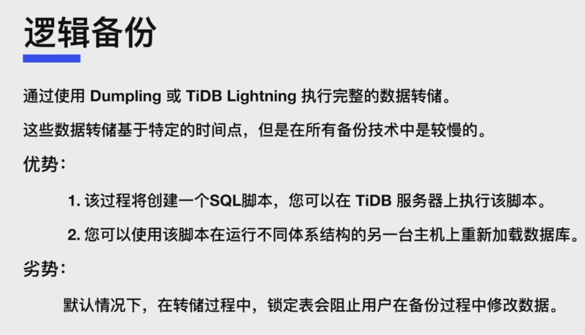物理备份

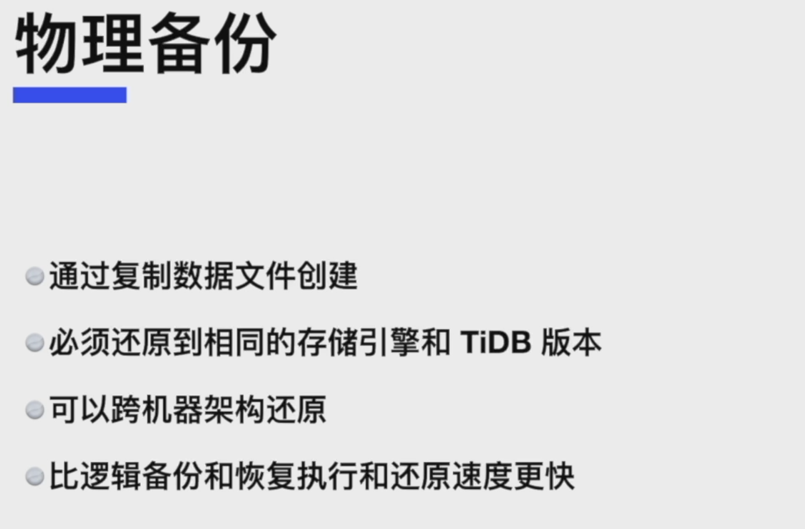 

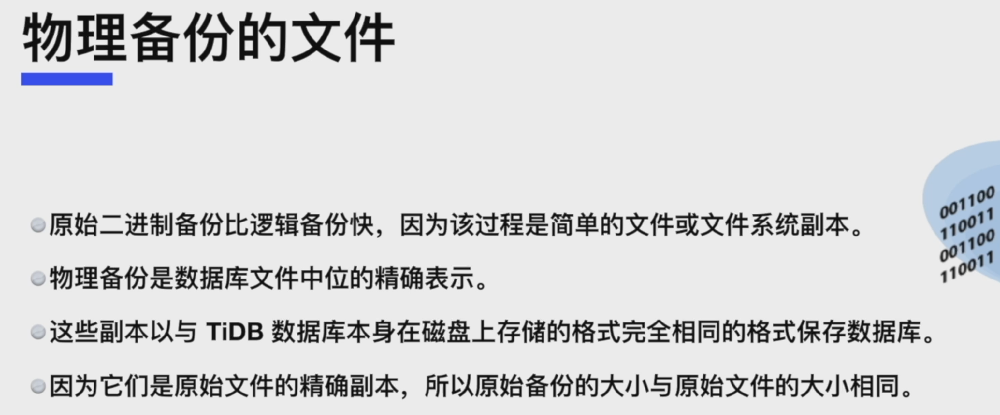 

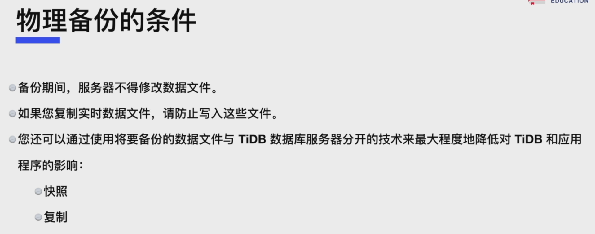 

### 基于复制的备份

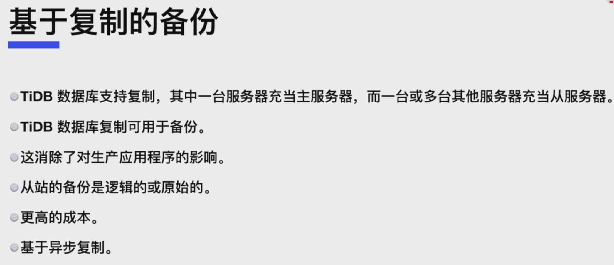 

## 备份恢复技术对比

| 方法         | 冷/热/温   | 逻辑备份/物理备份 | 一致性 |
| ------------ | ---------- | ----------------- | ------ |
| BR工具       | 热备       | 物理              | 是     |
| Dumpling     | 热/温备    | 逻辑              | 是     |
| 复制         | 热备       | 逻辑              | 是     |
| 操作系统拷贝 | 冷备或温备 | 物理              | 是     |

## 备份恢复技术的选择

 

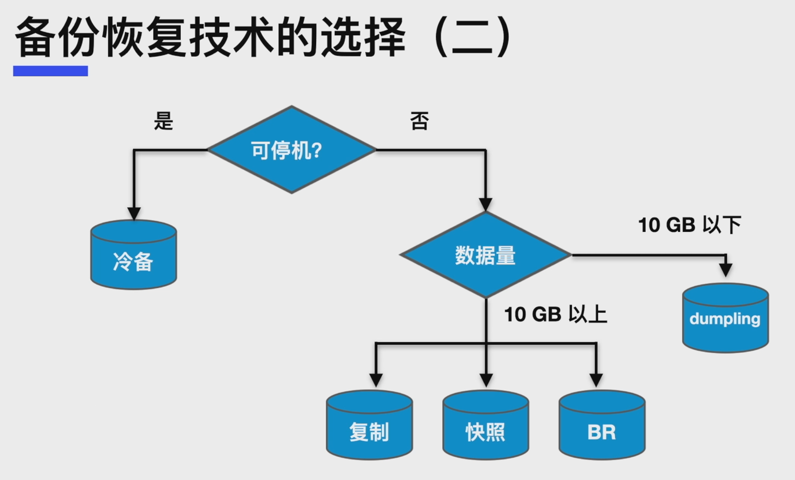 

## 其他

- 冷备需要停机，冷备的速度快于热备；

- 热备时，数据库依然可以保持读写；

- 热备时，需要注意数据穿越的现象；

> 比如10点中开始备份，10点30的时候修改了数据，然后把10点30的数据备份进去了，11点才结束备份，那备份里就不止会有10点之前的数据，还可能有10点之后的数据；

逻辑备份可以应用于异构数据库间的数据迁移，因为逻辑备份一般是导出SQL的形式；

物理备份适合大数据量的备份，物理备份的速度一般快于逻辑备份；

# 使用BR进行备份

## 全库备份和恢复

### 全库备份

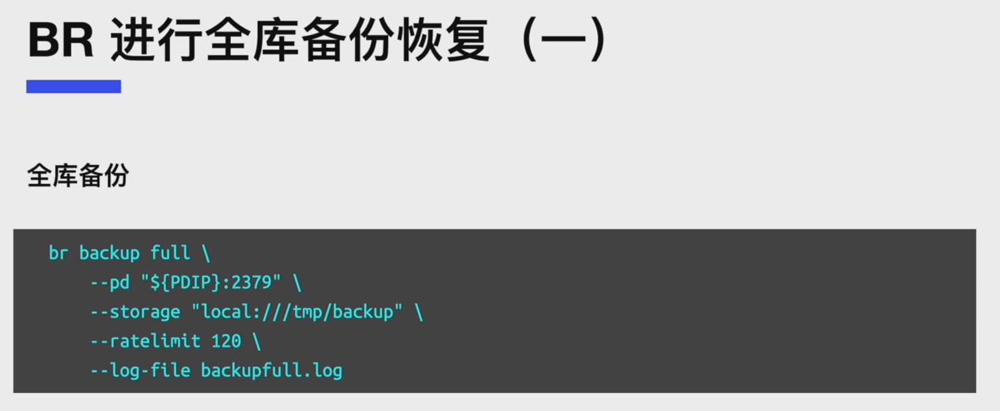注意：

- rate-limit：设置带宽的限速，避免对在线业务影响过大；

### 全库恢复

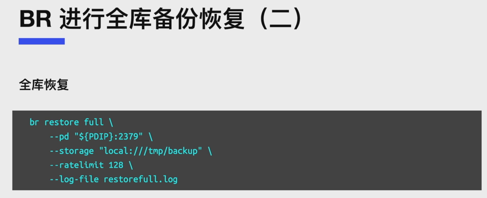注意：

- 这个storage可能是一个共享存储，也有可能是每个TiKV上单独的存储；
- 每个TiKV节点在storage看到的一定是**本次恢复的全部SST文件**，不能只是自己节点备份的那些SST文件；

## 单库备份和恢复

### 单库备份

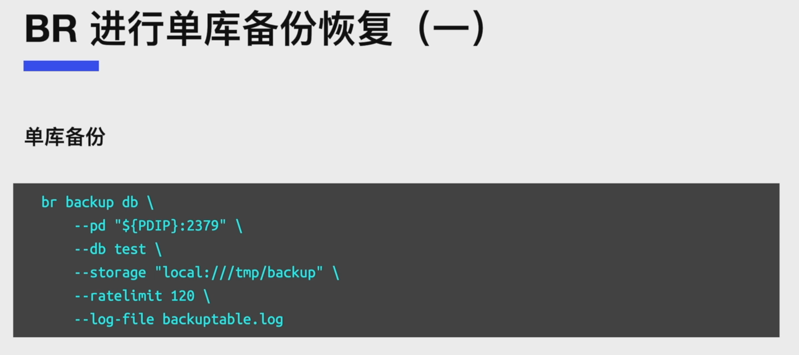 

### 单库恢复

## 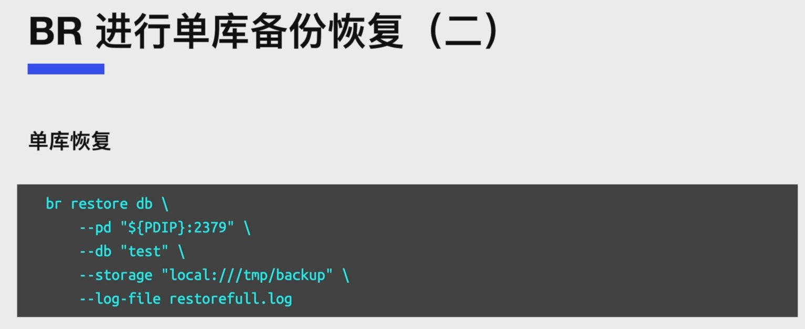 单表备份和恢复

### 单表备份

### 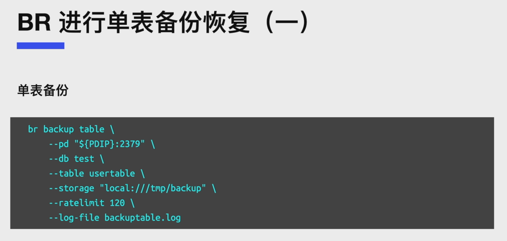单表恢复

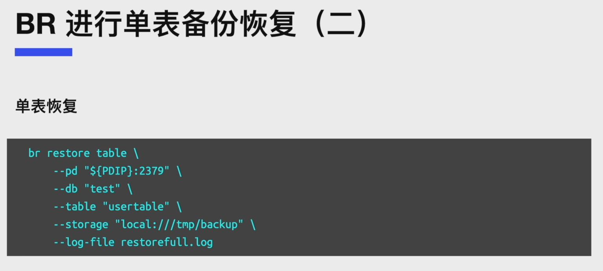

## 选择性恢复数据

## 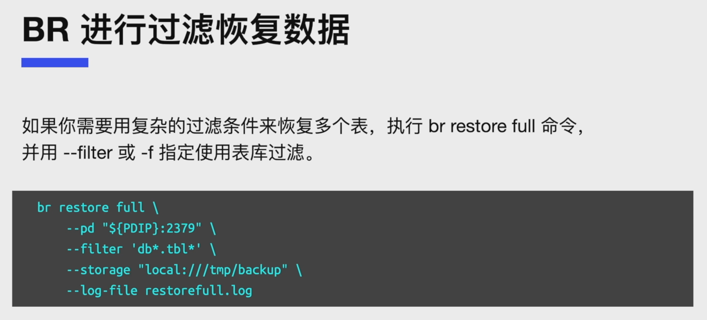 增量备份与恢复

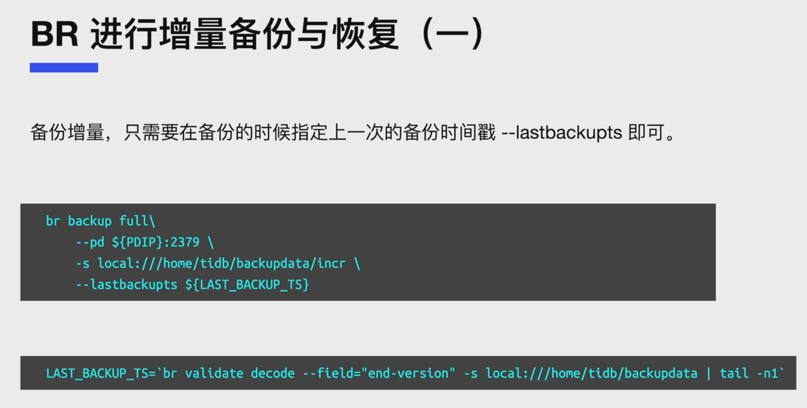注意：**增量备份的位置**要和**全量备份的位置不同**； 

##  BR工具最佳实践

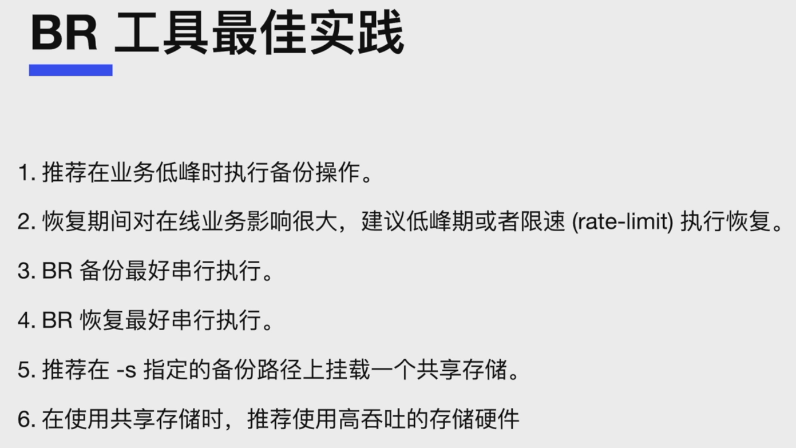