# 理解TiDB执行计划


# Join查询的执行计划

## Index Join

- 如果预计**需要连接的行数较少（一般小于 1 万行）**，推荐使用 Index Join 算法。

- **Index Join 算法对内存消耗较小**，但如果**需要执行大量探查操作**，运行速度可能会慢于其他 Join 算法。

- **如果 Build 端的数据量比 Probe 端小，且 Probe 端的数据已预先建立了索引**，那么这种情况下 **Index Join 算法效率更高**。

在下面这段查询语句中，因为 Index Join 比 Hash Join 效率低，所以 SQL 优化器选择了 Hash Join 算法：

```sql
-- 删除已有索引
ALTER TABLE t2 DROP INDEX t1_id;

EXPLAIN ANALYZE SELECT /*+ INL_JOIN(t1, t2) */  * FROM t1 INNER JOIN t2 ON t1.id = t2.t1_id WHERE t1.int_col = 1;
EXPLAIN ANALYZE SELECT /*+ HASH_JOIN(t1, t2) */  * FROM t1 INNER JOIN t2 ON t1.id = t2.t1_id WHERE t1.int_col = 1;
EXPLAIN ANALYZE SELECT * FROM t1 INNER JOIN t2 ON t1.id = t2.t1_id WHERE t1.int_col = 1;
+-----------------------------+----------+---------+-----------+---------------+--------------------------------------------------------------------------------------------------------------------------------------------------------------------------------------------------------------------------------------------------------------------------------------------------------------------------+---------------------------------------------------------------------------------------------------------------------------+---------+------+
| id                          | estRows  | actRows | task      | access object | execution info                                                                                                                                                                                                                                                                                                           | operator info                                                                                                             | memory  | disk |
+-----------------------------+----------+---------+-----------+---------------+--------------------------------------------------------------------------------------------------------------------------------------------------------------------------------------------------------------------------------------------------------------------------------------------------------------------------+---------------------------------------------------------------------------------------------------------------------------+---------+------+
| IndexJoin_14                | 90000.00 | 0       | root      |               | time:330.2ms, loops:1, inner:{total:72.2ms, concurrency:5, task:12, construct:58.6ms, fetch:13.5ms, build:2.12µs}, probe:26.1ms                                                                                                                                                                                          | inner join, inner:TableReader_10, outer key:test.t2.t1_id, inner key:test.t1.id, equal cond:eq(test.t2.t1_id, test.t1.id) | 88.5 MB | N/A  |
| ├─TableReader_20(Build)     | 90000.00 | 90000   | root      |               | time:307.2ms, loops:96, cop_task: {num: 24, max: 130.6ms, min: 170.9µs, avg: 33.5ms, p95: 105ms, max_proc_keys: 10687, p95_proc_keys: 9184, tot_proc: 472ms, rpc_num: 24, rpc_time: 802.4ms, copr_cache_hit_ratio: 0.62, distsql_concurrency: 15}                                                                        | data:TableFullScan_19                                                                                                     | 58.6 MB | N/A  |
| │ └─TableFullScan_19        | 90000.00 | 90000   | cop[tikv] | table:t2      | tikv_task:{proc max:34ms, min:0s, avg: 15.3ms, p80:24ms, p95:30ms, iters:181, tasks:24}, scan_detail: {total_process_keys: 69744, total_process_keys_size: 217533936, total_keys: 69753, get_snapshot_time: 701.6µs, rocksdb: {delete_skipped_count: 97368, key_skipped_count: 236847, block: {cache_hit_count: 3509}}}  | keep order:false                                                                                                          | N/A     | N/A  |
| └─TableReader_10(Probe)     | 12617.92 | 0       | root      |               | time:11.9ms, loops:12, cop_task: {num: 42, max: 848.8µs, min: 199µs, avg: 451.8µs, p95: 846.2µs, max_proc_keys: 7, p95_proc_keys: 5, rpc_num: 42, rpc_time: 18.3ms, copr_cache_hit_ratio: 0.00, distsql_concurrency: 15}                                                                                                 | data:Selection_9                                                                                                          | N/A     | N/A  |
|   └─Selection_9             | 12617.92 | 0       | cop[tikv] |               | tikv_task:{proc max:0s, min:0s, avg: 0s, p80:0s, p95:0s, iters:42, tasks:42}, scan_detail: {total_process_keys: 56, total_process_keys_size: 174608, total_keys: 77, get_snapshot_time: 727.7µs, rocksdb: {block: {cache_hit_count: 154}}}                                                                               | eq(test.t1.int_col, 1)                                                                                                    | N/A     | N/A  |
|     └─TableRangeScan_8      | 90000.00 | 56      | cop[tikv] | table:t1      | tikv_task:{proc max:0s, min:0s, avg: 0s, p80:0s, p95:0s, iters:42, tasks:42}                                                                                                                                                                                                                                             | range: decided by [test.t2.t1_id], keep order:false                                                                       | N/A     | N/A  |
+-----------------------------+----------+---------+-----------+---------------+--------------------------------------------------------------------------------------------------------------------------------------------------------------------------------------------------------------------------------------------------------------------------------------------------------------------------+---------------------------------------------------------------------------------------------------------------------------+---------+------+

+------------------------------+----------+---------+-----------+---------------+------------------------------------------------------------------------------------------------------------------------------------------------------------------------------------------------------------------------------------------------------------------------------------------------------------------------+---------------------------------------------------+---------+---------+
| id                           | estRows  | actRows | task      | access object | execution info                                                                                                                                                                                                                                                                                                         | operator info                                     | memory  | disk    |
+------------------------------+----------+---------+-----------+---------------+------------------------------------------------------------------------------------------------------------------------------------------------------------------------------------------------------------------------------------------------------------------------------------------------------------------------+---------------------------------------------------+---------+---------+
| HashJoin_20                  | 90000.00 | 0       | root      |               | time:313.6ms, loops:1, build_hash_table:{total:24.6ms, fetch:21.2ms, build:3.32ms}, probe:{concurrency:5, total:1.57s, max:313.5ms, probe:18.9ms, fetch:1.55s}                                                                                                                                                         | inner join, equal:[eq(test.t1.id, test.t2.t1_id)] | 32.0 MB | 0 Bytes |
| ├─TableReader_23(Build)      | 9955.54  | 10000   | root      |               | time:23.6ms, loops:12, cop_task: {num: 11, max: 504.6µs, min: 203.7µs, avg: 377.4µs, p95: 504.6µs, rpc_num: 11, rpc_time: 3.92ms, copr_cache_hit_ratio: 1.00, distsql_concurrency: 15}                                                                                                                                 | data:Selection_22                                 | 14.9 MB | N/A     |
| │ └─Selection_22             | 9955.54  | 10000   | cop[tikv] |               | tikv_task:{proc max:104ms, min:3ms, avg: 24.4ms, p80:33ms, p95:104ms, iters:113, tasks:11}, scan_detail: {get_snapshot_time: 241.4µs, rocksdb: {block: {}}}                                                                                                                                                            | eq(test.t1.int_col, 1)                            | N/A     | N/A     |
| │   └─TableFullScan_21       | 71010.00 | 71010   | cop[tikv] | table:t1      | tikv_task:{proc max:101ms, min:3ms, avg: 23.8ms, p80:33ms, p95:101ms, iters:113, tasks:11}                                                                                                                                                                                                                             | keep order:false                                  | N/A     | N/A     |
| └─TableReader_25(Probe)      | 90000.00 | 90000   | root      |               | time:293.7ms, loops:91, cop_task: {num: 24, max: 105.7ms, min: 210.9µs, avg: 31.4ms, p95: 103.8ms, max_proc_keys: 10687, p95_proc_keys: 9184, tot_proc: 407ms, rpc_num: 24, rpc_time: 752.2ms, copr_cache_hit_ratio: 0.62, distsql_concurrency: 15}                                                                    | data:TableFullScan_24                             | 58.6 MB | N/A     |
|   └─TableFullScan_24         | 90000.00 | 90000   | cop[tikv] | table:t2      | tikv_task:{proc max:31ms, min:0s, avg: 13ms, p80:19ms, p95:26ms, iters:181, tasks:24}, scan_detail: {total_process_keys: 69744, total_process_keys_size: 217533936, total_keys: 69753, get_snapshot_time: 637.2µs, rocksdb: {delete_skipped_count: 97368, key_skipped_count: 236847, block: {cache_hit_count: 3509}}}  | keep order:false                                  | N/A     | N/A     |
+------------------------------+----------+---------+-----------+---------------+------------------------------------------------------------------------------------------------------------------------------------------------------------------------------------------------------------------------------------------------------------------------------------------------------------------------+---------------------------------------------------+---------+---------+

+------------------------------+----------+---------+-----------+---------------+--------------------------------------------------------------------------------------------------------------------------------------------------------------------------------------------------------------------------------------------------------------------------------------------------------------------------+---------------------------------------------------+---------+---------+
| id                           | estRows  | actRows | task      | access object | execution info                                                                                                                                                                                                                                                                                                           | operator info                                     | memory  | disk    |
+------------------------------+----------+---------+-----------+---------------+--------------------------------------------------------------------------------------------------------------------------------------------------------------------------------------------------------------------------------------------------------------------------------------------------------------------------+---------------------------------------------------+---------+---------+
| HashJoin_21                  | 90000.00 | 0       | root      |               | time:331.7ms, loops:1, build_hash_table:{total:32.7ms, fetch:26ms, build:6.73ms}, probe:{concurrency:5, total:1.66s, max:331.3ms, probe:16ms, fetch:1.64s}                                                                                                                                                               | inner join, equal:[eq(test.t1.id, test.t2.t1_id)] | 32.3 MB | 0 Bytes |
| ├─TableReader_26(Build)      | 9955.54  | 10000   | root      |               | time:30.4ms, loops:13, cop_task: {num: 11, max: 1.87ms, min: 844.7µs, avg: 1.29ms, p95: 1.87ms, rpc_num: 11, rpc_time: 13.5ms, copr_cache_hit_ratio: 1.00, distsql_concurrency: 15}                                                                                                                                      | data:Selection_25                                 | 12.2 MB | N/A     |
| │ └─Selection_25             | 9955.54  | 10000   | cop[tikv] |               | tikv_task:{proc max:104ms, min:3ms, avg: 24.4ms, p80:33ms, p95:104ms, iters:113, tasks:11}, scan_detail: {get_snapshot_time: 521µs, rocksdb: {block: {}}}                                                                                                                                                                | eq(test.t1.int_col, 1)                            | N/A     | N/A     |
| │   └─TableFullScan_24       | 71010.00 | 71010   | cop[tikv] | table:t1      | tikv_task:{proc max:101ms, min:3ms, avg: 23.8ms, p80:33ms, p95:101ms, iters:113, tasks:11}                                                                                                                                                                                                                               | keep order:false                                  | N/A     | N/A     |
| └─TableReader_23(Probe)      | 90000.00 | 90000   | root      |               | time:308.6ms, loops:91, cop_task: {num: 24, max: 123.3ms, min: 518.9µs, avg: 32.4ms, p95: 113.4ms, max_proc_keys: 10687, p95_proc_keys: 9184, tot_proc: 499ms, rpc_num: 24, rpc_time: 776ms, copr_cache_hit_ratio: 0.62, distsql_concurrency: 15}                                                                        | data:TableFullScan_22                             | 58.6 MB | N/A     |
|   └─TableFullScan_22         | 90000.00 | 90000   | cop[tikv] | table:t2      | tikv_task:{proc max:44ms, min:0s, avg: 16.8ms, p80:27ms, p95:40ms, iters:181, tasks:24}, scan_detail: {total_process_keys: 69744, total_process_keys_size: 217533936, total_keys: 69753, get_snapshot_time: 955.4µs, rocksdb: {delete_skipped_count: 97368, key_skipped_count: 236847, block: {cache_hit_count: 3509}}}  | keep order:false                                  | N/A     | N/A     |
+------------------------------+----------+---------+-----------+---------------+--------------------------------------------------------------------------------------------------------------------------------------------------------------------------------------------------------------------------------------------------------------------------------------------------------------------------+---------------------------------------------------+---------+---------+
```

在上面所示的 Index Join 操作中，`t1.int_col` 一列的索引被删除了。如果加上这个索引，操作执行速度可以从 `0.3 秒` 提高到 `0.06 秒`，如下表所示：

```sql
-- 重新添加索引
ALTER TABLE t2 ADD INDEX (t1_id);

EXPLAIN ANALYZE SELECT /*+ INL_JOIN(t1, t2) */  * FROM t1 INNER JOIN t2 ON t1.id = t2.t1_id WHERE t1.int_col = 1;
EXPLAIN ANALYZE SELECT /*+ HASH_JOIN(t1, t2) */  * FROM t1 INNER JOIN t2 ON t1.id = t2.t1_id WHERE t1.int_col = 1;
EXPLAIN ANALYZE SELECT * FROM t1 INNER JOIN t2 ON t1.id = t2.t1_id WHERE t1.int_col = 1;
```

执行计划如下：

```sql
+----------------------------------+----------+---------+-----------+------------------------------+----------------------------------------------------------------------------------------------------------------------------------------------------------------------------------------------------------------------------------------------------------------------------------------------------------------------------------------------------------------------------------------------+---------------------------------------------------------------------------------------------------------------------------+-----------+------+
| id                               | estRows  | actRows | task      | access object                | execution info                                                                                                                                                                                                                                                                                                                                                                               | operator info                                                                                                             | memory    | disk |
+----------------------------------+----------+---------+-----------+------------------------------+----------------------------------------------------------------------------------------------------------------------------------------------------------------------------------------------------------------------------------------------------------------------------------------------------------------------------------------------------------------------------------------------+---------------------------------------------------------------------------------------------------------------------------+-----------+------+
| IndexJoin_12                     | 90000.00 | 0       | root      |                              | time:65.6ms, loops:1, inner:{total:129.7ms, concurrency:5, task:7, construct:7.13ms, fetch:122.5ms, build:16.4µs}, probe:2.54ms                                                                                                                                                                                                                                                              | inner join, inner:IndexLookUp_11, outer key:test.t1.id, inner key:test.t2.t1_id, equal cond:eq(test.t1.id, test.t2.t1_id) | 28.7 MB   | N/A  |
| ├─TableReader_33(Build)          | 9955.54  | 10000   | root      |                              | time:15.4ms, loops:16, cop_task: {num: 11, max: 1.52ms, min: 211.5µs, avg: 416.8µs, p95: 1.52ms, rpc_num: 11, rpc_time: 4.36ms, copr_cache_hit_ratio: 1.00, distsql_concurrency: 15}                                                                                                                                                                                                         | data:Selection_32                                                                                                         | 13.9 MB   | N/A  |
| │ └─Selection_32                 | 9955.54  | 10000   | cop[tikv] |                              | tikv_task:{proc max:104ms, min:3ms, avg: 24.4ms, p80:33ms, p95:104ms, iters:113, tasks:11}, scan_detail: {get_snapshot_time: 185µs, rocksdb: {block: {}}}                                                                                                                                                                                                                                    | eq(test.t1.int_col, 1)                                                                                                    | N/A       | N/A  |
| │   └─TableFullScan_31           | 71010.00 | 71010   | cop[tikv] | table:t1                     | tikv_task:{proc max:101ms, min:3ms, avg: 23.8ms, p80:33ms, p95:101ms, iters:113, tasks:11}                                                                                                                                                                                                                                                                                                   | keep order:false                                                                                                          | N/A       | N/A  |
| └─IndexLookUp_11(Probe)          | 90000.00 | 0       | root      |                              | time:115.6ms, loops:7                                                                                                                                                                                                                                                                                                                                                                        |                                                                                                                           | 555 Bytes | N/A  |
|   ├─IndexRangeScan_9(Build)      | 90000.00 | 0       | cop[tikv] | table:t2, index:t1_id(t1_id) | time:114.3ms, loops:7, cop_task: {num: 7, max: 42ms, min: 1.3ms, avg: 16.2ms, p95: 42ms, tot_proc: 71ms, rpc_num: 7, rpc_time: 113.2ms, copr_cache_hit_ratio: 0.29, distsql_concurrency: 15}, tikv_task:{proc max:37ms, min:0s, avg: 11.3ms, p80:20ms, p95:37ms, iters:7, tasks:7}, scan_detail: {total_keys: 9296, get_snapshot_time: 141.9µs, rocksdb: {block: {cache_hit_count: 18592}}}  | range: decided by [eq(test.t2.t1_id, test.t1.id)], keep order:false                                                       | N/A       | N/A  |
|   └─TableRowIDScan_10(Probe)     | 90000.00 | 0       | cop[tikv] | table:t2                     |                                                                                                                                                                                                                                                                                                                                                                                              | keep order:false                                                                                                          | N/A       | N/A  |
+----------------------------------+----------+---------+-----------+------------------------------+----------------------------------------------------------------------------------------------------------------------------------------------------------------------------------------------------------------------------------------------------------------------------------------------------------------------------------------------------------------------------------------------+---------------------------------------------------------------------------------------------------------------------------+-----------+------+

+------------------------------+----------+---------+-----------+---------------+----------------------------------------------------------------------------------------------------------------------------------------------------------------------------------------------------------------------------------------------------------------------------------------------------------------------------+---------------------------------------------------+---------+---------+
| id                           | estRows  | actRows | task      | access object | execution info                                                                                                                                                                                                                                                                                                             | operator info                                     | memory  | disk    |
+------------------------------+----------+---------+-----------+---------------+----------------------------------------------------------------------------------------------------------------------------------------------------------------------------------------------------------------------------------------------------------------------------------------------------------------------------+---------------------------------------------------+---------+---------+
| HashJoin_32                  | 90000.00 | 0       | root      |               | time:320.2ms, loops:1, build_hash_table:{total:19.3ms, fetch:16.8ms, build:2.52ms}, probe:{concurrency:5, total:1.6s, max:320.1ms, probe:16.1ms, fetch:1.58s}                                                                                                                                                              | inner join, equal:[eq(test.t1.id, test.t2.t1_id)] | 32.0 MB | 0 Bytes |
| ├─TableReader_35(Build)      | 9955.54  | 10000   | root      |               | time:18.6ms, loops:12, cop_task: {num: 11, max: 713.8µs, min: 197.3µs, avg: 368.5µs, p95: 713.8µs, rpc_num: 11, rpc_time: 3.83ms, copr_cache_hit_ratio: 1.00, distsql_concurrency: 15}                                                                                                                                     | data:Selection_34                                 | 14.9 MB | N/A     |
| │ └─Selection_34             | 9955.54  | 10000   | cop[tikv] |               | tikv_task:{proc max:104ms, min:3ms, avg: 24.4ms, p80:33ms, p95:104ms, iters:113, tasks:11}, scan_detail: {get_snapshot_time: 178.9µs, rocksdb: {block: {}}}                                                                                                                                                                | eq(test.t1.int_col, 1)                            | N/A     | N/A     |
| │   └─TableFullScan_33       | 71010.00 | 71010   | cop[tikv] | table:t1      | tikv_task:{proc max:101ms, min:3ms, avg: 23.8ms, p80:33ms, p95:101ms, iters:113, tasks:11}                                                                                                                                                                                                                                 | keep order:false                                  | N/A     | N/A     |
| └─TableReader_37(Probe)      | 90000.00 | 90000   | root      |               | time:304.4ms, loops:91, cop_task: {num: 24, max: 114ms, min: 251.1µs, avg: 33.1ms, p95: 110.4ms, max_proc_keys: 10687, p95_proc_keys: 9184, tot_proc: 492ms, rpc_num: 24, rpc_time: 793ms, copr_cache_hit_ratio: 0.62, distsql_concurrency: 15}                                                                            | data:TableFullScan_36                             | 58.6 MB | N/A     |
|   └─TableFullScan_36         | 90000.00 | 90000   | cop[tikv] | table:t2      | tikv_task:{proc max:38ms, min:3ms, avg: 14.1ms, p80:23ms, p95:35ms, iters:181, tasks:24}, scan_detail: {total_process_keys: 69744, total_process_keys_size: 217533936, total_keys: 139497, get_snapshot_time: 577.2µs, rocksdb: {delete_skipped_count: 44208, key_skipped_count: 253431, block: {cache_hit_count: 3527}}}  | keep order:false                                  | N/A     | N/A     |
+------------------------------+----------+---------+-----------+---------------+----------------------------------------------------------------------------------------------------------------------------------------------------------------------------------------------------------------------------------------------------------------------------------------------------------------------------+---------------------------------------------------+---------+---------+

+------------------------------+----------+---------+-----------+---------------+----------------------------------------------------------------------------------------------------------------------------------------------------------------------------------------------------------------------------------------------------------------------------------------------------------------------------+---------------------------------------------------+---------+---------+
| id                           | estRows  | actRows | task      | access object | execution info                                                                                                                                                                                                                                                                                                             | operator info                                     | memory  | disk    |
+------------------------------+----------+---------+-----------+---------------+----------------------------------------------------------------------------------------------------------------------------------------------------------------------------------------------------------------------------------------------------------------------------------------------------------------------------+---------------------------------------------------+---------+---------+
| HashJoin_33                  | 90000.00 | 0       | root      |               | time:306.3ms, loops:1, build_hash_table:{total:20.5ms, fetch:17.1ms, build:3.45ms}, probe:{concurrency:5, total:1.53s, max:305.9ms, probe:17.1ms, fetch:1.51s}                                                                                                                                                             | inner join, equal:[eq(test.t1.id, test.t2.t1_id)] | 32.0 MB | 0 Bytes |
| ├─TableReader_42(Build)      | 9955.54  | 10000   | root      |               | time:19.6ms, loops:12, cop_task: {num: 11, max: 1.07ms, min: 246.1µs, avg: 600µs, p95: 1.07ms, rpc_num: 11, rpc_time: 6.17ms, copr_cache_hit_ratio: 1.00, distsql_concurrency: 15}                                                                                                                                         | data:Selection_41                                 | 19.7 MB | N/A     |
| │ └─Selection_41             | 9955.54  | 10000   | cop[tikv] |               | tikv_task:{proc max:104ms, min:3ms, avg: 24.4ms, p80:33ms, p95:104ms, iters:113, tasks:11}, scan_detail: {get_snapshot_time: 282.9µs, rocksdb: {block: {}}}                                                                                                                                                                | eq(test.t1.int_col, 1)                            | N/A     | N/A     |
| │   └─TableFullScan_40       | 71010.00 | 71010   | cop[tikv] | table:t1      | tikv_task:{proc max:101ms, min:3ms, avg: 23.8ms, p80:33ms, p95:101ms, iters:113, tasks:11}                                                                                                                                                                                                                                 | keep order:false                                  | N/A     | N/A     |
| └─TableReader_44(Probe)      | 90000.00 | 90000   | root      |               | time:289.2ms, loops:91, cop_task: {num: 24, max: 108.2ms, min: 252.8µs, avg: 31.3ms, p95: 106.1ms, max_proc_keys: 10687, p95_proc_keys: 9184, tot_proc: 445ms, rpc_num: 24, rpc_time: 750.4ms, copr_cache_hit_ratio: 0.62, distsql_concurrency: 15}                                                                        | data:TableFullScan_43                             | 58.6 MB | N/A     |
|   └─TableFullScan_43         | 90000.00 | 90000   | cop[tikv] | table:t2      | tikv_task:{proc max:31ms, min:3ms, avg: 13.3ms, p80:24ms, p95:30ms, iters:181, tasks:24}, scan_detail: {total_process_keys: 69744, total_process_keys_size: 217533936, total_keys: 139497, get_snapshot_time: 730.2µs, rocksdb: {delete_skipped_count: 44208, key_skipped_count: 253431, block: {cache_hit_count: 3527}}}  | keep order:false                                  | N/A     | N/A     |
+------------------------------+----------+---------+-----------+---------------+----------------------------------------------------------------------------------------------------------------------------------------------------------------------------------------------------------------------------------------------------------------------------------------------------------------------------+---------------------------------------------------+---------+---------+
```

> 在上方示例中，SQL 优化器之所以选择了性能较差的 Hash Join 算法，而不是 Index Join 算法，原因在于查询优化是一个 [NP 完全问题](https://zh.wikipedia.org/wiki/NP完全)，可能会选择不太理想的计划。如果需要频繁调用这个查询，建议通过[执行计划管理](https://docs.pingcap.com/zh/tidb/v6.5/sql-plan-management)的方式将 Hint 与 SQL 语句绑定，这样要比在发送给 TiDB 的 SQL 语句中插入 Hint 更容易管理。

### Index Join 相关算法

如果使用 Hint [`INL_JOIN`](https://docs.pingcap.com/zh/tidb/v6.5/optimizer-hints#inl_joint1_name--tl_name-) 进行 Index Join 操作，TiDB 会**在连接外表之前创建一个中间结果的 Hash Table**。TiDB 同样也支持使用 Hint [`INL_HASH_JOIN`](https://docs.pingcap.com/zh/tidb/v6.5/optimizer-hints#inl_hash_join) **在外表上建 Hash Table**。

### 配置

Index Join 算法的性能受以下系统变量影响：

- [`tidb_index_join_batch_size`](https://docs.pingcap.com/zh/tidb/v6.5/system-variables#tidb_index_join_batch_size)（默认值：`25000`）- `index lookup join` 操作的 batch 大小。
- [`tidb_index_lookup_join_concurrency`](https://docs.pingcap.com/zh/tidb/v6.5/system-variables#tidb_index_lookup_join_concurrency)（默认值：`4`）- 可以并发执行的 index lookup 任务数。

## Hash Join

在 Hash Join 操作中，TiDB 首先读取 Build 端的数据并将其缓存在 Hash Table 中，然后再读取 Probe 端的数据，使用 Probe 端的数据来探查 Hash Table 以获得所需行。与 Index Join 算法相比，Hash Join 要消耗更多内存，但如果需要连接的行数很多，运行速度会比 Index Join 快。TiDB 中的 Hash Join 算子是多线程的，并且可以并发执行。

如果在执行操作时，内存使用超过了 [`tidb_mem_quota_query`](https://docs.pingcap.com/zh/tidb/v6.5/system-variables#tidb_mem_quota_query) 规定的值（默认为 1 GB），且 [`tidb_enable_tmp_storage_on_oom`](https://docs.pingcap.com/zh/tidb/v6.5/system-variables#tidb_enable_tmp_storage_on_oom) 的值为 `ON` （默认为 `ON`），那么 TiDB 会尝试使用临时存储，在磁盘上创建 Hash Join 的 Build 端。`EXPLAIN ANALYZE` 返回结果中的 `execution info` 一栏记录了有关内存使用情况等运行数据。

### 配置

Hash Join 算法的性能受以下系统变量影响：

- [`tidb_mem_quota_query`](https://docs.pingcap.com/zh/tidb/v6.5/system-variables#tidb_mem_quota_query)（默认值：1GB）- 如果某条查询的内存消耗超出了配额，TiDB 会尝试将 Hash Join 的 Build 端移到磁盘上以节省内存。
- [`tidb_hash_join_concurrency`](https://docs.pingcap.com/zh/tidb/v6.5/system-variables#tidb_hash_join_concurrency)（默认值：`5`）- 可以并发执行的 Hash Join 任务数量。

## Merge Join

Merge Join 是一种特殊的 Join 算法。当两个关联表要 Join 的字段需要按排好的顺序读取时，适用 Merge Join 算法。由于 **Build 端和 Probe 端的数据都会读取**，这种算法的 Join 操作是流式的，类似“拉链式合并”的高效版。Merge Join 占用的内存要远低于 Hash Join，但 Merge Join 不能并发执行。

TiDB 会按照以下顺序执行 Merge Join 算子：

1. 从 Build 端把一个 Join Group 的数据全部读取到内存中。
2. 读取 Probe 端的数据。
3. 将 Probe 端的每行数据与 Build 端的一个完整 Join Group 比较，依次查看是否匹配（除了满足等值条件以外，还有其他非等值条件，这里的“匹配”主要是指查看是否满足非等值条件）。Join Group 指的是所有 Join Key 上值相同的数据。

## 分区查询的执行计划

以下示例，分区裁剪不会消除任何分区

```sql
EXPLAIN SELECT COUNT(*) FROM t1 WHERE YEAR(d) = 2017;
+------------------------------------+----------+-----------+---------------------------+----------------------------------+
| id                                 | estRows  | task      | access object             | operator info                    |
+------------------------------------+----------+-----------+---------------------------+----------------------------------+
| HashAgg_20                         | 1.00     | root      |                           | funcs:count(Column#7)->Column#6  |
| └─PartitionUnion_21                | 5.00     | root      |                           |                                  |
|   ├─StreamAgg_36                   | 1.00     | root      |                           | funcs:count(Column#9)->Column#7  |
|   │ └─TableReader_37               | 1.00     | root      |                           | data:StreamAgg_25                |
|   │   └─StreamAgg_25               | 1.00     | cop[tikv] |                           | funcs:count(1)->Column#9         |
|   │     └─Selection_35             | 6000.00  | cop[tikv] |                           | eq(year(test.t1.d), 2017)        |
|   │       └─TableFullScan_34       | 7500.00  | cop[tikv] | table:t1, partition:p2016 | keep order:false                 |
|   ├─StreamAgg_55                   | 1.00     | root      |                           | funcs:count(Column#11)->Column#7 |
|   │ └─TableReader_56               | 1.00     | root      |                           | data:StreamAgg_44                |
|   │   └─StreamAgg_44               | 1.00     | cop[tikv] |                           | funcs:count(1)->Column#11        |
|   │     └─Selection_54             | 14192.00 | cop[tikv] |                           | eq(year(test.t1.d), 2017)        |
|   │       └─TableFullScan_53       | 17740.00 | cop[tikv] | table:t1, partition:p2017 | keep order:false                 |
|   ├─StreamAgg_74                   | 1.00     | root      |                           | funcs:count(Column#13)->Column#7 |
|   │ └─TableReader_75               | 1.00     | root      |                           | data:StreamAgg_63                |
|   │   └─StreamAgg_63               | 1.00     | cop[tikv] |                           | funcs:count(1)->Column#13        |
|   │     └─Selection_73             | 3977.60  | cop[tikv] |                           | eq(year(test.t1.d), 2017)        |
|   │       └─TableFullScan_72       | 4972.00  | cop[tikv] | table:t1, partition:p2018 | keep order:false                 |
|   ├─StreamAgg_93                   | 1.00     | root      |                           | funcs:count(Column#15)->Column#7 |
|   │ └─TableReader_94               | 1.00     | root      |                           | data:StreamAgg_82                |
|   │   └─StreamAgg_82               | 1.00     | cop[tikv] |                           | funcs:count(1)->Column#15        |
|   │     └─Selection_92             | 20361.60 | cop[tikv] |                           | eq(year(test.t1.d), 2017)        |
|   │       └─TableFullScan_91       | 25452.00 | cop[tikv] | table:t1, partition:p2019 | keep order:false                 |
|   └─StreamAgg_112                  | 1.00     | root      |                           | funcs:count(Column#17)->Column#7 |
|     └─TableReader_113              | 1.00     | root      |                           | data:StreamAgg_101               |
|       └─StreamAgg_101              | 1.00     | cop[tikv] |                           | funcs:count(1)->Column#17        |
|         └─Selection_111            | 8892.80  | cop[tikv] |                           | eq(year(test.t1.d), 2017)        |
|           └─TableFullScan_110      | 11116.00 | cop[tikv] | table:t1, partition:pmax  | keep order:false                 |
+------------------------------------+----------+-----------+---------------------------+----------------------------------+
27 rows in set (0.00 sec)
```

由上述 `EXPLAIN` 结果可知：

- TiDB 认为需要访问所有分区 `(p2016..pMax)`。这是因为 TiDB 将谓词 `YEAR（d）= 2017` 视为 [non-sargable](https://en.wikipedia.org/wiki/Sargable)。这个问题并非是 TiDB 特有的。
- 在扫描每个分区时，`Selection` 算子将筛选出年份不为 2017 的行。
- 在每个分区上会执行流式聚合，以计算匹配的行数。
- `└─PartitionUnion_21` 算子会合并访问每个分区后的结果。

## 开启IndexMerge查询的执行计划

索引合并是从 TiDB v4.0 起引入的一种新的表访问方式。在这种访问方式下，**TiDB 优化器可以选择对一张表使用多个索引，并将每个索引的返回结果进行合并**。在某些场景下，**这种访问方式能够减少大量不必要的数据扫描，提升查询的执行效率**。

TiDB 中的索引合并分为**交集型**和**并集型**两种类型，分别适用于由 **`AND` 连接的表达式和由 `OR` 连接的表达式**。其中，并集型索引合并在 TiDB v4.0 作为实验功能引入，在 v5.4.0 成为正式功能 (GA)。**交集型索引合并从 TiDB v6.5.0 起引入，且必须使用 [`USE_INDEX_MERGE`](https://docs.pingcap.com/zh/tidb/v6.5/optimizer-hints#use_index_merget1_name-idx1_name--idx2_name-) Hint 指定才能使用**。

- AND：交集
- OR：并集

**在 v5.4.0 及以上版本的新建集群中，索引合并默认开启**。在其他情况下如果未开启，可将 `tidb_enable_index_merge` 的值设为 `ON` 来开启索引合并功能。

```sql
SET session tidb_enable_index_merge = ON;
```

示例

```sql
CREATE TABLE t(a int, b int, c int, d int, INDEX idx_a(a), INDEX idx_b(b), INDEX idx_c(c), INDEX idx_d(d));
```

不使用索引合并和使用索引合并

```sql
EXPLAIN SELECT /*+ NO_INDEX_MERGE() */ * FROM t WHERE a = 1 OR b = 1;
+-------------------------+----------+-----------+---------------+--------------------------------------+
| id                      | estRows  | task      | access object | operator info                        |
+-------------------------+----------+-----------+---------------+--------------------------------------+
| TableReader_7           | 19.99    | root      |               | data:Selection_6                     |
| └─Selection_6           | 19.99    | cop[tikv] |               | or(eq(test.t.a, 1), eq(test.t.b, 1)) |
|   └─TableFullScan_5     | 10000.00 | cop[tikv] | table:t       | keep order:false, stats:pseudo       |
+-------------------------+----------+-----------+---------------+--------------------------------------+
EXPLAIN SELECT /*+ USE_INDEX_MERGE(t) */ * FROM t WHERE a > 1 OR b > 1;
+-------------------------------+---------+-----------+-------------------------+------------------------------------------------+
| id                            | estRows | task      | access object           | operator info                                  |
+-------------------------------+---------+-----------+-------------------------+------------------------------------------------+
| IndexMerge_8                  | 5555.56 | root      |                         | type: union                                    |
| ├─IndexRangeScan_5(Build)     | 3333.33 | cop[tikv] | table:t, index:idx_a(a) | range:(1,+inf], keep order:false, stats:pseudo |
| ├─IndexRangeScan_6(Build)     | 3333.33 | cop[tikv] | table:t, index:idx_b(b) | range:(1,+inf], keep order:false, stats:pseudo |
| └─TableRowIDScan_7(Probe)     | 5555.56 | cop[tikv] | table:t                 | keep order:false, stats:pseudo                 |
+-------------------------------+---------+-----------+-------------------------+------------------------------------------------+
```

> 如果我建了一个联合索引，如(a,b)，上面的or过滤条件是否可以全部用上索引？

例如，在上述示例中，过滤条件是使用 `OR` 连接的 `WHERE` 子句。**在启用索引合并前，每个表只能使用一个索引，不能将 `a = 1` 下推到索引 `a`，也不能将 `b = 1` 下推到索引 `b`。当 `t` 中存在大量数据时，全表扫描的效率会很低**。

对于以上查询语句，优化器选择了**并集型索引合并**的方式访问表。**在这种访问方式下，优化器可以选择对一张表使用多个索引，并将每个索引的返回结果进行合并，生成以上两个示例中的后一个执行计划**。此时的 `IndexMerge_8` 算子的 `operator info` 中的 **`type: union`** 表示该算子是一个并集型索引合并算子。它有三个子节点，其中 `IndexRangeScan_5` 和 `IndexRangeScan_6` 根据范围扫描得到符合条件的所有 `RowID`，再由 `TableRowIDScan_7` 算子根据这些 `RowID` 精确地读取所有满足条件的数据。

其中对于 `IndexRangeScan`/`TableRangeScan` 一类按范围进行的扫表操作，`EXPLAIN` 表中 `operator info` 列相比于其他扫表操作，多了**被扫描数据的范围**这一信息。比如上面的例子中，`IndexRangeScan_5` 算子中的 `range:(1,+inf]` 这一信息表示该算子扫描了从 1 到正无穷这个范围的数据。

```sql
EXPLAIN SELECT /*+ NO_INDEX_MERGE() */ * FROM t WHERE a > 1 AND b > 1 AND c = 1;  -- 不使用索引合并

+--------------------------------+---------+-----------+-------------------------+---------------------------------------------+
| id                             | estRows | task      | access object           | operator info                               |
+--------------------------------+---------+-----------+-------------------------+---------------------------------------------+
| IndexLookUp_19                 | 1.11    | root      |                         |                                             |
| ├─IndexRangeScan_16(Build)     | 10.00   | cop[tikv] | table:t, index:idx_c(c) | range:[1,1], keep order:false, stats:pseudo |
| └─Selection_18(Probe)          | 1.11    | cop[tikv] |                         | gt(test.t.a, 1), gt(test.t.b, 1)            |
|   └─TableRowIDScan_17          | 10.00   | cop[tikv] | table:t                 | keep order:false, stats:pseudo              |
+--------------------------------+---------+-----------+-------------------------+---------------------------------------------+

EXPLAIN SELECT /*+ USE_INDEX_MERGE(t, idx_a, idx_b, idx_c) */ * FROM t WHERE a > 1 AND b > 1 AND c = 1;  -- 使用索引合并

+-------------------------------+---------+-----------+-------------------------+------------------------------------------------+
| id                            | estRows | task      | access object           | operator info                                  |
+-------------------------------+---------+-----------+-------------------------+------------------------------------------------+
| IndexMerge_9                  | 1.11    | root      |                         | type: intersection                             |
| ├─IndexRangeScan_5(Build)     | 3333.33 | cop[tikv] | table:t, index:idx_a(a) | range:(1,+inf], keep order:false, stats:pseudo |
| ├─IndexRangeScan_6(Build)     | 3333.33 | cop[tikv] | table:t, index:idx_b(b) | range:(1,+inf], keep order:false, stats:pseudo |
| ├─IndexRangeScan_7(Build)     | 10.00   | cop[tikv] | table:t, index:idx_c(c) | range:[1,1], keep order:false, stats:pseudo    |
| └─TableRowIDScan_8(Probe)     | 1.11    | cop[tikv] | table:t                 | keep order:false, stats:pseudo                 |
+-------------------------------+---------+-----------+-------------------------+------------------------------------------------+
```

在如上示例中，过滤条件是使用 `AND` 连接的 `WHERE` 子句。在启用索引合并前，只能选择使用 `idx_a`、`idx_b` 或 `idx_c` 三个索引中的一个。

如果三个过滤条件中的其中一个的过滤性非常好，直接选择对应的索引即可达到理想的执行效率。但**如果数据分布同时满足以下三种情形，可以考虑使用交集型索引合并**：

- **全表的数据量相当大**，导致直接读全表的执行效率非常低下
- **每个过滤条件单独的过滤性都不够好**，导致 `IndexLookUp` 使用单个索引的执行效率也不够理想
- **三个过滤条件整体的过滤性非常好**

在交集型索引合并访问方式下，优化器可以选择对一张表使用多个索引，并将每个索引的返回结果取交集，生成以上两个示例中的后一个执行计划。此时的 `IndexMerge_9` 算子的 `operator info` 中的 **`type: intersection`** 表示该算子是一个交集型索引合并算子。该执行计划的其它部分和上述并集型索引合并示例类似。

> 注意：
>
> - TiDB 的索引合并特性在 v5.4.0 及之后的版本默认开启，即 [`tidb_enable_index_merge`](https://docs.pingcap.com/zh/tidb/v6.5/system-variables#tidb_enable_index_merge-从-v40-版本开始引入) 为 `ON`。
> - **如果查询中使用了 SQL 优化器 Hint [`USE_INDEX_MERGE`](https://docs.pingcap.com/zh/tidb/v6.5/optimizer-hints#use_index_merget1_name-idx1_name--idx2_name-)，无论 `tidb_enable_index_merge` 开关是否开启，都会强制使用索引合并特性**。
> - **当过滤条件中有无法下推的表达式时，必须使用 Hint [`USE_INDEX_MERGE`](https://docs.pingcap.com/zh/tidb/v6.5/optimizer-hints#use_index_merget1_name-idx1_name--idx2_name-) 才能开启索引合并**。
> - **如果查询有除了全表扫描以外的单索引扫描方式可以选择，优化器不会自动选择索引合并，只能通过 Hint 指定使用索引合并**。
> - 索引合并目前无法在临时表上使用。
> - **交集型索引合并目前不会被优化器自动选择**，必须使用 [`USE_INDEX_MERGE`](https://docs.pingcap.com/zh/tidb/v6.5/optimizer-hints#use_index_merget1_name-idx1_name--idx2_name-) Hint 指定**表名和索引名**时才会被选择。

# 逻辑优化

## 子查询相关的优化（非关联子查询）

### `... IN (SELECT ... FROM ...)`

对于这种情况，会将其 `IN` 的子查询改写为 `SELECT ... FROM ... GROUP ...` 的形式，然后将 `IN` 改写为普通的 `JOIN` 的形式。如 `select * from t1 where t1.a in (select t2.a from t2)` 会被改写为 `select t1.* from t1, (select distinct(a) a from t2) t2 where t1.a = t2.a` 的形式。同时这里的 `DISTINCT` 可以在 `t2.a` 具有 `UNIQUE` 属性时被自动消去。

```sql
explain select * from t1 where t1.a in (select t2.a from t2);
+------------------------------+---------+-----------+------------------------+----------------------------------------------------------------------------+
| id                           | estRows | task      | access object          | operator info                                                              |
+------------------------------+---------+-----------+------------------------+----------------------------------------------------------------------------+
| IndexJoin_12                 | 9990.00 | root      |                        | inner join, inner:TableReader_11, outer key:test.t2.a, inner key:test.t1.a |
| ├─HashAgg_21(Build)          | 7992.00 | root      |                        | group by:test.t2.a, funcs:firstrow(test.t2.a)->test.t2.a                   |
| │ └─IndexReader_28           | 9990.00 | root      |                        | index:IndexFullScan_27                                                     |
| │   └─IndexFullScan_27       | 9990.00 | cop[tikv] | table:t2, index:idx(a) | keep order:false, stats:pseudo                                             |
| └─TableReader_11(Probe)      | 7992.00 | root      |                        | data:TableRangeScan_10                                                     |
|   └─TableRangeScan_10        | 7992.00 | cop[tikv] | table:t1               | range: decided by [test.t2.a], keep order:false, stats:pseudo              |
+------------------------------+---------+-----------+------------------------+----------------------------------------------------------------------------+
```

这个改写会在 `IN` 子查询相对较小，而外部查询相对较大时产生更好的执行性能。因为不经过改写的情况下，我们无法使用以 t2 为驱动表的 `index join`。同时这里的弊端便是，**当改写删成的聚合无法被自动消去且 `t2` 表比较大时，反而会影响查询的性能**。目前 TiDB 中使用 [tidb_opt_insubq_to_join_and_agg](https://docs.pingcap.com/zh/tidb/v6.5/system-variables#tidb_opt_insubq_to_join_and_agg) 变量来控制这个优化的打开与否。当遇到不合适这个优化的情况可以手动关闭。

### `EXISTS` 子查询以及 `... >/>=/</<=/=/!= (SELECT ... FROM ...)`

当前对于这种场景的子查询，**当它不是关联子查询时，TiDB 会在优化阶段提前展开它，将其直接替换为一个结果集直接判断结果**。如下图中，**`EXISTS` 会提前在优化阶段被执行为 `TRUE`，从而不会在最终的执行结果中看到它**。

```sql
create table t1(a int);
create table t2(a int);
insert into t2 values(1);
explain select * from t1 where exists (select * from t2);
+------------------------+----------+-----------+---------------+--------------------------------+
| id                     | estRows  | task      | access object | operator info                  |
+------------------------+----------+-----------+---------------+--------------------------------+
| TableReader_12         | 10000.00 | root      |               | data:TableFullScan_11          |
| └─TableFullScan_11     | 10000.00 | cop[tikv] | table:t1      | keep order:false, stats:pseudo |
+------------------------+----------+-----------+---------------+--------------------------------+
```

在上述优化中，优化器会自动优化语句执行。除以上情况外，你也可以在语句中添加 [`SEMI_JOIN_REWRITE`](https://docs.pingcap.com/zh/tidb/v6.5/optimizer-hints#semi_join_rewrite) hint 进一步改写语句。

**如果不使用 `SEMI_JOIN_REWRITE` 进行改写，Semi Join 在选择 Hash Join 的执行方式时，只能够使用子查询构建哈希表，因此在子查询比外查询结果集大时，执行速度可能会不及预期。Semi Join 在选择 Index Join 的执行方式时，只能够使用外查询作为驱动表，因此在子查询比外查询结果集小时，执行速度可能会不及预期。**

使用 `SEMI_JOIN_REWRITE` 改写后，优化器便可以扩大选择范围，选择更好的执行方式。

#### SEMI_JOIN_REWRITE()

`SEMI_JOIN_REWRITE()` 提示优化器将查询语句中的半连接 (Semi Join) 改写为普通的内连接。目前该 Hint 只作用于 `EXISTS` 子查询。

如果不使用该 Hint 进行改写，Semi Join 在选择 Hash Join 的执行方式时，只能够使用子查询构建哈希表，因此在子查询比外查询结果集大时，执行速度可能会不及预期。Semi Join 在选择 Index Join 的执行方式时，只能够使用外查询作为驱动表，因此在子查询比外查询结果集小时，执行速度可能会不及预期。

在使用了 `SEMI_JOIN_REWRITE()` 进行改写后，优化器便可以扩大选择范围，选择更好的执行方式。

```sql
-- 不使用 SEMI_JOIN_REWRITE() 进行改写
EXPLAIN SELECT * FROM t WHERE EXISTS (SELECT 1 FROM t1 WHERE t1.a = t.a);
+-----------------------------+---------+-----------+------------------------+---------------------------------------------------+
| id                          | estRows | task      | access object          | operator info                                     |
+-----------------------------+---------+-----------+------------------------+---------------------------------------------------+
| MergeJoin_9                 | 7992.00 | root      |                        | semi join, left key:test.t.a, right key:test.t1.a |
| ├─IndexReader_25(Build)     | 9990.00 | root      |                        | index:IndexFullScan_24                            |
| │ └─IndexFullScan_24        | 9990.00 | cop[tikv] | table:t1, index:idx(a) | keep order:true, stats:pseudo                     |
| └─IndexReader_23(Probe)     | 9990.00 | root      |                        | index:IndexFullScan_22                            |
|   └─IndexFullScan_22        | 9990.00 | cop[tikv] | table:t, index:idx(a)  | keep order:true, stats:pseudo                     |
+-----------------------------+---------+-----------+------------------------+---------------------------------------------------+
-- 使用 SEMI_JOIN_REWRITE() 进行改写
EXPLAIN SELECT * FROM t WHERE EXISTS (SELECT /*+ SEMI_JOIN_REWRITE() */ 1 FROM t1 WHERE t1.a = t.a);
+------------------------------+---------+-----------+------------------------+---------------------------------------------------------------------------------------------------------------+
| id                           | estRows | task      | access object          | operator info                                                                                                 |
+------------------------------+---------+-----------+------------------------+---------------------------------------------------------------------------------------------------------------+
| IndexJoin_16                 | 1.25    | root      |                        | inner join, inner:IndexReader_15, outer key:test.t1.a, inner key:test.t.a, equal cond:eq(test.t1.a, test.t.a) |
| ├─StreamAgg_39(Build)        | 1.00    | root      |                        | group by:test.t1.a, funcs:firstrow(test.t1.a)->test.t1.a                                                      |
| │ └─IndexReader_34           | 1.00    | root      |                        | index:IndexFullScan_33                                                                                        |
| │   └─IndexFullScan_33       | 1.00    | cop[tikv] | table:t1, index:idx(a) | keep order:true                                                                                               |
| └─IndexReader_15(Probe)      | 1.25    | root      |                        | index:Selection_14                                                                                            |
|   └─Selection_14             | 1.25    | cop[tikv] |                        | not(isnull(test.t.a))                                                                                         |
|     └─IndexRangeScan_13      | 1.25    | cop[tikv] | table:t, index:idx(a)  | range: decided by [eq(test.t.a, test.t1.a)], keep order:false, stats:pseudo                                   |
+------------------------------+---------+-----------+------------------------+---------------------------------------------------------------------------------------------------------------+
```

在上述例子中可以看到，在使用了 Hint 之后，TiDB 可以选择由表 `t1` 作为驱动表的 IndexJoin 的执行方式。

## 关联子查询去关联

### 简介

以 `select * from t1 where t1.a < (select sum(t2.a) from t2 where t2.b = t1.b)` 为例，这里子查询 `t1.a < (select sum(t2.a) from t2 where t2.b = t1.b)` 中涉及了关联列上的条件 `t2.b=t1.b`，不过恰好由于这是一个等值条件，因此可以将其等价的改写为 `select t1.* from t1, (select b, sum(a) sum_a from t2 group by b) t2 where t1.b = t2.b and t1.a < t2.sum_a;`。这样，一个关联子查询就被重新改写为 `JOIN` 的形式。

TiDB 之所以要进行这样的改写，是因为关联子查询每次子查询执行时都是要和它的外部查询结果绑定的。在上面的例子中，如果 `t1.a` 有一千万个值，那这个子查询就要被重复执行一千万次，因为 `t2.b=t1.b` 这个条件会随着 `t1.a` 值的不同而发生变化。当通过一些手段将关联依赖解除后，这个子查询就只需要被执行一次了。

### 限制

这种改写的弊端在于，**在关联没有被解除时，优化器是可以使用关联列上的索引的**。也就是说，**虽然这个子查询可能被重复执行多次，但是每次都可以使用索引过滤数据**。**而解除关联的变换上，通常是会导致关联列的位置发生改变而导致虽然子查询只被执行了一次，但是单次执行的时间会比没有解除关联时的单次执行时间长**。

因此，**在外部的值比较少的情况下，不解除关联依赖反而可能对执行性能更有帮助**。这时可以通过使用 Optimizer Hint [`NO_DECORRELATE`](https://docs.pingcap.com/zh/tidb/v6.5/optimizer-hints#no_decorrelate) 或[优化规则及表达式下推的黑名单](https://docs.pingcap.com/zh/tidb/v6.5/blocklist-control-plan)中关闭“子查询去关联”优化规则的方式来关闭这个优化。在一般情况下，推荐使用 Optimizer Hint 并在需要时配合[执行计划管理](https://docs.pingcap.com/zh/tidb/v6.5/sql-plan-management)功能来禁止解除关联。

### 示例

```sql
create table t1(a int, b int);
create table t2(a int, b int, index idx(b));
explain select * from t1 where t1.a < (select sum(t2.a) from t2 where t2.b = t1.b);
+----------------------------------+----------+-----------+---------------+-----------------------------------------------------------------------------------------+
| id                               | estRows  | task      | access object | operator info                                                                           |
+----------------------------------+----------+-----------+---------------+-----------------------------------------------------------------------------------------+
| HashJoin_11                      | 9990.00  | root      |               | inner join, equal:[eq(test.t1.b, test.t2.b)], other cond:lt(cast(test.t1.a), Column#7)  |
| ├─HashAgg_23(Build)              | 7992.00  | root      |               | group by:test.t2.b, funcs:sum(Column#8)->Column#7, funcs:firstrow(test.t2.b)->test.t2.b |
| │ └─TableReader_24               | 7992.00  | root      |               | data:HashAgg_16                                                                         |
| │   └─HashAgg_16                 | 7992.00  | cop[tikv] |               | group by:test.t2.b, funcs:sum(test.t2.a)->Column#8                                      |
| │     └─Selection_22             | 9990.00  | cop[tikv] |               | not(isnull(test.t2.b))                                                                  |
| │       └─TableFullScan_21       | 10000.00 | cop[tikv] | table:t2      | keep order:false, stats:pseudo                                                          |
| └─TableReader_15(Probe)          | 9990.00  | root      |               | data:Selection_14                                                                       |
|   └─Selection_14                 | 9990.00  | cop[tikv] |               | not(isnull(test.t1.b))                                                                  |
|     └─TableFullScan_13           | 10000.00 | cop[tikv] | table:t1      | keep order:false, stats:pseudo                                                          |
+----------------------------------+----------+-----------+---------------+-----------------------------------------------------------------------------------------+
```

上面是优化生效的情况，可以看到 `HashJoin_11` 是一个普通的 `inner join`。

接下来，通过 Optimizer Hint `NO_DECORRELATE` 提示优化器不对该子查询解除关联：

```sql
explain select * from t1 where t1.a < (select /*+ NO_DECORRELATE() */ sum(t2.a) from t2 where t2.b = t1.b);
+------------------------------------------+-----------+-----------+------------------------+--------------------------------------------------------------------------------------+
| id                                       | estRows   | task      | access object          | operator info                                                                        |
+------------------------------------------+-----------+-----------+------------------------+--------------------------------------------------------------------------------------+
| Projection_10                            | 10000.00  | root      |                        | test.t1.a, test.t1.b                                                                 |
| └─Apply_12                               | 10000.00  | root      |                        | CARTESIAN inner join, other cond:lt(cast(test.t1.a, decimal(10,0) BINARY), Column#7) |
|   ├─TableReader_14(Build)                | 10000.00  | root      |                        | data:TableFullScan_13                                                                |
|   │ └─TableFullScan_13                   | 10000.00  | cop[tikv] | table:t1               | keep order:false, stats:pseudo                                                       |
|   └─MaxOneRow_15(Probe)                  | 10000.00  | root      |                        |                                                                                      |
|     └─StreamAgg_20                       | 10000.00  | root      |                        | funcs:sum(Column#14)->Column#7                                                       |
|       └─Projection_45                    | 100000.00 | root      |                        | cast(test.t2.a, decimal(10,0) BINARY)->Column#14                                     |
|         └─IndexLookUp_44                 | 100000.00 | root      |                        |                                                                                      |
|           ├─IndexRangeScan_42(Build)     | 100000.00 | cop[tikv] | table:t2, index:idx(b) | range: decided by [eq(test.t2.b, test.t1.b)], keep order:false, stats:pseudo         |
|           └─TableRowIDScan_43(Probe)     | 100000.00 | cop[tikv] | table:t2               | keep order:false, stats:pseudo                                                       |
+------------------------------------------+-----------+-----------+------------------------+--------------------------------------------------------------------------------------+
```

也可以通过全局关闭关联规则达到同样的效果：

```sql
insert into mysql.opt_rule_blacklist values("decorrelate");
admin reload opt_rule_blacklist;
explain select * from t1 where t1.a < (select sum(t2.a) from t2 where t2.b = t1.b);
+------------------------------------------+-----------+-----------+------------------------+--------------------------------------------------------------------------------------+
| id                                       | estRows   | task      | access object          | operator info                                                                        |
+------------------------------------------+-----------+-----------+------------------------+--------------------------------------------------------------------------------------+
| Projection_10                            | 10000.00  | root      |                        | test.t1.a, test.t1.b                                                                 |
| └─Apply_12                               | 10000.00  | root      |                        | CARTESIAN inner join, other cond:lt(cast(test.t1.a, decimal(10,0) BINARY), Column#7) |
|   ├─TableReader_14(Build)                | 10000.00  | root      |                        | data:TableFullScan_13                                                                |
|   │ └─TableFullScan_13                   | 10000.00  | cop[tikv] | table:t1               | keep order:false, stats:pseudo                                                       |
|   └─MaxOneRow_15(Probe)                  | 10000.00  | root      |                        |                                                                                      |
|     └─StreamAgg_20                       | 10000.00  | root      |                        | funcs:sum(Column#14)->Column#7                                                       |
|       └─Projection_45                    | 100000.00 | root      |                        | cast(test.t2.a, decimal(10,0) BINARY)->Column#14                                     |
|         └─IndexLookUp_44                 | 100000.00 | root      |                        |                                                                                      |
|           ├─IndexRangeScan_42(Build)     | 100000.00 | cop[tikv] | table:t2, index:idx(b) | range: decided by [eq(test.t2.b, test.t1.b)], keep order:false, stats:pseudo         |
|           └─TableRowIDScan_43(Probe)     | 100000.00 | cop[tikv] | table:t2               | keep order:false, stats:pseudo                                                       |
+------------------------------------------+-----------+-----------+------------------------+--------------------------------------------------------------------------------------+
```

在**执行了关闭关联规则的语句后**，**可以在 `IndexRangeScan_42(Build)` 的 `operator info` 中看到 `range: decided by [eq(test.t2.b, test.t1.b)]`**。这部分信息就是**关联依赖未被解除时，TiDB 使用关联条件进行索引范围查询的显示结果**。

## 谓词下推

谓词下推**将查询语句中的过滤表达式计算尽可能下推到距离数据源最近的地方，以尽早完成数据的过滤，进而显著地减少数据传输或计算的开销**。

### 示例 3: 谓词下推到 join 下方

```sql
create table t(id int primary key, a int not null);
create table s(id int primary key, a int not null);
explain select * from t join s on t.a = s.a where t.a < 1;
+------------------------------+----------+-----------+---------------+--------------------------------------------+
| id                           | estRows  | task      | access object | operator info                              |
+------------------------------+----------+-----------+---------------+--------------------------------------------+
| HashJoin_8                   | 4154.17  | root      |               | inner join, equal:[eq(test.t.a, test.s.a)] |
| ├─TableReader_15(Build)      | 3323.33  | root      |               | data:Selection_14                          |
| │ └─Selection_14             | 3323.33  | cop[tikv] |               | lt(test.s.a, 1)                            |
| │   └─TableFullScan_13       | 10000.00 | cop[tikv] | table:s       | keep order:false, stats:pseudo             |
| └─TableReader_12(Probe)      | 3323.33  | root      |               | data:Selection_11                          |
|   └─Selection_11             | 3323.33  | cop[tikv] |               | lt(test.t.a, 1)                            |
|     └─TableFullScan_10       | 10000.00 | cop[tikv] | table:t       | keep order:false, stats:pseudo             |
+------------------------------+----------+-----------+---------------+--------------------------------------------+
7 rows in set (0.00 sec)
```

在该查询中，将谓词 `t.a < 1` 下推到 join 前进行过滤，可以减少 join 时的计算开销。

此外，这条 SQL 执行的是内连接，且 `ON` 条件是 `t.a = s.a`，可以由 `t.a < 1` 推导出谓词 `s.a < 1`，并将其下推至 join 运算前对 `s` 表进行过滤，可以进一步减少 join 时的计算开销。

### 示例 4: 存储层不支持的谓词无法下推

```sql
create table t(id int primary key, a varchar(10) not null);
desc select * from t where truncate(a, " ") = '1';
+-------------------------+----------+-----------+---------------+---------------------------------------------------+
| id                      | estRows  | task      | access object | operator info                                     |
+-------------------------+----------+-----------+---------------+---------------------------------------------------+
| Selection_5             | 8000.00  | root      |               | eq(truncate(cast(test.t.a, double BINARY), 0), 1) |
| └─TableReader_7         | 10000.00 | root      |               | data:TableFullScan_6                              |
|   └─TableFullScan_6     | 10000.00 | cop[tikv] | table:t       | keep order:false, stats:pseudo                    |
+-------------------------+----------+-----------+---------------+---------------------------------------------------+
```

在该查询中，存在谓词 `truncate(a, " ") = '1'`。

从 explain 结果中可以看到，该谓词没有被下推到 TiKV 上进行计算，这是**因为 TiKV coprocessor 中没有对 `truncate` 内置函数进行支持，因此无法将其下推到 TiKV 上**。

### 示例 5: 外连接中内表上的谓词不能下推

```sql
create table t(id int primary key, a int not null);
create table s(id int primary key, a int not null);
explain select * from t left join s on t.a = s.a where s.a is null;
+-------------------------------+----------+-----------+---------------+-------------------------------------------------+
| id                            | estRows  | task      | access object | operator info                                   |
+-------------------------------+----------+-----------+---------------+-------------------------------------------------+
| Selection_7                   | 10000.00 | root      |               | isnull(test.s.a)                                |
| └─HashJoin_8                  | 12500.00 | root      |               | left outer join, equal:[eq(test.t.a, test.s.a)] |
|   ├─TableReader_13(Build)     | 10000.00 | root      |               | data:TableFullScan_12                           |
|   │ └─TableFullScan_12        | 10000.00 | cop[tikv] | table:s       | keep order:false, stats:pseudo                  |
|   └─TableReader_11(Probe)     | 10000.00 | root      |               | data:TableFullScan_10                           |
|     └─TableFullScan_10        | 10000.00 | cop[tikv] | table:t       | keep order:false, stats:pseudo                  |
+-------------------------------+----------+-----------+---------------+-------------------------------------------------+
6 rows in set (0.00 sec)
```

在该查询中，内表 s 上存在谓词 `s.a is null`。

从 explain 中可以看到，该谓词没有被下推到 join 前进行计算，这是**因为外连接在不满足 on 条件时会对内表填充 NULL，而在该查询中 `s.a is null` 用来对 join 后的结果进行过滤，如果将其下推到 join 前在内表上进行过滤，则下推前后不等价，因此不可进行下推**。

### 示例 6: 谓词中包含用户变量时不能下推

```sql
create table t(id int primary key, a char);
set @a = 1;
explain select * from t where a < @a;
+-------------------------+----------+-----------+---------------+--------------------------------+
| id                      | estRows  | task      | access object | operator info                  |
+-------------------------+----------+-----------+---------------+--------------------------------+
| Selection_5             | 8000.00  | root      |               | lt(test.t.a, getvar("a"))      |
| └─TableReader_7         | 10000.00 | root      |               | data:TableFullScan_6           |
|   └─TableFullScan_6     | 10000.00 | cop[tikv] | table:t       | keep order:false, stats:pseudo |
+-------------------------+----------+-----------+---------------+--------------------------------+
3 rows in set (0.00 sec)
```

在该查询中，表 t 上存在谓词 `a < @a`，其中 `@a` 为值为 1 的用户变量。

从 explain 中可以看到，该谓词没有像示例 2 中一样，将谓词简化为 `a < 1` 并下推到 TiKV 上进行计算。这是因为，**用户变量 `@a` 的值可能会某些场景下在查询过程中发生改变，且 TiKV 对于用户变量 `@a` 的值不可知**，因此 TiDB 不会将 `@a` 替换为 1，且不会下推至 TiKV 上进行计算。

一个帮助理解的例子如下：

```sql
create table t(id int primary key, a int);
insert into t values(1, 1), (2,2);
set @a = 1;
select id, a, @a:=@a+1 from t where a = @a;
+----+------+----------+
| id | a    | @a:=@a+1 |
+----+------+----------+
|  1 |    1 | 2        |
|  2 |    2 | 3        |
+----+------+----------+
2 rows in set (0.00 sec)
```

可以从在该查询中看到，`@a` 的值会在查询过程中发生改变，因此如果将 `a = @a` 替换为 `a = 1` 并下推至 TiKV，则优化前后不等价。

## 分区剪裁

#### Range 分区表上可以使用分区裁剪的场景

##### 场景一

等值比较的查询条件可以使用分区裁剪。

使用 `in` 条件的等值比较查询条件也可以使用分区裁剪。

##### 场景二

区间比较的查询条件如 `between`, `> < = >= <=` 可以使用分区裁剪。

##### 场景三

分区表达式为 `fn(col)` 的简单形式，查询条件是 `>` `<` `=` `>=` `<=` 之一，且 `fn` 是单调函数，可以使用分区裁剪。

关于 `fn` 函数，对于任意 `x` `y`，如果 `x > y`，则 `fn(x) > fn(y)`，那么这种是严格递增的单调函数。非严格递增的单调函数也可以符合分区裁剪要求，只要函数 `fn` 满足：对于任意 `x` `y`，如果 `x > y`，则 `fn(x) >= fn(y)`。理论上，所有满足单调条件（严格或者非严格）的函数都支持分区裁剪。目前，TiDB 支持的单调函数如下：

- [`UNIX_TIMESTAMP()`](https://docs.pingcap.com/zh/tidb/v6.5/date-and-time-functions)
- [`TO_DAYS()`](https://docs.pingcap.com/zh/tidb/v6.5/date-and-time-functions)

例如，分区表达式是 `fn(col)` 形式，`fn` 为我们支持的单调函数 `to_days`，就可以使用分区裁剪：

```sql
create table t (id datetime) partition by range (to_days(id)) (
    partition p0 values less than (to_days('2020-04-01')),
    partition p1 values less than (to_days('2020-05-01')));
explain select * from t where id > '2020-04-18';
+-------------------------+----------+-----------+-----------------------+-------------------------------------------+
| id                      | estRows  | task      | access object         | operator info                             |
+-------------------------+----------+-----------+-----------------------+-------------------------------------------+
| TableReader_8           | 3333.33  | root      |                       | data:Selection_7                          |
| └─Selection_7           | 3333.33  | cop[tikv] |                       | gt(test.t.id, 2020-04-18 00:00:00.000000) |
|   └─TableFullScan_6     | 10000.00 | cop[tikv] | table:t, partition:p1 | keep order:false, stats:pseudo            |
+-------------------------+----------+-----------+-----------------------+-------------------------------------------+
```

#### Range 分区表上不能使用分区裁剪的场景

由于**分区裁剪的规则优化是在查询计划的生成阶段**，**对于执行阶段才能获取到过滤条件的场景**，**无法利用分区裁剪的优化**。

```sql
create table t1 (x int) partition by range (x) (
    partition p0 values less than (5),
    partition p1 values less than (10));
create table t2 (x int);
explain select * from t2 where x < (select * from t1 where t2.x < t1.x and t2.x < 2);
+--------------------------------------+----------+-----------+------------------------+-----------------------------------------------------------+
| id                                   | estRows  | task      | access object          | operator info                                             |
+--------------------------------------+----------+-----------+------------------------+-----------------------------------------------------------+
| Projection_13                        | 9990.00  | root      |                        | test.t2.x                                                 |
| └─Apply_15                           | 9990.00  | root      |                        | CARTESIAN inner join, other cond:lt(test.t2.x, test.t1.x) |
|   ├─TableReader_18(Build)            | 9990.00  | root      |                        | data:Selection_17                                         |
|   │ └─Selection_17                   | 9990.00  | cop[tikv] |                        | not(isnull(test.t2.x))                                    |
|   │   └─TableFullScan_16             | 10000.00 | cop[tikv] | table:t2               | keep order:false, stats:pseudo                            |
|   └─Selection_19(Probe)              | 0.80     | root      |                        | not(isnull(test.t1.x))                                    |
|     └─MaxOneRow_20                   | 1.00     | root      |                        |                                                           |
|       └─Union_21                     | 2.00     | root      |                        |                                                           |
|         ├─TableReader_24             | 2.00     | root      |                        | data:Selection_23                                         |
|         │ └─Selection_23             | 2.00     | cop[tikv] |                        | lt(test.t2.x, 2), lt(test.t2.x, test.t1.x)                |
|         │   └─TableFullScan_22       | 2.50     | cop[tikv] | table:t1, partition:p0 | keep order:false, stats:pseudo                            |
|         └─TableReader_27             | 2.00     | root      |                        | data:Selection_26                                         |
|           └─Selection_26             | 2.00     | cop[tikv] |                        | lt(test.t2.x, 2), lt(test.t2.x, test.t1.x)                |
|             └─TableFullScan_25       | 2.50     | cop[tikv] | table:t1, partition:p1 | keep order:false, stats:pseudo                            |
+--------------------------------------+----------+-----------+------------------------+-----------------------------------------------------------+
14 rows in set (0.00 sec)
```

这个查询每从 `t2` 读取一行，都会去分区表 `t1` 上进行查询，理论上这时会满足 `t1.x > val` 的过滤条件，但实际上由于分区裁剪只作用于查询计划生成阶段，而不是执行阶段，因而不会做裁剪。

# TopN 和 Limit 下推

**SQL 中的 LIMIT 子句在 TiDB 查询计划树中对应 Limit 算子节点，ORDER BY 子句在查询计划树中对应 Sort 算子节点**，此外，我们会将**相邻的 Limit 和 Sort 算子组合成 TopN 算子节点**，表示按某个排序规则提取记录的前 N 项。从另一方面来说，**Limit 节点等价于一个排序规则为空的 TopN 节点**。

和谓词下推类似，**TopN（及 Limit，下同）下推将查询计划树中的 TopN 计算尽可能下推到距离数据源最近的地方，以尽早完成数据的过滤，进而显著地减少数据传输或计算的开销**。

如果要关闭这个规则，可参照[优化规则及表达式下推的黑名单](https://docs.pingcap.com/zh/tidb/v6.5/blocklist-control-plan)中的关闭方法。

## 示例

以下通过一些例子对 TopN 下推进行说明。

### 示例 1：下推到存储层 Coprocessor

```sql
create table t(id int primary key, a int not null);
explain select * from t order by a limit 10;
+----------------------------+----------+-----------+---------------+--------------------------------+
| id                         | estRows  | task      | access object | operator info                  |
+----------------------------+----------+-----------+---------------+--------------------------------+
| TopN_7                     | 10.00    | root      |               | test.t.a, offset:0, count:10   |
| └─TableReader_15           | 10.00    | root      |               | data:TopN_14                   |
|   └─TopN_14                | 10.00    | cop[tikv] |               | test.t.a, offset:0, count:10   |
|     └─TableFullScan_13     | 10000.00 | cop[tikv] | table:t       | keep order:false, stats:pseudo |
+----------------------------+----------+-----------+---------------+--------------------------------+
4 rows in set (0.00 sec)
```

在该查询中，将 TopN 算子节点下推到 TiKV 上对数据进行过滤，每个 Coprocessor 只向 TiDB 传输 10 条记录。在 TiDB 将数据整合后，再进行最终的过滤。

### 示例 2：TopN 下推过 Join 的情况（排序规则仅依赖于外表中的列）

```sql
create table t(id int primary key, a int not null);
create table s(id int primary key, a int not null);
explain select * from t left join s on t.a = s.a order by t.a limit 10;
+----------------------------------+----------+-----------+---------------+-------------------------------------------------+
| id                               | estRows  | task      | access object | operator info                                   |
+----------------------------------+----------+-----------+---------------+-------------------------------------------------+
| TopN_12                          | 10.00    | root      |               | test.t.a, offset:0, count:10                    |
| └─HashJoin_17                    | 12.50    | root      |               | left outer join, equal:[eq(test.t.a, test.s.a)] |
|   ├─TopN_18(Build)               | 10.00    | root      |               | test.t.a, offset:0, count:10                    |
|   │ └─TableReader_26             | 10.00    | root      |               | data:TopN_25                                    |
|   │   └─TopN_25                  | 10.00    | cop[tikv] |               | test.t.a, offset:0, count:10                    |
|   │     └─TableFullScan_24       | 10000.00 | cop[tikv] | table:t       | keep order:false, stats:pseudo                  |
|   └─TableReader_30(Probe)        | 10000.00 | root      |               | data:TableFullScan_29                           |
|     └─TableFullScan_29           | 10000.00 | cop[tikv] | table:s       | keep order:false, stats:pseudo                  |
+----------------------------------+----------+-----------+---------------+-------------------------------------------------+
8 rows in set (0.01 sec)
```

在该查询中，**TopN 算子的排序规则仅依赖于外表 t 中的列，可以将 TopN 下推到 Join 之前进行一次计算，以减少 Join 时的计算开销**。除此之外，TiDB 同样将 TopN 下推到了存储层中。

### 示例 3：TopN 不能下推过 Join 的情况

```sql
create table t(id int primary key, a int not null);
create table s(id int primary key, a int not null);
explain select * from t join s on t.a = s.a order by t.id limit 10;
+-------------------------------+----------+-----------+---------------+--------------------------------------------+
| id                            | estRows  | task      | access object | operator info                              |
+-------------------------------+----------+-----------+---------------+--------------------------------------------+
| TopN_12                       | 10.00    | root      |               | test.t.id, offset:0, count:10              |
| └─HashJoin_16                 | 12500.00 | root      |               | inner join, equal:[eq(test.t.a, test.s.a)] |
|   ├─TableReader_21(Build)     | 10000.00 | root      |               | data:TableFullScan_20                      |
|   │ └─TableFullScan_20        | 10000.00 | cop[tikv] | table:s       | keep order:false, stats:pseudo             |
|   └─TableReader_19(Probe)     | 10000.00 | root      |               | data:TableFullScan_18                      |
|     └─TableFullScan_18        | 10000.00 | cop[tikv] | table:t       | keep order:false, stats:pseudo             |
+-------------------------------+----------+-----------+---------------+--------------------------------------------+
6 rows in set (0.00 sec)
```

**TopN 无法下推过 Inner Join**。以上面的查询为例，**如果先 Join 得到 100 条记录，再做 TopN 可以剩余 10 条记录。而如果在 TopN 之前就过滤到剩余 10 条记录，做完 Join 之后可能就剩下 5 条了，导致了结果的差异**。

同理，**TopN 无法下推到 Outer Join 的内表上。在 TopN 的排序规则涉及多张表上的列时**，也无法下推，如 `t.a+s.a`。**只有当 TopN 的排序规则仅依赖于外表上的列时，才可以下推。**

### 示例 4：TopN 转换成 Limit 的情况

```sql
create table t(id int primary key, a int not null);
create table s(id int primary key, a int not null);
explain select * from t left join s on t.a = s.a order by t.id limit 10;
+----------------------------------+----------+-----------+---------------+-------------------------------------------------+
| id                               | estRows  | task      | access object | operator info                                   |
+----------------------------------+----------+-----------+---------------+-------------------------------------------------+
| TopN_12                          | 10.00    | root      |               | test.t.id, offset:0, count:10                   |
| └─HashJoin_17                    | 12.50    | root      |               | left outer join, equal:[eq(test.t.a, test.s.a)] |
|   ├─Limit_21(Build)              | 10.00    | root      |               | offset:0, count:10                              |
|   │ └─TableReader_31             | 10.00    | root      |               | data:Limit_30                                   |
|   │   └─Limit_30                 | 10.00    | cop[tikv] |               | offset:0, count:10                              |
|   │     └─TableFullScan_29       | 10.00    | cop[tikv] | table:t       | keep order:true, stats:pseudo                   |
|   └─TableReader_35(Probe)        | 10000.00 | root      |               | data:TableFullScan_34                           |
|     └─TableFullScan_34           | 10000.00 | cop[tikv] | table:s       | keep order:false, stats:pseudo                  |
+----------------------------------+----------+-----------+---------------+-------------------------------------------------+
8 rows in set (0.00 sec)
```

在上面的查询中，TopN 首先推到了外表 t 上。然后因为它要对 `t.id` 进行排序，而 **`t.id` 是表 t 的主键，可以直接按顺序读出 (`keep order:true`)，从而省略了 TopN 中的排序，将其简化为 Limit**。

# 物理优化

## 索引的选择

TiDB **基于规则或基于代价**来选择索引。基于的规则包括**前置规则和 Skyline-Pruning**。在选择索引时，**TiDB 会先尝试前置规则。如果存在索引满足某一条前置规则，则直接选择该索引**。**否则，TiDB 会采用 Skyline-Pruning 来排除不合适的索引**，**然后基于每个读表算子的代价估算，选择代价最小的索引**。

### 基于规则选择

#### 前置规则

TiDB 采用如下的启发式前置规则来选择索引：

- 规则 1：如果存在索引满足“**唯一性索引全匹配 + 不需要回表**（即该索引生成的计划是 IndexReader）”时，直接选择该索引。
- 规则 2：如果存在索引满足“**唯一性索引全匹配 + 需要回表**（即该索引生成的计划是 IndexLookupReader）”时，**选择满足该条件且回表行数最小的索引作为候选索引**。
- 规则 3：如果存在索引满足“**普通索引不需要回表 + 读取行数小于一定阈值**”时，**选择满足该条件且读取行数最小的索引作为候选索引**。
- 规则 4：如果规则 2 和 3 之中仅选出一条候选索引，则选择该候选索引。**如果规则 2 和 3 均选出候选索引，则选择读取行数（读索引行数 + 回表行数）较小的索引**。

上述规则中的“索引全匹配”指每个索引列上均存在等值条件。在执行 **`EXPLAIN FORMAT = 'verbose' ...`** 语句时，如果**前置规则匹配了某一索引**，TiDB 会**输出一条 NOTE 级别的 warning 提示该索引匹配了前置规则**。

在以下示例中，因为索引 `idx_b` 满足规则 2 中“唯一性索引全匹配 + 需要回表”的条件，TiDB 选择索引 `idx_b` 作为访问路径，`SHOW WARNING` 返回了索引 `idx_b` 命中前置规则的提示。

```sql
mysql> CREATE TABLE t(a INT PRIMARY KEY, b INT, c INT, UNIQUE INDEX idx_b(b));
Query OK, 0 rows affected (0.01 sec)

mysql> EXPLAIN FORMAT = 'verbose' SELECT b, c FROM t WHERE b = 3 OR b = 6;
+-------------------+---------+---------+------+-------------------------+------------------------------+
| id                | estRows | estCost | task | access object           | operator info                |
+-------------------+---------+---------+------+-------------------------+------------------------------+
| Batch_Point_Get_5 | 2.00    | 8.80    | root | table:t, index:idx_b(b) | keep order:false, desc:false |
+-------------------+---------+---------+------+-------------------------+------------------------------+
1 row in set, 1 warning (0.00 sec)

mysql> SHOW WARNINGS;
+-------+------+-------------------------------------------------------------------------------------------+
| Level | Code | Message                                                                                   |
+-------+------+-------------------------------------------------------------------------------------------+
| Note  | 1105 | unique index idx_b of t is selected since the path only has point ranges with double scan |
+-------+------+-------------------------------------------------------------------------------------------+
1 row in set (0.00 sec)
```


# 参考

[TiDB 查询优化及调优系列（五）调优案例实践](https://tidb.net/blog/266c949c#%E6%A1%88%E4%BE%8B1:%20Delete%20%E6%B6%89%E5%8F%8A%E6%95%B0%E6%8D%AE%E9%87%8F%E8%BF%87%E5%A4%A7%E5%AF%BC%E8%87%B4%20OOM)


# SQL优化案例

## 1、Delete 涉及数据量过大导致 OOM

```
MySQL [db_stat]> explain delete from t_stat where imp_date<='20200202';
+---------------------+--------------+------+------------------------------------------------------+
| id                  | count        | task | operator info                                        |
+---------------------+--------------+------+------------------------------------------------------+
| TableReader_6       | 220895815.00 | root | data:Selection_5                                     |
| └─Selection_5       | 220895815.00 | cop  | le(db_stat.t_stat.imp_date, "20200202")              |
|   └─TableScan_4     | 220895815.00 | cop  | table:t_stat, range:[-inf,+inf], keep order:false    |
+---------------------+--------------+------+------------------------------------------------------+
3 rows in set (0.00 sec)
MySQL [db_stat]> select count(*)  from t_stat where imp_date<='20200202';
+-----------+
| count(*)  |
+-----------+
| 184340473 |
+-----------+
1 row in set (17.88 sec)
```

**背景**

大批量清理数据时系统资源消耗高，在 TiDB 节点内存不足时可能导致 OOM

**分析**

`imp_date`字段上虽然有索引，但是扫描的时间范围过大，无论优化器选择 IndexScan 还是 Table Scan，TiDB 都要向 TiKV Coprocessor 请求读取大量的数据

**影响**

- TiKV 节点 Coprocessor CPU 使用率快速上涨
- 执行 Delete 操作的 TiDB 节点内存占用快速上涨，因为要将大批量数据加载到 TiDB 内存

**建议**

- 删除数据时，缩小数据筛选范围，或者加上 limit N 每次删除一批数据
- 建议使用 Range 分区表，按照分区快速删除

## 2、执行计划不稳定导致查询延迟增加

```
MySQL [db_stat]> explain SELECT * FROM `tbl_article_check_result` `t` WHERE (articleid = '20190925A0PYT800') ORDER BY checkTime desc LIMIT 100 ;
+--------------------------+----------+------+-------------------------------------------------------------------------------------------------------------------------------------------------------------------------------------------------------------------------------------------------------------------------------------------------------------------------------------------------------------------------------+
| id                       | count    | task | operator info                                                                                                                                                                                                                                                                                                                                                                 |
+--------------------------+----------+------+-------------------------------------------------------------------------------------------------------------------------------------------------------------------------------------------------------------------------------------------------------------------------------------------------------------------------------------------------------------------------------+
| Projection_7             | 100.00   | root | db_stat.t.type, db_stat.t.articleid, db_stat.t.docid, db_stat.t.version, db_stat.t.checkid, db_stat.t.checkstatus, db_stat.t.seclevel, db_stat.t.t1checkstatus, db_stat.t.t2checkstatus, db_stat.t.mdaichannel, db_stat.t.mdaisubchannel, db_stat.t.checkuser, db_stat.t.checktime, db_stat.t.addtime, db_stat.t.havegot, db_stat.t.checkcode                                 |
| └─Limit_12               | 100.00   | root | offset:0, count:100                                                                                                                                                                                                                                                                                                                                                           |
|   └─IndexLookUp_34       | 100.00   | root |                                                                                                                                                                                                                                                                                                                                                                               |
|     ├─IndexScan_31       | 30755.49 | cop  | table:t, index:checkTime, range:[NULL,+inf], keep order:true, desc                                                                                                                                                                                                                                                                                                            |
|     └─Selection_33       | 100.00   | cop  | eq(db_dayu_1.t.articleid, "20190925A0PYT800")                                                                                                                                                                                                                                                                                                                                 |
|       └─TableScan_32     | 30755.49 | cop  | table:tbl_article_check_result, keep order:false                                                                                                                                                                                                                                                                                                                              |
+--------------------------+----------+------+-------------------------------------------------------------------------------------------------------------------------------------------------------------------------------------------------------------------------------------------------------------------------------------------------------------------------------------------------------------------------------+
6 rows in set (0.00 sec)
```

**背景**

`articleid`和 `checkTime`字段上分别建有单列索引，正常情况下走 `articleid`上的索引比较快，偶尔执行计划不稳定时走 `checkTime`上的索引，导致查询延迟达到分钟级别

**分析**

`LIMIT 100`限定了获取 100 条记录，如果 `checkTime`和 `articleid`列之间的相关度不高，在独立性假设失效时，优化器估算走 `checkTime`上的索引并满足 `articleid`条件时扫描的行数，可能比走 `articleid`上的索引扫描的行数更少

**影响**

业务响应延迟不稳定，监控 Duration 偶尔出现抖动

**建议**

- 手动 analyze table，配合 crontab 定期 analyze，维持统计信息准确度
- 自动 auto analyze，调低 analyze ratio 阈值，提高收集频次，并设置运行时间窗
  - set global tidb_auto_analyze_ratio=0.2;
  - set global tidb_auto_analyze_start_time='00:00 +0800';
  - set global tidb_auto_analyze_end_time='06:00 +0800';
- 业务修改 SQL ，使用 force index 固定使用 articleid 列上的索引
- 业务可以不用修改 SQL，使用 SPM （见上述章节）的 create binding 创建 force index 的绑定 SQL，可以避免执行计划不稳定导致的性能下降；

## 3、查询字段与值的数据类型不匹配

```
MySQL [db_stat]> explain select * from t_like_list where person_id=1535538061143263;
+---------------------+------------+------+-----------------------------------------------------------------------------------+
| id                  | count      | task | operator info                                                                     |
+---------------------+------------+------+-----------------------------------------------------------------------------------+
| Selection_5         | 1430690.40 | root | eq(cast(db_stat.t_like_list.person_id), 1.535538061143263e+15)                    |
| └─TableReader_7     | 1788363.00 | root | data:TableScan_6                                                                  |
|   └─TableScan_6     | 1788363.00 | cop  | table:t_like_list, range:[-inf,+inf], keep order:false                            |
+---------------------+------------+------+-----------------------------------------------------------------------------------+
3 rows in set (0.00 sec)
```

[背景](#案例3 查询字段与值的数据类型不匹配/背景)

```
person_id列上建有索引且选择性较好，但执行计划没有按预期走IndexScan
```

[分析](#案例3 查询字段与值的数据类型不匹配/分析)

`person_id`是字符串类型，但是存储的值都是数字，业务认为可以直接赋值；而优化器需要在字段上做 `cast`类型转换，导致无法使用索引

[建议](#案例3 查询字段与值的数据类型不匹配/建议)

`where`条件的值加上引号，之后执行计划使用了索引：

```
MySQL [db_stat]> explain select * from table:t_like_list where person_id='1535538061143263';
+-------------------+-------+------+----------------------------------------------------------------------------------------------------------+
| id                | count | task | operator info                                                                                            |
+-------------------+-------+------+----------------------------------------------------------------------------------------------------------+
| IndexLookUp_10    | 0.00  | root |                                                                                                          |
| ├─IndexScan_8     | 0.00  | cop  | table:t_like_list, index:person_id, range:["1535538061143263","1535538061143263"], keep order:false      |
| └─TableScan_9     | 0.00  | cop  | table:t_like_list, keep order:false                                                                      |
+-------------------+-------+------+----------------------------------------------------------------------------------------------------------+
3 rows in set (0.00 sec)
```

## 4、读热点导致 SQL 延迟增加

某个数据量 600G 左右、读多写少的 TiDB 集群，某段时间发现 TiDB 监控的 Query Summary - Duration 指标显著增加，p99 如下图。

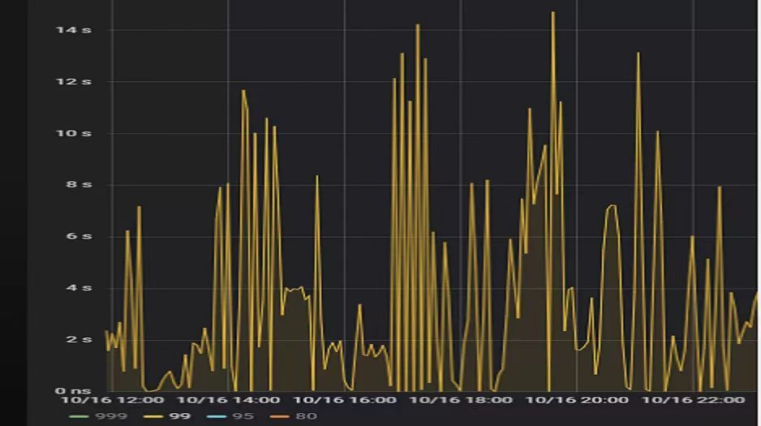

查看 TiDB 监控下的 KV Duration 明显升高，其中 KV Request Duration 999 by store 监控看到多个 TiKV 节点 Duration 均有上涨。

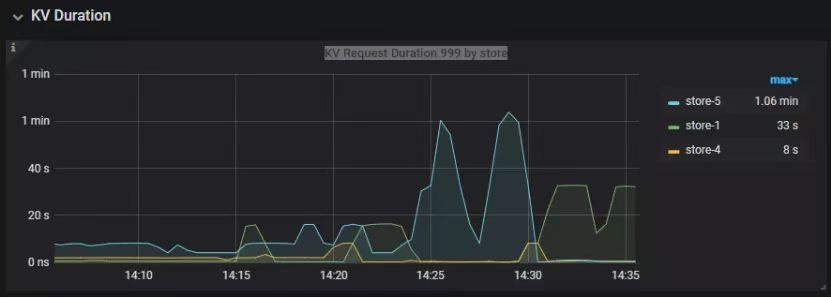

查看 TiKV 监控 Coprocessor Overview：

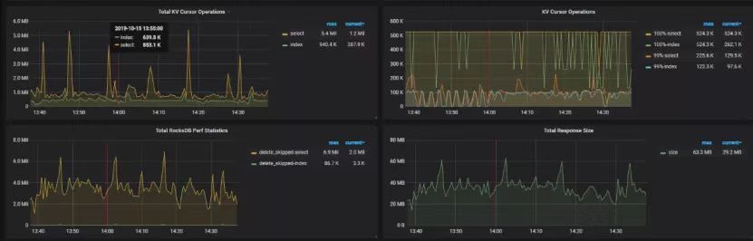

查看监控 Coprocessor CPU：

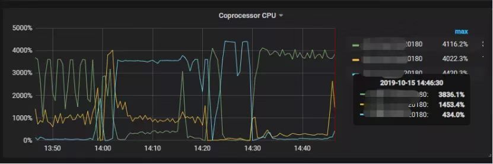

发现 Coprocessor CPU 线程池几乎打满。下面开始分析日志，调查 Duration 和 Coprocessor CPU 升高的原因。

[慢查询日志分析](#案例4 读热点导致 SQL 延迟增加/慢查询日志分析)

使用 `pt-query-digest`工具分析 TiDB 慢查询日志：

```
./pt-query-digest tidb_slow_query.log > result
```

分析慢日志解析出来的 TopSQL 发现 `Process keys`和 `Process time`并不是线性相关，`Process keys`数量多的 SQL 的 `Process time`处理时间不一定更长，如下面 SQL 的 `Process keys`为 22.09M，`Process time`为 51s。

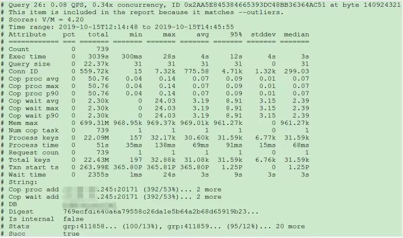

下面 SQL 的 `Process keys`为 12.68M，但是 `Process time`高达 142353s。

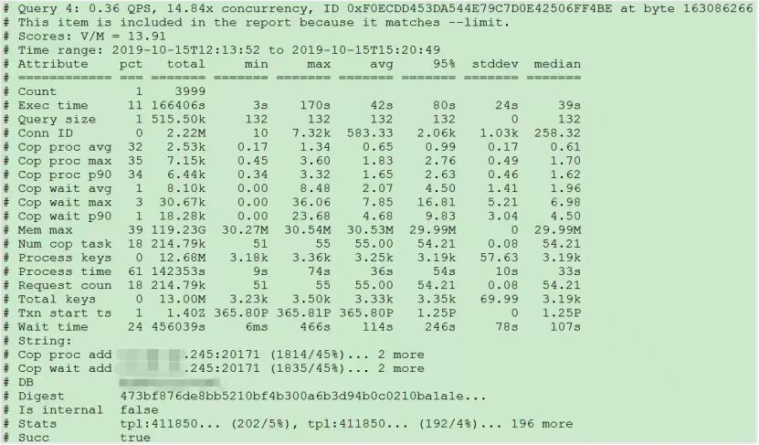

过滤 `Process time`较多的 SQL，发现 3 个典型的 `slow query`，分析具体的执行计划。

**SQL1**

```
select a.a_id, a.b_id,uqm.p_id from a join hsq on a.b_id=hsq.id join uqm on a.a_id=uqm.id;
```

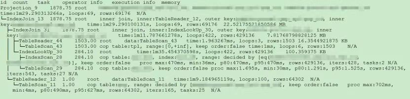

**SQL2**

```
select distinct g.abc, g.def, g.ghi, h.abcd, hi.jq   from ggg g left join ggg_host gh on g.id = gh.ggg_id left join host h on gh.a_id = h.id left join a_jq hi on h.id = hi.hid   where h.abcd is not null and h.abcd  <>  '' and hi.jq is not null and hi.jq  <>  '';
```

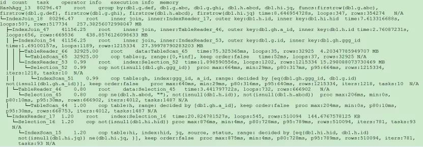

**SQL3**

```
select tb1.mt, tb2.name from tb2 left join tb1 on tb2.mtId=tb1.id where tb2.type=0 and (tb1.mt is not null and tb1.mt != '') and (tb2.name is not null or tb2.name != '');
```

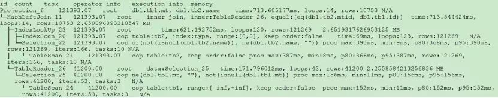

分析执行计划未发现异常，查看相关表的统计信息也都没有过期，继续分析 TiDB 和 TiKV 日志。

[常规日志分析](#案例4 读热点导致 SQL 延迟增加/常规日志分析)

查看 TiKV 日志中标记为 [slow-query] 的日志行中的 region 分布情况。

```
more tikv.log.2019-10-16-06\:28\:13 |grep slow-query |awk -F ']' '{print $1}' | awk  '{print $6}' | sort | uniq -c | sort –n
```

找到访问频率最大的 3 个 region：

```
73 29452
140 33324
757 66625
```

这些 region 的访问次数远远高于其它 region，之后定位这些 region 所属的表名。首先查看 [slow-query] 所在行记录的 table_id 和 start_ts，然后查询 TiDB 日志获取表名，比如 table_id 为 1318，start_ts 为 411837294180565013，使用如下命令过滤，发现是上述慢查询 SQL 涉及的表。

```
more tidb-2019-10-14T16-40-51.728.log | grep '"/[1318/]"' |grep 411837294180565013
```

[解决](#案例4 读热点导致 SQL 延迟增加/解决)

对这些 region 做 split 操作，以 region 66625 为例，命令如下（需要将 x.x.x.x 替换为实际的 pd 地址）。

```
pd-ctl –u http://x.x.x.x:2379 operator add split-region 66625
```

操作后查看 PD 日志

```
[2019/10/16 18:22:56.223 +08:00] [INFO] [operator_controller.go:99] ["operator finish"] [region-id=30796] [operator="\"admin-split-region (kind:admin, region:66625(1668,3), createAt:2019-10-16 18:22:55.888064898 +0800 CST m=+110918.823762963, startAt:2019-10-16 18:22:55.888223469 +0800 CST m=+110918.823921524, currentStep:1, steps:[split region with policy SCAN]) finished\""]
```

日志显示 region 已经分裂完成，之后查看该 region 相关的 slow-query：

```
more tikv.log.2019-10-16-06\:28\:13 |grep slow-query  | grep 66625
```

观察一段时间后确认 66625 不再是热点 region，继续处理其它热点 region。所有热点 region 处理完成后，监控 Query Summary - Duration 显著降低。

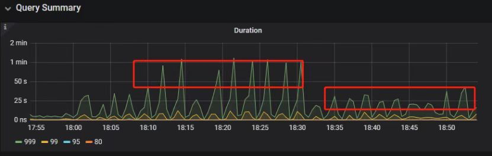

Duration 稳定了保持一段时间，18:55 之后仍然有较高的 Duration 出现：

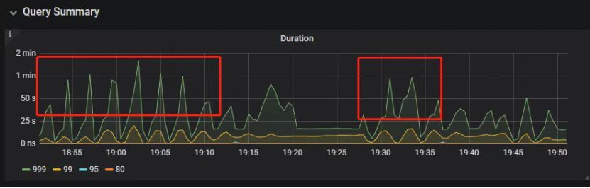

观察压力较重的 tikv，移走热点 region 的 leader：

```
pd-ctl –u http://x.x.x.x:2379 operator add transfer-leader 1 2 //把 region1 的 leader 调度到 store2
```

leader 迁走之后，原 TiKV 节点的 Duration 立刻下降，但是迁移到新 TiKV 节点的 Duration 随之上升。

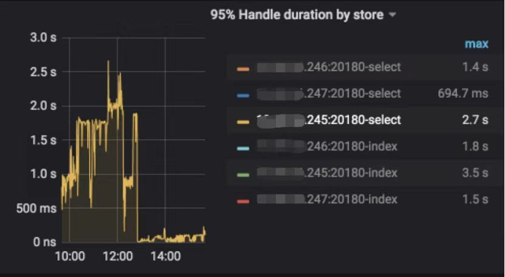

之后多次对热点 region 进行 split 操作，最终 Duration 明显下降并恢复稳定。

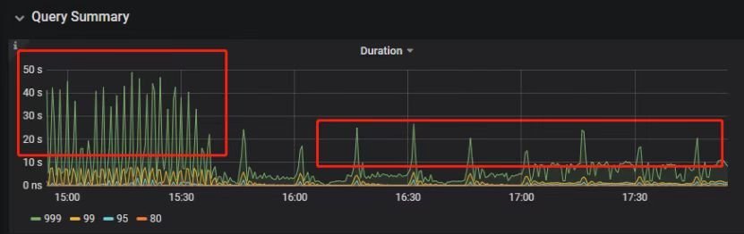

[案例总结](#案例4 读热点导致 SQL 延迟增加/案例总结)

对于分布式数据库的读热点问题，有时难以通过优化 SQL 的方式解决，需要分析整个 TiDB 集群的监控和日志来定位原因。严重的读热点可能导致部分 TiKV 达到资源瓶颈，这种短板效应限制了整个集群性能的充分发挥，通过分裂 region 的方式可以将热点 region 分散到更多的 TiKV 节点上，让每个 TiKV 的负载尽可能达到均衡，缓解读热点对 SQL 查询性能的影响。更多热点问题的处理思路可以参考 [TiDB 查询优化及调优系列（四）查询执行计划的调整及优化原理 ](https://pingcap.com/zh/blog/tidb-query-optimization-and-tuning-4)。

## 5、SQL 执行计划不准

SQL 执行时间突然变长

[分析](#案例5 SQL 执行计划不准/分析)

- SQL 语句

```
select count(*)
from   tods.bus_jijin_trade_record a, tods.bus_jijin_info b 
where   a.fund_code=b.fund_code  and a.type in   ('PURCHASE','APPLY')  
and   a.status='CANCEL_SUCCESS' and a.pay_confirm_status = 1 
and a.cancel_app_no   is not null and a.id >=    177045000  
and a.updated_at   > date_sub(now(), interval 48 hour) ;
```

执行结果，需要 1 分 3.7s：

```
mysql> select   count(*)
    -> from tods.bus_jijin_trade_record a,   tods.bus_jijin_info b 
    -> where a.fund_code=b.fund_code  and a.type in ('PURCHASE','APPLY')  
    -> and a.status='CANCEL_SUCCESS' and   a.pay_confirm_status = 1 
    -> and a.cancel_app_no is not null and   a.id >=  177045000  
    -> and a.updated_at >   date_sub(now(), interval 48 hour) ;
+----------+
| count(*) |
+----------+
|      708 |
+----------+
1   row in set (1 min 3.77 sec)
```

- 索引信息

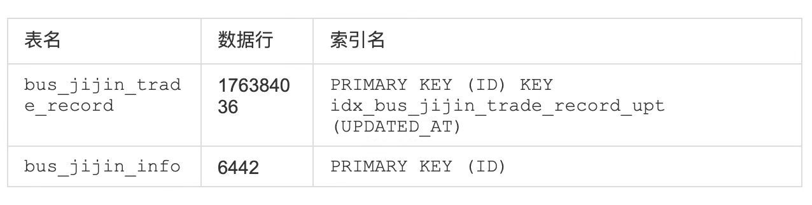

- 查看执行计划

```
mysql> explain 
    -> select count(*)
    -> from tods.bus_jijin_trade_record a,   tods.bus_jijin_info b 
    -> where a.fund_code=b.fund_code  and a.type in ('PURCHASE','APPLY')  
    -> and a.status='CANCEL_SUCCESS' and   a.pay_confirm_status = 1 
    -> and a.cancel_app_no is not null and   a.id >=  177045000  
    -> and a.updated_at >   date_sub(now(), interval 48 hour) ;
+----------------------------+--------------+------+-------------------------------------------------------------------------------------------------------------------------------------------------------------------+
| id                         | count        | task | operator info                                                                                                                                                     |
+----------------------------+--------------+------+-------------------------------------------------------------------------------------------------------------------------------------------------------------------+
| StreamAgg_13               | 1.00         | root | funcs:count(1)                                                                                                                                                    |
| └─HashRightJoin_27         | 421.12       | root | inner join, inner:TableReader_18, equal:[eq(a.fund_code, b.fund_code)]                                                                                            |
|   ├─TableReader_18         | 421.12       | root | data:Selection_17                                                                                                                                                 |
|   │ └─Selection_17         | 421.12       | cop  | eq(a.pay_confirm_status, 1), eq(a.status, "CANCEL_SUCCESS"), gt(a.updated_at, 2020-03-03 22:31:08), in(a.type, "PURCHASE", "APPLY"), not(isnull(a.cancel_app_no)) |
|   │   └─TableScan_16       | 145920790.55 | cop  | table:a, range:[177045000,+inf], keep order:false                                                                                                                 |
|   └─TableReader_37         | 6442.00      | root | data:TableScan_36                                                                                                                                                 |
|     └─TableScan_36         | 6442.00      | cop  | table:b, range:[-inf,+inf], keep order:false                                                                                                                      |
+----------------------------+--------------+------+-------------------------------------------------------------------------------------------------------------------------------------------------------------------+

TableScan_16，TableScan_36：表示在 TiKV 端分别对表 a 和 b 的数据进行扫描，其中 TableScan_16 扫描了 1.46 亿的行数；
Selection_17：表示满足表 a 后面 where 条件的数据；
TableReader_37： 由于表 b 没有独立的附加条件，所以直接将这部分数据返回给 TiDB；
TableReader_18：将各个 coprocessor 满足 a 表条件的结果返回给 TiDB；
HashRightJoin_27：将 TableReader_37 和 TableReader_18 上的结果进行 hash join；
StreamAgg_13：进一步统计所有行数，将数据返回给客户端；
```

可以看到语句中 a 表(bus_jijin_trade_record)的条件 id >= 177045000，和 updated_at > date_sub(now(), interval 48 hour)上，这两个列分别都有索引，但是 TiDB 还是选择了全表扫描。

按照上面两个条件分别查询数据分区情况

```
mysql> SELECT COUNT(*) FROM tods.bus_jijin_trade_record WHERE id >= 177045000 ;
+-----------+
| COUNT(*)  |
+-----------+
| 145917327 |
+-----------+
1 row in set (16.86   sec)

mysql> SELECT COUNT(*) FROM tods.bus_jijin_trade_record WHERE updated_at > date_sub(now(), interval 48 hour)  ;
+-----------+
|  COUNT(*) |
+-----------+
|    713682 |
+-----------+
```

可以看到，表 bus_jijin_trade_record 有 1.7 亿的数据量，应该走 updated_at 字段上的索引。 使用强制 hint 进行执行，6.27 秒就执行完成了，速度从之前 63s 到现在的 6.3s，提升了 10 倍。

```
mysql> select   count(*)
    -> from tods.bus_jijin_trade_record a   use index(idx_bus_jijin_trade_record_upt), tods.bus_jijin_info b 
    -> where a.fund_code=b.fund_code  and a.type in ('PURCHASE','APPLY')  
    -> and a.status='CANCEL_SUCCESS' and   a.pay_confirm_status = 1 
    -> and a.cancel_app_no is not null and   a.id >=  177045000  
    -> and a.updated_at >   date_sub(now(), interval 48 hour) ;
+----------+
| count(*) |
+----------+
|      709 |
+----------+
1 row in set (6.27   sec)
```

强制 hint 后的执行计划：

```
mysql> explain 
    -> select count(*)
    -> from tods.bus_jijin_trade_record a   use index(idx_bus_jijin_trade_record_upt), tods.bus_jijin_info b 
    -> where a.fund_code=b.fund_code  and a.type in ('PURCHASE','APPLY')  
    -> and a.status='CANCEL_SUCCESS' and   a.pay_confirm_status = 1 
    -> and a.cancel_app_no is not null and   a.id >=  177045000  
    -> and a.updated_at >   date_sub(now(), interval 48 hour) ;
+------------------------------+--------------+------+----------------------------------------------------------------------------------------------------------------------------+
| id                           | count        | task | operator info                                                                                                              |
+------------------------------+--------------+------+----------------------------------------------------------------------------------------------------------------------------+
| StreamAgg_13                 | 1.00         | root | funcs:count(1)                                                                                                             |
| └─HashRightJoin_24           | 421.12       | root | inner join, inner:IndexLookUp_20, equal:[eq(a.fund_code, b.fund_code)]                                                     |
|   ├─IndexLookUp_20           | 421.12       | root |                                                                                                                            |
|   │ ├─Selection_18           | 146027634.83 | cop  | ge(a.id, 177045000)                                                                                                        |
|   │ │   └─IndexScan_16       | 176388219.00 | cop  | table:a, index:UPDATED_AT, range:(2020-03-03 23:05:30,+inf], keep order:false                                              |
|   │ └─Selection_19           | 421.12       | cop  | eq(a.pay_confirm_status, 1), eq(a.status, "CANCEL_SUCCESS"), in(a.type, "PURCHASE", "APPLY"), not(isnull(a.cancel_app_no)) |
|   │   └─TableScan_17         | 146027634.83 | cop  |   table:bus_jijin_trade_record, keep order:false                                                                           |
|   └─TableReader_31           | 6442.00      | root | data:TableScan_30                                                                                                          |
|     └─TableScan_30           | 6442.00      | cop  | table:b, range:[-inf,+inf], keep order:false                                                                               |
+------------------------------+--------------+------+----------------------------------------------------------------------------------------------------------------------------+
```

使用 hint 后的执行计划，预估 updated_at 上的索引会扫描 176388219，没有选择索引而选择了全表扫描，可以判定是由于错误的统计信息导致执行计划有问题。

查看表 `bus_jijin_trade_record`上的统计信息。

```
mysql> show   stats_meta where table_name like 'bus_jijin_trade_record' and db_name like   'tods';
+---------+------------------------+---------------------+--------------+-----------+
| Db_name | Table_name             | Update_time         | Modify_count | Row_count |
+---------+------------------------+---------------------+--------------+-----------+
| tods    | bus_jijin_trade_record | 2020-03-05 22:04:21 |     10652939 | 176381997 |
+---------+------------------------+---------------------+--------------+-----------+

mysql> show   stats_healthy  where table_name like   'bus_jijin_trade_record' and db_name like 'tods';
+---------+------------------------+---------+
| Db_name | Table_name             | Healthy |
+---------+------------------------+---------+
| tods    | bus_jijin_trade_record |      93 |
+---------+------------------------+---------+
```

根据统计信息，表 `bus_jijin_trade_record`有 176381997，修改的行数有 10652939，该表的健康度为：(176381997-10652939)/176381997 *100=93。

[解决](#案例5 SQL 执行计划不准/解决)

重新收集统计信息

```
mysql> set   tidb_build_stats_concurrency=10;
Query OK, 0 rows   affected (0.00 sec)

#调整收集统计信息的并发度，以便快速对统计信息进行收集 
mysql> analyze   table tods.bus_jijin_trade_record;
Query OK, 0 rows   affected (3 min 48.74 sec)
```

查看没有使用 hint 语句的执行计划

```
mysql> explain   select count(*)
  -> from tods.bus_jijin_trade_record a,   tods.bus_jijin_info b 
  -> where a.fund_code=b.fund_code  and a.type in ('PURCHASE','APPLY')  
  -> and a.status='CANCEL_SUCCESS' and   a.pay_confirm_status = 1 
  -> and a.cancel_app_no is not null and   a.id >=  177045000  
  -> and a.updated_at >   date_sub(now(), interval 48 hour) ;;
+------------------------------+-----------+------+----------------------------------------------------------------------------------------------------------------------------+
| id                           | count     | task | operator info                                                                                                              |
+------------------------------+-----------+------+----------------------------------------------------------------------------------------------------------------------------+
| StreamAgg_13                 | 1.00      | root | funcs:count(1)                                                                                                             |
| └─HashRightJoin_27           | 1.99      | root | inner join, inner:IndexLookUp_23, equal:[eq(a.fund_code, b.fund_code)]                                                     |
|   ├─IndexLookUp_23           | 1.99      | root |                                                                                                                            |
|   │ ├─Selection_21           | 626859.65 | cop  | ge(a.id, 177045000)                                                                                                        |
|   │ │   └─IndexScan_19       | 757743.08 | cop  | table:a, index:UPDATED_AT, range:(2020-03-03 23:28:14,+inf], keep order:false                                              |
|   │ └─Selection_22           | 1.99      | cop  | eq(a.pay_confirm_status, 1), eq(a.status, "CANCEL_SUCCESS"), in(a.type, "PURCHASE", "APPLY"), not(isnull(a.cancel_app_no)) |
|   │   └─TableScan_20         | 626859.65 | cop  | table:bus_jijin_trade_record, keep order:false                                                                             |
|   └─TableReader_37           | 6442.00   | root | data:TableScan_36                                                                                                          |
|     └─TableScan_36           | 6442.00   | cop  | table:b, range:[-inf,+inf], keep order:false                                                                               |
+------------------------------+-----------+------+----------------------------------------------------------------------------------------------------------------------------+
9 rows in set (0.00   sec)
```

可以看到，收集完统计信息后，现在的执行计划走了索引扫描，与手动添加 hint 的行为一致，且扫描的行数 757743 符合预期。

此时执行时间变为 1.69s ，在执行计划没变的情况下，应该是由于缓存命中率上升带来的提升。

```
mysql> select   count(*)
    -> from tods.bus_jijin_trade_record a,   tods.bus_jijin_info b 
    -> where a.fund_code=b.fund_code  and a.type in ('PURCHASE','APPLY')  
    -> and a.status='CANCEL_SUCCESS' and   a.pay_confirm_status = 1 
    -> and a.cancel_app_no is not null and   a.id >=  177045000  
    -> and a.updated_at >   date_sub(now(), interval 48 hour) ;
+----------+
| count(*) |
+----------+
|      712 |
+----------+
1 row in set (1.69   sec)
```

[案例总结](#案例5 SQL 执行计划不准/案例总结)

可以看出该 SQL 执行效率变差是由于统计信息不准确造成的，在通过收集统计信息之后得到了正确的执行计划。

从最终结果 712 行记录来看，创建联合索引可以更大的降低扫描数据的量，更进一步提升性能。在性能已经满足业务要求情况下，联合索引会有额外的成本，留待以后尝试。