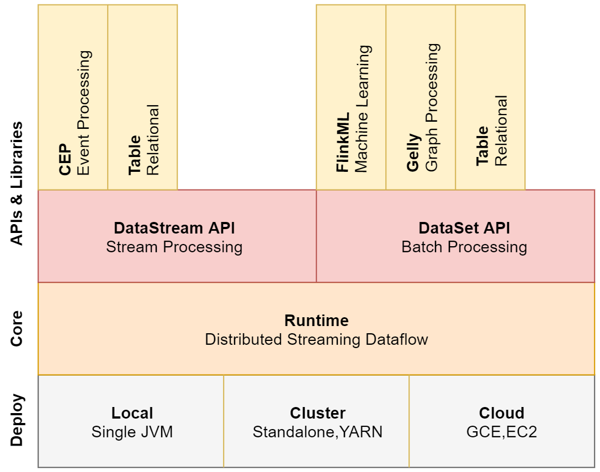
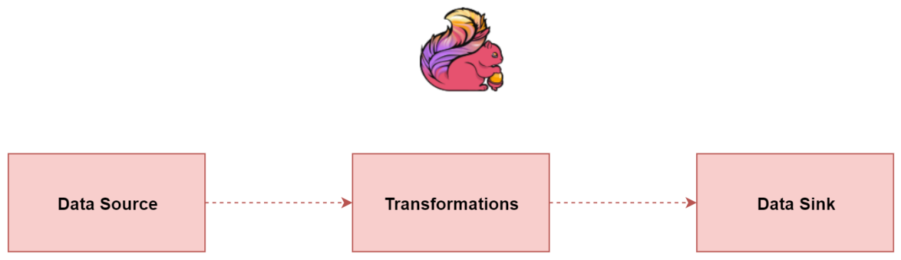
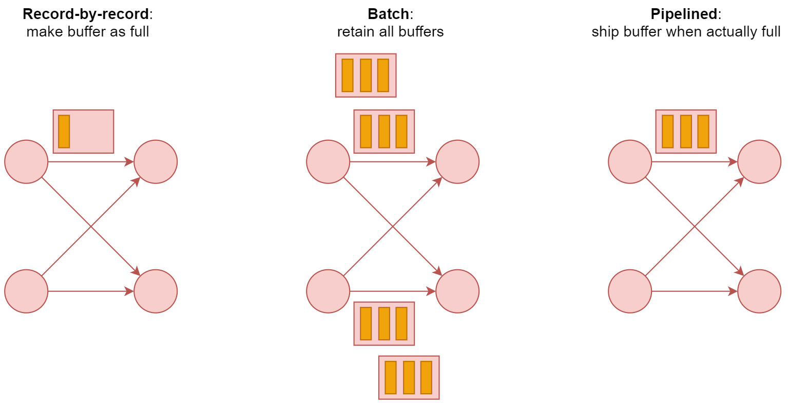

# Flink基本概念

## 什么是Flink

Flink是一个开源的分布式、高可用、高性能、准确的流式处理框架；

- 高可用：Flink的稳定性和可用性比较好；

- 高性能：Flink的处理性能比较好；

- 准确：Flink可以保证处理数据的准确性；

Flink支持流处理和批处理，Flink中的批处理是流处理的一个特例；

## Flink架构图

Flink支持的部署方式：Local部署、Cluster部署（Standlone，YARN）、Cloud部署（GCE、EC2）;

分布式的流处理引擎是Flink的核心 ；

DataStream API：支持复杂事件处理（CEP），Table操作，SQL操作；

DataSet API：支持Flink ML机器学习计算，Gelly图计算，Table操作，SQL操作；

## Flink三大核心组件

- Data Source：数据源，用于接收数据；
- Transformations算子：用于处理数据；
- Data Sink：用于输出数据，将计算好的数据输出到其他介质；

## 流处理产品对比

Storm只支持流处理，MapReduce、Spark只支持批处理，Spark Streaming是Spark之上支持流处理的子系统，看似是一个特例，但实际Spark Streaming本质上还是一个批处理系统；

> Spark Streaming（微批）采用的是micro-batch架构，就是**将输入的数据流切分成更细粒度的batch**，并为每个batch提交一个批处理的Spark任务；

| 产品     | Storm         | SparkStreaming | Flink        |
| :------- | :------------ | :------------- | :----------- |
| 模型     | Native        | Mirco-Batch    | Native       |
| API      | 组合式        | 声明式         | 声明式       |
| 语义     | At-least-once | Exectly-once   | Exectly-once |
| 容错机制 | Ack           | Checkpoint     | Checkpoint   |
| 状态管理 | 无            | 基于DStream    | 基于操作     |
| 延时     | Low           | Medium         | Low          |
| 吞吐量   | Low           | High           | High         |

解释：
Native：表示来**一条数据处理一条数据**；
Mirco-Batch：表示划分小批，一小批一小批的处理数据；

组合式：表示是**基础API**，例如实现一个求和操作都需要写代码实现，比较麻烦，代码量会比较多。
声明式：表示提供的是**封装后的高阶函数**，例如filter、count等函数，可以直接使用，比较方便，代码量比较少。

## Flink的流处理和批处理

在执行引擎这一层，流处理系统与批处理系统最大的不同在于**节点之间的数据传输方式**。
对于一个**流处理系统**，其节点间数据传输的标准模型（**一条一条处理**）是：当一条数据被处理完成后，序列化到缓存中，**然后立刻通过网络传输到下一个节点**，由下一个节点继续处理；

而对于一个批处理系统，其节点间数据传输的标准模型是：当一条数据被处理完成后，序列化到缓存中，**并不会立刻通过网络传输到下一个节点，当缓存写满的时候，就持久化到本地硬盘上，当所有数据都被处理完成后，才开始将处理后的数据通过网络传输到下一个节点**。

这两种数据传输模式是两个极端，对应的是流处理系统对低延迟的要求和批处理系统对高吞吐量的要求；

Flink的执行引擎采用了一种十分灵活的方式，**同时支持了这两种数据传输模型**
Flink**以固定的缓存块为单位**进行网络数据传输，用户可以通过**缓存块超时值**指定缓存块的传输时机。

- 如果**缓存块的超时值为0**，则Flink的数据传输方式类似前面所说的流处理系统的标准模型，此时系统可以获得最低的处理延迟；
- 如果**缓存块的超时值为无限大**，则Flink的数据传输方式类似前面所说的批处理系统的标准模型，此时系统可以获得最高的吞吐量；

这样就比较灵活了，其实底层还是流式计算模型，批处理只是一个极限特例而已。
看一下这个图中显示的三种数据传输模型

## 实时计算框架如何选择

1：需要关注流数据是否需要进行**状态管理**；

2：消息语义是否有特殊要求At-least-once或者Exectly-once；

3：小型独立的项目，需要低延迟的场景，建议使用Storm；

4：如果项目中已经使用了Spark，并且**秒级别的实时处理**可以满足需求，建议使用SparkStreaming；

5：要求消息语义为Exectly-once，数据量较大，要求高吞吐低延迟，需要进行状态管理，建议选择Flink；

