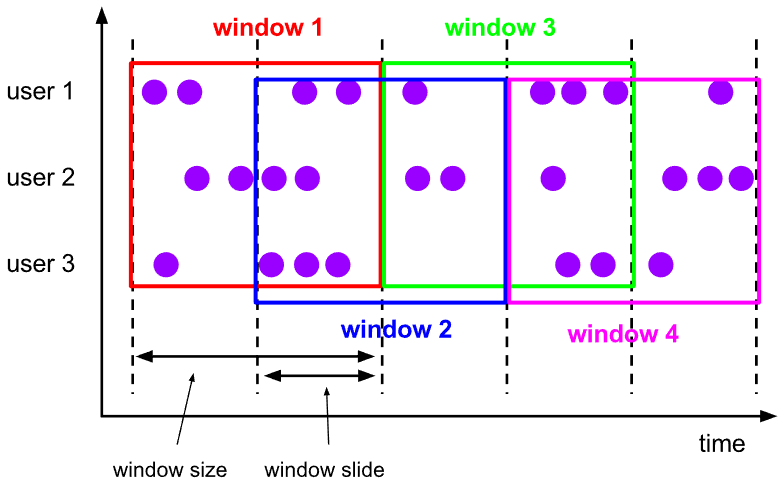
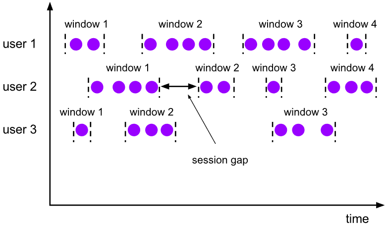
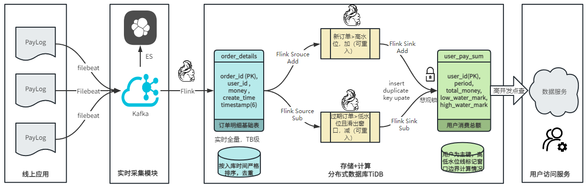
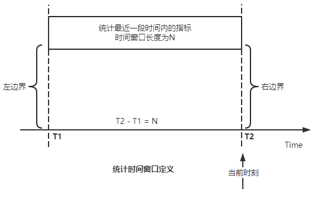
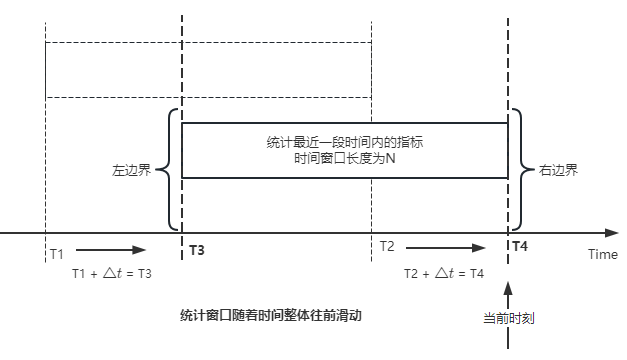
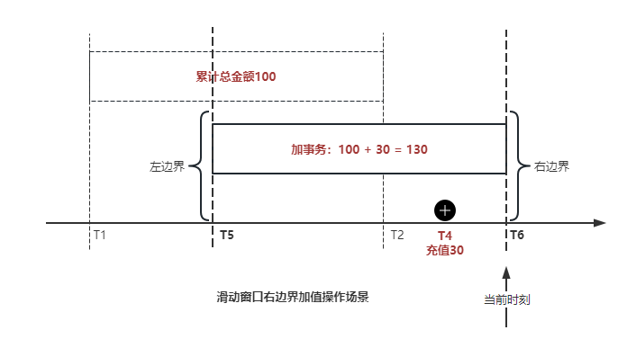
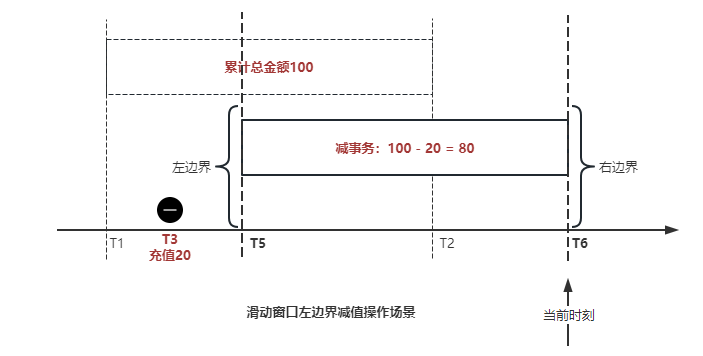
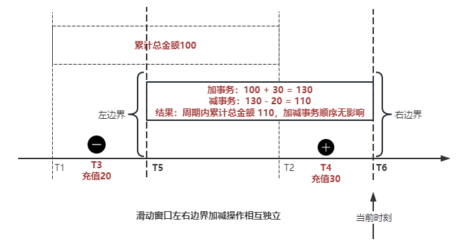
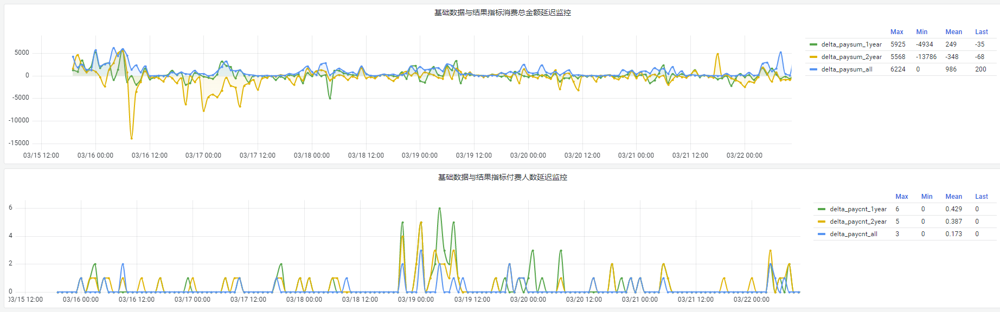

# 前言

原文地址：[基于TiDB+Flink实现的滑动窗口实时累计指标算法](https://tidb.net/blog/0a76a3ae?_gl=1*3oy1j0*_ga*NjEyOTY1OTE1LjE2NjE3NjI2NDA.*_ga_D02DELFW09*MTcwNjQzNzA5MS4yMDMuMC4xNzA2NDM3MDkxLjAuMC4w)

在不少的支付分析场景里，大部分累计值指标可以通过 T+n 的方式计算得到 。随着行业大环境由增量市场转为存量市场，产品的运营要求更加精细化、更快速反应，这对各项数据指标的实时性要求已经越来越高。产品如果能实时把握应用的整体运行情况或特征用户的状态，就可以及时安排合理的市场营销活动，这对改善用户的体验和促进收益的增长有明显的帮助。

# 需求指标

有一个场景为了进一步优化营销活动内容，希望我们实时提供每个玩家在最近 1 年、2 年、5 年、10 年内的实时消费总金额。

要实时计算每个玩家最近 N 年的实时消费累计总金额，一方面要考虑到这个指标随着时间推进它可能在不断增加，另一方面会有数据过期了而不再属于这个统计周期内，要及时减去，从而维护一个动态的累计值。

这里的每一个用户的“最近 N 年”指标是不断前进的，涉及到产品上线以来的全部用户，其累计的用户量、支付数据都在亿级别以上，且明确要求实时统计历史数据。综合分析下来，解决该问题具有一定的挑战性。

在经过充分调研和分析后，基于实时计算框架 Flink 和分布式数据库 TiDB 的组合使用，我们提出了一种实时计算滑动窗口内累计指标的算法，在一个数据库里同时支持实时 OLAP 计算和 OLTP 数据服务，有效地解决了这个问题，目前已经在线上稳定服务了一段时间。下面给大家分享下我们的思考和实践。

# 数据特点

首先我们先从整体上评估下数据的特点，分析一下数据规模、有哪些关键问题对我们的计算有影响。

## 数据概况

- 基础数据量大，存在乱序、重复等问题
  - 数据源历史数据量较大，亿级别；日增日志数据在百万级别
  - 原始日志数据打印在不同应用机器上，没有集中统一存储，分散
  - 由于业务有等待逻辑，业务时间字段存在乱序问题，即先产生的数据的日志打印时间可能晚于后产生的数据的打印时间，时间乱序的数据如果不及时处理可能会出现漏算的情况
  - 由于业务有重试机制，相同的日志数据可能重复出现，数据重算会导致结果错误
- 聚合指标要求支持高并发访问
  - 最终的结果指标要求支持 TP 服务访问，且满足高并发场景

线上的应用部署在不同的机器上，先后请求的数据的业务时间和日志打印时间，可能是乱序的，这会导致我们需要解决数据排序的问题。且由于业务存在请求重试逻辑，数据也有可能是重复的，需要设计好去重机制。

## 实现重难点

- 保证计算的实时性、准确性
  - 需要处理数据乱序问题，使其有序，然后实时监听数据在分别进入统计周期开始边界、结束边界的变化情况，准确在累计值上执行加、减操作
- 计算的事务性
  - 在对同一个用户的累计指标执行加、减操作时，要严格保证每个操作的原子性和隔离性
  - 此外，还要保证不同用户之间的操作也是事务隔离的
- 累计指标可重入
  - 数据经过统计窗口边界时，有且仅有一次被计算，需要处理原始数据重复问题
  - 程序重启时数据计算结果应该保持不变，指标的值不会变多，也不会变少，即保证重入

主要的问题在于对于统计最近一段时间内的值，这个“最近”是实时变化的，即统计区间的开始、结束时间点也是实时变化的，这个问题可能就比较复杂了，需要严格保证每个操作的原子性和隔离性，而且每笔数据不能重复算也不能漏算，否则就会出现数据错误。

# 可选算法

## 实时统计

该方案是指，当查询某个用户最近 N 年的累计值的请求发送过来时，直接到数据库统计得到结果，可以理解为是一个用户级的实时 AP 操作。这种方法在良好的表设计、索引设计下，大部分场景在秒级别可以完成查询，在并发高时数据库资源很容易出现算力瓶颈，导致服务不稳定，业务受影响。

- 优点
  - 方案简单，实现容易
  - 能获取到准确的指标结果
- 缺点
  - 由业务方维护计算的方法，访问和计算是同时进行的，没有做到分离
  - 数据库要有实时高并发的 AP 能力，对数据库要求过高
  - 计算全部依托于数据库，IO、CPU等资源容易出现瓶颈
  - 高并发时服务不稳定

总的来说，实时统计这个算法实现起来相对简单，但服务容易因算力问题影响，实时性不能保证，尤其是高并发场景容易出现问题，线上实时数据服务慎用该策略。

## 全量缓存+实时增量

该方案提前将全部用户的最近 N 年的累计值算好，并缓存起来，业务方可以实时读取这个缓存，也能支持高并发实时响应。然后计算侧根据实时变化的情况，更新每个用户指标值。如果是在统计周期内用户有新增数据，则在缓存值基础上累加，如果在统计周期内有用户的数据过期了，则在缓存值的基础上减去。总之，总是维护好用户的实时累计值。

- 优点
  - 支持实时高并发读取
  - 业务访问和计算分离，访问延迟低
- 缺点
  - 实时维护缓存，要引入额外的机制保障数据更新的事务性
  - 容易出现读写冲突问题
  - 数据没有落地，故障或宕机时数据丢失风险高
  - 计算复杂，且不可重入

实时全量缓存方案，解决了实时全量统计的实时性和高并发访问的问题，但是也带来了数据操作的事务性、安全性等问题，有一定的可取之处，但缺点也很明显。

## 全量持久化+实时增量

考虑到业务侧是 OLTP 的访问特性，要求支持低延迟高并发，提供点查的方式才是最高效的。

该方案在数据初始化时先提前算好全部用户的累计值，并存储到关系型数据库，再基于数据库的基量数据进行实时的增量更新操作。如果是在统计周期内用户有新增数据，则在基量值上累加，如果在统计周期内有用户的数据过期了，则在基量值上减去，一直基于实时的变化量来维护最新的累计值。

- 优点
  - 支持实时高并发读取
  - 业务访问和计算分离，访问延迟低
  - 数据存储在数据库，保存有最新的数据状态，能保证数据安全和事务性，进而能保证计算是可重入的
- 缺点
  - 计算复杂，程序维护成本较高
  - 数据库要求高，必须能存储大量数据且支持高并发访问，且能应对未来的业务增长量

综合考虑之后，我们选用了全量持久化+实时增量的方案。

目前业界领域内处理实时数据的技术工具，选用 Flink 应该是毫无疑义的。数据库方面选型，我们需要考虑下面的场景：

- 首先要求数据库具有灵活的扩展性，必须能存储数以亿计的历史数据，且能应对还在不断增长的数据规模
- 其次要支持良好的事务特性，这一方面支持最好的就是关系型数据库，要能保证数据操作时的事务隔离
- 同时在高并发场景下保证读、写互不影响，支持业务高并发访问

满足这些苛刻要求的数据库其实不多，分布式数据库 TiDB 就是其中一个非常优秀的选项 ，它能很好地满足上面的场景需求。

# 数据模型

我们计算用户最近 N 年的累计值，这里有两个关键要素，一个是统计时间周期，一个是用户。

下面我们以统计时间周期为分析切入点，引入时间窗口来解决我们的统计问题。

## 时间窗口定义

一段固定长度的时间区间，即我们需求里说的“最近 N 年”，我们可以称其为一个时间窗口。如果一个时间窗口支持随着时间变化，那这个窗口就是动态变化的，根据动态变化的情况会有许多细分的窗口类型，用以解决不同场景的问题。下面主要介绍和我们业务相关度较高的滑动窗口和会话窗口。

#### 滑动窗口

滑动窗口是固定长度的时间窗口，随着时间变化以一定的频率前进，它们之间允许有重叠。 滑动窗口的滑动距离（window slide）可以控制生成新窗口的频率。 如果 slide 小于窗口大小，不同的滑动窗口会有部分重叠。这种情况下，一个数据点可能被多个窗口包含在内。

如上图所示，比如我们设置了窗口的大小为 10 分钟，每 5 分钟滑动一次，则会在每 5 分钟后得到一个新的窗口， 且新窗口会包含一部分在之前的窗口里出现过的数据。

在滑动时间窗口中，我们通常要选择窗口大小和滑动步长。窗口大小指的是每个子时间段的长度，而滑动步长则指的是相邻子时间段之间的时间间隔。根据具体的场景，我们可以调整窗口大小和滑动步长，使得滑动时间窗口更好地适应不同的数据流处理需求。

这个数据模型，很符合我们的统计最近 N 年的实时累计值的场景。“最近 1 年”、“最近 2 年”、“最近 5 年”、“最近 10 年”就是我们的窗口大小，滑动步长是实时，这里为了分析方便，我们每 1 分钟滑动一次，即每分钟都会产生一个最近 N 年的滑动窗口。

#### 会话窗口

与滑动窗口不同，会话窗口会为活跃数据创建窗口，会话窗口不会相互重叠，没有固定的开始或结束时间。我们可以设置固定的会话间隔（session gap）来定义多长时间算作不活跃。 当超出了不活跃的时间段，当前的窗口就会关闭，并且将接下来的数据分发到新的会话窗口。

在我们的场景，相当于对每个用户维护一个永远不关闭的会话窗口，方便实时监听“最近”的情况，但会话窗口的开始时间不好跟随时间变化而动态设置。同时考虑到我们要分析的数据量在百万级以上，要实时维护这么多的会话窗口，资源消耗会比较多，难度会比较大。所以，会话窗口不合适我们的计算场景。

综合考虑后，我们选择了滑动窗口模型来开展我们的计算。这种处理技术常用于实时数据分析和流媒体处理中。它可以帮助我们对数据流中的信息进行实时监听并分析，能够快速响应数据流的变化。

# 业务实现

## 处理流程

整个处理数据流，过程大致如下：

- 1.数据实时采集
  - 线上应用在不同机器上部署，实时产生日志数据，通过 Filebeat 采集并汇总数据流写入到 Kafka 中
- 2.借助 TiDB 关系型数据库的特性解决数据乱序、重复问题，生成基础数据
  - 设计合理的业务唯一键，给每一行数据设置一个精确到微秒的入库时间（create_time timestamp(6)，CT），在我们的业务场景，能得全部入库数据按 CT 字段严格有序
  - 同时，利用 TiDB 的唯一键特性对重复的数据去重
  - Flink 消费 Kafka，将经过 ETL 后基础数据实时写入到 TiDB 中生成基础数据表，供后续计算、数据校验、监控使用
- 3.数据指标的持久化和可重入计算
  - 对 TiDB 的结果指标表设置用户维度的主键，同时设置每个用户在滑动窗口左、右边界已消费的数据的 CT 水位线，保证计算可重入要求，即经过窗口边界的数据只会计算一次
  - Flink 双 Source 读取按 CT 切片的开始边界、结束边界的数据，用双 Sink 分别负责指标的加、减。TiDB 集群事先设置为悲观锁事务模式，Flink 作业在 Sink 时执行串行的 INSERT ON DUPLICATE KEY UPDATE 语句完成累计值的加、减操作，可以保证操作事务的原子性、隔离性。经过调优上线后，该方式在我们的计算场景里也有不错的性能，能满足业务需求。
- 4.计算和对外访问同时服务
  - 利用 TiDB 写操作不阻塞读的特性，在计算的同时数据也在实时对外服务，不影响线上服务可用性
  - 用户是我们表的主键，而产品访问时是对用户的点查，所以我们的方案具备非常高的并发访问性能，远超过业务峰值。

下面详细描述具体的计算过程。

## 滑动窗口计算

#### 窗口建模

基于滑动窗口模型，结合我们的数据特性，定义了一个滑动的统计时间窗口，如下图。

最近 N 年的统计周期长度，由统计区间的开始时间 T1 （左边界） 和 T2 （右边界）共同决定，时间长度 N = T2 - T1 始终保持固定，即左右边界的间隔是固定不变的。

窗口的右边界 T2 随着时间变化，不断实时向前滑动，同时也牵引着整个窗口向前滑动。如下图所示，我们设定固定的前进频率为 Delta t ，窗口随该频率不断向前滑动，前进的步调频率最快可以到秒级，但是为了保证读取到的数据稳定性以及应对上游数据可能存在延迟的情况，我们通常设置为 30 秒或 1 分钟。

#### 基础数据处理

读取到线上日志数据写入到 TiDB 中生成基础数据时，我们借助 TiDB 关系型数据库的特性，解决数据排序、重复的问题。

- 通过提前设计合理的业务唯一键，Flink Sink 时用 INSERT INGORE 方式写入数据， 遇到相同的数据只会写入一行，达到去重的目的
- 同时，设置一个精确到微秒的入库时间字段（create_time timestamp(6)，下文简称 CT），在我们的业务场景里数亿行数据全部入库，每一行数据都能做到按 CT 字段有序递增。

TiDB 不仅解决了海量数据的存储，还保证了优秀的读写性能。上游业务可以保证相同用户在同一时刻不会出现支付多笔的情况，为了防止极端情况的出现，Flink 使用串行 Sink 的方式写入基础数据，经过对几十亿行历史日志数据的重放入库验证，每一行数据都有严格的递增入库时间，可以保证其单调递增特性，同时也能达到万级的写入QPS性能。这是我们下面按时间切片来计算的关键所在。

#### 窗口内累计值计算

##### 1.计算流设计

为了保证同一个用户在相同步调下执行操作，我们起一条 Flink 计算流，流里设置两个 Source 和两个 Sink 分别负责指标累计值的加、减操作，Sink 时借助 TiDB 的悲观事务特性，整个过程可以保证操作的事务性和计算可重入。

- 这两个 Source 读取数据的时间点，分别指向统计时间窗口的左、右边界。指向右边界的指针负责用户累计金额的加操作，指向左边界的指针负责用户累计金额的减操作，它们使用相同的步调随着时间推进。
- 假设有一个用户他每个时刻都有充值行为，那么随着时间推进，“最近 N 年”这个时间窗口也在不断推进，窗口的右边界是实时前进的，就会不断有新数据进来，计算累计值则需要不断加；窗口的左边界也在往前走，滑出左边界的数据就过期了、不在这个统计周期内了，所以左边界的指针就需不断减去这些值。

在写入数据的时候，如果是首次计算则需要插入，如果不是首次写入则要求更新多列，于是我们使用了 INSERT ON DUPLICATE KEY UPDATE 方式执行加、减的操作，同时为了避免锁冲突而影响写效率，设置单线程串行的 Sink 行为。

##### 2.结果指标表设计

为了保证可重入和 Exactly Once 要求，即经过窗口边界的数据只计算一次。我们在 TiDB 数据库层面，在结果指标表内，我们通过对每个用户的指标设置两个水位线字段，分别标识最近一次的已经执行过的左边界、右边界数据。

- 以用户为维度，每个用户指标都有 low_water_mark 和 high_water_mark 这两个水位线时间来做标记这个累计指标的计算状态，它们来自基础数据表的入库时间。用户指标的 high_water_mark 与 low_water_mark 和 Flink 作业里窗口的左边界和右边界不太一样，作业里的左右边界时间是和真实世界一样的绝对时间 （True Time），而它们是业务上的逻辑时间，所以它们之间时间跨度，是可以超过窗口的长度的，这样以保证能统计到完整周期的指标。
- 作业右边界指针读到的数据是最新的，要执行加操作，当在结果指标表没有该用户时（high_water_mark 为 null ）说明是首次充值可以直接加，且同时设置该 CT 为其 low_water_mark 和 high_water_mark； 如果该用户有在表里了则要求其 CT 大于 high_water_mark 才可以累加进去，否则不累加，累计进去的同时更新 high_water_mark 为当前 CT，以保证同一条数据的计算可重入，不会出现重复加的问题。
- 左边界指标读到的数据是统计周期内过期的数据，目标是减去，原始数据的有序性保证了经过左边界的数据一定已经经过右边界，即一定已经完成了加的操作，所以不存在结果指标表没有该用户时的情况，为了避免重复减的问题，要求过期数据的 CT 小于统计周期开始时间且大于 low_water_mark 才执行减操作，同时更新 low_water_mark 为当前 CT。如果 CT 小于等于 low_water_mark 说明已经执行过减操作，不需要重复操作。

利用 TiDB 写操作不阻塞读的特性，不管计算任务多么繁忙，只要不影响数据库性能，那线上服务都可以实时读到最新的结果指标，不会影响线上服务可用性，这一点也是 TiDB 非常优秀的地方。

##### 3.典型场景分析

下面我们通过不同场景来阐述该算法。

1）如上图所示，窗口在前一个统计窗口内容累计总金额值为 100，在经过一次滑动后，有一笔充值金额为 30 的新订单进入了统计周期内，体现在这笔订单的入库时间小于当前窗口的右边界，那么我们的计算 FLink 作业就能读取到该值，并在相应用户的累计值上执行加操作，得到实时的最近 N 年累计总充值指标。

2）同理，如下图，如果是有一笔数据随着窗口滑动而过期了，此时这笔订单的入库时间在最近 N 年之前，我们的计算 FLink 作业就能读取到该值，并在相应用户的累计值上执行减操作，得到实时的最近 N 年累计总充值指标。

3）更复杂的计算场景，如下图，如果随着窗口滑动同时有新数据进入，也有旧数据过期，那么流里设置的两个 Source 和两个 Sink 分别负责指标累计值的加、减操作。由于基础数据源是严格有序的和在 Sink 时设置了串行操作，同时我们将加、减操作放在了 TiDB 内执行，而 TiDB 具有优秀的事务机制保证，所以我们左、右边界的操作是相互独立的事务，互不影响。如果同时有多条新数据、多条过期数据，基础数据的有序性和 Sink 的事务性也可以保证数据的正常处理。

# 应用与总结

- 日志数据通过 Flink ETL 后写入到 TiDB 基础表，借助设置到微秒级别的入库时间，经过验证，在我们业务场景的数十亿行数据能能做到单调递增，这为我们后面的计算打下了关键性的基础
- 计算流首次启动时要处理历史数据，要设置好窗口的左右边界，假设要统计最近 1 年的累计消费金额，则需要手动指定右边界的 Source 起点为 365 天前，左边界的 Source 起点为 730 天前（左右边界共同决定统计窗口的长度）。设置 2 年、3 年、5 年、10 年的场景依此类推。
  - 在跑历史数据时，计算流的串行处理速度可以达到万级QPS，证明 TiDB 和 Flink 有非常优秀的计算能力
  - 历史数据量大，初始化耗时通常较久，一个优化的方法是基于历史日志数据，使用离线统计的方式一次性先算好基量指标，然后 Flink 作业再基于此结果来计算。这可以大大缩短指标首次上线、故障恢复、数据重算等场景的时间，极大提高用户体验
- 计算策略里设计的每个环节都是可重入的，当遇到网络中断、数据库抖动或 Flink 流失败重启等故障，数据不会丢、也不会重算，可以保证数据的安全性
- 该算法已正式上线到生产环境，已稳定对外提供数据服务有数月之余。为了保证数据消费的稳定性，在不影响整体服务体验的情况下，我们设置 Flink 的消费时间比实时数据略迟一点时间，这也是一个实时计算的最佳实践经验。

# 适用场景

该基于 TiDB + Flink 的实时累计指标算法，目的是解决”最近一段时间的实时累计指标“的计算问题。

经过一些调整或优化，它也可以适用于很多的计算场景，如：

- 有明确时间范围的实时指标：
  - 最近一段时间的实时充值总额、订单量、支付率等
  - 最近一段时间的实时 PU/ARPU/ARPPU 等
  - 最近一段时间的实时 AU/DAU//MAU、新增用户数等
- 适用的统计周期：最近一段时间，即最近 N 时/天/周/月/年，指定的统计时间窗口长度
- 适用的计算维度：产品、渠道、平台、用户、角色等

如果有任何问题，欢迎一起交流探索！