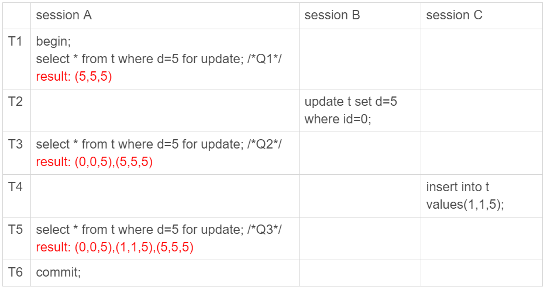

# 幻读

1、在可重复读隔离级别下，普通的查询是快照读，是不会看到别的事务插入的数据的；因此**幻读只会在"当前读"的情况下才会出现**；

2、如Session B修改的结果，被Session A的select语句用"当前读"看到，并不是幻读；**幻读仅专指"新插入的行"**。

> 当前读：如select ... for update 或者 select ... lock in share mode, 指读取的是数据记录的最新版本，并且会对读取的记录进行锁定，防止其他事务同时改动相同记录。
>
> 快照读：基于一个快照读取数据，不会锁定数据，如事务开始时创建的快照，因此在当前事务执行过程中，即使其他事务修改了当前事务访问的相同记录，当前事务访问的数据仍然是事务开始时的快照数据。

**select ... lock in share mode**走的是IS锁（意向共享锁），即在符合条件的行记录上加共享锁，其他会话可以读取这些记录，也可以继续加IS锁，但是无法修改这些记录直到你这个加锁的会话执行完成（否则直接锁等待超时）。

- 适用于两张表存在关系时的写操作的一致性场景；

**select ... for update**走的是IX锁（意向排他锁），即在符合条件的行数加排他锁，其他会话也就无法在这些记录上添加任何的S锁或X锁。如果**不存在一致性非锁定读**的话，那么其他会话是无法读取和修改这些记录的；但InnoDB有**非锁定读**（快照读并需要加锁），**for update之后并不会阻塞其他会话的快照读取操作**，即除了select ... for update和select ... for update 这种显式加锁的查询操作。

- 适用于操作同一张表时的一致性场景；

产生幻读的原因是，**行锁只能锁住行，但是新插入记录这个动作，要更新的是记录之间的“间隙”**。因此，为了解决幻读问题，InnoDB 只好引入新的锁，也就是**间隙锁 (Gap Lock)**。

参考：

[深入理解SELECT ... LOCK IN SHARE MODE和SELECT ... FOR UPDATE](https://www.cnblogs.com/moxiaotao/p/12983367.html)

# 锁问题

锁的设计是为了**保证数据的一致性**。而这个一致性，不止是数据库内部数据状态在此刻的一致性，还包含了数据和日志在逻辑上的一致性。

- Next-Key Lock（临界锁）：锁定的是行记录本身以及后面的间隙；

- Gap Lock（间隙锁）：行记录之间的间隙，不包括行记录本身；

- Record Lock（行锁）：行记录本身；

> Next-Key Lock = Gap Lock + Record Lock

- ‌**排他锁**‌：‌执行查询时，‌对数据加排他锁，‌不允许其他事务读取和修改。‌
- **共享锁**‌：‌只加共享锁，‌允许其他事务读取，‌但不允许修改。

> 注意这里的读取是指当前读，而不是快照读，即普通的查询（即不带for update 或 lock in share mode的查询）；‌

**间隙锁和间隙锁是不冲突，只有行锁和行锁才冲突**。next-key加的时候是分为两步，先加间隙锁，然后再加行锁。

锁就是加在索引上的，这是MySQL InnoDB 的一个基础设定。

