# 客户画像

客户画像需要坚持三个原则，分别是人口属性和信用信息为主，强相关信息为主，定性数据为主。

客户画像目的有两个：

- 业务场景出发，寻找目标客户；

- 参考用户画像的信息，为用户设计产品或开展营销活动。

参考：

[从相亲说起：从对公客户画像、贡献积分到智慧银行对公营销](https://zhuanlan.zhihu.com/p/54657038)

[金融行业大数据用户画像实践](https://www.woshipm.com/data-analysis/445963.html)

# 矩阵相关操作和算法

## SVD（奇异值分解）

**SVD（奇异值分解）**是一种**矩阵分解**的方法，用于**将一个矩阵分解为三个矩阵的乘积**。它在很多领域中都有广泛的应用，包括数据降维、推荐系统、图像处理等。

SVD将一个矩阵分解为以下三个矩阵的乘积：

- **U矩阵**：包含原始矩阵的左奇异向量（left singular vectors）组成的矩阵。它的列向量是正交的，并且是原始矩阵的特征向量。
- **Σ矩阵**：包含奇异值（singular values）组成的对角矩阵。奇异值是原始矩阵的特征值的平方根，表示了原始矩阵在每个特征向量方向上的重要性。
- **V矩阵**：包含原始矩阵的右奇异向量（right singular vectors）组成的矩阵。它的列向量也是正交的，并且是原始矩阵的特征向量。

SVD的数学表示为：A = UΣV^T，其中A是原始矩阵，U、Σ和V分别是分解后的三个矩阵。

通过SVD分解，我们可以对原始矩阵进行降维，只保留奇异值较大的特征向量，从而减少数据的维度。这在处理大规模数据和矩阵压缩方面非常有用。此外，SVD还可以用于推荐系统中的协同过滤算法，通过分解用户-物品评分矩阵，可以进行用户和物品的推荐。

需要注意的是，SVD的计算成本较高，特别是对于大型矩阵。因此，在实际应用中，通常会使用近似的SVD方法，如**截断SVD（Truncated SVD）**或 **随机SVD（Randomized SVD）**，以加快计算速度并降低内存消耗。


SVD（奇异值分解）在处理稀疏矩阵时可能会遇到一些挑战。SVD是一种用于矩阵分解的数学技术，它将一个矩阵分解为三个矩阵的乘积：U、Σ和Vᵀ。其中，U和V是正交矩阵，Σ是对角矩阵。

对于稠密矩阵，SVD可以直接应用并得到精确的分解结果。然而，对于稀疏矩阵，SVD的应用可能会面临以下问题：

1. 存储需求：稀疏矩阵通常具有大量的零元素，而SVD需要存储完整的矩阵。这可能导致存储需求过高，尤其是在处理大规模稀疏矩阵时。

2. 计算复杂度：SVD的计算复杂度较高，尤其是在处理大规模稀疏矩阵时。对于非常大的稀疏矩阵，计算SVD可能会变得非常耗时。

为了应对这些问题，针对稀疏矩阵的特殊算法和技术已经被提出，例如截断SVD（Truncated SVD）和随机SVD（Randomized SVD）。这些方法可以在保留主要信息的同时，减少存储需求和计算复杂度。

因此，虽然SVD在处理稀疏矩阵时可能会面临一些挑战，但通过使用特殊的算法和技术，仍然可以有效地应用SVD来处理稀疏矩阵，并获得有用的分解结果。


奇异值分解（SVD）是一种**将矩阵分解为若干特征向量和特征值的线性代数技术**。在推荐系统中，SVD常被用于将用户-物品交互矩阵分解为低维的隐含特征空间，从而降低数据的维度，提取出隐藏在用户和物品之间的潜在关系。

在SVD中，矩阵A被分解为三个矩阵的乘积：

*A*=*U*Σ*V*^*T*

- *U* 是一个正交矩阵，包含了A的左奇异向量。
- Σ 是一个对角矩阵，包含了A的奇异值。
- *V* 是一个正交矩阵，包含了A的右奇异向量。

下面是一个简单的PySpark示例，演示了如何在PySpark中使用ALS模型进行SVD分解：

```python
from pyspark.sql import SparkSession
from pyspark.ml.recommendation import ALS

# 创建Spark会话
spark = SparkSession.builder.appName("SVD Example").getOrCreate()

# 假设 ratings 是一个包含用户评分的 DataFrame，包括 userId, movieId, rating 等列
# 注意：ALS模型要求userId和movieId是整数类型

# 构建ALS模型
als = ALS(rank=10, maxIter=10, regParam=0.1, userCol="userId", itemCol="movieId", ratingCol="rating")
model = als.fit(ratings)

# 从模型中提取U, V 矩阵
U = model.userFactors
V = model.itemFactors

# 显示 U, V 矩阵
U.show()
V.show()
```

在这个示例中，我们使用ALS模型来进行矩阵分解。训练得到的模型包含了用户的隐含特征矩阵（U）和物品的隐含特征矩阵（V）。通过这两个矩阵，你可以获取到用户和物品在隐含特征空间中的表示。

请注意，这只是一个简单的示例，实际上，ALS模型还可以用于推荐系统中，它会在训练过程中优化用户-物品评分矩阵的近似，从而提取出隐含特征。

### 截断SVD（Truncated SVD）和随机SVD（Randomized SVD）

截断SVD（Truncated SVD）和随机SVD（Randomized SVD）是两种用于处理稀疏矩阵的SVD变体方法。

1. 截断SVD（Truncated SVD）：
   \- 截断SVD是一种通过截断奇异值来近似原始矩阵的SVD方法。
   \- 它通过保留最大的k个奇异值和对应的奇异向量来近似原始矩阵。
   \- 这种方法可以减少存储需求和计算复杂度，特别适用于处理大规模稀疏矩阵。
   \- 截断SVD的结果是一个近似的低秩矩阵分解，可以用于降维、特征提取和数据压缩等任务。

2. 随机SVD（Randomized SVD）：
   \- 随机SVD是一种使用随机采样技术来加速SVD计算的方法。
   \- 它通过在原始矩阵上进行随机投影和采样，得到一个较小的近似矩阵。
   \- 随后，对近似矩阵进行SVD计算，得到近似的奇异值和奇异向量。
   \- 这种方法可以显著减少计算复杂度，特别适用于处理大规模稀疏矩阵。
   \- 随机SVD的结果是一个近似的低秩矩阵分解，可以用于降维、特征提取和数据压缩等任务。

截断SVD和随机SVD是在处理稀疏矩阵时常用的技术，它们通过近似的方式提供了一种有效的方法来处理大规模稀疏矩阵，并获得有用的分解结果。这些方法在降低存储需求和计算复杂度的同时，仍然能够保留主要的信息和特征。


>特征值和特征向量是线性代数中的重要概念，用于描述矩阵的性质和变换。
>
>特征值（eigenvalue）是一个标量，表示线性变换中的一个重要特性。对于一个n维矩阵A，其特征值是满足方程 Av = λv 的标量λ，其中v是一个非零向量。换句话说，特征值λ表示了在线性变换下，向量v的方向保持不变，只发生了缩放的程度。
>
>特征向量（eigenvector）是与特征值相关联的向量。对于一个n维矩阵A和其特征值λ，特征向量v是满足方程 Av = λv 的非零向量。特征向量表示在线性变换下，保持其方向不变的向量。
>
>特征值和特征向量的重要性在于它们提供了矩阵的基本性质和变换的特征。通过计算矩阵的特征值和特征向量，我们可以了解矩阵的对称性、稳定性、奇异性等信息。在实际应用中，特征值和特征向量被广泛应用于数据降维、主成分分析、图像处理、物理模拟等领域。
>
>需要注意的是，特征值和特征向量通常是成对出现的，一个特征值对应一个特征向量。特征向量可以按比例缩放，因此通常会进行归一化处理，使其长度为1。
>
>对称方阵是指一个矩阵的转置与其本身相等的方阵。V=V^T

# 推荐算法

## 协同过滤算法

常用的协同过滤算法有以下几种：

1. **基于用户的协同过滤算法（User-Based Collaborative Filtering）**：根据**用户之间的相似性**以及**其他用户对物品的评分**来推荐物品。常用的相似性度量方法是余弦相似性、皮尔逊相关性或杰卡德（Jaccard）相似性。
   - 通常**杰卡德相似系数**常用在**0，1类型布尔数据集**上，皮尔逊相关系数通常用在**数值数据集**上。
2. **基于物品的协同过滤算法（Item-Based Collaborative Filtering）**：根据**物品之间的相似性**以及**用户对物品的评分**来推荐物品。常用的相似性度量方法是余弦相似性、皮尔逊相关性或杰卡德（Jaccard）相似性。
3. **基于模型的协同过滤算法（Model-Based Collaborative Filtering）**：通过**建立一个预测模型来预测用户对未评分物品的评分**。常用的模型包括协同过滤矩阵分解（Collaborative Filtering Matrix Factorization）、神经网络（Neural Networks）、关联规则挖掘（Association Rule Mining）等。
4. **基于深度学习的协同过滤算法（Deep Learning Collaborative Filtering）**：**利用深度学习模型来预测用户对未评分物品的评分**。常用的深度学习模型包括循环神经网络（Recurrent Neural Networks）、自注意力模型（Self-Attention Models）等。
5. **基于强化学习的协同过滤算法（Reinforcement Learning Collaborative Filtering）**：利用强化学习来优化推荐策略。常用的奖励函数包括点击率、购买率、平均评分等。

这些协同过滤算法各有优缺点，应根据具体的应用场景和数据特点选择合适的算法。

基于内存的协同过滤算法是一种推荐系统算法，它利用用户之间的相似性或物品之间的相似性来进行推荐。该算法主要基于用户的历史行为或物品的属性，而不需要显式地建立模型。

基于内存的协同过滤算法通常有两种类型：基于用户的协同过滤和基于物品的协同过滤。

1. 基于用户的协同过滤（User-Based Collaborative Filtering）：该方法通过计算用户之间的相似性来进行推荐。具体步骤如下：
   - 计算用户之间的相似性，常用的相似性度量方法包括余弦相似度、皮尔逊相关系数等。
   - 根据用户的相似性，找到与目标用户最相似的一组用户。
   - 根据这组相似用户的历史行为，推荐目标用户可能感兴趣的物品。

2. 基于物品的协同过滤（Item-Based Collaborative Filtering）：该方法通过计算物品之间的相似性来进行推荐。具体步骤如下：
   - 计算物品之间的相似性，常用的相似性度量方法包括余弦相似度、皮尔逊相关系数等。
   - 根据物品的相似性，找到与目标物品最相似的一组物品。
   - 根据这组相似物品的历史行为，推荐给目标用户与这些物品相关的其他物品。

基于内存的协同过滤算法简单且易于实现，但在面对大规模数据时可能会面临性能问题。此外，它也存在冷启动问题，即对于新用户或新物品，由于缺乏历史数据，无法进行准确的推荐。因此，在实际应用中，通常会结合其他推荐算法来提高推荐的准确性和覆盖率。

### ALS算法（交替最小二乘法）

ALS算法是一种**基于矩阵分解的协同过滤推荐算法**，全称为**交替最小二乘法**（Alternating Least Squares）。

传统的协同过滤推荐算法主要**基于用户-物品的评分矩阵进行计算**，**但当用户-物品的评分矩阵较为稀疏时，推荐结果的准确性会受到影响**。ALS算法通过矩阵分解技术，将用户-物品的评分矩阵分解为用户矩阵和物品矩阵，并通过迭代优化这两个矩阵来提高推荐准确性。

具体来说，ALS算法采用**最小二乘法**来优化用户和物品矩阵，**每次迭代时，先固定用户矩阵，优化物品矩阵，然后固定物品矩阵，优化用户矩阵，直到达到预设的迭代次数或收敛条件**。在优化过程中，算法通过迭代交替的方式逐步改进用户和物品矩阵，以提高推荐结果的准确性。

ALS算法已被广泛应用于推荐场景中，如电商、新闻、广告等领域的个性化推荐系统。

```python
from pyspark.ml.recommendation import ALS  
from pyspark.sql import SparkSession  
  
# 创建一个SparkSession  
spark = SparkSession.builder.appName('ALSRecommendation').getOrCreate()  
  
# 加载数据集，数据集中的每一行包含用户ID、物品ID和评分  
data = spark.read.csv('your_data.csv', header=True, inferSchema=True)  
  
# 训练ALS模型  
als = ALS(userCol="user_id", itemCol="item_id", ratingCol="rating",coldStartStrategy="drop")  
model = als.fit(data)  
  
# 计算用户之间的相似度  
userSimilarityMatrix = model.userSimilarities  
  
# 输出用户相似度矩阵  
for i in range(userSimilarityMatrix.shape[0]):  
    for j in range(userSimilarityMatrix.shape[1]):  
        print(f"{i}\t{j}\t{userSimilarityMatrix[i][j]}")  
  
# 关闭SparkSession  
spark.stop()
```


# 模型评价指标

## RMSE、MSE和MAE

均方根误差（Root Mean Squared Error, RMSE）是一种常用的回归模型评估指标，用于衡量模型预测值和实际观测值的差异程度。它是均方误差（Mean Squared Error，MSE）的平方根。


均方根误差（RMSE，Root Mean Squared Error）：

```matlab
RMSE = sqrt((1/n) Σ(yᵢ - ŷᵢ)²)
```

均方误差（MSE，Mean Squared Error）：

```matlab
MSE = (1/n) * Σ(yᵢ - ŷᵢ)²
```

均值绝对误差（MAE，Mean Absolute Error）：用于衡量预测值与真实值之间的平均绝对差异程度。

```matlab
MSE = (1/n) * Σ|yᵢ - ŷᵢ|
```

> n是样本个数，yᵢ是第i个样本的实际观测值，ŷᵢ是第i个样本的预测值。

RMSE的值越小，表示模型的预测能力越好，与实际观测值的差异越小。

RMSE的优点是对预测误差的较大值更加敏感，因为它对误差进行了平方操作。这使得RMSE在回归问题中广泛使用，特别是当存在较大的误差值时。

MAE反应的就是真实误差，RMSE 与 MAE 的量纲相同（单位相同），但求出结果后我们会发现RMSE比MAE的要大一些。

### RMSE与MSE的区别

RMSE是MSE的平方根；

MSE：

- MSE计算的是预测值与实际观测值之间差异的平方的平均值；
- 单位是原始数据单位的平方；
- MSE对所有误差值都平等对待；
  - 因为在计算平均值时，每个误差值都被平等考虑，没有特别的权重分配；
  - MSE（均方误差）是真实值与预测值的差值的平方然后求和平均，是衡量预测误差的一种指标。MSE对所有误差值都平等对待。

RMSE：

- 而RMSE是对MSE进行了平方根操作，单位与原始数据的单位相同；
- RMSE对预测误差的较大值更加敏感：RMSE因为它是先对误差进行平方的累加后再开方，它其实是放大了较大误差之间的差距，这也意味RMSE在回归问题中更加关注较大的误差值；

## R-squared

对于RMSE、MSE和MAE这些衡量方法，都存在的问题在于，没有一个上下限，比如我们使用auc，其上限为1，则越接近1代表模型越好，0.5附近代表模型和随机猜测基本差不多性能很差，实际上回归中也是存在这样一中指标的，如R方。

R方（R-squared），也称为决定系数（coefficient of determination），是一种用于评估回归模型拟合优度的统计指标。它表示因变量的变异程度中可以由自变量解释的比例。

**R方的取值范围在0到1之间，越接近1表示模型对观测数据的拟合程度越好，越接近0表示模型对观测数据的拟合程度较差。**

R方的计算方法如下：

1. 计算实际观测值与模型预测值之间的平方差和（SST，Sum of Squares Total）。
2. 计算模型预测值与实际观测值的平均值之间的平方差和（SSE，Sum of Squares Error）。
3. 计算R方，即1减去SSE除以SST的比值。

R方的计算公式为：R方 = 1 - (SSE / SST) = 1 - (MSE/Var)

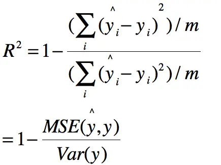

> MSE即均方误差值，Var表示方差

R方的解释：

- R方等于0时，表示模型无法解释因变量的变异，拟合效果较差。
- R方等于1时，表示模型完全解释了因变量的变异，拟合效果完美。
- R方在0到1之间时，表示模型解释了部分因变量的变异，拟合效果介于较差和完美之间。

需要注意的是，R方并不是一个绝对的评估指标，它只能用于比较不同模型对同一数据集的拟合优度。在使用R方进行模型比较时，应该结合其他评估指标和领域知识进行综合考量。

```python
# MSE
y_preditc=reg.predict(x_test) #reg是训练好的模型
mse_test=np.sum((y_preditc-y_test)**2)/len(y_test) #跟数学公式一样的
# RMSE
rmse_test=mse_test ** 0.5
# MAE
mae_test=np.sum(np.absolute(y_preditc-y_test))/len(y_test)
# R Square
r2_score=1- mean_squared_error(y_test,y_preditc)/ np.var(y_test)
```

使用scikit-learn的api

```python
from sklearn.metrics import mean_squared_error #均方误差
from sklearn.metrics import mean_absolute_error #平方绝对误差
from sklearn.metrics import r2_score#R square
#调用
mean_squared_error(y_test,y_predict)
mean_absolute_error(y_test,y_predict)
r2_score(y_test,y_predict)
```


## Silhouette分数-评估聚类质量

Silhouette分数是一种用于评估聚类质量的指标。它结合了聚类内部的紧密度和聚类之间的分离度，可以帮助我们判断聚类结果的好坏。

Silhouette分数主要用于评价样本的聚类结果与其实际标签之间的相似度。

计算Silhouette分数时，先计算样本i属于某个簇的平均距离，称为簇内距离；然后计算样本i属于其他簇的平均距离，称为簇间距离。Silhouette分数由簇间距离减去簇内距离得到。

Silhouette分数的取值范围在[-1, 1]之间，具体解释如下：

- 当Silhouette分数接近于1时，表示样本在自己的聚类中紧密地聚集在一起，并且与其他聚类之间有很好的分离度。
- 当Silhouette分数接近于0时，表示样本在聚类边界附近，可能存在重叠或者不明显的聚类结构。
- 当Silhouette分数接近于-1时，表示样本被错误地分配到了其他聚类中，聚类结果可能是不合理的。

因此，Silhouette分数越接近于1，表示聚类结果越好；越接近于-1，表示聚类结果越差。

在代码中，我们使用ClusteringEvaluator来计算聚类结果的Silhouette分数。通过比较不同聚类算法的Silhouette分数，我们可以评估它们在给定数据集上的聚类性能。

```python
from pyspark.ml.feature import VectorAssembler
from pyspark.ml.feature import StringIndexer
from pyspark.ml.clustering import KMeans
from pyspark.ml.evaluation import ClusteringEvaluator

# 假设df是包含客户数据的DataFrame，features是用于聚类的特征列名列表

# 创建特征向量
vecAssembler = VectorAssembler(inputCols=features, outputCol="features")
df_features = vecAssembler.transform(df)

# 将布尔类型特征转换为数值类型（0表示False，1表示True）
bool_features = ['bool_feature1', 'bool_feature2']
for feature in bool_features:
    indexer = StringIndexer(inputCol=feature, outputCol=feature+"_index")
    df_features = indexer.fit(df_features).transform(df_features)

# 选择需要的特征列
selected_features = features + [feature+"_index" for feature in bool_features]
df_selected_features = df_features.select(selected_features)

# 使用K-Means进行聚类
kmeans = KMeans(k=3, seed=1)
model = kmeans.fit(df_selected_features)
df_clustered = model.transform(df_selected_features)

# 计算聚类结果的Silhouette分数
evaluator = ClusteringEvaluator()
silhouette_score = evaluator.evaluate(df_clustered)

print("Silhouette score: ", silhouette_score)
```

# 特征选择技术

有些模型对人群进行分组后，很难向业务解释其结果。对于这类分组结果，可以让系统根据数据挖掘中的特征选择技术，如信息增益 IG（Information Gain）、开方检验 CHI 等，来确定这组人群应该有怎样的特征，并将其作为标签。

在面对难以理解的高维特征空间时。通过使用特征选择技术，我们可以找出对分组结果影响最大的特征，从而形成更具解释性的特征集合。

1. **信息增益（IG）**：这是一种基于决策树的特征选择方法。它衡量的是**每个特征对于分类结果的信息贡献，通过计算每个特征的熵（或者说是对概率分布的不确定性）在考虑和不考虑该特征时的差值来衡量信息增益**。
2. **卡方检验（CHI）**：这是一种基于统计学的特征选择方法。它**通过计算每个特征和分类结果之间的相关性，以及这种相关性是否显著，来决定是否选择该特征**。

这两种方法都可以帮助我们找出对分组结果影响最大的特征，但是它们各有优缺点。例如，信息增益可能偏向选择具有大量不同可能值的特征，而卡方检验可能对离散特征更为敏感。因此，在实际应用中，我们可能需要尝试多种不同的特征选择方法，以获得最合适的结果。

最后，通过将这些选择的特征组合成一个易于理解的标签，我们可以为业务提供一个清晰的指南，以理解并利用这些分组结果。这种方法尤其在面对需要人工介入的情况时非常有用，比如在面对一个需要人工解释的决策时，或者在需要提供一个易于理解的报告时。

# 聚类分析

## 聚类客户分群后，确定每一个客群的典型特征和标签

确定每一个客群的典型特征和标签可以通过以下方法：

1. 特征重要性：对于使用聚类算法得到的客群，可以使用特征重要性评估方法来确定每个客群中最具有区分性和重要性的特征。一种常用的方法是使用决策树算法，如随机森林或梯度提升树，通过评估特征在决策树中的分裂贡献来计算特征的重要性。较高重要性的特征可以被认为是该客群的典型特征。

2. 数据可视化：通过将客群的数据进行可视化，可以观察不同客群之间的特征分布和差异。常用的可视化方法包括散点图、箱线图、直方图等。通过观察不同客群在不同特征上的分布情况，可以确定每个客群的典型特征。

3. 领域知识和业务理解：结合领域知识和业务理解，可以根据对客群的理解和需求来确定每个客群的典型特征和标签。例如，在电商领域，可以根据购买行为、偏好和消费金额等特征来确定客群的典型特征和标签，如高价值客户、折扣敏感客户等。

4. 聚类算法的输出：某些聚类算法（如K-Means）会为每个客群分配一个中心点，该中心点可以被视为该客群的典型特征。中心点的特征值可以用来描述该客群的特征。

```python
from pyspark.ml.clustering import KMeans
from pyspark.ml.feature import VectorAssembler

# 假设已经有一个DataFrame df，包含客户数据，其中features列包含了用于聚类的特征

# 创建特征向量
assembler = VectorAssembler(inputCols=["feature1", "feature2", ...], outputCol="features")
df = assembler.transform(df)

# 训练K-Means模型
kmeans = KMeans(k=3)  # 假设要将客户分为3个群组
model = kmeans.fit(df)

# 获取每个客群的中心点
centers = model.clusterCenters()

# 获取每个客群的标签
labels = model.transform(df).select("prediction").rdd.flatMap(lambda x: x).collect()

# 打印每个客群的典型特征和标签
for i in range(len(centers)):
    print("Cluster", i+1)
    print("Center:", centers[i])
    print("Label:", labels[i])
    print()
```

在上述代码中，首先使用VectorAssembler将特征列合并为一个特征向量。然后，使用KMeans算法训练模型，并通过clusterCenters()方法获取每个客群的中心点。最后，使用transform()方法获取每个客户的预测标签，并打印出每个客群的典型特征和标签。

请注意，代码中的feature1、feature2等应替换为实际的特征列名，k的值可以根据实际需求进行调整。

## 找出对聚类客户分群影响最大的特征集合

要找出对聚类客户分群影响最大的特征集合，可以使用特征重要性评估方法。以下是一种基于PySpark的示例代码，演示如何计算特征重要性并找出对聚类客户分群影响最大的特征集合：

```python
from pyspark.ml.clustering import KMeans
from pyspark.ml.feature import VectorAssembler

# 假设已经有一个DataFrame df，包含客户数据，其中features列包含了用于聚类的特征

# 创建特征向量
assembler = VectorAssembler(inputCols=["feature1", "feature2", ...], outputCol="features")
df = assembler.transform(df)

# 训练K-Means模型
kmeans = KMeans(k=3)  # 假设要将客户分为3个群组
model = kmeans.fit(df)

# 获取每个特征的重要性
feature_importances = model.featureImportances

# 将特征重要性与特征列名对应起来
feature_importances_dict = dict(zip(assembler.getInputCols(), feature_importances))

# 按照特征重要性降序排序
sorted_features = sorted(feature_importances_dict.items(), key=lambda x: x[1], reverse=True)

# 打印对聚类客户分群影响最大的特征集合
top_features = [feature for feature, importance in sorted_features[:5]]  # 假设选择前5个特征
print("Top features:", top_features)
```

在上述代码中，首先使用VectorAssembler将特征列合并为一个特征向量。然后，使用KMeans算法训练模型，并通过featureImportances属性获取每个特征的重要性。将特征重要性与特征列名对应起来，并按照重要性降序排序。最后，选择前几个重要性最高的特征作为对聚类客户分群影响最大的特征集合。

请注意，代码中的feature1、feature2等应替换为实际的特征列名，k的值可以根据实际需求进行调整。在示例代码中，选择了前5个重要性最高的特征，你可以根据实际情况调整这个数量。


# 对公客户产品推荐模型

针对对公客户的产品推荐模型可以基于机器学习和数据分析技术构建。下面是一个简单的建议，你可以根据实际情况进行定制和扩展：

1. **数据收集与准备**：
   - 收集对公客户的历史交易数据，包括交易类型、金额、频率、时间等信息。
   - 整理客户的基本信息，如行业、公司规模、地理位置等。
   - 获得产品信息，包括各种产品的特性、利率、期限等。
2. **特征工程**：
   - 从收集到的数据中提取特征，例如平均交易金额、交易频率、行业类型等。
   - 对分类特征进行独热编码或者使用嵌入（Embedding）技术进行处理。
   - 可以考虑加入一些衍生特征，比如交易频率的变化趋势等。
3. **模型选择**：
   - 由于这是一个推荐系统，你可以考虑使用协同过滤、内容过滤、基于矩阵分解的方法（如ALS）等传统的推荐算法，也可以尝试更先进的深度学习模型（如神经网络）。
   - 可以考虑使用模型融合技术，将多个模型的结果综合考虑。
4. **模型训练**：
   - 将数据分为训练集和测试集，用训练集训练模型，用测试集验证模型的性能。
   - 使用适当的评价指标（如准确率、召回率、F1-score等）来评估模型的性能。
5. **模型部署**：
   - 将训练好的模型部署到生产环境中，以便实时进行产品推荐。
6. **模型监控与优化**：
   - 定期监控模型的性能，如果发现性能下降或者模型过时，及时进行调整和优化。
7. **用户反馈与迭代**：
   - 收集用户的反馈信息，不断改进模型以提供更准确的产品推荐。
8. **合规性和隐私保护**：
   - 确保模型的使用符合相关法规和政策，保护客户的隐私数据。

以上只是一个简单的框架，实际上建立一个高效的产品推荐模型需要综合考虑业务场景、数据特点、模型选择等多方面因素，同时也需要不断地进行实验和迭代，以优化模型的性能和推荐效果。

## 协同过滤的分类

协同过滤是一种常用于推荐系统的技术，它基于用户的行为和偏好来推荐物品。协同过滤分为两种主要类型：

1. **基于用户的协同过滤（User-Based Collaborative Filtering）**：
   - **思想**：基于相似用户的行为，将一个用户喜欢的物品推荐给另一个相似的用户。
   - **步骤**：
     1. 计算用户之间的相似度，通常使用余弦相似度等指标。
     2. 找到与目标用户最相似的一组用户。
     3. 将这组用户喜欢的物品推荐给目标用户，但排除目标用户已经拥有或者评价过的物品。
   - **优点**：
     - 相对容易实现。
     - 对于新用户也能够提供推荐。
   - **缺点**：
     - 对于用户和物品数量庞大的情况，计算相似度的开销会很大。
     - 用户行为的稀疏性问题。
2. **基于物品的协同过滤（Item-Based Collaborative Filtering）**：
   - **思想**：基于物品的相似度，推荐与用户喜欢的物品相似的物品。
   - **步骤**：
     1. 计算物品之间的相似度，通常使用余弦相似度等指标。
     2. 对于目标用户已经评价过的物品，找到相似的物品。
     3. 将相似的物品推荐给目标用户，但排除目标用户已经拥有或者评价过的物品。
   - **优点**：
     - 在物品数量远大于用户数量时，计算相似度的开销相对较小。
     - 对于稀疏用户行为矩阵也能够提供较好的推荐。
   - **缺点**：
     - 不太容易处理新物品，因为它们没有历史评价数据。

实际应用中，通常会结合这两种方法，以充分发挥它们的优势。同时，还可以采用一些技巧，如加权评分、时间衰减等，以提升推荐的精度和准确度。

协同过滤是推荐系统中的经典方法，但也有一些局限性，比如对于冷启动问题（新用户或新物品）的处理相对困难，也容易受到数据稀疏性的影响。因此，在实际应用中，还可以结合其他技术如内容过滤、深度学习等来提升推荐系统的性能。

## 对于用户行为的稀疏矩阵，在基于用户的协同过滤该如何处理

处理用户行为矩阵的稀疏性是协同过滤算法中非常重要的一环，特别是在基于用户的协同过滤中。以下是一些处理稀疏矩阵的方法：

1. **相似度矩阵的稀疏性处理**：
   - **降维技术**：可以使用主成分分析（PCA）等降维技术来减少相似度矩阵的维度，从而减轻稀疏性问题。
   - **过滤稀疏行/列**：如果用户行为矩阵中有些行或列的数据极其稀疏（比如某些用户只有很少的行为记录），可以考虑将这些行或列过滤掉，以减少稀疏性对计算的影响。
2. **相似用户的选择**：
   - **Top-N 相似用户**：可以只考虑与目标用户最相似的前N个用户，而不是所有用户，从而减少计算相似度的开销。
   - **设定相似度阈值**：可以设置一个相似度阈值，只考虑与目标用户相似度超过这个阈值的用户。
3. **引入其他信息**：
   - **内容信息**：可以考虑将用户的其他信息（如个人信息、历史购买记录等）融入相似度计算中，从而提高相似度的准确性。
4. **使用附加特征**：
   - **引入上下文信息**：可以将上下文信息（如时间、地理位置等）作为附加特征，加入相似度计算中，从而更精确地找到相似用户。
5. **使用混合方法**：
   - **结合内容过滤**：将基于用户的协同过滤与内容过滤相结合，从而在稀疏矩阵中引入更多的信息来进行推荐。
6. **使用稠密表示**：
   - **矩阵分解方法**：使用矩阵分解（如SVD、ALS等）将用户行为矩阵分解为两个稠密的低维矩阵，从而减少稀疏性的影响。
7. **正则化**：
   - 在相似度计算或矩阵分解过程中引入正则化项，以控制模型的复杂度，避免过拟合。

这些方法可以根据具体的业务场景和数据特点进行选择和组合。在实际应用中，通常需要通过实验和评估来确定哪种方法对于特定问题是最有效的。


当涉及到处理稀疏矩阵和协同过滤时，PySpark 提供了强大的工具来处理大规模数据集。以下是一些示例代码，演示了如何在 PySpark 中应用一些处理稀疏矩阵和协同过滤的方法：

### 1. 降维技术 - 主成分分析 (PCA)

```python
from pyspark.ml.feature import PCA
from pyspark.ml.linalg import Vectors
from pyspark.sql import SparkSession

spark = SparkSession.builder.appName("PCA Example").getOrCreate()

# 假设 userFeatures 是一个稀疏矩阵
data = [(0, Vectors.sparse(5, [(1, 1.0), (3, 7.0)])),
        (1, Vectors.dense([2.0, 0.0, 3.0, 4.0, 5.0])),
        (2, Vectors.dense([4.0, 0.0, 0.0, 6.0, 7.0]))]
df = spark.createDataFrame(data, ["id", "userFeatures"])

pca = PCA(k=3, inputCol="userFeatures", outputCol="pcaFeatures")
model = pca.fit(df)

result = model.transform(df)
result.show()
```

### 2. 基于用户的协同过滤 - Top-N 相似用户

```python
from pyspark.ml.recommendation import ALS
from pyspark.ml.evaluation import RegressionEvaluator

# 假设 ratings 是一个包含用户评分的 DataFrame，包括 userId, movieId, rating 等列

als = ALS(maxIter=5, regParam=0.01, userCol="userId", itemCol="movieId", ratingCol="rating")
model = als.fit(ratings)

# 获取每个用户的前 N 个相似用户
userRecs = model.recommendForAllUsers(5)
userRecs.show()
```

### 3. 引入其他信息 - 结合内容过滤

```python
from pyspark.ml.feature import VectorAssembler

# 假设 userFeatures 是一个 DataFrame 包含用户的特征信息，以及评分信息

assembler = VectorAssembler(
    inputCols=["feature1", "feature2", "feature3", "rating"],
    outputCol="features")

output = assembler.transform(userFeatures)
```

### 4. 使用矩阵分解方法 - ALS

```python
from pyspark.ml.recommendation import ALS
from pyspark.ml.evaluation import RegressionEvaluator

als = ALS(maxIter=5, regParam=0.01, userCol="userId", itemCol="movieId", ratingCol="rating")
model = als.fit(ratings)

# 进行预测
predictions = model.transform(test)

# 评估模型性能
evaluator = RegressionEvaluator(metricName="rmse", labelCol="rating", predictionCol="prediction")
rmse = evaluator.evaluate(predictions)
print(f"Root Mean Squared Error (RMSE) = {rmse}")
```

这些代码片段提供了一些基本的示例，演示了如何在 PySpark 中应用不同的方法来处理稀疏矩阵和实施协同过滤。请根据实际情况调整代码以满足你的需求，并确保你的数据和环境符合相应的要求。

## 基于内容的协同过滤

基于内容的协同过滤是推荐系统中的一种方法，它主要根据物品（如商品、文章、视频等）的内容特征和用户的偏好来进行推荐。与传统的协同过滤不同，基于内容的推荐系统主要关注**物品的特性和用户的兴趣匹配**，而**不依赖于用户-用户或物品-物品之间的交互行为**。

基于内容的协同过滤的核心思想可以总结为以下几个步骤：

1. **物品的特征提取**：
   - 对于每个物品，需要从中提取出能够描述其特性的特征，这些特征可以是文本、图片、音频等信息，具体取决于物品的类型。
2. **用户偏好建模**：
   - 对用户的偏好进行建模，通常使用一个用户特征向量表示用户的兴趣，这个向量可以通过分析用户历史行为、个人信息等得到。
3. **相似度计算**：
   - 在基于内容的协同过滤中，需要计算物品之间的相似度。通常可以使用余弦相似度等度量两个物品在特征空间中的相似程度。
4. **推荐生成**：
   - 对于一个给定的用户，可以根据用户的特征向量以及物品的特征向量，通过相似度计算来推荐与用户偏好相似的物品。

基于内容的协同过滤的优点是：

- 不依赖于用户行为数据的稀疏性，可以处理冷启动问题（新用户或新物品）。
- 能够提供解释性强的推荐，因为推荐是基于物品的实际特征进行的。

然而，基于内容的协同过滤也存在一些局限性：

- 对于复杂的物品特征提取可能会比较困难，特别是在涉及到多媒体内容时。
- 无法发现新的、与用户历史偏好不完全相符的推荐。

通常，实际应用中会综合考虑基于内容的协同过滤和传统的协同过滤方法，以充分利用它们的优势。同时，也可以结合其他技术如矩阵分解、深度学习等来提升推荐系统的性能。


## 有用户购买物品的笔数和购买金额，以及用户账户余额，可以如何构建一个用户-物品的评分矩阵

基于用户购买物品的笔数、购买金额和用户账户余额，可以设计一个简单的评分机制来构建用户-物品的评分矩阵。以下是一个示例方法：

1. **定义评分规则**：

   首先，需要定义一个评分规则，根据用户的购买行为给出相应的评分。可以根据不同的业务需求来设计评分规则，例如：

   - 用户购买一笔物品可以给一个固定的分数。
   - 用户的购买金额越高，给予的评分越高。
   - 用户的购买笔数越多，给予的评分越高。
   - 用户账户余额越高，给予的评分越高。

   这些规则可以根据具体情况来制定，也可以根据业务需求和实验来调整。

2. **计算评分**：

   使用定义好的评分规则，根据用户的购买物品的笔数、购买金额以及账户余额，计算出相应的评分。

3. **构建用户-物品评分矩阵**：

   将计算得到的评分填充到用户-物品评分矩阵中，这样就得到了一个基于用户购买行为的评分矩阵。

**numpy代码**

```python
import numpy as np

# 假设有用户购买物品的笔数、购买金额和账户余额的数据
purchase_counts = np.array([3, 5, 2, 1, 4])
purchase_amounts = np.array([100, 200, 50, 30, 150])
account_balances = np.array([500, 1000, 200, 800, 300])

# 定义评分规则
def calculate_score(count, amount, balance):
    return count * 0.2 + amount * 0.1 + balance * 0.01

# 计算评分
scores = calculate_score(purchase_counts, purchase_amounts, account_balances)

# 构建用户-物品评分矩阵
user_item_ratings = scores.reshape(-1, 1)

print(user_item_ratings)
```

这是一个简单的示例，实际应用中需要根据具体的业务需求和数据特点来设计评分规则。同时，也可以根据实际情况对评分规则进行调整和优化。

**PySpark 代码**

在 PySpark 中，你可以使用用户购买物品的笔数、购买金额和用户账户余额来构建一个用户-物品的评分矩阵。下面是一个简单的示例代码：

```python
from pyspark.sql import SparkSession
from pyspark.sql.functions import col

# 创建 SparkSession
spark = SparkSession.builder.appName("User-Item Ratings").getOrCreate()

# 假设有一个 DataFrame 包含用户ID、物品ID、购买笔数、购买金额和账户余额等信息
# 假设数据集为 df，包括列 userId, itemId, purchaseCount, purchaseAmount, accountBalance

# 定义评分规则
def calculate_score(purchase_count, purchase_amount, account_balance):
    return purchase_count * 0.2 + purchase_amount * 0.1 + account_balance * 0.01

# 添加评分列
df_with_scores = df.withColumn("score", 
                               calculate_score(col("purchaseCount"), col("purchaseAmount"), col("accountBalance")))

# 选取需要的列并得到用户-物品评分矩阵
user_item_ratings = df_with_scores.select("userId", "itemId", "score")

user_item_ratings.show()
```

在这个示例中，我们首先定义了一个评分规则 `calculate_score`，然后使用 PySpark 的 DataFrame 操作，将购买笔数、购买金额和账户余额作为参数传递给评分规则，得到评分，并将评分添加到 DataFrame 中。最后，我们选择了需要的列，得到了用户-物品评分矩阵。

请确保你已经正确导入了必要的模块并设置了正确的数据集。根据实际情况，你可能需要对评分规则进行调整或者添加额外的逻辑。

# 案例

## 亚马逊图书推荐案例

协同过滤的思想比较简单，主要有三种：

- **用户协同过滤（UserCF）**：**相似的用户可能喜欢相同物品。**如加了好友的两个用户，或者点击行为类似的用户被视为相似用户。如我兄弟和她的太太互加了抖音好友，他们两人各自喜欢的视频，可能会产生互相推荐。

- **物品协同过滤（ItemCF）**：**相似的物品可能被同个用户喜欢。**这个就是著名的世界杯期间沃尔玛尿布和啤酒的故事了。这里因为世界杯期间，奶爸要喝啤酒看球，又要带娃，啤酒和尿布同时被奶爸所需要，也就是相似商品，可以放在一起销售。

- **模型协同过滤：**使用矩阵分解模型来学习用户和物品的协同过滤信息。一般这种协同过滤模型有：SVD，SVD++等。

### 物品协同过滤

人工智能实践过程三个步骤：数据，学习和决策。这里也将用同样步骤，以图书销售推荐为例，解释物品协同过滤的过程。为了简单化，假设某图书销售平台总共有6本书销售，有6个用户购买。

**数据：**用户的评分数据，分值1-5分。每个用户对图书的评分如下图矩阵所示。

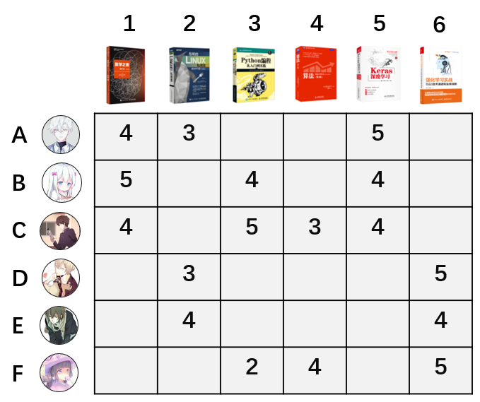

**学习算法：**前面说到ItemCF的定义是，相似的物品可能被同个用户喜欢。反过来讲，就是被同个用户喜欢的物品是相似商品。如上图中，图书1和图书2两本书，被用户A同时喜欢，这两本书具有相似性。而图书5和图书6，没有被同个用户同时喜欢，不具有相似性。

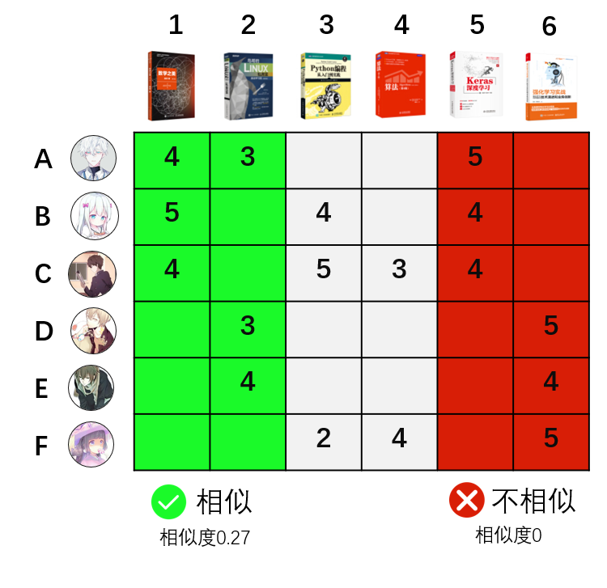

如果用余弦相似度计算图书1和图书2的相似度，也叫做cosine距离，计算过程为：

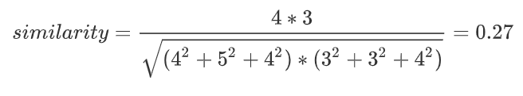

回想高中时候的课本我们就可以知道，上面的similarity计算公式，实际上就是计算书籍1的评分向量（4,5,4,0,0,0）和书籍2的评分向量（3,0,0,3,4,0）的 cos 夹角。

用同样的方式，可以算出图书1跟其他五本图书相似度分别为0.27, 0 .79，0.32,0.99和0。对每两本书计算完这个相似度后，就可以获得**全部图书的相似矩阵**。

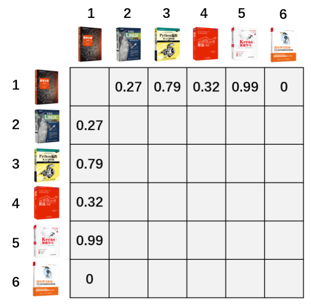

一个平台不仅仅有6本图书6个用户，我们再扩展到一般的情况。计算物品的相似度，实际是计算每两个物品评分向量的cosine距离，评分向量的每一维，代表了一个用户，下图中，表格的第一行代表了所有用户对物品A的评分。当有100万个用户时，也就是计算每两个100万维向量的距离。这样就导致计算量很大，而且很多平台不仅仅只有100万用户，因而这个低效的计算方式需要改进。

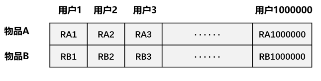

**预测决策：**

有了评分矩阵之后，预测决策一般有两种场景。

- 第一种是**根据相似度排序推荐最近邻物品**：类似于**“看了还看”，“买了还买”**场景。在这里的例子中，我们知道图书1和其他图书的相似度排序分别是图书5，图书3，图书4和图书2。当用户点击了图书1时，就可以按照相似顺序从高到低推荐。

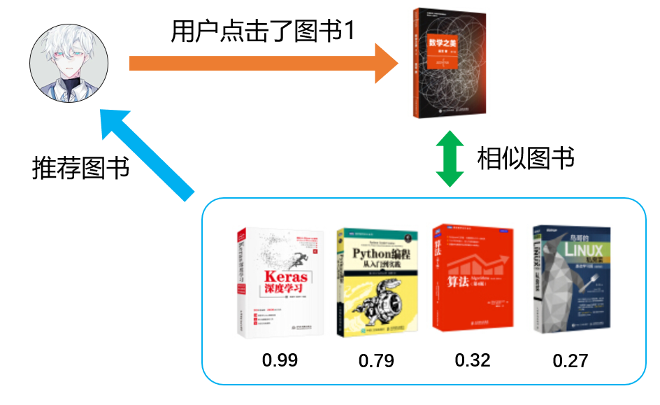

- 第二种是**根据相似度预测评分推荐物品**。如何决策要不要给用户B推荐图书2，图书4和图书6呢？如下图，通过**用户B对图书1的评分 \* 未知图书与图书1的相似度**来预测用户B对剩下图书的评分。如图书2的预测评分 =  图书1的评分5分 * 图书1和图书2的相似度0.27 ，从而用户B对图书2的评分是：5*0.27=1.35。同样方式计算出其他图书的评分预测。

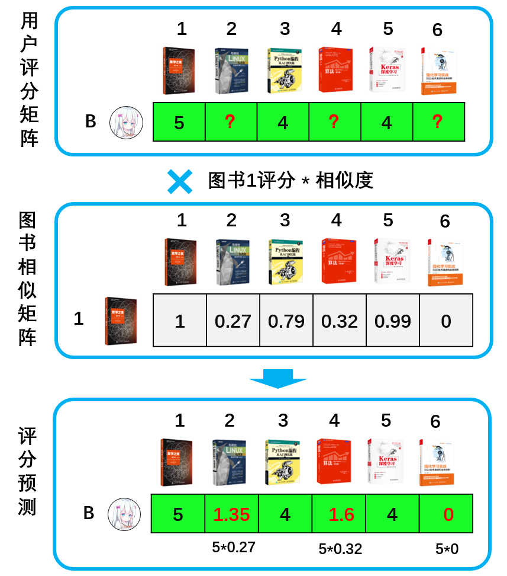

从上面的结果来看，用户B对其他图书评分比较低，这几本图书推荐的可能性大大减少。

#### **物品协同过滤实际使用**

这是推荐系统里最朴素的算法，因为它的计算量会随着用户和物品的数量呈指数增长，所以它并不适合在大量用户或大量物品的场景使用。在它诞生的年代，还没有大数据，这种计算方式耗费大量内存，需要做大量的优化。我尝试过用100万用户，100万物品和500万条的数据在256G内存的机器上做过尝试，计算一分钟后就宣告内存耗尽。确实需要计算的话，一般使用Spark来实现。

因为这个缺点，就需要新的算法来计算物品的协同过滤。

前面提到，计算任意两物品之间的相似度后，有两个使用场景。针对这两个场景，分别有不同的迭代算法：

- **根据相似度排序推荐最近邻物品**：使用如Word2vec，Item2vec等Embedding类的算法，将物品嵌入固定的向量空间中，再使用LSH算法(局部敏感哈希算法)取最近邻物品。这个后续文章会介绍。
- **根据相似度预测评分推荐物品**：本章后续介绍的SVD算法。

虽然这个算法使用较少了，但是物品协同过滤的思想都是一脉相乘的，理解了这个简单的cosine相似度计算方式，可以更好理解后续的迭代算法。

最后补充一下，物品协同过滤的一个缺点，或者说是协同过滤的缺点，对于一个新物品，协同过滤是无法推荐的。因为新物品用户无评分，导致它跟所有物品的相似度都是为0。这个是使用这个算法时非常需要注意的一个点。

### 用户协同过滤

用户协同过滤（UserCF）的计算方式跟物品协同过滤（ItemCF）的计算方式类似。不同的是由计算两两物品的相似度，转换成计算两两用户的相似度。如下图所示：

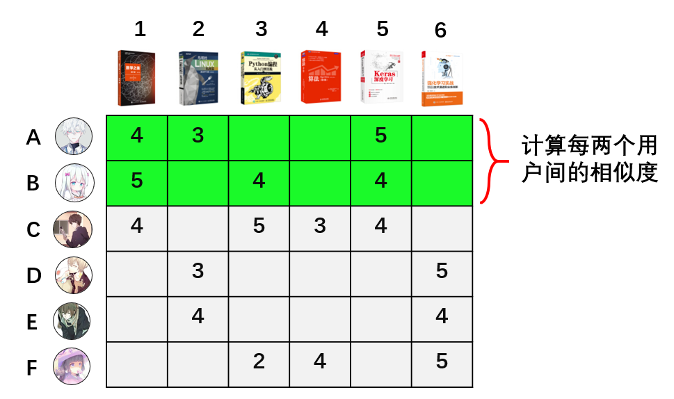

评分了相同图书的用户为相似用户，他们的相似度同样也用cosine相似度公式来计算。计算完相似度后，就可以根据用户间的相似性，预测用户对未评分图书进行评分预测。

但是在亚马逊上，由于用户评分的稀疏性（很多用户压根不评分），没有评分的用户无法跟其他用户计算相似性，从而导致很多用户之间没有相似度。所以2001年的时候，亚马逊选择物品协同过滤算法来做推荐，并发表了论文。这个论文也导致大家一度认为物品协同过滤优于用户协同过滤。

### 模型协同过滤-矩阵分解（SVD）

对于很多没有计算机专业背景的人来说，直接理解SVD算法是很困难的。需要有高等数学，线性代数，还要理解机器学习模型中的目标函数，损失函数，梯度，正则化，最小二乘法等概念。很多文章介绍SVD都很技术，这里不准备采用技术大咖们的方式。我还是继续用图文的方式介绍，这也许是世界上最简单的理解SVD的方式。

首先介绍一下背景。

SVD算法的诞生，跟美国Netflix公司有关。这家公司中文名叫网飞，拍了大家熟悉的网剧《纸牌屋》。


时间来到2006年，Netflix发起一个推荐系统的悬赏竞赛。他们公开了自己网站的用户数据评分数据包，并放出100万美元悬赏优化推荐算法。凡是能在Netflix现有的推荐系统基础上，把均方根误差降低10%的人，都能参与瓜分这100万美元。消息一放出，引来了无数高手参加。这场比赛中，最佳算法就是SVD。

背景介绍完了，接下来直接介绍SVD是怎么计算的。

还是跟前面那样，简单化问题：假设一个平台只有4个用户和4本图书。

**1、数据：**用户对物品评分1-5分，且有以下评分记录。

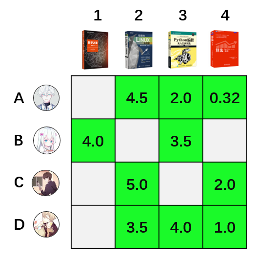

**2、学习算法**：

根据线性代数我们知道，一个矩阵可以分解为多个矩阵的乘积。SVD英文全称叫做Singular Value Decomposition，这个算法是个矩阵分解的通用名称，在不同领域有不同的形式。在推荐系统领域，可以简单的认为，**SVD就是将一个矩阵，在一定的精度损失下，将一个矩阵分解成两个矩阵**。运用这个算法，我们可以将上图的矩阵做以下的近似分解：

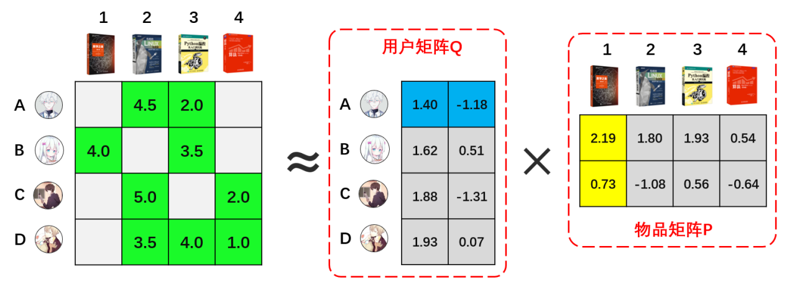

其中，**用户矩阵部分代表着每个用户的偏好在一个二维隐语义空间上的映射**。同样地，**物品矩阵代表着每本图书的特性在一个二维隐语义空间上的映射**。这两个矩阵也就是模型的结果。这样，我们训练模型的时候，就只需要训练用户矩阵中的8个参数和物品矩阵中的8个参数即可。大大减少了计算量。

模型训练的过程，简单地说，就是通过最小二乘法，不断将用户评分数据迭代入矩阵中计算，直到把均方误差优化到最小。上图的结果是我通过Spark的ML库ALS模块直接计算的。

算法的具体目标函数，损失函数和梯度等，详述则涉及很多机器学习知识点，这里就不作介绍了。技术方面有很多解读文章，需要进一步理解的同学，可以搜索相关文章阅读。

**3、预测决策：**

通过模型训练，我们得到用户矩阵Q和物品矩阵P后，全部用户对全部图书的评分预测可以通过R = PQ来获得。如上图中，用户A的向量(1.40,-1.18)乘以物品2的向量（2.19,0.73）则可得用户A对物品1的评分预测为：1.40×(-1.18)+2.19×0.73=2.21。

对所有的用户和物品都执行相同操作，可以得到全部用户对全部物品的评分。如下图右侧矩阵：

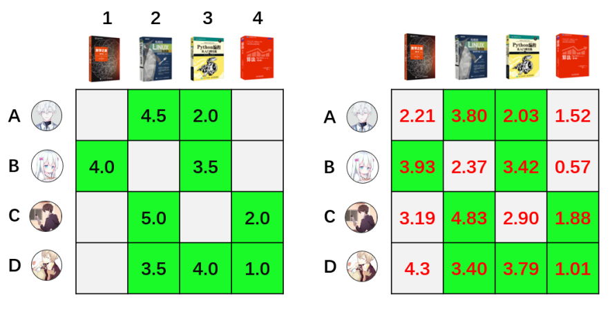

得到全部的评分预测后，我们就可以对每本图书进行择优推荐。需要注意的是，用户矩阵和物品矩阵的乘积，得到的评分预估值，与用户的实际评分不是全等关系，而是近似相等的关系。如上图中两个矩阵绿色部分，用户实际评分和预估评分都是近似的，有一定的误差。

在现在的实际应用中，SVD一般作为协同过滤的离线召回使用。一般地，将需要给用户推荐的物品提前离线计算好，存在HBASE中，在用户有请求的时候，直接读取推荐的结果，放入初排阶段的召回集中。

## 电影推荐

数据集：[MovieLens Latest Datasets](https://grouplens.org/datasets/movielens/latest/)

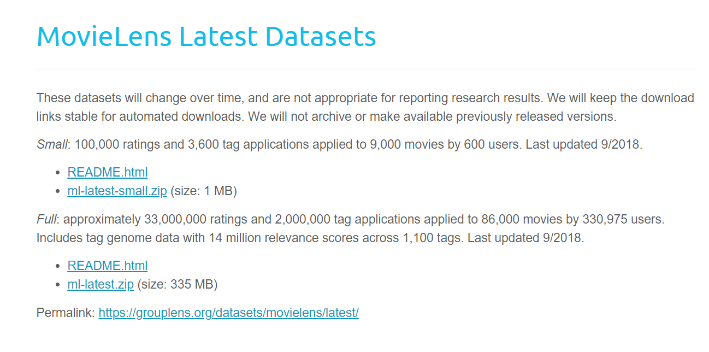

```python
import os
import pandas as pd
import numpy as np

DATA_PATH = "./datasets/ml-latest-small/ratings.csv"
CACHE_DIR = "./datasets/cache/"

# 因为数据是独立于算法的，因此把数据加载函数从算法中抽离

def load_data(data_path):
    '''
    加载数据
    :param data_path: 数据集路径
    :return: 用户-物品评分矩阵
    '''
    # 数据集缓存地址
    cache_path = os.path.join(CACHE_DIR, "ratings_matrix.cache")

    print("开始加载数据集...")
    if os.path.exists(cache_path):  # 判断是否存在缓存文件
        print("加载缓存中...")
        ratings_matrix = pd.read_pickle(cache_path)
        print("从缓存加载数据集完毕")
    else:
        print("加载新数据中...")
        # 设置要加载的数据字段的类型
        dtype = {"userId": np.int32, "movieId": np.int32, "rating": np.float32}
        # 加载数据，我们只用前三列数据，分别是用户ID，电影ID，已经用户对电影的对应评分
        ratings = pd.read_csv(data_path, dtype=dtype, usecols=range(3))
        # 透视表，将电影ID转换为列名称，转换成为一个User-Movie的评分矩阵
        ratings_matrix = ratings.pivot_table(index=["userId"], columns=["movieId"], values="rating")
        # 存入缓存文件
        ratings_matrix.to_pickle(cache_path)
        print("数据集加载完毕")
    return ratings_matrix

# 在算法内部使用fit方法，作为算法的数据传输入口
class CollaborativeFiltering(object):

    CACHE_DIR = "./datasets/cache/"

    BASED = None

    def __init__(self):
        self.datasets = None  # 数据集：用户-物品评分矩阵
        self.similarity = None  # 相似度矩阵
        print("正在使用%s-based协同过滤算法"%self.BASED)

    def fit(self, datasets):
        '''
        传入用户-物品评分矩阵数据集，计算相似度
        :param datasets: 用户-物品评分矩阵数据集，也就是ratings_matrix
        :return:
        '''
        print("开始训练数据")
        self.datasets = datasets
        self.similarity = self.compute_pearson_similarity(datasets, self.BASED)
        print("训练完毕")

    def refit(self, datasets):
        '''
        重新训练
        :param datasets: 用户-物品评分矩阵数据集，也就是ratings_matrix
        :return:
        '''
        # 删除缓存的计算好的相似度
        print("清除原有参数数据...")
        if self.BASED == "user":
            os.remove(os.path.join(self.CACHE_DIR, "user_similarity.cache"))
        elif self.BASED == "item":
            os.remove(os.path.join(self.CACHE_DIR, "item_similarity.cache"))
        else:
            raise Exception("无效的算法类型")
        print("清除完毕")
        # 重新训练
        self.fit(datasets)

    def compute_pearson_similarity(self, ratings_matrix, based="user"):
        '''
        计算皮尔逊相关系数
        :param ratings_matrix: 用户-物品评分矩阵
        :param based: "user" or "item"
        :return: 相似度矩阵
        '''
        user_similarity_cache_path = os.path.join(self.CACHE_DIR, "user_similarity.cache")
        item_similarity_cache_path = os.path.join(self.CACHE_DIR, "item_similarity.cache")
        # 基于皮尔逊相关系数计算相似度
        # 用户相似度
        if based == "user":
            if os.path.exists(user_similarity_cache_path):
                print("正从缓存加载用户相似度矩阵")
                similarity = pd.read_pickle(user_similarity_cache_path)
            else:
                print("开始计算用户相似度矩阵")
                similarity = ratings_matrix.T.corr()
                similarity.to_pickle(user_similarity_cache_path)

        elif based == "item":
            if os.path.exists(item_similarity_cache_path):
                print("正从缓存加载物品相似度矩阵")
                similarity = pd.read_pickle(item_similarity_cache_path)
            else:
                print("开始计算物品相似度矩阵")
                similarity = ratings_matrix.corr()
                similarity.to_pickle(item_similarity_cache_path)
        else:
            raise Exception("Unhandled 'based' Value: %s" % based)
        print("相似度矩阵计算/加载完毕")
        return similarity

    def predict(self, *args, **kwargs):
        pass

    def _predict_all(self, uid, item_ids):
        '''
        预测全部评分
        :param uid: 用户id
        :param item_ids: 要预测物品id列表
        :return: 生成器，逐个返回预测评分
        '''
        # 逐个预测
        for iid in item_ids:
            try:
                rating = self.predict(uid, iid)
            except Exception as e:
                print(e)
            else:
                yield uid, iid, rating

    def predict_all(self, uid, filter_rule=None):
        '''
        预测全部评分，并可根据条件进行前置过滤
        :param uid: 用户ID
        :param filter_rule: 过滤规则，只能是四选一，否则将抛异常："unhot","rated",["unhot","rated"],None
        :return: 生成器，逐个返回预测评分
        '''

        if not filter_rule:
            item_ids = self.datasets.columns
        elif isinstance(filter_rule, str) and filter_rule == "unhot":
            '''过滤非热门电影'''
            # 统计每部电影的评分数
            count = self.datasets.count()
            # 过滤出评分数高于10的电影，作为热门电影
            item_ids = count.where(count > 10).dropna().index
        elif isinstance(filter_rule, str) and filter_rule == "rated":
            '''过滤用户评分过的电影'''
            # 获取用户对所有电影的评分记录
            user_ratings = self.datasets.ix[uid]
            # 评分范围是1-5，小于6的都是评分过的，除此以外的都是没有评分的
            _ = user_ratings < 6
            item_ids = _.where(_ == False).dropna().index
        elif isinstance(filter_rule, list) and set(filter_rule) == set(["unhot", "rated"]):
            '''过滤非热门和用户已经评分过的电影'''
            count = self.datasets.count()
            ids1 = count.where(count > 10).dropna().index

            user_ratings = self.datasets.ix[uid]
            _ = user_ratings < 6
            ids2 = _.where(_ == False).dropna().index
            # 取二者交集
            item_ids = set(ids1) & set(ids2)
        else:
            raise Exception("无效的过滤参数")

        yield from self._predict_all(uid, item_ids)


class UserBasedCF(CollaborativeFiltering):

    BASED = "user"

    def predict(self, uid, iid):
        '''
        预测给定用户对给定物品的评分值
        :param uid: 用户ID
        :param iid: 物品ID
        :return: 预测的评分值
        '''
        print("开始预测用户<%d>对电影<%d>的评分..."%(uid, iid))
        # 1. 找出uid用户的相似用户
        similar_users = self.similarity[uid].drop([uid]).dropna()
        # 相似用户筛选规则：正相关的用户
        similar_users = similar_users.where(similar_users>0).dropna()
        if similar_users.empty is True:
            raise Exception("无法预测用户<{uid}>对电影<{iid}>的评分，因为用户<{uid}>没有相似的用户".format(uid=uid,iid=iid))

        # 2. 从uid用户的近邻相似用户中筛选出对iid物品有评分记录的近邻用户
        ids = set(self.datasets[iid].dropna().index)&set(similar_users.index)
        finally_similar_users = similar_users.ix[list(ids)]

        if finally_similar_users.empty is True:
            raise Exception("无法预测用户<{uid}>对电影<{iid}>的评分，因为用户<{uid}>的相似用户中没有人对电影<{iid}>有过评分.".format(uid=uid,iid=iid))

        # 3. 结合uid用户与其近邻用户的相似度预测uid用户对iid物品的评分
        sum_up = 0    # 评分预测公式的分子部分的值
        sum_down = 0    # 评分预测公式的分母部分的值
        for sim_uid, similarity in finally_similar_users.iteritems():
            # 近邻用户的评分数据
            sim_user_rated_movies = self.datasets.ix[sim_uid].dropna()
            # 近邻用户对iid物品的评分
            sim_user_rating_for_item = sim_user_rated_movies[iid]
            # 计算分子的值
            sum_up += similarity * sim_user_rating_for_item
            # 计算分母的值
            sum_down += similarity

        # 计算预测的评分值并返回
        predict_rating = sum_up/sum_down
        print("预测出用户<%d>对电影<%d>的评分：%0.2f" % (uid, iid, predict_rating))
        return round(predict_rating, 2)


class ItemBasedCF(CollaborativeFiltering):

    BASED = "item"

    def predict(self, uid, iid):
        '''
        预测给定用户对给定物品的评分值
        :param uid: 用户ID
        :param iid: 物品ID
        :return: 预测的评分值
        '''
        print("开始预测用户<%d>对电影<%d>的评分..." % (uid, iid))
        # 1. 找出iid物品的相似物品
        similar_items = self.similarity[iid].drop([iid]).dropna()
        # 相似物品筛选规则：正相关的物品
        similar_items = similar_items.where(similar_items > 0).dropna()
        if similar_items.empty is True:
            raise Exception("无法预测用户<{uid}>对电影<{iid}>的评分，因为电影<{iid}>没有相似的电影".format(uid=uid, iid=iid))

        # 2. 从iid物品的近邻相似物品中筛选出uid用户评分过的物品
        ids = set(self.datasets.ix[uid].dropna().index) & set(similar_items.index)
        finally_similar_items = similar_items.ix[list(ids)]

        if finally_similar_items.empty is True:
            raise Exception("无法预测用户<{uid}>对电影<{iid}>的评分，因为用户<{uid}>没有对电影<{iid}>的相似电影有过评分.".format(uid=uid, iid=iid))

        # 3. 结合iid物品与其相似物品的相似度和uid用户对其相似物品的评分，预测uid对iid的评分
        sum_up = 0  # 评分预测公式的分子部分的值
        sum_down = 0  # 评分预测公式的分母部分的值
        for sim_iid, similarity in finally_similar_items.iteritems():
            # 近邻物品的评分数据
            sim_item_rated_movies = self.datasets[sim_iid].dropna()
            # uid用户对相似物品物品的评分
            sim_item_rating_from_user = sim_item_rated_movies[uid]
            # 计算分子的值
            sum_up += similarity * sim_item_rating_from_user
            # 计算分母的值
            sum_down += similarity

        # 计算预测的评分值并返回
        predict_rating = sum_up / sum_down
        print("预测出用户<%d>对电影<%d>的评分：%0.2f" % (uid, iid, predict_rating))
        return round(predict_rating, 2)

if __name__ == '__main__':
    datasets = load_data(DATA_PATH)
    ubcf = UserBasedCF()
    ubcf.fit(datasets)
    ubcf.predict(1,1)
    ubcf.refit(datasets)
```

**TOP-K推荐结果**

```python
def top_k_rs_result(k):
    '''TOP-K推荐结果'''
    ratings_matrix = load_data(DATA_PATH)
    user_similar = compute_pearson_similarity(ratings_matrix, based="user")
    results = predict_all(1, ratings_matrix, user_similar, filter_rule=["unhot", "rated"])
    return sorted(results, key=lambda x: x[2], reverse=True)[:k]

if __name__ == '__main__':
    from pprint import pprint
    result = top_k_rs_result(20)
    pprint(result)
```


### PySpark版本

```python
from pyspark.sql import SparkSession

# 初始化SparkSession
spark = SparkSession.builder.appName("CollaborativeFiltering").getOrCreate()

DATA_PATH = "./datasets/ml-latest-small/ratings.csv"
CACHE_DIR = "./datasets/cache/"

def load_data(data_path):
    cache_path = os.path.join(CACHE_DIR, "ratings_matrix.cache")

    print("开始加载数据集...")
    if os.path.exists(cache_path):
        print("加载缓存中...")
        ratings_matrix = spark.read.load(cache_path)
        print("从缓存加载数据集完毕")
    else:
        print("加载新数据中...")
        # 设置要加载的数据字段的类型
        schema = ["userId", "movieId", "rating"]
        ratings = spark.read.csv(data_path, header=True, schema=schema)
        ratings_matrix = ratings.groupBy("userId").pivot("movieId").agg({"rating": "max"})
        ratings_matrix.write.save(cache_path)
        print("数据集加载完毕")
    return ratings_matrix

class CollaborativeFiltering(object):
    CACHE_DIR = "./datasets/cache/"

    BASED = None

    def __init__(self):
        self.datasets = None
        self.similarity = None
        print("正在使用%s-based协同过滤算法"%self.BASED)

    def fit(self, datasets):
        print("开始训练数据")
        self.datasets = datasets
        self.similarity = self.compute_pearson_similarity(datasets, self.BASED)
        print("训练完毕")

    def refit(self, datasets):
        print("清除原有参数数据...")
        if self.BASED == "user":
            os.remove(os.path.join(self.CACHE_DIR, "user_similarity.cache"))
        elif self.BASED == "item":
            os.remove(os.path.join(self.CACHE_DIR, "item_similarity.cache"))
        else:
            raise Exception("无效的算法类型")
        print("清除完毕")
        self.fit(datasets)

    def compute_pearson_similarity(self, ratings_matrix, based="user"):
        user_similarity_cache_path = os.path.join(self.CACHE_DIR, "user_similarity.cache")
        item_similarity_cache_path = os.path.join(self.CACHE_DIR, "item_similarity.cache")

        if based == "user":
            if os.path.exists(user_similarity_cache_path):
                print("正从缓存加载用户相似度矩阵")
                similarity = spark.read.load(user_similarity_cache_path)
            else:
                print("开始计算用户相似度矩阵")
                ratings_matrix = ratings_matrix.fillna(0)
                similarity = ratings_matrix.corr()
                similarity.write.save(user_similarity_cache_path)
        elif based == "item":
            if os.path.exists(item_similarity_cache_path):
                print("正从缓存加载物品相似度矩阵")
                similarity = spark.read.load(item_similarity_cache_path)
            else:
                print("开始计算物品相似度矩阵")
                ratings_matrix = ratings_matrix.fillna(0)
                similarity = ratings_matrix.corr()
                similarity.write.save(item_similarity_cache_path)
        else:
            raise Exception("Unhandled 'based' Value: %s" % based)
        print("相似度矩阵计算/加载完毕")
        return similarity

    def predict(self, *args, **kwargs):
        pass

    def _predict_all(self, uid, item_ids):
        for iid in item_ids:
            try:
                rating = self.predict(uid, iid)
            except Exception as e:
                print(e)
            else:
                yield uid, iid, rating

    def predict_all(self, uid, filter_rule=None):
        if not filter_rule:
            item_ids = self.datasets.columns
        elif isinstance(filter_rule, str) and filter_rule == "unhot":
            count = self.datasets.count()
            item_ids = [col for col in count.columns if count.filter(count[col] > 10).count() > 0]
        elif isinstance(filter_rule, str) and filter_rule == "rated":
            user_ratings = self.datasets.filter(self.datasets.userId == uid)
            item_ids = [col for col in user_ratings.columns if user_ratings.filter(user_ratings[col] < 6).count() == 0]
        elif isinstance(filter_rule, list) and set(filter_rule) == set(["unhot", "rated"]):
            count = self.datasets.count()
            ids1 = [col for col in count.columns if count.filter(count[col] > 10).count() > 0]
            user_ratings = self.datasets.filter(self.datasets.userId == uid)
            ids2 = [col for col in user_ratings.columns if user_ratings.filter(user_ratings[col] < 6).count() == 0]
            item_ids = list(set(ids1) & set(ids2))
        else:
            raise Exception("无效的过滤参数")

        yield from self._predict_all(uid, item_ids)

class UserBasedCF(CollaborativeFiltering):
    BASED = "user"

    def predict(self, uid, iid):
        print("开始预测用户<%d>对电影<%d>的评分..."%(uid, iid))
        similar_users = self.similarity.filter(self.similarity.userId != uid).filter(self.similarity[uid] > 0)
        if similar_users.count() == 0:
            raise Exception("无法预测用户<{uid}>对电影<{iid}>的评分，因为用户<{uid}>没有相似的用户".format(uid=uid,iid=iid))

        ids = [row.userId for row in similar_users.select("userId").collect()]
        user_ratings = self.datasets.filter(self.datasets.userId == uid)
        user_rating_for_item = user_ratings.select(str(iid)).collect()[0][0]

        sum_up = 0
        sum_down = 0
        for sim_uid in ids:
            sim_user_ratings = self.datasets.filter(self.datasets.userId == sim_uid).dropna()
            sim_user_rating_for_item = sim_user_ratings.select(str(iid)).collect()[0][0]
            similarity = similar_users.filter(similar_users.userId == sim_uid).select(str(uid)).collect()[0][0]

            sum_up += similarity * sim_user_rating_for_item
            sum_down += similarity

        predict_rating = sum_up / sum_down
        print("预测出用户<%d>对电影<%d>的评分：%0.2f" % (uid, iid, predict_rating))
        return round(predict_rating, 2)

class ItemBasedCF(CollaborativeFiltering):
    BASED = "item"

    def predict(self, uid, iid):
        print("开始预测用户<%d>对电影<%d>的评分..." % (uid, iid))
        similar_items = self.similarity.filter(self.similarity.movieId != iid).filter(self.similarity[iid] > 0)
        if similar_items.count() == 0:
            raise Exception("无法预测用户<{uid}>对电影<{iid}>的评分，因为电影<{iid}>没有相似的电影".format(uid=uid, iid=iid))

        ids = [row.movieId for row in similar_items.select("movieId").collect()]
        user_rating_for_item = self.datasets.filter(self.datasets.userId == uid).select(str(iid)).collect()[0][0]

        sum_up = 0
        sum_down = 0
        for sim_iid in ids:
            sim_item_ratings = self.datasets.filter(self.datasets.movieId == sim_iid).dropna()
            sim_item_rating_from_user = sim_item_ratings.filter(sim_item_ratings.userId == uid).select(str(sim_iid)).collect()[0][0]
            similarity = similar_items.filter(similar_items.movieId == sim_iid).select(str(iid)).collect()[0][0]

            sum_up += similarity * sim_item_rating_from_user
            sum_down += similarity

        predict_rating = sum_up / sum_down
        print("预测出用户<%d>对电影<%d>的评分：%0.2f" % (uid, iid, predict_rating))
        return round(predict_rating, 2)

if __name__ == '__main__':
    datasets = load_data(DATA_PATH)
    ubcf = UserBasedCF()
    ubcf.fit(datasets)
    ubcf.predict(1,1)
    ubcf.refit(datasets)
```

优化思路：

1. 使用Spark的分布式计算能力：将代码修改为使用Spark的分布式计算能力，可以使用Spark的RDD或DataFrame API来处理大规模数据。例如，可以使用spark.read.csv方法加载数据，并使用Spark的转换和操作函数对数据进行处理。下面是一个示例代码片段：

```python
from pyspark.sql import SparkSession

# 初始化SparkSession
spark = SparkSession.builder \
    .appName("Collaborative Filtering") \
    .getOrCreate()

# 使用Spark的分布式计算能力加载数据
data = spark.read.csv("hdfs://path/to/data.csv", header=True, inferSchema=True)

# 使用Spark的转换和操作函数进行数据处理
# ...

# 使用Spark的分布式计算能力训练模型和进行预测
# ...
```

2. 使用分布式文件系统加载数据：将数据从本地文件加载改为使用分布式文件系统（如HDFS或S3）加载数据。这样可以将数据分布在多个节点上进行并行处理，提高处理速度和容量。下面是一个示例代码片段：

```python
# 使用分布式文件系统加载数据
data = spark.read.csv("hdfs://path/to/data.csv", header=True, inferSchema=True)

# 使用Spark的转换和操作函数进行数据处理
# ...
```

3. 使用Spark的内置函数进行聚合和相关性计算：不需要手动计算相似度矩阵，可以使用Spark的内置函数进行聚合和相关性计算。例如，可以使用groupBy和pivot函数计算评分矩阵，使用corr函数计算相似度矩阵。下面是一个示例代码片段：

```python
from pyspark.sql.functions import col, corr

# 使用Spark的内置函数进行聚合和相关性计算
rating_matrix = data.groupBy("user_id").pivot("item_id").sum("rating")
similarity_matrix = rating_matrix.corr()
```

4. 使用Spark的缓存机制：可以使用Spark的缓存机制将中间结果缓存在内存或磁盘上，以提高迭代算法的性能。例如，可以使用cache方法将数据集缓存起来，避免重复计算。下面是一个示例代码片段：

```python
# 缓存数据集
data.cache()

# 使用缓存的数据集进行模型训
```

### 升级版PySPark版本

```python
from pyspark.sql import SparkSession
import os

# 初始化SparkSession
spark = SparkSession.builder.appName("CollaborativeFiltering").getOrCreate()

DATA_PATH = "your_hive_table_name"  # 替换成您的Hive表名
     
# 在算法内部使用fit方法，作为算法的数据传输入口
class CollaborativeFiltering(object):
    BASED = None
    
    def __init__(self):
        self.datasets = None  # 数据集：用户-物品评分矩阵
        self.similarity = None  # 相似度矩阵
        print("正在使用%s-based协同过滤算法"%self.BASED)
        
    def load_data(self):
         '''
        加载数据
        :param data_path: 数据集路径
        :return: 用户-物品评分矩阵
        '''
        print("开始加载数据集...")
        schema = ["userId", "movieId", "rating"]
        ratings = spark.sql("SELECT * FROM {}".format(DATA_PATH))
        ratings_matrix = ratings.groupBy("userId").pivot("movieId").agg({"rating": "max"})
        print("数据集加载完毕")
        return ratings_matrix    

    def fit(self, datasets):
        '''
        传入用户-物品评分矩阵数据集，计算相似度
        :param datasets: 用户-物品评分矩阵数据集，也就是ratings_matrix
        :return:
        '''
        print("开始训练数据")
        self.datasets = datasets
        self.similarity = self.compute_pearson_similarity(datasets, self.BASED)
        print("训练完毕")

    # def refit(self, datasets):
        # '''
        # 重新训练
        # :param datasets: 用户-物品评分矩阵数据集，也就是ratings_matrix
        # :return:
        # '''
        删除缓存的计算好的相似度
        # print("清除原有参数数据...")
        # if self.BASED == "user":
            # spark._jvm.org.apache.hadoop.fs.FileSystem.get(spark._jsc.hadoopConfiguration()).delete(spark._jvm.org.apache.hadoop.fs.Path(os.path.join(self.CACHE_DIR, "user_similarity.cache")), True)
        # elif self.BASED == "item":
            # spark._jvm.org.apache.hadoop.fs.FileSystem.get(spark._jsc.hadoopConfiguration()).delete(spark._jvm.org.apache.hadoop.fs.Path(os.path.join(self.CACHE_DIR, "item_similarity.cache")), True)
        # else:
            # raise Exception("无效的算法类型")
        # print("清除完毕")
        重新训练
        # self.fit(datasets)
        
    def compute_pearson_similarity(self, ratings_matrix, based="user"):
        '''
        计算皮尔逊相关系数
        :param ratings_matrix: 用户-物品评分矩阵
        :param based: "user" or "item"
        :return: 相似度矩阵
        '''
        # 基于皮尔逊相关系数计算相似度
        ratings_matrix = ratings_matrix.fillna(0)
        if based == "user":
            similarity = ratings_matrix.corr()
        elif based == "item":
            similarity = ratings_matrix.corr()
        else:
            raise Exception("Unhandled 'based' Value: %s" % based)
        print("相似度矩阵计算完毕")
        return similarity  
        
    def compute_pearson_similarity(self, ratings_matrix, based="user"):            
        if based == "user":                           
            print("开始计算用户相似度矩阵")
            assembler = VectorAssembler(inputCols=ratings_matrix.columns, outputCol="features")
            df_features = assembler.transform(ratings_matrix)
            mh = MinHashLSH(inputCol="features", outputCol="hashes", numHashTables=5, seed=12345)
            model = mh.fit(df_features)
            similar_items = model.approxSimilarityJoin(df_features, df_features, 0.6, distCol="JaccardDistance")
            similarity = similar_items.select("datasetA.userId", "datasetB.userId", "JaccardDistance").withColumnRenamed("datasetB.userId", "userId").withColumnRenamed("JaccardDistance", "similarity")
            similarity.write.save(user_similarity_cache_path)
        elif based == "item":               
            print("开始计算物品相似度矩阵")
            ratings_matrix_transposed = ratings_matrix.withColumnRenamed('userId', 'movieId').withColumnRenamed('movieId', 'userId')
            assembler = VectorAssembler(inputCols=ratings_matrix_transposed.columns, outputCol="features")
            df_features = assembler.transform(ratings_matrix_transposed)
            mh = MinHashLSH(inputCol="features", outputCol="hashes", numHashTables=5, seed=12345)
            model = mh.fit(df_features)
            similar_items = model.approxSimilarityJoin(df_features, df_features, 0.6, distCol="JaccardDistance")
            similarity = similar_items.select("datasetA.movieId", "datasetB.movieId", "JaccardDistance").withColumnRenamed("datasetB.movieId", "movieId").withColumnRenamed("JaccardDistance", "similarity")
            similarity.write.save(item_similarity_cache_path)
        else:
            raise Exception("Unhandled 'based' Value: %s" % based)

        print("相似度矩阵计算/加载完毕")
        return similarity        

    def predict(self, *args, **kwargs):
        pass

    def _predict_all(self, uid, item_ids):
        '''
        预测全部评分
        :param uid: 用户id
        :param item_ids: 要预测物品id列表
        :return: 生成器，逐个返回预测评分
        '''
        # 逐个预测
        for iid in item_ids:
            try:
                rating = self.predict(uid, iid)
            except Exception as e:
                print(e)
            else:
                yield uid, iid, rating

    def predict_all(self, uid, filter_rule=None):
        '''
        预测全部评分，并可根据条件进行前置过滤
        :param uid: 用户ID
        :param filter_rule: 过滤规则，只能是四选一，否则将抛异常："unhot","rated",["unhot","rated"],None
        :return: 生成器，逐个返回预测评分
        '''
        if not filter_rule:
            item_ids = [col for col in self.datasets.columns if col not in ['userId']]
        elif isinstance(filter_rule, str) and filter_rule == "unhot":
            '''过滤非热门物品：即评分次数大于10的物品'''
            count = self.datasets.count()
            item_ids = [col for col in count.columns if self.datasets.filter(self.datasets[col] > 10).count() > 0]
        elif isinstance(filter_rule, str) and filter_rule == "rated":
            '''过滤已评分物品：即该用户已经对其评过分的物品'''
            user_ratings = self.datasets.filter(self.datasets.userId == uid)
            item_ids = [col for col in user_ratings.columns if user_ratings.filter(user_ratings[col] < 6).count() == 0]
        elif isinstance(filter_rule, list) and set(filter_rule) == set(["unhot", "rated"]):
            '''同时过滤非热门物品和已评分物品'''
            count = self.datasets.count()
            ids1 = [col for col in count.columns if self.datasets.filter(self.datasets[col] > 10).count() > 0]
            user_ratings = self.datasets.filter(self.datasets.userId == uid)
            ids2 = [col for col in user_ratings.columns if user_ratings.filter(user_ratings[col] < 6).count() == 0]
            item_ids = list(set(ids1) & set(ids2))
        else:
            raise Exception("无效的过滤参数")

        yield from self._predict_all(uid, item_ids)


class UserBasedCF(CollaborativeFiltering):
    BASED = "user"

    def predict(self, uid, iid):
        '''
        预测用户对某个物品的评分
        :param uid: 用户id
        :param iid: 物品id
        :return: 预测评分
        '''
        print("开始预测用户<%d>对电影<%d>的评分..."%(uid, iid))
        similar_users = self.similarity.filter(self.similarity.userId != uid).filter(self.similarity[uid] > 0)
        if similar_users.count() == 0:
            raise Exception("无法预测用户<{uid}>对电影<{iid}>的评分，因为用户<{uid}>没有相似的用户".format(uid=uid,iid=iid))

        ids = [row.userId for row in similar_users.select("userId").collect()]
        user_ratings = self.datasets.filter(self.datasets.userId == uid)
        user_rating_for_item = user_ratings.select(str(iid)).collect()[0][0]

        sum_up = 0
        sum_down = 0
        for sim_uid in ids:
            sim_user_ratings = self.datasets.filter(self.datasets.userId == sim_uid).dropna()
            sim_user_rating_for_item = sim_user_ratings.select(str(iid)).collect()[0][0]
            similarity = similar_users.filter(similar_users.userId == sim_uid).select(str(uid)).collect()[0][0]

            sum_up += similarity * sim_user_rating_for_item
            sum_down += similarity

        predict_rating = sum_up / sum_down
        print("预测出用户<%d>对电影<%d>的评分：%0.2f" % (uid, iid, predict_rating))
        return round(predict_rating, 2)

# PySpark版本        
class UserBasedCF(CollaborativeFiltering):
    BASED = "user"

    def predict(self, uid, iid):
        print(f"开始预测用户<{uid}>对电影<{iid}>的评分...")

        similar_users = self.similarity.filter((self.similarity.userId != uid) & (self.similarity[uid] > 0))

        if similar_users.count() == 0:
            raise Exception(f"无法预测用户<{uid}>对电影<{iid}>的评分，因为用户<{uid}>没有相似的用户")

        user_ratings = self.datasets.filter(self.datasets.userId == uid)
        user_rating_for_item = user_ratings.select(str(iid)).first()[0]

        # 计算预测评分
        sum_up = similar_users.join(self.datasets, similar_users.userId == self.datasets.userId) \
            .select(similar_users.userId, self.datasets[str(iid)], similar_users[uid]) \
            .rdd \
            .map(lambda x: x[similar_users[uid]] * x[self.datasets[str(iid)]]) \
            .sum()

        sum_down = similar_users.select(similar_users[uid]).rdd.map(lambda x: x[0]).sum()

        predict_rating = sum_up / sum_down
        print(f"预测出用户<{uid}>对电影<{iid}>的评分：{predict_rating:.2f}")

        return round(predict_rating, 2)
        

class ItemBasedCF(CollaborativeFiltering):
    BASED = "item"

    def predict(self, uid, iid):
        '''
        预测用户对某个物品的评分
        :param uid: 用户id
        :param iid: 物品id
        :return: 预测评分
        '''
        print("开始预测用户<%d>对电影<%d>的评分..." % (uid, iid))
        similar_items = self.similarity.filter(self.similarity.movieId != iid).filter(self.similarity[iid] > 0)
        if similar_items.count() == 0:
            raise Exception("无法预测用户<{uid}>对电影<{iid}>的评分，因为电影<{iid}>没有相似的电影".format(uid=uid, iid=iid))

        ids = [row.movieId for row in similar_items.select("movieId").collect()]
        user_rating_for_item = self.datasets.filter(self.datasets.userId == uid).select(str(iid)).collect()[0][0]

        sum_up = 0
        sum_down = 0
        for sim_iid in ids:
            sim_item_ratings = self.datasets.filter(self.datasets.movieId == sim_iid).dropna()
            sim_item_rating_from_user = sim_item_ratings.filter(sim_item_ratings.userId == uid).select(str(sim_iid)).collect()[0][0]
            similarity = similar_items.filter(similar_items.movieId == sim_iid).select(str(iid)).collect()[0][0]

            sum_up += similarity * sim_item_rating_from_user
            sum_down += similarity

        predict_rating = sum_up / sum_down
        print("预测出用户<%d>对电影<%d>的评分：%0.2f" % (uid, iid, predict_rating))
        return round(predict_rating, 2)

if __name__ == '__main__':
    cf = CollaborativeFiltering()
    datasets = cf.load_data()
    ubcf = UserBasedCF()
    ubcf.fit(datasets)
    ubcf.predict(1,1)
    # ubcf.refit(datasets)

```


# 参考

1. [协同过滤推荐算法](https://zhuanlan.zhihu.com/p/80069337)

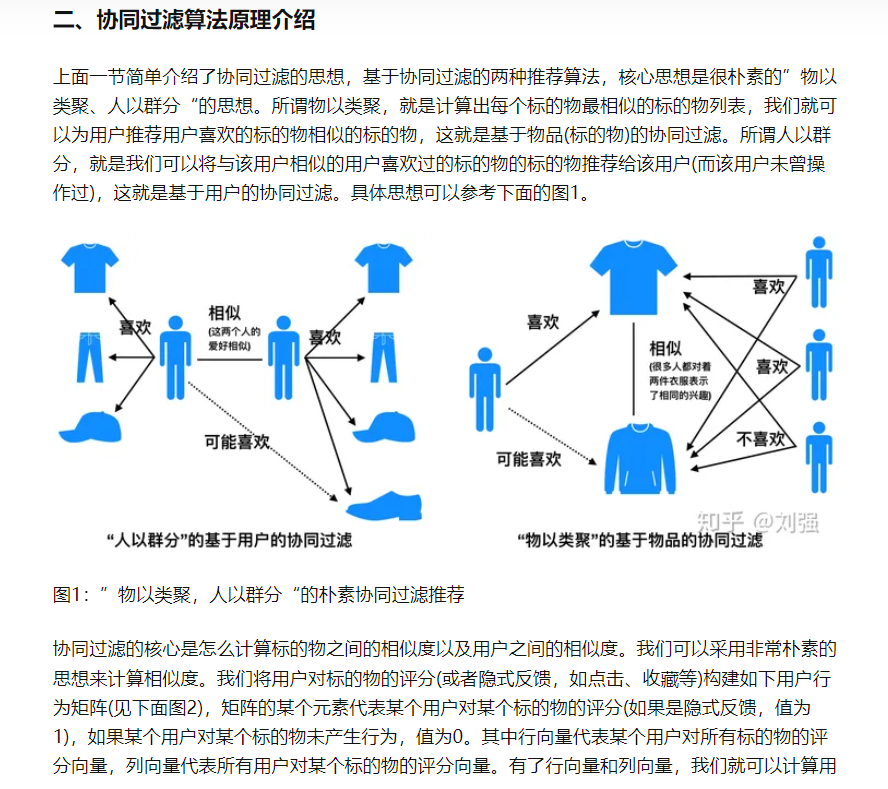

2. [推荐算法：3种协同过滤的原理及实现](https://www.niaogebiji.com/article-25842-1.html)

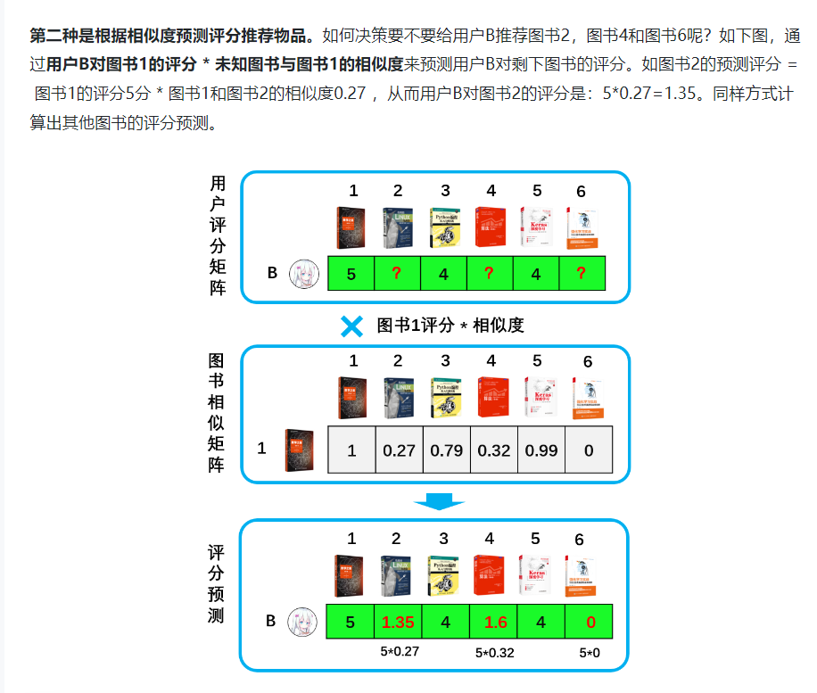

3. [章一 协同过滤推荐算法：基于内存的协同过滤](https://zhuanlan.zhihu.com/p/58629568)

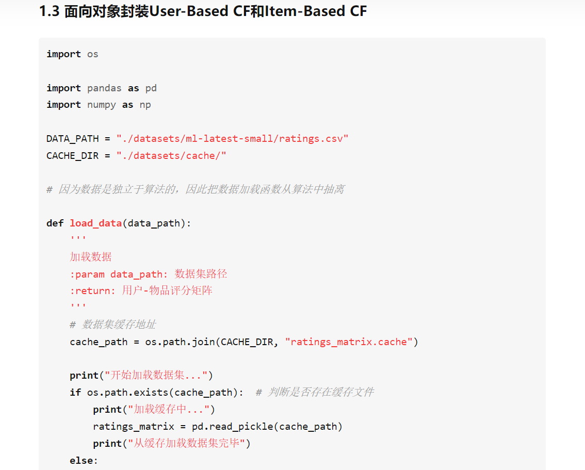